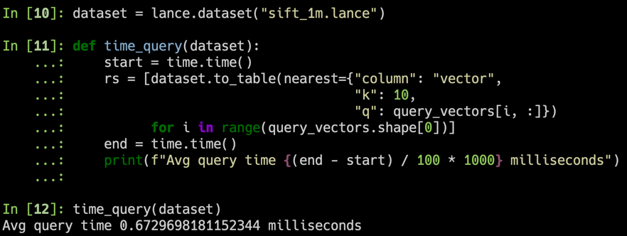
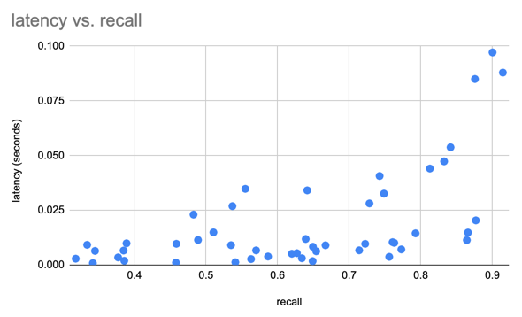
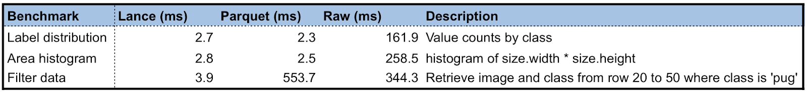
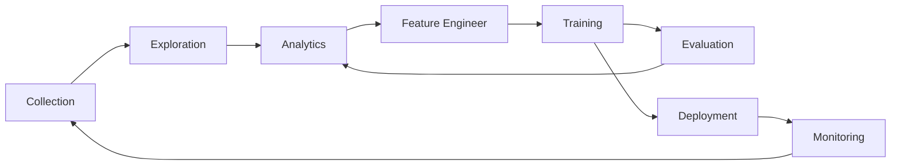

<div align="center">
<p align="center">


**Modern columnar data format for ML. Convert from Parquet in 2-lines of code for 100x faster random access, a vector index, data versioning, and more.<br/>**
**Compatible with pandas, DuckDB, Polars, and pyarrow with more integrations on the way.**

<a href="https://lancedb.github.io/lance/">Documentation</a> •
<a href="https://blog.lancedb.com/">Blog</a> •
<a href="https://discord.gg/zMM32dvNtd">Discord</a> •
<a href="https://twitter.com/lancedb">Twitter</a>

[CI]: https://github.com/lancedb/lance/actions/workflows/rust.yml
[CI Badge]: https://github.com/lancedb/lance/actions/workflows/rust.yml/badge.svg
[Docs]: https://lancedb.github.io/lance/
[Docs Badge]: https://img.shields.io/badge/docs-passing-brightgreen
[crates.io]: https://crates.io/crates/lance
[crates.io badge]: https://img.shields.io/crates/v/lance.svg
[Python versions]: https://pypi.org/project/pylance/
[Python versions badge]: https://img.shields.io/pypi/pyversions/pylance

[![CI Badge]][CI]
[![Docs Badge]][Docs]
[![crates.io badge]][crates.io]
[![Python versions badge]][Python versions]

</p>
</div>

<hr />

Lance is a modern columnar data format that is optimized for ML workflows and datasets. Lance is perfect for:

1. Building search engines and feature stores.
2. Large-scale ML training requiring high performance IO and shuffles.
3. Storing, querying, and inspecting deeply nested data for robotics or large blobs like images, point clouds, and more.

The key features of Lance include:

* **High-performance random access:** 100x faster than Parquet without sacrificing scan performance.

* **Vector search:** find nearest neighbors in milliseconds and combine OLAP-queries with vector search.

* **Zero-copy, automatic versioning:** manage versions of your data without needing extra infrastructure.

* **Ecosystem integrations:** Apache Arrow, Pandas, Polars, DuckDB and more on the way.

## Quick Start

**Installation**

```shell
pip install pylance
```

**Converting to Lance**

```python
import lance

import pandas as pd
import pyarrow as pa
import pyarrow.dataset

df = pd.DataFrame({"a": [5], "b": [10]})
uri = "/tmp/test.parquet"
tbl = pa.Table.from_pandas(df)
pa.dataset.write_dataset(tbl, uri, format='parquet')

parquet = pa.dataset.dataset(uri, format='parquet')
lance.write_dataset(parquet, "/tmp/test.lance")
```

**Reading Lance data**

```python
dataset = lance.dataset("/tmp/test.lance")
assert isinstance(dataset, pa.dataset.Dataset)
```

**Pandas**

```python
df = dataset.to_table().to_pandas()
df
```

**DuckDB**

```python
import duckdb

# If this segfaults, make sure you have duckdb v0.7+ installed
duckdb.query("SELECT * FROM dataset LIMIT 10").to_df()
```

**Vector search**

Download the sift1m subset

```shell
wget ftp://ftp.irisa.fr/local/texmex/corpus/sift.tar.gz
tar -xzf sift.tar.gz
```

Convert it to Lance

```python
import lance
from lance.vector import vec_to_table
import numpy as np
import struct

nvecs = 1000000
ndims = 128
with open("sift/sift_base.fvecs", mode="rb") as fobj:
    buf = fobj.read()
    data = np.array(struct.unpack("<128000000f", buf[4 : 4 + 4 * nvecs * ndims])).reshape((nvecs, ndims))
    dd = dict(zip(range(nvecs), data))

table = vec_to_table(dd)
uri = "vec_data.lance"
sift1m = lance.write_dataset(table, uri, max_rows_per_group=8192, max_rows_per_file=1024*1024)
```

Build the index

```python
sift1m.create_index("vector",
                    index_type="IVF_PQ",
                    num_partitions=256,  # IVF
                    num_sub_vectors=16)  # PQ
```

Search the dataset

```python
# Get top 10 similar vectors
import duckdb

dataset = lance.dataset(uri)

# Sample 100 query vectors. If this segfaults, make sure you have duckdb v0.7+ installed
sample = duckdb.query("SELECT vector FROM dataset USING SAMPLE 100").to_df()
query_vectors = np.array([np.array(x) for x in sample.vector])

# Get nearest neighbors for all of them
rs = [dataset.to_table(nearest={"column": "vector", "k": 10, "q": q})
      for q in query_vectors]
```

## Directory structure

| Directory          | Description              |
|--------------------|--------------------------|
| [rust](./rust)     | Core Rust implementation |
| [python](./python) | Python bindings (pyo3)   |
| [docs](./docs)     | Documentation source     |

## What makes Lance different

Here we will highlight a few aspects of Lance’s design. For more details, see the full [Lance design document](https://lancedb.github.io/lance/format.html).

**Vector index**: Vector index for similarity search over embedding space.
Support both CPUs (``x86_64`` and ``arm``) and GPU (``Nvidia (cuda)`` and ``Apple Silicon (mps)``).

**Encodings**: To achieve both fast columnar scan and sub-linear point queries, Lance uses custom encodings and layouts.

**Nested fields**: Lance stores each subfield as a separate column to support efficient filters like “find images where detected objects include cats”.

**Versioning**: A Manifest can be used to record snapshots. Currently we support creating new versions automatically via appends, overwrites, and index creation .

**Fast updates** (ROADMAP): Updates will be supported via write-ahead logs.

**Rich scalar indices** (ROADMAP):

* Inverted index for fuzzy search over many label / annotation fields.

## Benchmarks

### Vector search

We used the SIFT dataset to benchmark our results with 1M vectors of 128D

1. For 100 randomly sampled query vectors, we get <1ms average response time (on a 2023 m2 MacBook Air)



2. ANNs are always a trade-off between recall and performance



### Vs. parquet

We create a Lance dataset using the Oxford Pet dataset to do some preliminary performance testing of Lance as compared to Parquet and raw image/XMLs. For analytics queries, Lance is 50-100x better than reading the raw metadata. For batched random access, Lance is 100x better than both parquet and raw files.



## Why are you building yet another data format?

The machine learning development cycle involves the steps:



People use different data representations to varying stages for the performance or limited by the tooling available.
Academia mainly uses XML / JSON for annotations and zipped images/sensors data for deep learning, which
is difficult to integrated into data infrastructure and slow to train over cloud storage.
While industry uses data lakes (Parquet-based techniques, i.e., Delta Lake, Iceberg) or data warehouses (AWS Redshift
or Google BigQuery) to collect and analyze data, they have to convert the data into training-friendly formats, such
as [Rikai](https://github.com/eto-ai/rikai)/[Petastorm](https://github.com/uber/petastorm)
or [TFRecord](https://www.tensorflow.org/tutorials/load_data/tfrecord).
Multiple single-purpose data transforms, as well as syncing copies between cloud storage to local training
instances have become a common practice.

While each of the existing data formats excels at the workload it was originally designed for, we need a new data format
tailored for multistage ML development cycles to reduce and data silos.

A comparison of different data formats in each stage of ML development cycle.

|                     | Lance | Parquet & ORC | JSON & XML | TFRecord | Database | Warehouse |
|---------------------|-------|---------------|------------|----------|----------|-----------|
| Analytics           | Fast  | Fast          | Slow       | Slow     | Decent   | Fast      |
| Feature Engineering | Fast  | Fast          | Decent     | Slow     | Decent   | Good      |
| Training            | Fast  | Decent        | Slow       | Fast     | N/A      | N/A       |
| Exploration         | Fast  | Slow          | Fast       | Slow     | Fast     | Decent    |
| Infra Support       | Rich  | Rich          | Decent     | Limited  | Rich     | Rich      |

## Community Highlights

Lance is currently used in production by:

* [LanceDB](https://github.com/lancedb/lancedb), a serverless, low-latency vector database for ML applications
* Self-driving car company for large-scale storage, retrieval and processing of multi-modal data.
* E-commerce company for billion-scale+ vector personalized search.
* and more.

## Presentations and Talks

* [Lance Deep Dive](https://drive.google.com/file/d/1Orh9rK0Mpj9zN_gnQF1eJJFpAc6lStGm/view?usp=drive_link). July 2023.
* [Lance: A New Columnar Data Format](https://docs.google.com/presentation/d/1a4nAiQAkPDBtOfXFpPg7lbeDAxcNDVKgoUkw3cUs2rE/edit#slide=id.p), [Scipy 2022, Austin, TX](https://www.scipy2022.scipy.org/posters). July, 2022.
