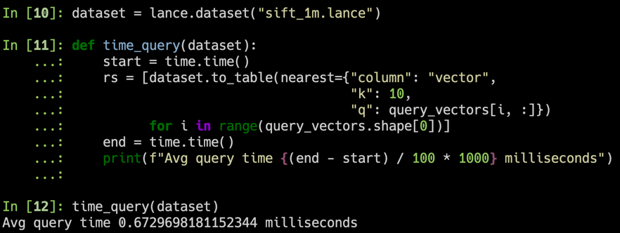
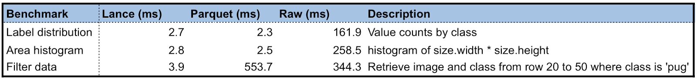
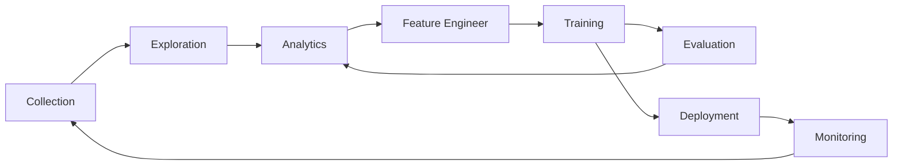

<div align="center">
<p align="center">


**The Open Lakehouse Format for Multimodal AI**<br/>
**High-performance vector search, full-text search, random access, and feature engineering capabilities for the lakehouse.**<br/>
**Compatible with Pandas, DuckDB, Polars, PyArrow, Ray, Spark, and more integrations on the way.**

<a href="https://lancedb.github.io/lance/">Documentation</a> •
<a href="https://blog.lancedb.com/">Blog</a> •
<a href="https://discord.gg/zMM32dvNtd">Discord</a> •
<a href="https://x.com/lancedb">X</a>

[CI]: https://github.com/lancedb/lance/actions/workflows/rust.yml
[CI Badge]: https://github.com/lancedb/lance/actions/workflows/rust.yml/badge.svg
[Docs]: https://lancedb.github.io/lance/
[Docs Badge]: https://img.shields.io/badge/docs-passing-brightgreen
[crates.io]: https://crates.io/crates/lance
[crates.io badge]: https://img.shields.io/crates/v/lance.svg
[Python versions]: https://pypi.org/project/pylance/
[Python versions badge]: https://img.shields.io/pypi/pyversions/pylance

[![CI Badge]][CI]
[![Docs Badge]][Docs]
[![crates.io badge]][crates.io]
[![Python versions badge]][Python versions]

</p>
</div>

<hr />

Lance is an open lakehouse format for multimodal AI. It contains a file format, table format, and catalog spec that allows you to build a complete lakehouse on top of object storage to power your AI workflows. Lance is perfect for:

1. Building search engines and feature stores with hybrid search capabilities.
2. Large-scale ML training requiring high performance IO and random access.
3. Storing, querying, and managing multimodal data including images, videos, audio, text, and embeddings.

The key features of Lance include:

* **Expressive hybrid search:** Combine vector similarity search, full-text search (BM25), and SQL analytics on the same dataset with accelerated secondary indices.

* **Lightning-fast random access:** 100x faster than Parquet or Iceberg for random access without sacrificing scan performance.

* **Native multimodal data support:** Store images, videos, audio, text, and embeddings in a single unified format with efficient blob encoding and lazy loading.

* **Data evolution:** Efficiently add columns with backfilled values without full table rewrites, perfect for ML feature engineering.

* **Zero-copy versioning:** ACID transactions, time travel, and automatic versioning without needing extra infrastructure.

* **Rich ecosystem integrations:** Apache Arrow, Pandas, Polars, DuckDB, Apache Spark, Ray, Trino, Apache Flink, and open catalogs (Apache Polaris, Unity Catalog, Apache Gravitino).

For more details, see the full [Lance format specification](https://lance.org/format).

> [!TIP]
> Lance is in active development and we welcome contributions. Please see our [contributing guide](https://lancedb.github.io/lance/community/contributing) for more information.

## Quick Start

**Installation**

```shell
pip install pylance
```

To install a preview release:

```shell
pip install --pre --extra-index-url https://pypi.fury.io/lancedb/ pylance
```

> [!TIP]
> Preview releases are released more often than full releases and contain the
> latest features and bug fixes. They receive the same level of testing as full releases.
> We guarantee they will remain published and available for download for at
> least 6 months. When you want to pin to a specific version, prefer a stable release.

**Converting to Lance**

```python
import lance

import pandas as pd
import pyarrow as pa
import pyarrow.dataset

df = pd.DataFrame({"a": [5], "b": [10]})
uri = "/tmp/test.parquet"
tbl = pa.Table.from_pandas(df)
pa.dataset.write_dataset(tbl, uri, format='parquet')

parquet = pa.dataset.dataset(uri, format='parquet')
lance.write_dataset(parquet, "/tmp/test.lance")
```

**Reading Lance data**
```python
dataset = lance.dataset("/tmp/test.lance")
assert isinstance(dataset, pa.dataset.Dataset)
```

**Pandas**
```python
df = dataset.to_table().to_pandas()
df
```

**DuckDB**
```python
import duckdb

# If this segfaults, make sure you have duckdb v0.7+ installed
duckdb.query("SELECT * FROM dataset LIMIT 10").to_df()
```

**Vector search**

Download the sift1m subset

```shell
wget ftp://ftp.irisa.fr/local/texmex/corpus/sift.tar.gz
tar -xzf sift.tar.gz
```

Convert it to Lance

```python
import lance
from lance.vector import vec_to_table
import numpy as np
import struct

nvecs = 1000000
ndims = 128
with open("sift/sift_base.fvecs", mode="rb") as fobj:
    buf = fobj.read()
    data = np.array(struct.unpack("<128000000f", buf[4 : 4 + 4 * nvecs * ndims])).reshape((nvecs, ndims))
    dd = dict(zip(range(nvecs), data))

table = vec_to_table(dd)
uri = "vec_data.lance"
sift1m = lance.write_dataset(table, uri, max_rows_per_group=8192, max_rows_per_file=1024*1024)
```

Build the index

```python
sift1m.create_index("vector",
                    index_type="IVF_PQ",
                    num_partitions=256,  # IVF
                    num_sub_vectors=16)  # PQ
```

Search the dataset

```python
# Get top 10 similar vectors
import duckdb

dataset = lance.dataset(uri)

# Sample 100 query vectors. If this segfaults, make sure you have duckdb v0.7+ installed
sample = duckdb.query("SELECT vector FROM dataset USING SAMPLE 100").to_df()
query_vectors = np.array([np.array(x) for x in sample.vector])

# Get nearest neighbors for all of them
rs = [dataset.to_table(nearest={"column": "vector", "k": 10, "q": q})
      for q in query_vectors]
```

## Directory structure

| Directory          | Description              |
|--------------------|--------------------------|
| [rust](./rust)     | Core Rust implementation |
| [python](./python) | Python bindings (PyO3)   |
| [java](./java)     | Java bindings (JNI)      |
| [docs](./docs)     | Documentation source     |

## Benchmarks

### Vector search

We used the SIFT dataset to benchmark our results with 1M vectors of 128D

1. For 100 randomly sampled query vectors, we get <1ms average response time (on a 2023 m2 MacBook Air)



2. ANNs are always a trade-off between recall and performance


### Vs. parquet

We create a Lance dataset using the Oxford Pet dataset to do some preliminary performance testing of Lance as compared to Parquet and raw image/XMLs. For analytics queries, Lance is 50-100x better than reading the raw metadata. For batched random access, Lance is 100x better than both parquet and raw files.



## Why Lance for AI/ML workflows?

The machine learning development cycle involves multiple stages:



Traditional lakehouse formats were designed for SQL analytics and struggle with AI/ML workloads that require:
- **Vector search** for similarity and semantic retrieval
- **Fast random access** for sampling and interactive exploration
- **Multimodal data** storage (images, videos, audio alongside embeddings)
- **Data evolution** for feature engineering without full table rewrites
- **Hybrid search** combining vectors, full-text, and SQL predicates

While existing formats (Parquet, Iceberg, Delta Lake) excel at SQL analytics, they require additional specialized systems for AI capabilities. Lance brings these AI-first features directly into the lakehouse format.

A comparison of different formats across ML development stages:

|                     | Lance | Parquet & ORC | JSON & XML | TFRecord | Database | Warehouse |
|---------------------|-------|---------------|------------|----------|----------|-----------|
| Analytics           | Fast  | Fast          | Slow       | Slow     | Decent   | Fast      |
| Feature Engineering | Fast  | Fast          | Decent     | Slow     | Decent   | Good      |
| Training            | Fast  | Decent        | Slow       | Fast     | N/A      | N/A       |
| Exploration         | Fast  | Slow          | Fast       | Slow     | Fast     | Decent    |
| Infra Support       | Rich  | Rich          | Decent     | Limited  | Rich     | Rich      |

## Community Highlights

Lance is currently used in production by:
* [LanceDB](https://github.com/lancedb/lancedb), a serverless, low-latency vector database for ML applications
* [LanceDB Enterprise](https://docs.lancedb.com/enterprise/introduction), hyperscale LanceDB with enterprise SLA.
* Leading multimodal Gen AI companies for training over petabyte-scale multimodal data.
* Self-driving car company for large-scale storage, retrieval and processing of multi-modal data.
* E-commerce company for billion-scale+ vector personalized search.
* and more.

## Presentations, Blogs and Talks

* [Designing a Table Format for ML Workloads](https://blog.lancedb.com/designing-a-table-format-for-ml-workloads/), Feb 2025.
* [Transforming Multimodal Data Management with LanceDB, Ray Summit](https://www.youtube.com/watch?v=xmTFEzAh8ho), Oct 2024.
* [Lance v2: A columnar container format for modern data](https://blog.lancedb.com/lance-v2/), Apr 2024.
* [Lance Deep Dive](https://drive.google.com/file/d/1Orh9rK0Mpj9zN_gnQF1eJJFpAc6lStGm/view?usp=drive_link). July 2023.
* [Lance: A New Columnar Data Format](https://docs.google.com/presentation/d/1a4nAiQAkPDBtOfXFpPg7lbeDAxcNDVKgoUkw3cUs2rE/edit#slide=id.p), [Scipy 2022, Austin, TX](https://www.scipy2022.scipy.org/posters). July, 2022.
