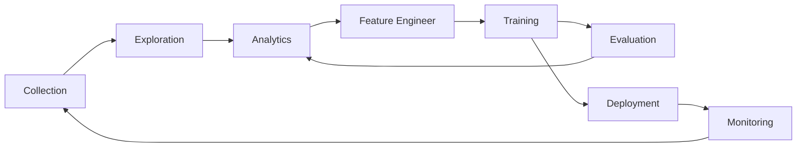

# Lance: Deep Learning with DuckDB and Arrow

<center>SELECT predict(‘resnet’, image) FROM dataset</center>

Lance is an Arrow and DuckDB compatible extension designed to help you explore, get insights and use machine-learning on your large-scale visual data, such as video, images, point clouds, audio natively.

Lance is deep learning for humans.

 [](https://eto-ai.github.io/lance/) [](https://pypi.org/project/pylance/)  [](https://discord.gg/zMM32dvNtd)

Lance delivers blazing fast performance for visual data use cases from exploratory data analysis to training and evaluation.

Lance is powered by <i>Lance Format</i>, an alternative to Parquet that is optimized with visual data. With first class Apache Arrow integration, Lance Format is queryable using DuckDB out of the box and can be converted from Parquet with a single line of code.

## What problems does Lance solve?

Today, the data tooling stack for computer vision is insufficient to serve the needs of the ML Engineering and Data Science community.

### Working with computer vision data for ML is different from working with tabular data:
- Visual data are large blobs that are difficult and slow to query by existing engines
- Annotations are deeply nested and stored in different locations (i.e. S3 vs CSV/XML)
- Exploratory data analysis, labeling, training and evaluation uses different tools requiring different formats that are optimized for certain use cases, but this leads to fragmentation and complicates lineage
- Deep learning is increasingly making use of vector-based semantics and embeddings, it is challenging to query across both vectors and other column types in a performant and usable way

### Lance to the rescue
To solve these pain-points, we are building Lance, an open-source columnar data format optimized for computer vision with the following goals:
- Use SQL to run embeddings, models and other arbitarily complex transformations fast!
- Blazing fast performance for analytical scans and random access to individual records (for visualization and annotation)
- Rich ML data types and integrations to eliminate manual data conversions
- Support for vector and search indices, versioning, and schema evolution

## Quick Start

We've provided Linux and MacOS wheels for Lance in PyPI. You can install Lance python bindings via:

```
pip install pylance
```

Thanks to its Apache Arrow-first APIs, `lance` can be used as a native `Arrow` extension.
For example, it enables users to directly use `DuckDB` to analyze lance dataset
via [DuckDB's Arrow integration](https://duckdb.org/docs/guides/python/sql_on_arrow).

```python
# pip install pylance duckdb
import lance
import duckdb

# Understand Label distribution of Oxford Pet Dataset
ds = lance.dataset("s3://eto-public/datasets/oxford_pet/oxford_pet.lance")
duckdb.query('select class, count(1) from ds group by 1').to_arrow_table()
```

## Important directories

| Directory                                  | Description                            |
|--------------------------------------------|----------------------------------------|
| [cpp](./cpp)                               | Source code for Eto services and sites |
| [python](./python)                         | Infrastructure as code                 |
| [notebooks](./python/notebooks)            | Build scripts for supporting services  |
| [duckdb extension](./integration/duckdb)   | Lance Duckdb extension                 |

## What makes Lance different

Here we will highlight a few aspects of Lance’s design. For more details, see the full [Lance design document](https://docs.google.com/document/d/1kknVcqRK65YqGkKASuQ40apr2A2DyK0Qtx5nhCPCdqQ/edit).

**Encodings**: to achieve both fast columnar scan and sub-linear point queries, Lance uses custom encodings and layouts.

**Nested fields**: Lance stores each subfield as a separate column to support efficient filters like “find images where detected objects include cats”.

**Versioning / updates** (ROADMAP): a Manifest can be used to record snapshots. Updates are supported via write-ahead logs.

**Secondary Indices** (ROADMAP):
  - Vector index for similarity search over embedding space
  - Inverted index for fuzzy search over many label / annotation fields

## Benchmarks

We create a Lance dataset using the Oxford Pet dataset to do some preliminary performance testing of Lance as compared to Parquet and raw image/xmls. For analytics queries, Lance is 50-100x better than reading the raw metadata. For batched random access, Lance is 100x better than both parquet and raw files.


## Why are you building yet another data format?!

Machine Learning development cycle involves the steps:



People use different data representations to varying stages for the performance or limited by the tooling available.
The academia mainly uses XML / JSON for annotations and zipped images/sensors data for deep learning, which
is difficult to integrated into data infrastructure and slow to train over cloud storage.
While the industry uses data lake (Parquet-based techniques, i.e., Delta Lake, Iceberg) or data warehouse (AWS Redshift
or Google BigQuery) to collect and analyze data, they have to convert the data into training-friendly formats, such
as [Rikai](https://github.com/eto-ai/rikai)/[Petastorm](https://github.com/uber/petastorm)
or [Tfrecord](https://www.tensorflow.org/tutorials/load_data/tfrecord).
Multiple single-purpose data transforms, as well as syncing copies between cloud storage to local training
instances have become a common practice among ML practices.

While each of the existing data formats excel at its original designed workload, we need a new data format
to tailored for multistage ML development cycle to reduce the fraction in tools and data silos.

A comparison of different data formats in each stage of ML development cycle.

|                     | Lance | Parquet & ORC | JSON & XML | Tfrecord | Database | Warehouse |
|---------------------|-------|---------------|------------|----------|----------|-----------|
| Analytics           | Fast  | Fast          | Slow       | Slow     | Decent   | Fast      |
| Feature Engineering | Fast  | Fast          | Decent     | Slow     | Decent   | Good      |
| Training            | Fast  | Decent        | Slow       | Fast     | N/A      | N/A       |
| Exploration         | Fast  | Slow          | Fast       | Slow     | Fast     | Decent    |
| Infra Support       | Rich  | Rich          | Decent     | Limited  | Rich     | Rich      |

## Presentations and Talks

* [Lance: A New Columnar Data Format](https://docs.google.com/presentation/d/1a4nAiQAkPDBtOfXFpPg7lbeDAxcNDVKgoUkw3cUs2rE/edit#slide=id.p)
  .
  [Scipy 2022, Austin, TX](https://www.scipy2022.scipy.org/posters). July, 2022.
