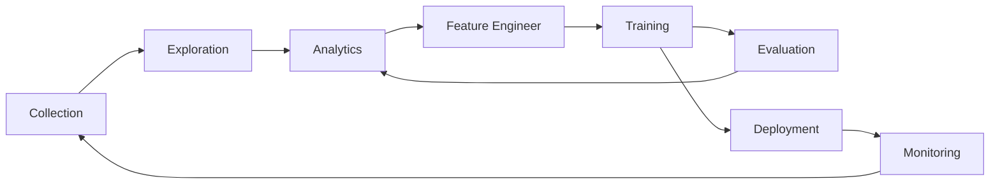

<div align="center">
<p align="center">


**Modern columnar data format for ML. Convert from Parquet in 2-lines of code for 100x faster random access, zero-cost schema evolution, rich secondary indices, versioning, and more.<br/>**
**Compatible with Pandas, DuckDB, Polars, Pyarrow, and Ray with more integrations on the way.**

<a href="https://lancedb.github.io/lance/">Documentation</a> •
<a href="https://blog.lancedb.com/">Blog</a> •
<a href="https://discord.gg/zMM32dvNtd">Discord</a> •
<a href="https://x.com/lancedb">X</a>

[CI]: https://github.com/lancedb/lance/actions/workflows/rust.yml
[CI Badge]: https://github.com/lancedb/lance/actions/workflows/rust.yml/badge.svg
[Docs]: https://lancedb.github.io/lance/
[Docs Badge]: https://img.shields.io/badge/docs-passing-brightgreen
[crates.io]: https://crates.io/crates/lance
[crates.io badge]: https://img.shields.io/crates/v/lance.svg
[Python versions]: https://pypi.org/project/pylance/
[Python versions badge]: https://img.shields.io/pypi/pyversions/pylance

[![CI Badge]][CI]
[![Docs Badge]][Docs]
[![crates.io badge]][crates.io]
[![Python versions badge]][Python versions]

</p>
</div>

<hr />

Lance is a modern columnar data format that is optimized for ML workflows and datasets. Lance is perfect for:

1. Building search engines and feature stores.
2. Large-scale ML training requiring high performance IO and shuffles.
3. Storing, querying, and inspecting deeply nested data for robotics or large blobs like images, point clouds, and more.

The key features of Lance include:

* **High-performance random access:** 100x faster than Parquet without sacrificing scan performance.

* **Vector search:** find nearest neighbors in milliseconds and combine OLAP-queries with vector search.

* **Zero-copy, automatic versioning:** manage versions of your data without needing extra infrastructure.

* **Ecosystem integrations:** Apache Arrow, Pandas, Polars, DuckDB, Ray, Spark and more on the way.

> [!TIP]
> Lance is in active development and we welcome contributions. Please see our [contributing guide](docs/contributing.rst) for more information.

## Quick Start

**Installation**

```shell
pip install pylance
```

To install a preview release:

```shell
pip install --pre --extra-index-url https://pypi.fury.io/lancedb/ pylance
```

> [!TIP]
> Preview releases are released more often than full releases and contain the
> latest features and bug fixes. They receive the same level of testing as full releases.
> We guarantee they will remain published and available for download for at
> least 6 months. When you want to pin to a specific version, prefer a stable release.

**Converting to Lance**

```python
import lance

import pandas as pd
import pyarrow as pa
import pyarrow.dataset

df = pd.DataFrame({"a": [5], "b": [10]})
uri = "/tmp/test.parquet"
tbl = pa.Table.from_pandas(df)
pa.dataset.write_dataset(tbl, uri, format='parquet')

parquet = pa.dataset.dataset(uri, format='parquet')
lance.write_dataset(parquet, "/tmp/test.lance")
```

**Reading Lance data**
```python
dataset = lance.dataset("/tmp/test.lance")
assert isinstance(dataset, pa.dataset.Dataset)
```

**Pandas**
```python
df = dataset.to_table().to_pandas()
df
```

**DuckDB**
```python
import duckdb

# If this segfaults, make sure you have duckdb v0.7+ installed
duckdb.query("SELECT * FROM dataset LIMIT 10").to_df()
```

**Vector search**

Download the sift1m subset

```shell
wget ftp://ftp.irisa.fr/local/texmex/corpus/sift.tar.gz
tar -xzf sift.tar.gz
```

Convert it to Lance

```python
import lance
from lance.vector import vec_to_table
import numpy as np
import struct

nvecs = 1000000
ndims = 128
with open("sift/sift_base.fvecs", mode="rb") as fobj:
    buf = fobj.read()
    data = np.array(struct.unpack("<128000000f", buf[4 : 4 + 4 * nvecs * ndims])).reshape((nvecs, ndims))
    dd = dict(zip(range(nvecs), data))

table = vec_to_table(dd)
uri = "vec_data.lance"
sift1m = lance.write_dataset(table, uri, max_rows_per_group=8192, max_rows_per_file=1024*1024)
```

Build the index

```python
sift1m.create_index("vector",
                    index_type="IVF_PQ",
                    num_partitions=256,  # IVF
                    num_sub_vectors=16)  # PQ
```

Search the dataset

```python
# Get top 10 similar vectors
import duckdb

dataset = lance.dataset(uri)

# Sample 100 query vectors. If this segfaults, make sure you have duckdb v0.7+ installed
sample = duckdb.query("SELECT vector FROM dataset USING SAMPLE 100").to_df()
query_vectors = np.array([np.array(x) for x in sample.vector])

# Get nearest neighbors for all of them
rs = [dataset.to_table(nearest={"column": "vector", "k": 10, "q": q})
      for q in query_vectors]
```

## Directory structure

| Directory          | Description              |
|--------------------|--------------------------|
| [rust](./rust)     | Core Rust implementation |
| [python](./python) | Python bindings (PyO3)   |
| [java](./java)     | Java bindings (JNI)      |
| [docs](./docs)     | Documentation source     |

## Java JNI Bindings

Lance provides comprehensive Java bindings through JNI (Java Native Interface), enabling high-performance data operations directly from Java applications.

### MergeInsertBuilder

The `MergeInsertBuilder` class provides a fluent API for building merge insert operations, which allow you to merge new data with existing data in a Lance dataset. This is similar to SQL's MERGE statement.

#### Basic Usage

```java
import com.lancedb.lance.*;

// Create a merge insert builder
MergeInsertBuilder builder = MergeInsertBuilder.create(dataset, "id");

// Configure the operation
MergeInsertBuilder configured = builder
    .whenMatchedUpdateAll()
    .whenNotMatchedInsertAll()
    .conflictRetries(5)
    .retryTimeout(1000L);

// Execute the merge insert
try (VectorSchemaRoot newData = createNewData()) {
    MergeInsertResult result = configured.execute(newData);
    
    System.out.println("Inserted: " + result.getNumInsertedRows());
    System.out.println("Updated: " + result.getNumUpdatedRows());
    System.out.println("Deleted: " + result.getNumDeletedRows());
}
```

#### API Reference

##### Constructor Methods

- `MergeInsertBuilder.create(Dataset dataset, String... onColumns)`
- `MergeInsertBuilder.create(Dataset dataset, List<String> onColumns)`

##### Configuration Methods

- `whenMatchedUpdateAll()` - Update all columns when there is a match
- `whenMatchedUpdateAll(String condition)` - Update all columns when there is a match and the condition is true
- `whenNotMatchedInsertAll()` - Insert all columns when there is no match
- `whenNotMatchedBySourceDelete()` - Delete rows when there is no match in the source
- `whenNotMatchedBySourceDelete(String expr)` - Delete rows when there is no match in the source and the expression is true
- `conflictRetries(int maxRetries)` - Set the number of conflict retries
- `retryTimeout(long timeoutMillis)` - Set the retry timeout in milliseconds

##### Execution Methods

- `execute(VectorSchemaRoot newData)` - Execute the merge insert operation
- `close()` - Clean up native resources

#### MergeInsertResult

The `MergeInsertResult` class contains statistics about the merge insert operation:

- `getNumInsertedRows()` - Number of rows inserted
- `getNumUpdatedRows()` - Number of rows updated  
- `getNumDeletedRows()` - Number of rows deleted
- `getTotalAffectedRows()` - Total number of affected rows

#### Error Handling

The JNI layer provides comprehensive error handling:

- Invalid column names throw `RuntimeException`
- Invalid SQL conditions are handled gracefully
- Memory management is automatic with proper cleanup
- Null conditions use default behavior

#### Testing

Comprehensive unit tests are provided in:

- `java/core/src/test/java/com/lancedb/lance/MergeInsertTest.java` - Unit tests for basic functionality, error handling, boundary conditions, and resource management
- `java/core/src/test/java/com/lancedb/lance/MergeInsertIntegrationTest.java` - Integration tests for complete workflows
- `java/core/lance-jni/src/tests.rs` - Rust-side JNI function tests

The tests cover:

**Basic Functionality:**
- Builder creation with various column configurations
- Fluent API configuration chaining
- Resource cleanup and memory management

**Error Handling:**
- Invalid column names and datasets
- Null and empty parameters
- Extreme values and edge cases
- SQL condition parsing errors

**Boundary Conditions:**
- Empty column lists
- Very long condition strings
- Unicode and special characters
- Negative and extreme numeric values

**Performance Testing:**
- Many columns and complex schemas
- Stress testing with multiple builders
- Memory leak detection
- Concurrent access patterns

**Resource Management:**
- Proper cleanup of native resources
- Multiple close operations
- Closed dataset handling
- Memory allocation patterns

#### Performance Considerations

- **Memory Management**: The JNI layer automatically manages memory for native objects
- **Resource Cleanup**: Always call `close()` on builders to prevent memory leaks
- **Concurrent Access**: Builders are not thread-safe; use separate instances per thread
- **Large Datasets**: For very large datasets, consider batching operations
- **Condition Complexity**: Complex SQL conditions may impact performance

#### Best Practices

1. **Always use try-with-resources**:
   ```java
   try (MergeInsertBuilder builder = MergeInsertBuilder.create(dataset, "id")) {
       // Use builder
   }
   ```

2. **Validate inputs early**:
   ```java
   if (dataset == null || columns == null || columns.isEmpty()) {
       throw new IllegalArgumentException("Invalid parameters");
   }
   ```

3. **Handle errors gracefully**:
   ```java
   try {
       MergeInsertResult result = builder.execute(newData);
       // Process result
   } catch (RuntimeException e) {
       // Handle JNI errors
   }
   ```

4. **Use appropriate retry settings**:
   ```java
   builder.conflictRetries(10)
          .retryTimeout(5000L);
   ```

5. **Monitor performance**:
   ```java
   long startTime = System.currentTimeMillis();
   MergeInsertResult result = builder.execute(newData);
   long duration = System.currentTimeMillis() - startTime;
   ```

#### Advanced Usage Examples

**Conditional Updates:**
```java
MergeInsertBuilder builder = MergeInsertBuilder.create(dataset, "id")
    .whenMatchedUpdateAll("source.value > target.value")
    .whenNotMatchedInsertAll();
```

**Complex Conditions:**
```java
String condition = "source.value > target.value AND source.name != target.name";
MergeInsertBuilder builder = MergeInsertBuilder.create(dataset, "id")
    .whenMatchedUpdateAll(condition)
    .whenNotMatchedBySourceDelete("target.id > 100");
```

**Multiple Join Columns:**
```java
MergeInsertBuilder builder = MergeInsertBuilder.create(dataset, Arrays.asList("id", "name"))
    .whenMatchedUpdateAll()
    .whenNotMatchedInsertAll();
```

**High-Performance Configuration:**
```java
MergeInsertBuilder builder = MergeInsertBuilder.create(dataset, "id")
    .whenMatchedUpdateAll()
    .whenNotMatchedInsertAll()
    .conflictRetries(100)
    .retryTimeout(30000L);
```

#### Troubleshooting

**Common Issues:**

1. **Memory Leaks**: Ensure all builders are properly closed
2. **Performance Issues**: Check retry settings and condition complexity
3. **JNI Errors**: Verify column names and dataset validity
4. **Concurrent Access**: Use separate builders per thread

**Debug Tips:**

- Enable JNI logging: `-Djava.library.path=/path/to/lance-jni`
- Monitor memory usage during large operations
- Use smaller batch sizes for very large datasets
- Profile SQL conditions for performance bottlenecks

## What makes Lance different

Here we will highlight a few aspects of Lance’s design. For more details, see the full [Lance design document](https://lancedb.github.io/lance/format.html).

**Vector index**: Vector index for similarity search over embedding space.
Support both CPUs (``x86_64`` and ``arm``) and GPU (``Nvidia (cuda)`` and ``Apple Silicon (mps)``).

**Encodings**: To achieve both fast columnar scan and sub-linear point queries, Lance uses custom encodings and layouts.

**Nested fields**: Lance stores each subfield as a separate column to support efficient filters like “find images where detected objects include cats”.

**Versioning**: A Manifest can be used to record snapshots. Currently we support creating new versions automatically via appends, overwrites, and index creation.

**Fast updates** (ROADMAP): Updates will be supported via write-ahead logs.

**Rich secondary indices**: Support `BTree`, `Bitmap`, `Full text search`, `Label list`,
`NGrams`, and more.

## Benchmarks

### Vector search

We used the SIFT dataset to benchmark our results with 1M vectors of 128D

1. For 100 randomly sampled query vectors, we get <1ms average response time (on a 2023 m2 MacBook Air)


2. ANNs are always a trade-off between recall and performance


### Vs. parquet

We create a Lance dataset using the Oxford Pet dataset to do some preliminary performance testing of Lance as compared to Parquet and raw image/XMLs. For analytics queries, Lance is 50-100x better than reading the raw metadata. For batched random access, Lance is 100x better than both parquet and raw files.


## Why are you building yet another data format?!

The machine learning development cycle involves the steps:



People use different data representations to varying stages for the performance or limited by the tooling available.
Academia mainly uses XML / JSON for annotations and zipped images/sensors data for deep learning, which
is difficult to integrate into data infrastructure and slow to train over cloud storage.
While industry uses data lakes (Parquet-based techniques, i.e., Delta Lake, Iceberg) or data warehouses (AWS Redshift
or Google BigQuery) to collect and analyze data, they have to convert the data into training-friendly formats, such
as [Rikai](https://github.com/eto-ai/rikai)/[Petastorm](https://github.com/uber/petastorm)
or [TFRecord](https://www.tensorflow.org/tutorials/load_data/tfrecord).
Multiple single-purpose data transforms, as well as syncing copies between cloud storage to local training
instances have become a common practice.

While each of the existing data formats excels at the workload it was originally designed for, we need a new data format
tailored for multistage ML development cycles to reduce and data silos.

A comparison of different data formats in each stage of ML development cycle.

|                     | Lance | Parquet & ORC | JSON & XML | TFRecord | Database | Warehouse |
|---------------------|-------|---------------|------------|----------|----------|-----------|
| Analytics           | Fast  | Fast          | Slow       | Slow     | Decent   | Fast      |
| Feature Engineering | Fast  | Fast          | Decent     | Slow     | Decent   | Good      |
| Training            | Fast  | Decent        | Slow       | Fast     | N/A      | N/A       |
| Exploration         | Fast  | Slow          | Fast       | Slow     | Fast     | Decent    |
| Infra Support       | Rich  | Rich          | Decent     | Limited  | Rich     | Rich      |

## Community Highlights

Lance is currently used in production by:
* [LanceDB](https://github.com/lancedb/lancedb), a serverless, low-latency vector database for ML applications
* [LanceDB Enterprise](https://docs.lancedb.com/enterprise/introduction), hyperscale LanceDB with enterprise SLA.
* Leading multimodal Gen AI companies for training over petabyte-scale multimodal data.
* Self-driving car company for large-scale storage, retrieval and processing of multi-modal data.
* E-commerce company for billion-scale+ vector personalized search.
* and more.

## Presentations, Blogs and Talks

* [Designing a Table Format for ML Workloads](https://blog.lancedb.com/designing-a-table-format-for-ml-workloads/), Feb 2025.
* [Transforming Multimodal Data Management with LanceDB, Ray Summit](https://www.youtube.com/watch?v=xmTFEzAh8ho), Oct 2024.
* [Lance v2: A columnar container format for modern data](https://blog.lancedb.com/lance-v2/), Apr 2024.
* [Lance Deep Dive](https://drive.google.com/file/d/1Orh9rK0Mpj9zN_gnQF1eJJFpAc6lStGm/view?usp=drive_link). July 2023.
* [Lance: A New Columnar Data Format](https://docs.google.com/presentation/d/1a4nAiQAkPDBtOfXFpPg7lbeDAxcNDVKgoUkw3cUs2rE/edit#slide=id.p), [Scipy 2022, Austin, TX](https://www.scipy2022.scipy.org/posters). July, 2022.

## Java Bindings

Lance provides Java bindings through JNI (Java Native Interface) that allow you to use Lance's core functionality from Java applications.

### MergeInsertBuilder

The `MergeInsertBuilder` class provides a fluent API for building merge insert operations, which allow you to merge new data with existing data in a Lance dataset.

#### Features

- **Fluent API**: Chain method calls for easy configuration
- **Conditional Updates**: Support for conditional updates and deletes
- **Conflict Resolution**: Configurable retry mechanisms for handling conflicts
- **Resource Management**: Automatic cleanup of native resources

#### Usage Example

```java
import com.lancedb.lance.MergeInsertBuilder;
import com.lancedb.lance.MergeInsertResult;
import org.apache.arrow.vector.VectorSchemaRoot;

// Create a merge insert builder
MergeInsertBuilder builder = MergeInsertBuilder.create(dataset, "id");

// Configure the operation
MergeInsertBuilder configured = builder
    .whenMatchedUpdateAll("source.value > target.value")
    .whenNotMatchedInsertAll()
    .whenNotMatchedBySourceDelete("target.id > 100")
    .conflictRetries(5)
    .retryTimeout(1000L);

// Execute the merge insert
try (VectorSchemaRoot newData = createNewData()) {
    MergeInsertResult result = configured.execute(newData);
    
    System.out.println("Inserted: " + result.getNumInsertedRows());
    System.out.println("Updated: " + result.getNumUpdatedRows());
    System.out.println("Deleted: " + result.getNumDeletedRows());
}
```

#### API Reference

##### Constructor Methods

- `MergeInsertBuilder.create(Dataset dataset, String... onColumns)`
- `MergeInsertBuilder.create(Dataset dataset, List<String> onColumns)`

##### Configuration Methods

- `whenMatchedUpdateAll()` - Update all columns when there is a match
- `whenMatchedUpdateAll(String condition)` - Update all columns when there is a match and the condition is true
- `whenNotMatchedInsertAll()` - Insert all columns when there is no match
- `whenNotMatchedBySourceDelete()` - Delete rows when there is no match in the source
- `whenNotMatchedBySourceDelete(String expr)` - Delete rows when there is no match in the source and the expression is true
- `conflictRetries(int maxRetries)` - Set the number of conflict retries
- `retryTimeout(long timeoutMillis)` - Set the retry timeout in milliseconds

##### Execution Methods

- `execute(VectorSchemaRoot newData)` - Execute the merge insert operation
- `close()` - Clean up native resources

#### MergeInsertResult

The `MergeInsertResult` class contains statistics about the merge insert operation:

- `getNumInsertedRows()` - Number of rows inserted
- `getNumUpdatedRows()` - Number of rows updated  
- `getNumDeletedRows()` - Number of rows deleted
- `getTotalAffectedRows()` - Total number of affected rows

#### Error Handling

The JNI layer provides comprehensive error handling:

- Invalid column names throw `RuntimeException`
- Invalid SQL conditions are handled gracefully
- Memory management is automatic with proper cleanup
- Null conditions use default behavior

#### Testing

Comprehensive unit tests are provided in:

- `MergeInsertTest.java` - Basic functionality tests
- `MergeInsertIntegrationTest.java` - Integration tests
- `tests.rs` - Rust-side JNI function tests

#### Performance Considerations

- Native memory is managed automatically
- Arrow streams are handled efficiently through FFI
- Async operations are executed on a dedicated runtime
- Resource cleanup is guaranteed through `AutoCloseable`

#### Dependencies

The Java bindings require:

- Apache Arrow Java library
- JNI support
- Rust toolchain for native compilation

For more information about the Java bindings, see the [Java documentation](java/README.md).
