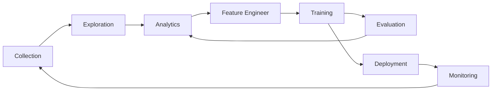

# Lance: A Columnar Data Format for Deep Learning Dataset


Lance is a cloud-native columnar data format designed for managing large-scale computer vision datasets in production
environments. Lance delivers blazing fast performance for image and video data use cases from analytics to point 
queries to training scans. 

## Why use Lance

You should use lance if you're a ML engineer looking to be 10x more productive when working with computer vision 
datasets:

1. Lance saves you from having to manage multiple systems and formats for metadata, 
raw assets, labeling updates, and vector indices.
2. Lance's custom column encoding means you don't need to choose between fast analytics and fast point queries.
3. Lance has a first-class Apache Arrow integration so it's easy to create and query Lance datasets (e.g., you can
directly query lance datasets using DuckDB with no extra work)
4. Did we mention Lance is fast.

## Major features

* Fast columnar scan for ML dataset analysis, ML training, and evaluation.
* Encodings that are capable of fast point queries for interactive data exploration.
* Extensible design for index and predicates pushdown.
* Self-describable, nested, and strong-typed data with an extensible type system. Support Image, Video, Audio and Sensor
  Data. Support Annotations and Tensors.
* Schema evolution and update (TODO).
* Cloud-native optimizations on low-cost cloud storage, i.e., AWS S3, Google GCS, or Azure Blob Storage.
* Open access via first-class [Apache Arrow](https://arrow.apache.org/) integration and multi-language support.

### Non-goals

* A new SQL engine
* A new ML framework

## How to Use Lance

Thanks for its Apache Arrow-first APIs, `lance` can be used as a native `Arrow` extension.
For example, it enables users to directly use `DuckDB` to analyze lance dataset
via [DuckDB's Arrow integration](https://duckdb.org/docs/guides/python/sql_on_arrow).

```python
# pip install pylance duckdb 
import lance
import duckdb

# Understand Label distribution of Oxford Pet Dataset
ds = lance.dataset("s3://eto-public/datasets/oxford_pet/pet.lance")
duckdb.query('select label, count(1) from ds group by label').to_arrow_table()
```

## Why are you building yet another data format?!

Machine Learning development cycle involves the steps:



People use different data representations to varying stages for the performance or limited by the tooling available.
The academia mainly uses XML / JSON for annotations and zipped images/sensors data for deep learning, which
is difficult to integrated into data infrastructure and slow to train over cloud storage.
While the industry uses data lake (Parquet-based techniques, i.e., Delta Lake, Iceberg) or data warehouse (AWS Redshift
or Google BigQuery) to collect and analyze data, they have to convert the data into training-friendly formats, such
as [Rikai](https://github.com/eto-ai/rikai)/[Petastorm](https://github.com/uber/petastorm)
or [Tfrecord](https://www.tensorflow.org/tutorials/load_data/tfrecord).
Multiple single-purpose data transforms, as well as syncing copies between cloud storage to local training
instances have become a common practice among ML practices.

While each of the existing data formats excel at its original designed workload, we need a new data format
to tailored for multistage ML development cycle to reduce the fraction in tools and data silos.

A comparison of different data formats in each stage of ML development cycle.

|                     | Lance | Parquet & ORC | JSON & XML | Tfrecord | Database | Warehouse |
|---------------------|-------|---------------|------------|----------|----------|-----------|
| Analytics           | Fast  | Fast          | Slow       | Slow     | Decent   | Fast      |
| Feature Engineering | Fast  | Fast          | Decent     | Slow     | Decent   | Good      |
| Training            | Fast  | Decent        | Slow       | Fast     | N/A      | N/A       |
| Exploration         | Fast  | Slow          | Fast       | Slow     | Fast     | Decent    |
| Infra Support       | Rich  | Rich          | Decent     | Limited  | Rich     | Rich      |

## Presentations and Talks

* [Lance: A New Columnar Data Format](https://docs.google.com/presentation/d/1a4nAiQAkPDBtOfXFpPg7lbeDAxcNDVKgoUkw3cUs2rE/edit#slide=id.p)
  .
  [Scipy 2022, Austin, TX](https://www.scipy2022.scipy.org/posters). July, 2022.
