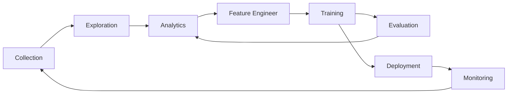

<div align="center">
<p align="center">
 


**Blazing fast exploration and analysis of ML data using python and SQL, backed by an Apache-Arrow compatible data format**

<a href="https://eto-ai.github.io/lance/">Documentation</a> •
<a href="https://blog.eto.ai/">Blog</a> •
<a href="https://discord.gg/zMM32dvNtd">Discord</a> •
<a href="https://twitter.com/etodotai">Twitter</a>


[](https://eto-ai.github.io/lance/)

 


</p>
</div>

<hr />

Lance makes machine learning workflows with ML data easy (images, videos, point clouds, audio, and of course tabular data), by allowing Developers, Analysts and Operations to:

* Use SQL to greatly simplify common operations on ML data, such as similarity search for data discovery, model inference and computing evaluation metrics.

* (Coming soon) visualize, slice and drill-into datasets to inspect embeddings, labels/annotations and metrics.

* (Coming soon) version, compare and diff ML datasets easily.

Lance is powered by Lance Format, an Apache-Arrow compatible columnar data format which is an alternative to Parquet, Iceberg and Delta. Lance has 50-100x faster query performance for ML data.

## Quick Start

```
pip install pylance
```

Thanks to its Apache Arrow-first APIs, `lance` can be used as a native `Arrow` extension.
For example, it enables users to directly use `DuckDB` to analyze lance dataset
via [DuckDB's Arrow integration](https://duckdb.org/docs/guides/python/sql_on_arrow).

```python
# pip install pylance duckdb
import lance
import duckdb

# Understand Label distribution of Oxford Pet Dataset
ds = lance.dataset("s3://eto-public/datasets/oxford_pet/oxford_pet.lance")
duckdb.query('select class, count(1) from ds group by 1').to_arrow_table()
```

## Important directories

| Directory                                  | Description                            |
|--------------------------------------------|----------------------------------------|
| [cpp](./cpp)                               | Core Lance Format |
| [python](./python)                         | Python SDK (Pylance)                |
| [notebooks](./python/notebooks)            | Jupyter Notebooks                      |
| [duckdb extension](./integration/duckdb)   | Lance Duckdb extension                 |

## What makes Lance different

Here we will highlight a few aspects of Lance’s design. For more details, see the full [Lance design document](https://docs.google.com/document/d/1kknVcqRK65YqGkKASuQ40apr2A2DyK0Qtx5nhCPCdqQ/edit).

**Encodings**: to achieve both fast columnar scan and sub-linear point queries, Lance uses custom encodings and layouts.

**Nested fields**: Lance stores each subfield as a separate column to support efficient filters like “find images where detected objects include cats”.

**Versioning / updates** (ROADMAP): a Manifest can be used to record snapshots. Updates are supported via write-ahead logs.

**Secondary Indices** (ROADMAP):
  - Vector index for similarity search over embedding space
  - Inverted index for fuzzy search over many label / annotation fields

## Benchmarks

We create a Lance dataset using the Oxford Pet dataset to do some preliminary performance testing of Lance as compared to Parquet and raw image/xmls. For analytics queries, Lance is 50-100x better than reading the raw metadata. For batched random access, Lance is 100x better than both parquet and raw files.


## Why are you building yet another data format?!

Machine Learning development cycle involves the steps:



People use different data representations to varying stages for the performance or limited by the tooling available.
The academia mainly uses XML / JSON for annotations and zipped images/sensors data for deep learning, which
is difficult to integrated into data infrastructure and slow to train over cloud storage.
While the industry uses data lake (Parquet-based techniques, i.e., Delta Lake, Iceberg) or data warehouse (AWS Redshift
or Google BigQuery) to collect and analyze data, they have to convert the data into training-friendly formats, such
as [Rikai](https://github.com/eto-ai/rikai)/[Petastorm](https://github.com/uber/petastorm)
or [Tfrecord](https://www.tensorflow.org/tutorials/load_data/tfrecord).
Multiple single-purpose data transforms, as well as syncing copies between cloud storage to local training
instances have become a common practice among ML practices.

While each of the existing data formats excel at its original designed workload, we need a new data format
to tailored for multistage ML development cycle to reduce the fraction in tools and data silos.

A comparison of different data formats in each stage of ML development cycle.

|                     | Lance | Parquet & ORC | JSON & XML | Tfrecord | Database | Warehouse |
|---------------------|-------|---------------|------------|----------|----------|-----------|
| Analytics           | Fast  | Fast          | Slow       | Slow     | Decent   | Fast      |
| Feature Engineering | Fast  | Fast          | Decent     | Slow     | Decent   | Good      |
| Training            | Fast  | Decent        | Slow       | Fast     | N/A      | N/A       |
| Exploration         | Fast  | Slow          | Fast       | Slow     | Fast     | Decent    |
| Infra Support       | Rich  | Rich          | Decent     | Limited  | Rich     | Rich      |

## Presentations and Talks

* [Lance: A New Columnar Data Format](https://docs.google.com/presentation/d/1a4nAiQAkPDBtOfXFpPg7lbeDAxcNDVKgoUkw3cUs2rE/edit#slide=id.p)
  .
  [Scipy 2022, Austin, TX](https://www.scipy2022.scipy.org/posters). July, 2022.
