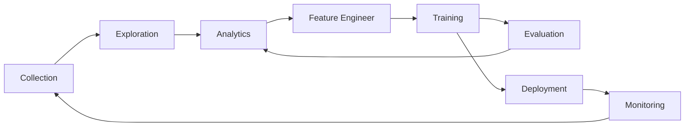

# Lance: A Columnar Data Format for Deep Learning

Lance is a *cloud-native columnar data format* designed for unstructured machine learning datasets, featuring:

* Fast columnar scan for ML dataset analysis, ML training, and evaluation.
* Encodings that are capable of fast point queries for interactive data exploration.
* Extensible design for index and predicates pushdown.
* Self-describable, nested, and strong-typed data with an extensible type system. Support Image, Video, Audio and Sensor
  Data. Support Annotations and Tensors.
* Schema evolution and update (TODO).
* Cloud-native optimizations on low-cost cloud storage, i.e., AWS S3, Google GCS, or Azure Blob Storage.
* Open access via first-class [Apache Arrow](https://arrow.apache.org/) integration and multi-language support.

## Why

Machine Learning development cycle involves the steps:

People use different data representations to varying stages for performance or tooling available.
The academia mainly uses XML / JSON for annotations and zipped images/sensors data for deep learning.
While the industry uses data lake (Parquet-based techniques, i.e., Delta Lake, Iceberg) or data warehouse (AWS Redshift
or Google BigQuery) to collect and analyze data, they have to convert the data into training-friendly formats, such
as [Rikai](https://github.com/eto-ai/rikai)/ [Petastorm](https://github.com/uber/petastorm)
or [Tfrecord](https://www.tensorflow.org/tutorials/load_data/tfrecord).
Multiple single-purpose data transforms, as well as syncing copies between cloud storage to local training
instances have become a common practice among ML practices.

The comparison of different storage technology in each stage of ML development cycle.

|                     | Lance | Parquet & ORC | JSON & XML | Tfrecord | Database | Warehouse |
|---------------------|-------|---------------|------------|----------|----------|-----------|
| Analytics           | Fast  | Fast          | Slow       | Slow     | Decent   | Fast      |
| Feature Engineering | Fast  | Fast          | Decent     | Slow     | Decent   | Good      |
| Training            | Fast  | Decent        | Slow       | Fast     | N/A      | N/A       |
| Exploration         | Fast  | Slow          | Fast       | Slow     | Fast     | Decent    |
| Tooling             | Rich  | Rich          | Rich       | Limited  | Good     | Rich      |

## Presentations and Talks

* [Lance: A New Columnar Data Format](https://docs.google.com/presentation/d/1a4nAiQAkPDBtOfXFpPg7lbeDAxcNDVKgoUkw3cUs2rE/edit#slide=id.p)
  .
  [Scipy 2022, Austin, TX](https://www.scipy2022.scipy.org/posters). July, 2022.
