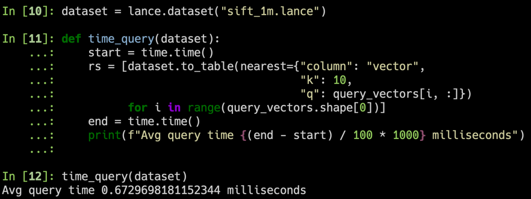
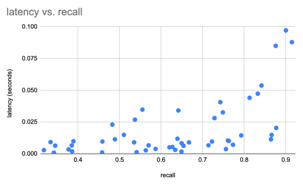
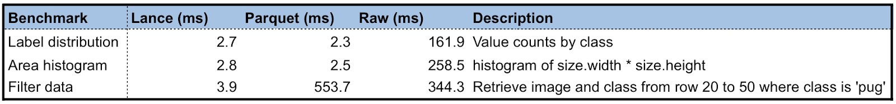
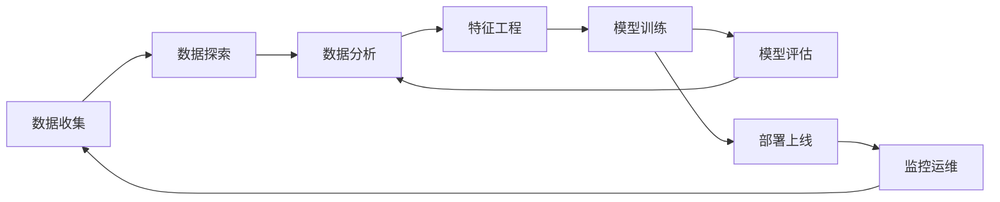

<div align="center">
<p align="center">


**面向多模态 AI 的开放湖仓格式**<br/>
**为湖仓提供高性能向量搜索、全文搜索、随机访问和特征工程能力。**<br/>
**兼容 Pandas、DuckDB、Polars、PyArrow、Ray、Spark 等，更多集成即将推出。**

<a href="https://lance.org">文档</a> &bull;
<a href="https://lance.org/community">社区</a> &bull;
<a href="https://discord.gg/lance">Discord</a> &bull;
<a href="https://groups.google.com/a/lance.org/g/dev">邮件列表</a>

[CI]: https://github.com/lance-format/lance/actions/workflows/rust.yml
[CI Badge]: https://github.com/lance-format/lance/actions/workflows/rust.yml/badge.svg
[Docs]: https://lance.org
[Docs Badge]: https://img.shields.io/badge/docs-passing-brightgreen
[crates.io]: https://crates.io/crates/lance
[crates.io badge]: https://img.shields.io/crates/v/lance.svg
[Python versions]: https://pypi.org/project/pylance/
[Python versions badge]: https://img.shields.io/pypi/pyversions/pylance

[![CI Badge]][CI]
[![Docs Badge]][Docs]
[![crates.io badge]][crates.io]
[![Python versions badge]][Python versions]

[English](README.md) | **中文**

</p>
</div>

<hr />

Lance 是面向多模态 AI 的开放湖仓格式。它包含文件格式、表格式和目录规范，允许你在对象存储之上构建完整的湖仓，为你的 AI 工作流提供动力。Lance 非常适合以下场景：

1. 构建具有混合搜索能力的搜索引擎和特征存储。
2. 需要高性能 IO 和随机访问的大规模 ML 训练。
3. 存储、查询和管理多模态数据，包括图像、视频、音频、文本和嵌入向量。

Lance 的核心特性包括：

* **表达力强的混合搜索：** 在同一数据集上组合向量相似性搜索、全文搜索（BM25）和 SQL 分析，并支持加速的二级索引。

* **极速随机访问：** 随机访问速度比 Parquet 或 Iceberg 快 100 倍，同时不牺牲扫描性能。

* **原生多模态数据支持：** 在统一格式中存储图像、视频、音频、文本和嵌入向量，支持高效的 blob 编码和延迟加载。

* **数据演进：** 高效地添加列并回填值，无需完整的表重写，非常适合 ML 特征工程。

* **零拷贝版本管理：** 自动版本管理，支持 ACID 事务、时间旅行、标签和分支——无需额外基础设施。

* **丰富的生态集成：** Apache Arrow、Pandas、Polars、DuckDB、Apache Spark、Ray、Trino、Apache Flink 以及开放目录（Apache Polaris、Unity Catalog、Apache Gravitino）。

更多详细信息，请参阅完整的 [Lance 格式规范](https://lance.org/format)。

> [!TIP]
> Lance 正在积极开发中，我们欢迎贡献。请参阅我们的[贡献指南](https://lance.org/community/contributing/)了解更多信息。

## 快速开始

**安装**

```shell
pip install pylance
```

安装预览版：

```shell
pip install --pre --extra-index-url https://pypi.fury.io/lance-format/pylance
```

> [!TIP]
> 预览版的发布频率高于正式版，包含最新的功能和错误修复。它们接受与正式版相同级别的测试。
> 我们保证它们将保持发布状态并可供下载至少 6 个月。当你需要锁定特定版本时，建议使用稳定版。

**转换为 Lance 格式**

```python
import lance

import pandas as pd
import pyarrow as pa
import pyarrow.dataset

df = pd.DataFrame({"a": [5], "b": [10]})
uri = "/tmp/test.parquet"
tbl = pa.Table.from_pandas(df)
pa.dataset.write_dataset(tbl, uri, format='parquet')

parquet = pa.dataset.dataset(uri, format='parquet')
lance.write_dataset(parquet, "/tmp/test.lance")
```

**读取 Lance 数据**
```python
dataset = lance.dataset("/tmp/test.lance")
assert isinstance(dataset, pa.dataset.Dataset)
```

**Pandas**
```python
df = dataset.to_table().to_pandas()
df
```

**DuckDB**
```python
import duckdb

# 如果出现段错误，请确保安装了 duckdb v0.7+ 版本
duckdb.query("SELECT * FROM dataset LIMIT 10").to_df()
```

**向量搜索**

下载 sift1m 子集

```shell
wget ftp://ftp.irisa.fr/local/texmex/corpus/sift.tar.gz
tar -xzf sift.tar.gz
```

转换为 Lance 格式

```python
import lance
from lance.vector import vec_to_table
import numpy as np
import struct

nvecs = 1000000
ndims = 128
with open("sift/sift_base.fvecs", mode="rb") as fobj:
    buf = fobj.read()
    data = np.array(struct.unpack("<128000000f", buf[4 : 4 + 4 * nvecs * ndims])).reshape((nvecs, ndims))
    dd = dict(zip(range(nvecs), data))

table = vec_to_table(dd)
uri = "vec_data.lance"
sift1m = lance.write_dataset(table, uri, max_rows_per_group=8192, max_rows_per_file=1024*1024)
```

构建索引

```python
sift1m.create_index("vector",
                    index_type="IVF_PQ",
                    num_partitions=256,  # IVF
                    num_sub_vectors=16)  # PQ
```

搜索数据集

```python
# 获取前 10 个最相似的向量
import duckdb

dataset = lance.dataset(uri)

# 随机采样 100 个查询向量。如果出现段错误，请确保安装了 duckdb v0.7+ 版本
sample = duckdb.query("SELECT vector FROM dataset USING SAMPLE 100").to_df()
query_vectors = np.array([np.array(x) for x in sample.vector])

# 获取所有查询向量的最近邻
rs = [dataset.to_table(nearest={"column": "vector", "k": 10, "q": q})
      for q in query_vectors]
```

## 目录结构

| 目录               | 描述                    |
|--------------------|------------------------|
| [rust](./rust)     | Rust 核心实现           |
| [python](./python) | Python 绑定 (PyO3)     |
| [java](./java)     | Java 绑定 (JNI)        |
| [docs](./docs)     | 文档源码                |

## 基准测试

### 向量搜索

我们使用 SIFT 数据集对 128 维的 100 万向量进行了基准测试。

1. 对于 100 个随机采样的查询向量，平均响应时间 <1ms（在 2023 款 M2 MacBook Air 上）



2. ANN 始终是召回率和性能之间的权衡



### 与 Parquet 对比

我们使用 Oxford Pet 数据集创建了 Lance 数据集，对 Lance 与 Parquet 以及原始图像/XML 进行了初步性能测试。对于分析查询，Lance 比读取原始元数据快 50-100 倍。对于批量随机访问，Lance 比 Parquet 和原始文件都快 100 倍。



## 为什么 Lance 适合 AI/ML 工作流?

机器学习开发周期涉及多个阶段：



传统湖仓格式是为 SQL 分析设计的，在 AI/ML 工作负载中表现不佳，因为 AI/ML 需要：
- **向量搜索** 用于相似性和语义检索
- **快速随机访问** 用于采样和交互式探索
- **多模态数据** 存储（图像、视频、音频与嵌入向量并存）
- **数据演进** 用于特征工程，无需完整表重写
- **混合搜索** 组合向量、全文和 SQL 谓词

虽然现有格式（Parquet、Iceberg、Delta Lake）擅长 SQL 分析，但它们需要额外的专用系统来提供 AI 能力。Lance 将这些 AI 优先的特性直接融入湖仓格式中。

各格式在 ML 开发各阶段的对比：

|                     | Lance | Parquet & ORC | JSON & XML | TFRecord | Database | Warehouse |
|---------------------|-------|---------------|------------|----------|----------|-----------|
| 分析                | 快    | 快            | 慢         | 慢       | 一般     | 快        |
| 特征工程            | 快    | 快            | 一般       | 慢       | 一般     | 良好      |
| 训练                | 快    | 一般          | 慢         | 快       | N/A      | N/A       |
| 探索                | 快    | 慢            | 快         | 慢       | 快       | 一般      |
| 基础设施支持         | 丰富  | 丰富          | 一般       | 有限     | 丰富     | 丰富      |
