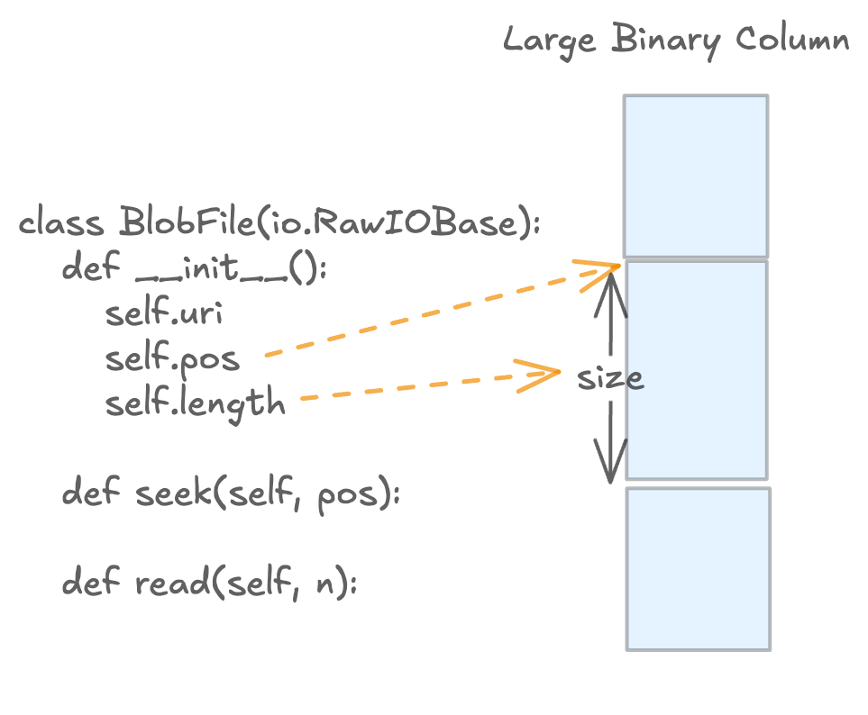

Blob As Files
=============

Unlike other data format, Large multimodal data is first class citizen in Lance
columnar format.
Lance provides a high-level API to store and retrieve large binary objects (blobs) in Lance datasets.

Lance serves large binary data using :py:class:`lance.BlobFile`, which
is a file-like object that lazily read large binary objects.

.. autoclass:: lance.BlobFile
    :members:
    :show-inheritance:
    :noindex:

To fetch blobs from Lance dataset, you can use :py:meth:`lance.dataset.LanceDataset.take_blobs`.

For example, it is easy to use `BlobFile` to extra frames from a video file without
loading the entire video into memory.

.. code-block:: python

    # pip install av pylance

    import av
    import lance

    ds = lance.dataset("./youtube.lance")
    start_time, end_time = 500, 1000
    blobs = ds.take_blobs([5], "video")
    with av.open(blobs[0]) as container:
        stream = container.streams.video[0]
        stream.codec_context.skip_frame = "NONKEY"

        start_time = start_time / stream.time_base
        start_time = start_time.as_integer_ratio()[0]
        end_time = end_time / stream.time_base
        container.seek(start_time, stream=stream)

        for frame in container.decode(stream):
            if frame.time > end_time:
                break
            display(frame.to_image())
            clear_output(wait=True)
