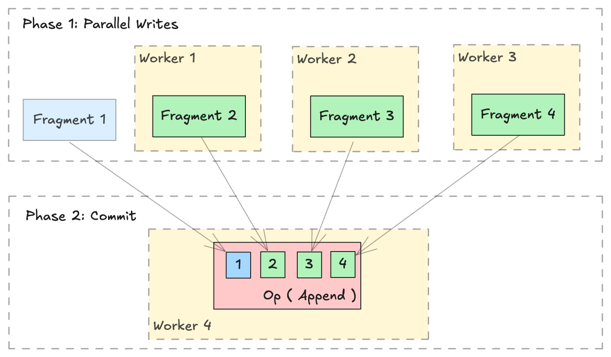

Distributed Write
=================

.. warning::

    Lance provides out-of-the-box :doc:`Ray <./integrations/ray>` and
    `Spark <https://github.com/lancedb/lance/tree/main/java/spark>`_ integrations.

    This page is intended for users who wish to perform distributed operations in a custom manner,
    i.e. using `slurm` or `Kubernetes` without the Lance integration.

Overview
--------

The :doc:`Lance format <format>` is designed to support parallel writing across multiple distributed workers.
A distributed write operation can be performed by two phrases:

#. Generate new :py:class:`~lance.LanceFragment` in parallel across multiple workers.
#. Collecting all the :class:`~lance.FragmentMetadata` and commit into a single dataset in
   a single :py:class:`~lance.LanceOperation`.

Write new data
~~~~~~~~~~~~~~~

Writing or appending new data is straightforward with :py:func:`~lance.fragment.write_fragments`.

.. testsetup:: new_data

    shutil.rmtree("./dist_write", ignore_errors=True)

.. testcode:: new_data

    import json
    from lance.fragment import write_fragments

    # Run on each worker
    data_uri = "./dist_write"
    schema = pa.schema([
        ("a", pa.int32()),
        ("b", pa.string()),
    ])

    # Run on worker 1
    data1 = {
        "a": [1, 2, 3],
        "b": ["x", "y", "z"],
    }
    fragments_1 = write_fragments(data1, data_uri, schema=schema)
    print("Worker 1: ", fragments_1)

    # Run on worker 2
    data2 = {
        "a": [4, 5, 6],
        "b": ["u", "v", "w"],
    }
    fragments_2 = write_fragments(data2, data_uri, schema=schema)
    print("Worker 2: ", fragments_2)

.. testoutput:: new_data

    Worker 1:  [FragmentMetadata(id=0, files=...)]
    Worker 2:  [FragmentMetadata(id=0, files=...)]

Now, use :meth:`lance.fragment.FragmentMetadata.to_json` to serialize the fragment metadata,
and collect all serialized metadata on a single worker to execute the final commit operation.

.. testcode:: new_data
    :emphasize-lines: 8,10,16

    import json
    from lance import FragmentMetadata, LanceOperation

    # Serialize Fragments into JSON data
    fragments_json1 = [json.dumps(fragment.to_json()) for fragment in fragments_1]
    fragments_json2 = [json.dumps(fragment.to_json()) for fragment in fragments_2]

    # On one worker, collect all fragments
    all_fragments = [FragmentMetadata.from_json(f) for f in \
        fragments_json1 + fragments_json2]

    # Commit the fragments into a single dataset
    # Use LanceOperation.Overwrite to overwrite the dataset or create new dataset.
    op = lance.LanceOperation.Overwrite(schema, all_fragments)
    read_version = 0 # Because it is empty at the time.
    lance.LanceDataset.commit(
        data_uri,
        op,
        read_version=read_version,
    )

We can read the dataset using the Lance API:

.. testcode:: new_data

    dataset = lance.dataset(data_uri)
    assert len(dataset.get_fragments()) == 2
    assert dataset.version == 1
    print(dataset.to_table().to_pandas())

.. testoutput:: new_data

        a  b
     0  1  x
     1  2  y
     2  3  z
     3  4  u
     4  5  v
     5  6  w

