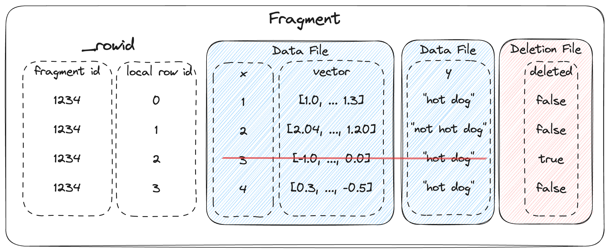
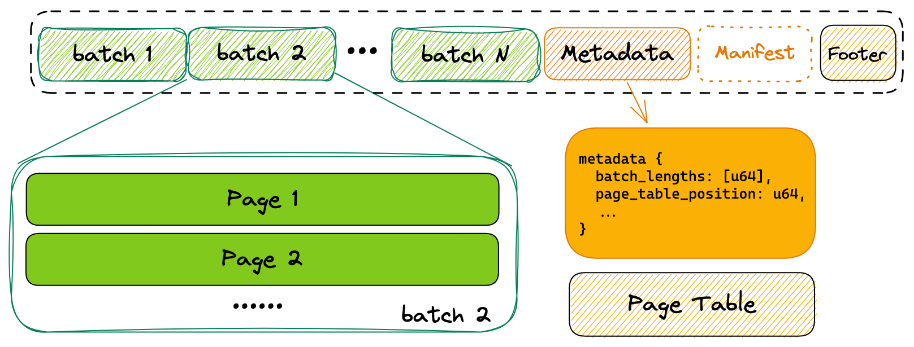
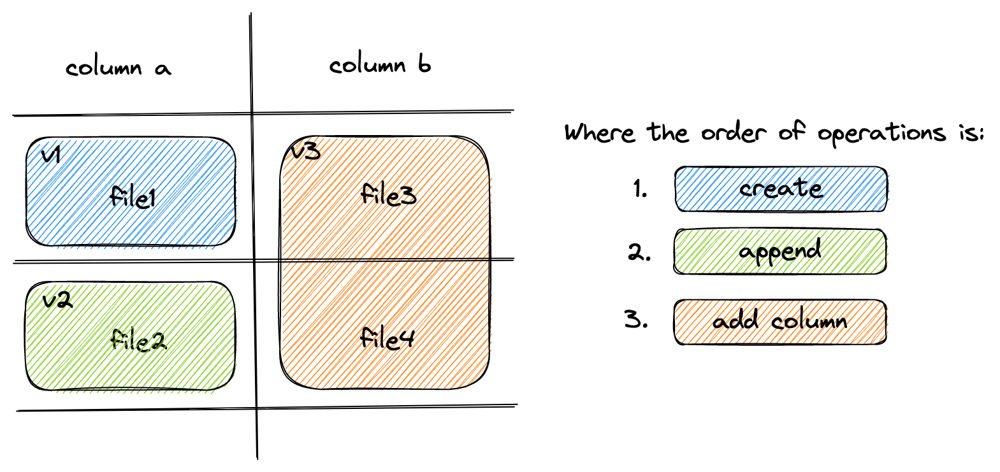
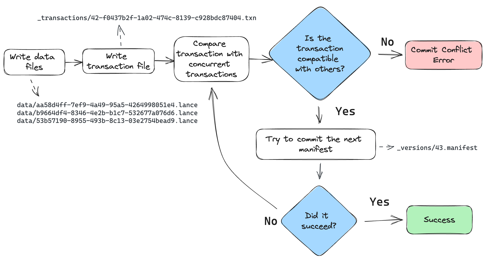
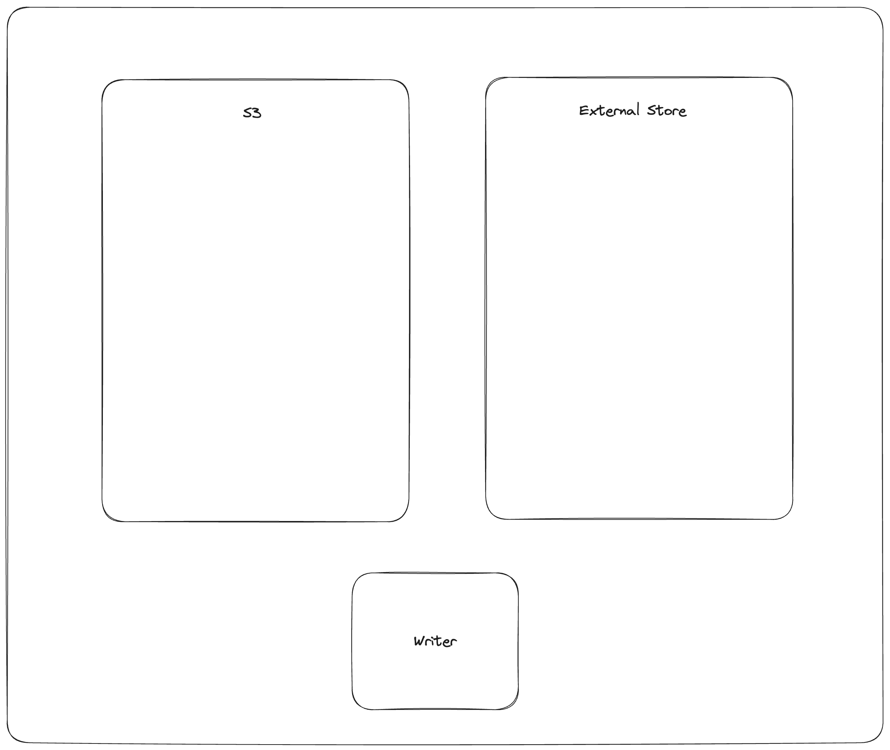
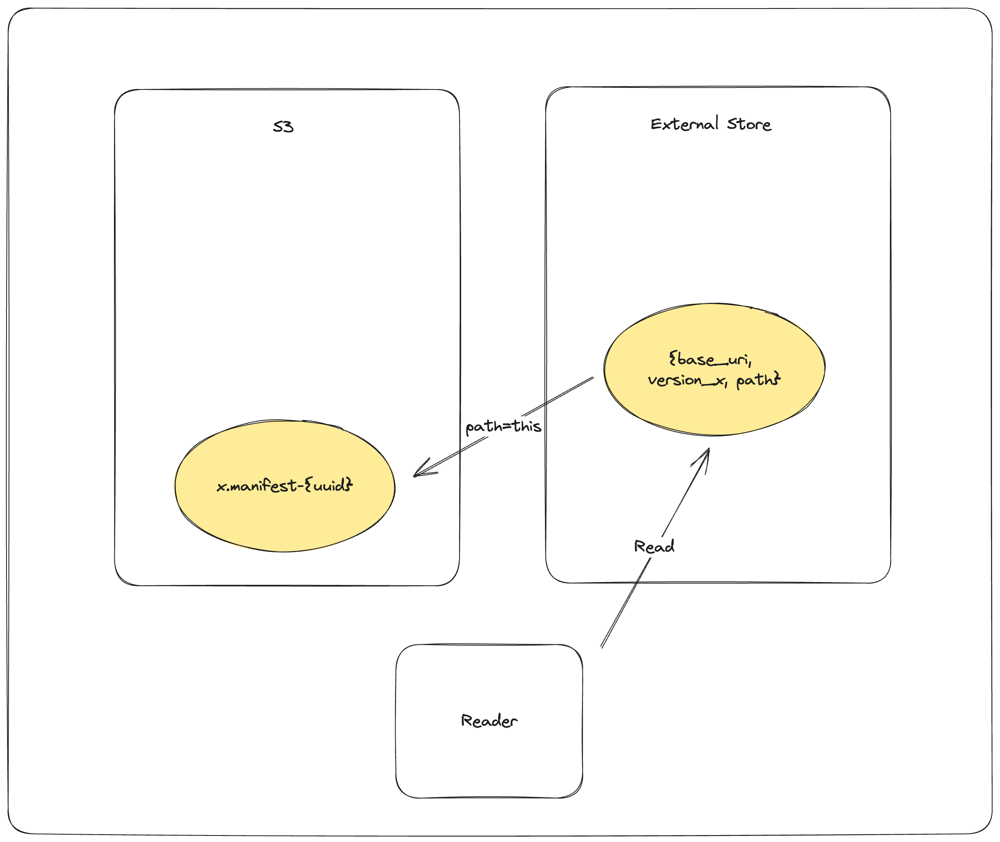

File Format
===========

Dataset Directory
------------------

A `Lance Dataset` is organized in a directory.

.. code-block::

    /path/to/dataset:
        data/*.lance  -- Data directory
        _versions/*.manifest -- Manifest file for each dataset version.
        _indices/{UUID-*}/index.idx -- Secondary index, each index per directory.
        _deletions/*.{arrow,bin} -- Deletion files, which contain ids of rows
          that have been deleted.

A ``Manifest`` file includes the metadata to describe a version of the dataset.

.. literalinclude:: ../protos/table.proto
   :language: protobuf
   :linenos:
   :start-at: // Manifest is
   :end-at: } // Manifest

Fragments
~~~~~~~~~

``DataFragment`` represents a chunk of data in the dataset. Itself includes one or more ``DataFile``,
where each ``DataFile`` can contain several columns in the chunk of data. It also may include a 
``DeletionFile``, which is explained in a later section.

.. literalinclude:: ../protos/table.proto
   :language: protobuf
   :linenos:
   :start-at: // Data fragment
   :end-at: } // DataFile

The overall structure of a fragment is shown below. One or more data files store
the columns of a fragment. New columns can be added to a fragment by adding new
data files. The deletion file (if present), stores the rows that have been
deleted from the fragment.

Every row has a unique id, which is an u64 that is composed of two u32s: the
fragment id and the local row id. The local row id is just the index of the
row in the data files.

File Structure
--------------

Each ``.lance`` file is the container for the actual data.

At the tail of the file, a `Metadata` protobuf block is used to describe the structure of the data file.

.. literalinclude:: ../protos/file.proto
   :language: protobuf
   :linenos:
   :start-at: message Metadata {
   :end-at: } // Metadata

Optionally, a ``Manifest`` block can be stored after the ``Metadata`` block, to make the lance file self-describable.

In the end of the file, a ``Footer`` is written to indicate the closure of a file:

.. code-block::

    +---------------+----------------+
    | 0 - 3 byte    | 4 - 7 byte     |
    +===============+================+
    | metadata position (uint64)     |
    +---------------+----------------+
    | major version | minor version  |
    +---------------+----------------+
    |   Magic number "LANC"          |
    +--------------------------------+

Feature Flags
-------------

As the file format and dataset evolve, new feature flags are added to the
format. There are two separate fields for checking for feature flags, depending
on whether you are trying to read or write the table. Readers should check the
``reader_feature_flags`` to see if there are any flag it is not aware of. Writers 
should check ``writer_feature_flags``. If either sees a flag they don't know, they
should return an "unsupported" error on any read or write operation.

Fields
------

Fields represent the metadata for a column. This includes the name, data type,
id, nullability, and encoding.

Fields are listed in depth first order, and can be one of (1) parent (struct),
(2) repeated (list/array), or (3) leaf (primitive). For example, the schema:

.. code-block::

    a: i32
    b: struct {
        c: list<i32>
        d: i32
    }

Would be represented as the following field list:

.. list-table::
   :widths: 20 20 20 20 25
   :header-rows: 1

   * - name
     - id
     - type
     - parent_id
     - logical_type
   * - ``a``
     - 1
     - LEAF
     - 0
     - ``"int32"``
   * - ``b``
     - 2
     - PARENT
     - 0
     - ``"struct"``
   * - ``b.c``
     - 3
     - REPEATED
     - 2
     - ``"list"``
   * - ``b.c``
     - 4
     - LEAF
     - 3
     - ``"int32"``
   * - ``b.d``
     - 5
     - LEAF
     - 2
     - ``"int32"``

Encodings
---------

`Lance` uses encodings that can render good both point query and scan performance.
Generally, it requires:

1. It takes no more than 2 disk reads to access any data points.
2. It takes sub-linear computation (``O(n)``) to locate one piece of data.

Plain Encoding
~~~~~~~~~~~~~~

Plain encoding stores Arrow array with **fixed size** values, such as primitive values, in contiguous space on disk.
Because the size of each value is fixed, the offset of a particular value can be computed directly.

Null: TBD

Variable-Length Binary Encoding
~~~~~~~~~~~~~~~~~~~~~~~~~~~~~~~

For variable-length data types, i.e., ``(Large)Binary / (Large)String / (Large)List`` in Arrow, Lance uses variable-length
encoding. Similar to Arrow in-memory layout, the on-disk layout include an offset array, and the actual data array.
The offset array contains the **absolute offset** of each value appears in the file.

.. code-block::

    +---------------+----------------+
    | offset array  | data array     |
    +---------------+----------------+

If ``offsets[i] == offsets[i + 1]``, we treat the ``i-th`` value as ``Null``.

Dictionary Encoding
~~~~~~~~~~~~~~~~~~~

Directory encoding is a composite encoding for a
`Arrow Dictionary Type <https://arrow.apache.org/docs/python/generated/pyarrow.DictionaryType.html#pyarrow.DictionaryType>`_,
where Lance encodes the `key` and `value` separately using primitive encoding types,
i.e., `key` are usually encoded with `Plain Encoding`_.

Dataset Update and Schema Evolution
-----------------------------------

``Lance`` supports fast dataset update and schema evolution via manipulating the ``Manifest`` metadata.

``Appending`` is done by appending new ``Fragment`` to the dataset.
While adding columns is done by adding new ``DataFile`` of the new columns to each ``Fragment``.
Finally, ``Overwrite`` a dataset can be done by resetting the ``Fragment`` list of the ``Manifest``.

Deletion
--------

Rows can be marked deleted by adding a deletion file next to the data in the
``_deletions`` folder. These files contain the indices of rows that have between
deleted for some fragment. For a given version of the dataset, each fragment can
have up to one deletion file. Fragments that have no deleted rows have no deletion
file.

Readers should filter out row ids contained in these deletion files during a 
scan or ANN search.

Deletion files come in two flavors:

1. Arrow files: which store a column with a flat vector of indices
2. Roaring bitmaps: which store the indices as compressed bitmaps.

`Roaring Bitmaps`_ are used for larger deletion sets, while Arrow files are used for
small ones. This is because Roaring Bitmaps are known to be inefficient for small
sets.

.. _`Roaring Bitmaps`: https://roaringbitmap.org/

The filenames of deletion files are structured like:

.. code-block::

    _deletions/{fragment_id}-{read_version}-{random_id}.{arrow|bin}

Where ``fragment_id`` is the fragment the file corresponds to, ``read_version`` is
the version of the dataset that it was created off of (usually one less than the
version it was committed to), and ``random_id`` is a random i64 used to avoid
collisions. The suffix is determined by the file type (``.arrow`` for Arrow file,
``.bin`` for roaring bitmap).

.. literalinclude:: ../protos/table.proto
   :language: protobuf
   :linenos:
   :start-at: // Deletion File
   :end-at: } // DeletionFile

Deletes can be materialized by re-writing data files with the deleted rows 
removed. However, this invalidates row indices and thus the ANN indices, which
can be expensive to recompute.

Committing Datasets
-------------------

A new version of a dataset is committed by writing a new manifest file to the
``_versions`` directory.

To prevent concurrent writers from overwriting each other, the commit process
must be atomic and consistent for all writers. If two writers try to commit
using different mechanisms, they may overwrite each other's changes. For any
storage system that natively supports atomic rename-if-not-exists or
put-if-not-exists, these operations should be used. This is true of local file
systems and cloud object stores, with the notable except of AWS S3. For ones
that lack this functionality, an external locking mechanism can be configured
by the user.

Conflict resolution
~~~~~~~~~~~~~~~~~~~

If two writers try to commit at the same time, one will succeed and the other
will fail. The failed writer should attempt to retry the commit, but only if
it's changes are compatible with the changes made by the successful writer.

The changes for a given commit are recorded as a transaction file, under the
``_transactions`` prefix in the dataset directory. The transaction file is a
serialized ``Transaction`` protobuf message. See the ``transaction.proto`` file
for its definition.

The commit process is as follows:

 1. The writer finishes writing all data files.
 2. The writer creates a transaction file in the ``_transactions`` directory.
    This files describes the operations that were performed, which is used for two
    purposes: (1) to detect conflicts, and (2) to re-build the manifest during
    retries.
 3. Look for any new commits since the writer started writing. If there are any,
    read their transaction files and check for conflicts. If there are any
    conflicts, abort the commit. Otherwise, continue.
 4. Build a manifest and attempt to commit it to the next version. If the commit
    fails because another writer has already committed, go back to step 3.

When checking whether two transactions conflict, be conservative. If the
transaction file is missing, assume it conflicts. If the transaction file 
has an unknown operation, assume it conflicts.

.. _external-manifest-store:

External Manifest Store
~~~~~~~~~~~~~~~~~~~~~~~

If the backing object store does not support \*-if-not-exists operations, an
external manifest store can be used to allow concurrent writers. An external
manifest store is a KV store that supports put-if-not-exists operation. The
external manifest store supplements but does not replace the manifests in
object storage. A reader unaware of the external manifest store could read a
table that uses it, but it might be up to one version behind the true latest
version of the table.

The commit process is as follows:

1. ``PUT_OBJECT_STORE mydataset.lance/_versions/{version}.manifest-{uuid}`` stage a new manifest in object store under a unique path determined by new uuid
2. ``PUT_EXTERNAL_STORE base_uri, version, mydataset.lance/_versions/{version}.manifest-{uuid}`` commit the path of the staged manifest to the external store.
3. ``COPY_OBJECT_STORE mydataset.lance/_versions/{version}.manifest-{uuid} mydataset.lance/_versions/{version}.manifest`` copy the staged manifest to the final path
4. ``PUT_EXTERNAL_STORE base_uri, version, mydataset.lance/_versions/{version}.manifest`` update the external store to point to the final manifest

Note that the commit is effectively complete after step 2. If the writer fails
after step 2, a reader will be able to detect the external store and object store
are out-of-sync, and will try to synchronize the two stores. If the reattempt at
synchronization fails, the reader will refuse to load. This is to ensure the that
the dataset is always portable by copying the dataset directory without special
tool.

The reader load process is as follows:

1. ``GET_EXTERNAL_STORE base_uri, version, path`` then, if path does not end in a UUID return the path
2. ``COPY_OBJECT_STORE mydataset.lance/_versions/{version}.manifest-{uuid} mydataset.lance/_versions/{version}.manifest`` reattempt synchronization
3. ``PUT_EXTERNAL_STORE base_uri, version, mydataset.lance/_versions/{version}.manifest`` update the external store to point to the final manifest
4. ``RETURN mydataset.lance/_versions/{version}.manifest`` always return the finalized path, return error if synchronization fails

Statistics
----------

Statistics are stored within Lance files. The statistics can be used to determine
which pages can be skipped within a query. The null count, lower bound (min),
and upper bound (max) are stored.

Statistics themselves are stored in Lance's columnar format, which allows for
selectively reading only relevant stats columns.

Statistic values
~~~~~~~~~~~~~~~~

Three types of statistics are stored per column: null count, min value, max value.
The min and max values are stored as their native data types in arrays.

There are special behavior for different data types to account for nulls:

For integer-based data types (including signed and unsigned integers, dates,
and timestamps), if the min and max are unknown (all values are null), then the
minimum/maximum representable values should be used instead.

For float data types, if the min and max are unknown, then use ``-Inf`` and ``+Inf``,
respectively. (``-Inf`` and ``+Inf`` may also be used for min and max if those values
are present in the arrays.) ``NaN`` values should be ignored for the purpose of min and max
statistics. If the max value is zero (negative or positive), the max value
should be recorded as ``+0.0``. Likewise, if the min value is zero (positive
or negative), it should be recorded as ``-0.0``.

For binary data types, if the min or max are unknown or unrepresentable, then use
null value. Binary data type bounds can also be truncated. For example, an array
containing just the value ``"abcd"`` could have a truncated min of
``"abc"`` and max of ``"abd"``. If there is no truncated value greater than the
maximum value, then instead use null for the maximum.

.. warning::

    The ``min`` and ``max`` values are not guaranteed to be within the array;
    they are simply upper and lower bounds. Two common cases where they are not
    contained in the array is if the min or max original value was deleted and
    when binary data is truncated. Therefore, statistic should not be used to
    compute queries such as ``SELECT max(col) FROM table``.

Page-level statistics format
~~~~~~~~~~~~~~~~~~~~~~~~~~~~

Page-level statistics are stored as arrays within the Lance file. Each array
contains one page long and is ``num_pages`` long. The page offsets are stored in
an array just like the data page table. The offset to the statistics page
table is stored in the metadata.

The schema for the statistics is:

.. code-block::

    <field_id_1>: struct
        null_count: i64
        min_value: <field_1_data_type>
        max_value: <field_1_data_type>
    ...
    <field_id_N>: struct
        null_count: i64
        min_value: <field_N_data_type>
        max_value: <field_N_data_type>

Any number of fields may be missing, as statistics for some fields or of some
kind may be skipped. In addition, readers should expect there may be extra
fields that are not in this schema. These should be ignored. Future changes to
the format may add additional fields, but these changes will be backwards
compatible.

However, writers should not write extra fields that aren't described in this
document. Until they are defined in the specification, there is no guarantee that
readers will be able to safely interpret new forms of statistics.

Feature: Move-Stable Row IDs
----------------------------

The row ids features assigns a unique u64 id to each row in the table. This id is
stable after being moved (such as during compaction), but is not necessarily
stable after a row is updated. (A future feature may make them stable after
updates.) To make access fast, a secondary index is created that maps row ids to
their locations in the table. The respective parts of these indices are stored
in the respective fragment's metadata.

row id
  A unique auto-incrementing u64 id assigned to each row in the table.

row address
  The current location of a row in the table. This is a u64 that can be thought
  of as a pair of two u32 values: the fragment id and the local row offset. For
  example, if the row address is (42, 9), then the row is in the 42rd fragment
  and is the 10th row in that fragment.

row id sequence
  The sequence of row ids in a fragment.

row id index
  A secondary index that maps row ids to row addresses. This index is constructed
  by reading all the row id sequences.

Assigning row ids
~~~~~~~~~~~~~~~~~

Row ids are assigned in a monotonically increasing sequence. The next row id is
stored in the manifest as the field ``next_row_id``. This starts at zero. When
making a commit, the writer uses that field to assign row ids to new fragments.
If the commit fails, the writer will re-read the new ``next_row_id``, update
the new row ids, and then try again. This is similar to how the ``max_fragment_id``
is used to assign new fragment ids.

When a row id updated, it it typically assigned a new row id rather than
reusing the old one. This is because this feature doesn't have a mechanism to
update secondary indices that may reference the old values for the row id. By
deleting the old row id and creating a new one, the secondary indices will avoid
referencing stale data.

Row ID sequences
~~~~~~~~~~~~~~~~

The row id values for a fragment are stored in a ``RowIdSequence`` protobuf
message. This is described in the `protos/rowids.proto`_ file. Row id sequences
are just arrays of u64 values, which have representations optimized for the
common case where they are sorted and possibly contiguous. For example, a new
fragment will have a row id sequence that is just a simple range, so it is 
stored as a ``start`` and ``end`` value.

These sequence messages are either stored inline in the fragment metadata, or
are written to a separate file and referenced from the fragment metadata. This
choice is typically made based on the size of the sequence. If the sequence is
small, it is stored inline. If it is large, it is written to a separate file. By
keeping the small sequences inline, we can avoid the overhead of additional IO
operations.

.. literalinclude:: ../protos/table.proto
   :language: protobuf
   :start-at:   oneof row_id_sequence {
   :end-at: } // row_id_sequence
   :caption: `protos/table.proto`_

Row ID index
~~~~~~~~~~~~

To ensure fast access to rows by their row id, a secondary index is created that
maps row ids to their locations in the table. This index is built when a table is
loaded, based on the row id sequences in the fragments. For example, if fragment
42 has a row id sequence of ``[0, 63, 10]``, then the index will have entries for
``0 -> (42, 0)``, ``63 -> (42, 1)``, ``10 -> (42, 2)``. The exact form of this
index is left up to the implementation, but it should be optimized for fast lookups.

.. _protos/table.proto: https://github.com/lancedb/lance/blob/main/protos/table.proto
.. _protos/rowids.proto: https://github.com/lancedb/lance/blob/main/protos/rowids.proto

