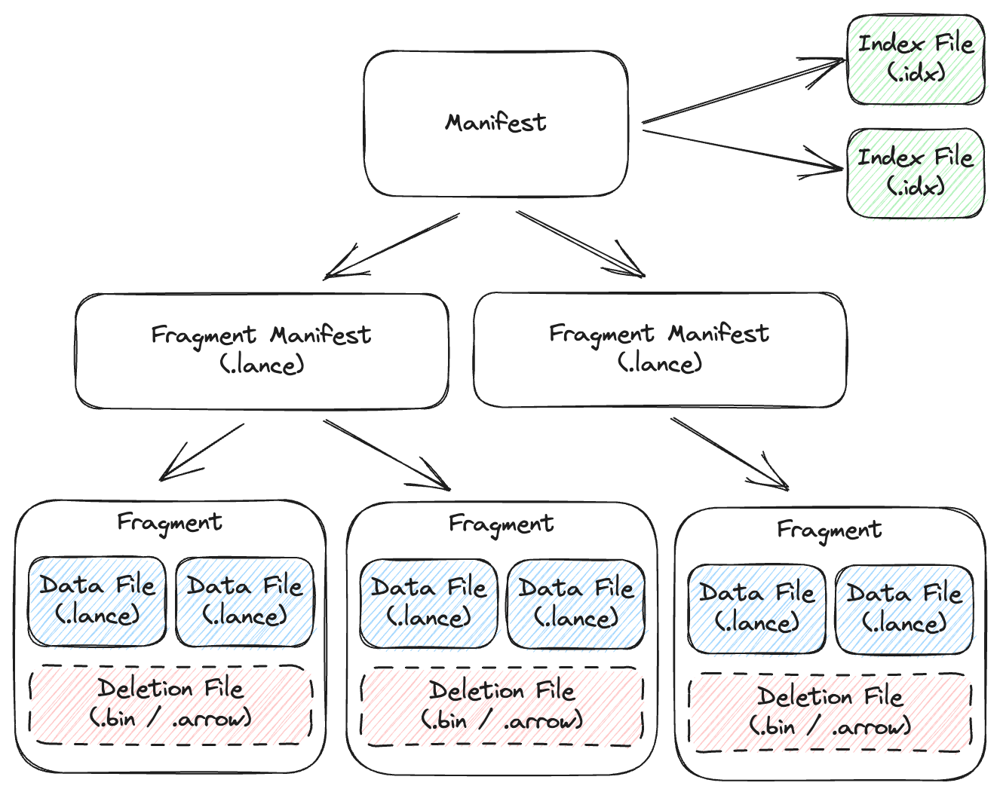

File Format
===========

Dataset Directory
------------------

A `Lance Dataset` is organized in a directory.

.. code-block::

    /path/to/dataset:
        data/*.lance  -- Data directory
        latest.manifest -- The manifest file for the latest version.
        _versions/*.manifest -- Manifest file for each dataset version.
        _fragment_manifests/*.lance -- Lance files containing data file metadata.
        _indices/{UUID-*}/index.idx -- Secondary index, each index per directory.

A ``Manifest`` file includes the metadata to describe a version of the dataset.
The manifest file references one or more fragment manifests. The fragment manifests
are Lance files where each row is a fragment, and contains the path, metadata,
and statistics for those fragments.

A fragment is a collection of rows. It is made up of multiple Lance files,
which collectively contain all the columns in the fragment. It also may contain
a deletion file, which houses the row ids of deleted rows.

Manifest format
~~~~~~~~~~~~~~~

The manifest file format is defined by a protobuf message:

.. literalinclude:: ../protos/format.proto
   :language: protobuf
   :linenos:
   :start-at: // Manifest is
   :end-at: } // Manifest

Fragments
~~~~~~~~~

``DataFragment`` represents a chunk of data in the dataset. Itself includes one or more ``DataFile``,
where each ``DataFile`` can contain several columns in the chunk of data. It also may include a 
``DeletionFile``, which is explained in a later section.

Fragment manifest format
~~~~~~~~~~~~~~~~~~~~~~~~

The fragment manifest is a Lance file, where each row is a fragment. The minimal schema
is:

.. code-block::

    id: u32
    data_files: struct
        path: string
        fields: list<u32>
    deletion_file: struct
        file_type: dictionary<u8, string>
        read_version: u64
        id: u64

The fragment manifest may include additional fields, such as:

.. code-block::

    num_deleted_rows: u64
    stats: struct
        num_values: i64
        <field_id_1>: struct
            null_count: i64
            min_value: <field_1_data_type>
            max_value: <field_1_data_type>
        ...
        <field_id_N>: struct
            null_count: i64
            min_value: <field_N_data_type>
            max_value: <field_N_data_type>

These fields are non-nullable, except for ``deletion_file.file_type``. If the
fragment does not have a deletion file, then ``file_type`` will be null. In those
rows, ``deletion_file.read_version`` and ``deletion_file.id`` may be arbitrary
values.

.. warning::

    Extra fields may be present in the manifest. They should be ignored if they
    are not understood.

Inline fragments
~~~~~~~~~~~~~~~~

Tables may also have their fragments represented inline in the manifest file,
under the ``fragments`` field, if the "external manifests" feature flag is
turned off. The ``DataFragment`` protobuf message represents a single fragment.

.. literalinclude:: ../protos/format.proto
   :language: protobuf
   :linenos:
   :start-at: // Data fragment
   :end-at: } // DataFile

The overall structure of a fragment is shown below. One or more data files store
the columns of a fragment. New columns can be added to a fragment by adding new
data files. The deletion file (if present), stores the rows that have been
deleted from the fragment.

.. image:: _static/fragment_structure.png

Every row has a unique id, which is an u64 that is composed of two u32s: the
fragment id and the local row id. The local row id is just the index of the
row in the data files.

File Structure
--------------

Each ``.lance`` file is the container for the actual data.

.. image:: file_struct.png

At the tail of the file, a `Metadata` protobuf block is used to describe the structure of the data file.

.. literalinclude:: ../protos/format.proto
   :language: protobuf
   :linenos:
   :start-at: message Metadata {
   :end-at: } // Metadata

Optionally, a ``Manifest`` block can be stored after the ``Metadata`` block, to make the lance file self-describable.

In the end of the file, a ``Footer`` is written to indicate the closure of a file:

.. code-block::

    +---------------+----------------+
    | 0 - 3 byte    | 4 - 7 byte     |
    +===============+================+
    | metadata position (uint64)     |
    +---------------+----------------+
    | major version | minor version  |
    +---------------+----------------+
    |   Magic number "LANC"          |
    +--------------------------------+

Feature Flags
-------------

As the file format and dataset evolve, new feature flags are added to the
format. There are two separate fields for checking for feature flags, depending
on whether you are trying to read or write the table. Readers should check the
``reader_feature_flags`` to see if there are any flag it is not aware of. Writers 
should check ``writer_feature_flags``. If either sees a flag they don't know, they
should return an "unsupported" error on any read or write operation.

Fields
------

Fields represent the metadata for a column. This includes the name, data type,
id, nullability, and encoding.

Fields are listed in depth first order, and can be one of (1) parent (struct),
(2) repeated (list/array), or (3) leaf (primitive). For example, the schema:

.. code-block::

    a: i32
    b: struct {
        c: list<i32>
        d: i32
    }

Would be represented as the following field list:

.. list-table::
   :widths: 20 20 20 20 25
   :header-rows: 1

   * - name
     - id
     - type
     - parent_id
     - logical_type
   * - ``a``
     - 1
     - LEAF
     - 0
     - ``"int32"``
   * - ``b``
     - 2
     - PARENT
     - 0
     - ``"struct"``
   * - ``b.c``
     - 3
     - REPEATED
     - 2
     - ``"list"``
   * - ``b.c``
     - 4
     - LEAF
     - 3
     - ``"int32"``
   * - ``b.d``
     - 5
     - LEAF
     - 2
     - ``"int32"``

Encodings
---------

`Lance` uses encodings that can render good both point query and scan performance.
Generally, it requires:

1. It takes no more than 2 disk reads to access any data points.
2. It takes sub-linear computation (``O(n)``) to locate one piece of data.

Plain Encoding
~~~~~~~~~~~~~~

Plain encoding stores Arrow array with **fixed size** values, such as primitive values, in contiguous space on disk.
Because the size of each value is fixed, the offset of a particular value can be computed directly.

Null: TBD

Variable-Length Binary Encoding
~~~~~~~~~~~~~~~~~~~~~~~~~~~~~~~

For variable-length data types, i.e., ``(Large)Binary / (Large)String / (Large)List`` in Arrow, Lance uses variable-length
encoding. Similar to Arrow in-memory layout, the on-disk layout include an offset array, and the actual data array.
The offset array contains the **absolute offset** of each value appears in the file.

.. code-block::

    +---------------+----------------+
    | offset array  | data array     |
    +---------------+----------------+

If ``offsets[i] == offsets[i + 1]``, we treat the ``i-th`` value as ``Null``.

Dictionary Encoding
~~~~~~~~~~~~~~~~~~~

Directory encoding is a composite encoding for a
`Arrow Dictionary Type <https://arrow.apache.org/docs/python/generated/pyarrow.DictionaryType.html#pyarrow.DictionaryType>`_,
where Lance encodes the `key` and `value` separately using primitive encoding types,
i.e., `key` are usually encoded with `Plain Encoding`_.

Dataset Update and Schema Evolution
-----------------------------------

``Lance`` supports fast dataset update and schema evolution via manipulating the ``Manifest`` metadata.

``Appending`` is done by appending new ``Fragment`` to the dataset.
While adding columns is done by adding new ``DataFile`` of the new columns to each ``Fragment``.
Finally, ``Overwrite`` a dataset can be done by resetting the ``Fragment`` list of the ``Manifest``.

.. image:: schema_evolution.png

Deletion
--------

Rows can be marked deleted by adding a deletion file next to the data in the
``_deletions`` folder. These files contain the indices of rows that have between
deleted for some fragment. For a given version of the dataset, each fragment can
have up to one deletion file. Fragments that have no deleted rows have no deletion
file.

Readers should filter out row ids contained in these deletion files during a 
scan or ANN search.

Deletion files come in two flavors:

1. Arrow files: which store a column with a flat vector of indices
2. Roaring bitmaps: which store the indices as compressed bitmaps.

`Roaring Bitmaps`_ are used for larger deletion sets, while Arrow files are used for
small ones. This is because Roaring Bitmaps are known to be inefficient for small
sets.

.. _`Roaring Bitmaps`: https://roaringbitmap.org/

The filenames of deletion files are structured like:

.. code-block::

    _deletions/{fragment_id}-{read_version}-{random_id}.{arrow|bin}

Where ``fragment_id`` is the fragment the file corresponds to, ``read_version`` is
the version of the dataset that it was created off of (usually one less than the
version it was committed to), and ``random_id`` is a random i64 used to avoid
collisions. The suffix is determined by the file type (``.arrow`` for Arrow file,
``.bin`` for roaring bitmap).

.. literalinclude:: ../protos/format.proto
   :language: protobuf
   :linenos:
   :start-at: // Deletion File
   :end-at: } // DeletionFile

Deletes can be materialized by re-writing data files with the deleted rows 
removed. However, this invalidates row indices and thus the ANN indices, which
can be expensive to recompute.

Statistics
----------

Statistics are stored for both the page-level (within a Lance file) and
fragment-level (within the manifest). The statistics can be used to determine
which fragments or pages can be skipped within a query. The null count, lower
bound (min), and upper bound (max) are stored.

Statistics themselves are stored in Lance's columnar format, which allows for
selectively reading only relevant stats columns.

Statistic values
~~~~~~~~~~~~~~~~

Three types of statistics are stored: null count, min value, max value. The min
and max values are stored as their native data types in arrays.

There are special behavior for different data types to account for nulls:

For integer-based data types (including signed and unsigned integers, dates,
and timestamps), if the min and max are unknown (all values are null), then the
minimum/maximum representable values should be used instead.

For float data types, if the min and max are unknown, then use ``-Inf`` and ``+Inf``,
respectively. ``NaN`` values should be ignored for the purpose of min and max
statistics. If the max value is zero (negative or positive), the max value
should be recorded as ``+0.0``. Likewise, if the min value is zero (positive
or negative), it should be recorded as ``-0.0``.

For binary data types, if the min or max are unknown or unrepresentable, then use
null value. Binary data type bounds can also be truncated. For example, an array
containing just the value ``"abcd"`` could have a truncated min of
``"abc"`` and max of ``"abd"``. If there is no truncated value greater than the
maximum value, then instead use null for the maximum.

.. warning::

    The ``min`` and ``max`` values are not guaranteed to be within the array;
    they are simply upper and lower bounds. Two common cases where they are not
    contained in the array is if the min or max original value was deleted and
    when binary data is truncated. Therefore, statistic should not be used to
    compute queries such as ``SELECT max(col) FROM table``, except to identify
    which pages and files definitely do not contain the min or max value.

Page-level statistics format
~~~~~~~~~~~~~~~~~~~~~~~~~~~~

Page-level statistics are stored as separate arrays within the Lance file. Each
array is only one page long. The page offsets are stored in an array just like
the data page table. The offset to the statistics page offsets is stored in the
metadata.

The schema for the statistics is:

.. code-block::

    num_values: i64
    <field_id_1>: struct
        null_count: i64
        min_value: <field_1_data_type>
        max_value: <field_1_data_type>
    ...
    <field_id_N>: struct
        null_count: i64
        min_value: <field_N_data_type>
        max_value: <field_N_data_type>

File-level statistics format
~~~~~~~~~~~~~~~~~~~~~~~~~~~~

File-level statistics are stored within the external manifest file. The statistics
are stored under the ``stats`` column, as a struct with the same schema as the 
page-level statistics.

.. note::

    Since the external manifest file is itself a Lance file, it will have
    page-level statistics about the file-level statistics within it. For manifest
    with a high number of files, those page-level statistics can be used to prune
    fragments based on some predicate, reducing the amount of IO required when 
    reading the fragment list.

Controlling statistics collection
~~~~~~~~~~~~~~~~~~~~~~~~~~~~~~~~~

Sometimes, users may not wish to collect statistics on all columns. This might be
especially true for column that are large binary blobs.

There is a field called ``statistics_columns`` that tracks which field ids to
collect statistics for going forward. This field is optional, and if it is not
set then statistics should be collected for all columns, if possible.

Partitioning
------------

Other table formats support explicit partitioning, splitting up files based on
column values (such as Hive-style partitioning) or transformations of them
(such as Apache Iceberg's "hidden partitioning").

Lance uses implicit partitioning. Data files and fragments may be written with
arbitrary splits and clustering, but no special metadata is recorded. Instead,
the partition values are encoded automatically in the fragment-level statistics.

What partitioning and clustering schemes are supported is entirely up to writers.
All that is needed to read any partitioning scheme is the file-level statistics,
so any partitioning scheme (even totally custom ones) are compatible with all
readers that support reading file-level statistics.
