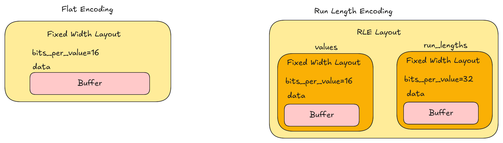
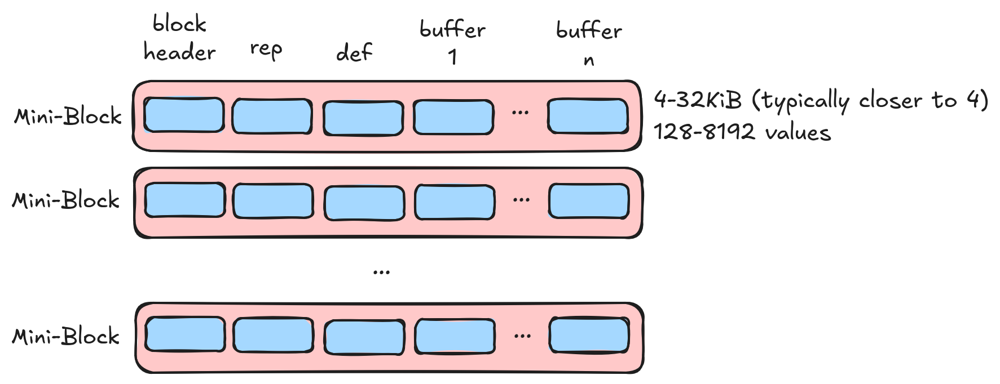
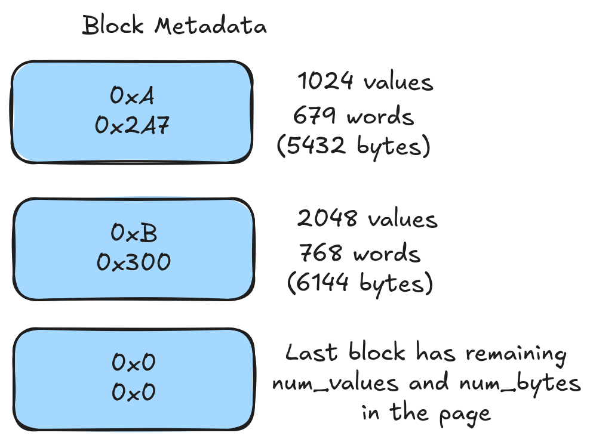
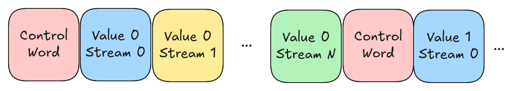
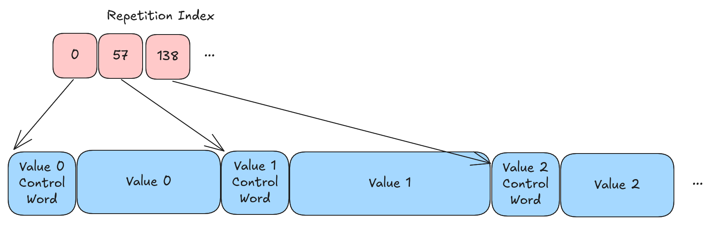

# Lance Encoding Strategy

The encoding strategy determines how array data is encoded into a disk page. The encoding strategy tends to evolve
more quickly than the file format itself.

## Older Encoding Strategies

The 0.1 and 2.0 encoding strategies are no longer documented. They were significantly different from future encoding
strategies and describing them in detail would be a distraction.

## Terminology

An array is a sequence of values. An array has a data type which describes the semantic interpretation of the values.
A layout is a way to encode an array into a set of buffers and child arrays. A buffer is a contiguous sequence of
bytes. An encoding describes how the semantic interpretation of data is mapped to the layout. An encoder converts
data from one layout to another.

Data types and layouts are orthogonal concepts. An integer array might be encoded into two completely different
layouts which represent the same data.



### Data Types

Lance uses a subset of Arrow's type system for data types. An Arrow data type is both a data type and an encoding.
When writing data Lance will often normalize Arrow data types. For example, a string array and a large string array
might end up traveling down the same path (variable width data). In fact, most types fall into two general paths. One
for fixed-width data and one for variable-width data (where we recognize both 32-bit and 64-bit offsets).

At read time, the Arrow data type is used to determine the target encoding. For example, a string array and large
string array might both be stored in the same layout but, at read time, we will use the Arrow data type to determine
the size of the offsets returned to the user. There is no requirement the output Arrow type matches the input Arrow
type. For example, it is acceptable to write an array as "large string" and then read it back as "string".

## Search Cache

The search cache is a key component of the Lance file reader. Random access requires that we locate the physical
location of the data in the file. To do so we need to know information such as the encoding used for a column,
the location of the page, and potentially other information. This information is collectively known as the "search
cache" and is implemented as a basic LRU cache. We define a "initialization phase" which is when we load the various indexing information into the search cache. The cost of initialization is assumed to be amortized over the lifetime
of the reader.

When performing full scans (i.e. not random access), we should be able to ignore the search cache and sometimes
can avoid loading it entirely. We _do_ want to optimize for cold scans as the initialization phase is often not
amortized over the lifetime of the reader.

## Structural Encoding

The first step in encoding an array is to determine the structural encoding of the array. A structural encoding
breaks the data into smaller units which can be independently decoded. Structural encodings are also responsible
for encoding the "structure" (struct validity, list validity, list offsets, etc.) typically utilizing repetition
levels and definition levels.

Structural encoding is fairly complicated! However, the goal is to suck out all the details related to I/O
scheduling so that compression libraries can focus on compression. This keeps our compression traits simple
without sacrificing our ability to perform random access.

There are only a few structural encodings. The structural encoding is described by the `PageLayout` message and
is the top-level message for the encoding.

```protobuf
%%% proto.message.PageLayout %%%
```

### Repetition and Definition Levels

Repetition and definition levels are an alternative to validity bitmaps and offset arrays for expressing struct
and list information. They have a significant advantage in that they combine all of these buffers into a single
buffer which allows us to avoid multiple IOPS.

A more extensive explanation of repetition and definition levels can be found in the code. One particular note
is that we use 0 to represent the "inner-most" item and Parquet uses 0 to represent the "outer-most" item. Here
is an example:

#### Definition Levels

Consider the following array:

```text
[{"middle": {"inner": 1]}}, NULL, {"middle": NULL}, {"middle": {"inner": NULL}}]
```

In Arrow we would have the following validity arrays:

```text
Outer validity : 1, 0, 1, 1
Middle validity: 1, ?, 0, 1
Inner validity : 1, ?, ?, 0
Values         : 1, ?, ?, ?
```

The ? values are undefined in the Arrow format. We can convert these into definition levels as follows:

| Values | Definition | Notes                |
| ------ | ---------- | -------------------- |
| 1      | 0          | Valid at all levels  |
| ?      | 3          | Null at outer level  |
| ?      | 2          | Null at middle level |
| ?      | 1          | Null at inner level  |

#### Repetition Levels

Consider the following list array with 3 rows

```text
[{<0,1>, <>, <2>}, {<3>}, {}], [], [{<4>}]
```

We would have three offsets arrays in Arrow:

```text
Outer-most ([]): [0, 3, 3, 4]
Middle     ({}): [0, 3, 4, 4, 5]
Inner      (<>): [0, 2, 2, 3, 4, 5]
Values         : [0, 1, 2, 3, 4]
```

We can convert these into repetition levels as follows:

| Values | Repetition | Notes                                     |
| ------ | ---------- | ----------------------------------------- |
| 0      | 3          | Start of outer-most list                  |
| 1      | 0          | Continues inner-most list (no new lists)  |
| ?      | 1          | Start of new inner-most list (empty list) |
| 2      | 1          | Start of new inner-most list              |
| 3      | 2          | Start of new middle list                  |
| ?      | 2          | Start of new inner-most list (empty list) |
| ?      | 3          | Start of new outer-most list (empty list) |
| 4      | 0          | Start of new outer-most list              |

### Mini Block Page Layout

The mini block page layout is the default layout for smallish types. This fits most of the classical data types
(integers, floats, booleans, small strings, etc.) that Parquet and related formats already handle well. As is no
surprise, the approach used is pretty similar to those formats.



The data is divided into small mini-blocks. Each mini-block should contain a power-of-two number of values (except
for the last mini-block) and should be less than 32KiB of compressed data. We have to read an entire mini-block to
get a single value so we want to keep the mini-block size small. Mini blocks are padded to 8 byte boundaries. This
helps to avoid alignment issues. Each mini-block starts with a small header which helps us figure out how much
padding has been applied.

The repetition and definition levels are sliced up and stored in the mini-blocks along with the compressed buffers.
Since we need to read an entire mini-block there is no need to zip up the various buffers and they are stored
one after the other (repetition, definition, values, ...).

#### Buffer 1 (Mini Blocks)

| Bytes | Meaning                             |
| ----- | ----------------------------------- |
| 1     | Number of buffers in the mini-block |
| 2     | Size of buffer 0                    |
| 2     | Size of buffer 1                    |
| ...   | ...                                 |
| 2     | Size of buffer N                    |
| 0-7   | Padding to ensure 8 byte alignment  |
| \*    | Buffer 0                            |
| 0-7   | Padding to ensure 8 byte alignment  |
| \*    | Buffer 1                            |
| ...   | ...                                 |
| 0-7   | Padding to ensure 8 byte alignment  |
| \*    | Buffer N                            |
| 0-7   | Padding to ensure 8 byte alignment  |

Note: It is natural to explain this buffer first but it is actually the second buffer in the page.

#### Buffer 0 (Mini Block Metadata)



To enable random access we have a small metadata lookup which contains two bytes per mini-block. This lookup
tells us how many bytes are in each mini block and how many items are in the mini block. This metadata lookup
must be loaded at initialization time and placed in the search cache.

| Bits (not bytes) | Meaning                             |
| ---------------- | ----------------------------------- |
| 12               | Number of 8-byte words in block 0   |
| 4                | Log2 of number of values in block 0 |
| 12               | Number of 8-byte words in block 1   |
| 4                | Log2 of number of values in block 1 |
| ...              | ...                                 |
| 12               | Number of 8-byte words in block N   |
| 4                | Log2 of number of values in block N |

The last 4 bits are special and we just store 0 today. This is because the protobuf contains the number of
values (not required to be a power of 2) in the entire disk page. We can subtract the values in the other blocks
to get the number of values in the last block.

#### Buffer 2 (Dictionary, optional)

Dictionary encoding is an encoding that can be applied at many different levels throughout a file. For example,
it could be used as a compressive encoding or it could even be entirely external to the file. We've found the
most convenient simple place to apply dictionary encoding is at the structural level. Since dictionary indices are
small we always use the mini block layout for dictionary encoding. When we use dictionary encoding we store the
dictionary in the buffer at index 2. We require the dictionary to be full loaded and decoded at initialization time.
This means we don't have to load the dictionary during random access but it does require the dictionary be placed
in the search cache.

Dictionary encoding is one of the few spots today where we have no rules on how it is encoded and compressed. We
treat the entire dictionary as a single opaque buffer. As a result we rely on the block compression trait to handle
dictionary compression.

#### Buffer 2 (or 3) (Repetition Index, optional)

If there is repetition (list levels) then we need some way to translate row offsets into item offsets. The mini
blocks always store items. During a full scan the list offsets are restored when we decode the repetition levels.
However, to support random access, we don't have the repetition levels available. Instead we store a repetition
index in the next available buffer (index 2 or 3 depending on whether the dictionary is present).

The repetition index is a flat buffer of u64 values. We have N \* D values where N is the number of mini blocks
and D Is the desired depth of random access plus one. For example, to support 1-dimensional lookups (random access
by rows) then D is 2. To support two-dimensional lookups (e.g. rows\[50\]\[17\]) then we could set D to 3.

Currently we only support 1-dimensional random access.
Currently we do not compress the repetition index.

This may change in future versions.

| Bytes | Meaning                            |
| ----- | ---------------------------------- |
| 8     | Number of rows in block 0          |
| 8     | Number of partial items in block 0 |
| 8     | Number of rows in block 1          |
| 8     | Number of partial items in block 1 |
| ...   | ...                                |
| 8     | Number of rows in block N          |
| 8     | Number of partial items in block N |

The last 8 bytes of each block stores the number of "partial" items. These are items leftover after the last
complete row. We don't require rows to be bounded by mini-blocks so we need to keep track of this. For example,
if we have 10,000 items per row then we might have several mini-blocks with only partial items and 0 rows.

At read time we can use this repetition index to translate row offsets into item offsets.

#### Mini Block Compression

The mini block layout relies on the compression algorithm to handle the splitting of data into mini-blocks. This
is because the number of values per block will depend on the compressibility of the data. As a result, there is
a special trait for mini block compression.

The data compression algorithm is the algorithm that decides chunk boundaries. The repetition and definition levels
are then sliced appropriately and sent to a block compressor. This means there are no constraints on how the repetition
and definition levels are compressed.

Beyond splitting the data into mini-blocks, there are no additional constraints. We expect to fully decode mini
blocks as opaque chunks. This means we can use any compression algorithm that we deem suitable.

#### Protobuf

```protobuf
%%% proto.message.MiniBlockLayout %%%
```

The protobuf for the mini block layout describes the compression of the various buffers. It also tells us
some information about the dictionary (if present) and the repetition index (if present).

### Full Zip Page Layout

The full zip page layout is a layout for larger values (e.g. vector embeddings) which are large but not so large
that we can justify a single IOP per value. In this case we are trying to avoid storing a large amount of "chunk
overhead" (both in terms of buffer space and the RAM space in the search cache that we would need to store the
repetition index). As a tradeoff, we are introducing a second IOP per-range for random access reads (unless the
data is fixed-width such as vector embeddings).

We currently use 256 bytes as the cutoff for the full zip layout. At this point we would only be fitting 16 values
in a 4KiB disk sector and so creating a mini-block descriptor for every 16 values would be too much overhead.

As a further consequence, we must ensure that the compression algorithm is "transparent" so that we can index
individual values after compression has been applied. This prevents us from using compression algorithms such
as delta encoding. If we want to apply general compression we have to apply them on a per-value basis. The way
we enforce this is by requiring the compression to return either a flat fixed-width or variable-width layout
so that we know the location of each element.

The repetition and definition levels, along with all compressed buffers, are all zipped together into a single
buffer.

#### Data Buffer (Buffer 0)



The data buffer is a single buffer that contains the repetition, definition, and value data, all zipped into a
single buffer. The repetition and definition information are combined and byte packed. This is referred to as
a control word. If the value is null or an empty list, then the control word is all that is serialized. If there
is no validity or repetition information then control words are not serialized. If the value is variable-width
then we encode the size of the value. This is either a 4-byte or 8-byte integer depending on the width used in
the offsets returned by the compression (in future versions this will likely be encoded with some kind of
variable-width integer encoding). Finally the value buffers themselves are appended.

| Bytes | Meaning        |
| ----- | -------------- |
| 0-4   | Control word 0 |
| 0/4/8 | Value 0 size   |
| \*    | Value 0 data   |
| ...   | ...            |
| 0-4   | Control word N |
| 0/4/8 | Value N size   |
| \*    | Value N data   |

Note: a fixed-width data type that has no validity information (e.g. non-nullable vector embeddings) is simply a
flat buffer of data.

#### Repetition Index (Buffer 1)



If there is repetition information or the values are variable width then we need additional help to locate values
in the disk page. The repetition index is an array of u64 values. There is one value per row and the value is an
offset to the start of that row in the data buffer. To perform random access we require two IOPS. First we issue
an IOP into the repetition index to determine the location and then a second IOP into the data buffer to load the
data. Alternatively, the entire repetition index can be loaded into memory in the initialization phase though this
can lead to high RAM usage by the search cache.

The repetition index must have a fixed width (or else we would need a repetition index to read the repetition
index!) and be transparent. As a result the compression options are limited. That being said, there is little
value (in terms of performance) in compressing the repetition index. It is never read in its entirety as it is
not needed for full scans. Currently the repetition index is always compressed with simple (non-chunked) byte
packing into 1,2,4, or 8 byte values.

#### Protobuf

```protobuf
%%% proto.message.FullZipLayout %%%
```

The protobuf for the full zip layout describes the compression of the data buffer. It also tells us the
size of the control words and how many bits we have per value (for fixed-width data) or how many bits we
have per offset (for variable-width data).

### All Null Page Layout

This layout is used when all the values are null. Surprisingly, this does not mean there is no data. If there
are any levels of struct or list then we need to store the rep/def levels so that we can distinguish between
null structs, null lists, empty lists, and null values.

#### Repetition and Definition Levels (Buffers 0 and 1)

Note: We currently store rep levels in the first buffer with a flat layout of 16-bit values and def levels
in the second buffer with a flat layout of 16-bit values. This will likely change in future versions.

#### Protobuf

```protobuf
%%% proto.message.AllNullLayout %%%
```

All we need to know is the meaning of each rep/def level.

### Blob Page Layout

The blob page layout is a layout for large binary values where we would only have a few values per disk page.
The actual data is stored out-of-line in external buffers. The disk page stores a "description" which is a
struct array of two fields: `position` and `size`. The `position` is the absolute file offset of the blob and
the `size` is the size (in bytes) of the blob. The inner page layout describes how the descriptions are encoded.

The validity information (definition levels) is smuggled into the descriptions. If the size and position are
both zero then the value is empty. Otherwise, if the size is zero and the position is non-zero then the
value is null and the position is the definition level.

This layout is only recommended when you can justify a single IOP per value. For example, when values are 1MiB
or larger.

This layout has no buffers of its own and merely wraps an inner layout.

#### Protobuf

```protobuf
%%% proto.message.BlobLayout %%%
```

Since we smuggle the validity into the descriptions we don't need to store it in the inner layout and so the
rep/def meaning is stored in the blob layout and the rep/def meaning in the inner layout will be 1 all valid item
layer.

## Semi-Structural Transformations

There are some data transformations that are applied to the data before (or during) the structural encoding process.
These are described here.

### Dictionary Encoding

Dictionary encoding is a technique that can be applied to any kind of array. It is useful when there are not very
many unique values in the array. First, a "dictionary" of unique values is created. Then we create a second array
of indices into the dictionary.

Dictionary encoding is also known as "categorical encoding" in other contexts.

Dictionary encoding could be treated as simply another compression technique but, when applied, it would be an
opaque compression technique which would limit its usability (e.g. in a full zip context). As a result, we apply
it before any structural encoding takes place. This allows us to place the dictionary in the search cache for
random access.

### Struct Packing

Struct packing is an alternative representation to apply to struct values. Instead of storing that struct in a
columnar fashion it will be stored in a row-major fashion. This will reduce the number of IOPS needed for random
access but will prevent the ability to read a single field at a time. This is useful when all fields in the struct
are always accessed together.

Packed struct is always opt-in (see section on configuration below).

Currently packed struct is limited to fixed-width data.

### Fixed Size List

Fixed size lists are an Arrow data type that needs specialized handling at the structural level. If the underlying
data type is primitive then the fixed size list will be primitive (e.g. a tensor). If the underlying data type
is structural (struct/list) then the fixed size list is structural and should be treated the same as a
variable-size list.

We don't want compression libraries to need to worry about the intricacies of fixed-size lists. As a result we
flatten the list as part of structural encoding. This complicates random access as we must translate between
rows (an entire fixed size list) and items (a single item in the list).

If the items in a fixed size list are nullable then we do not treat that validity array as a repetition or
definition level. Instead, we store the validity as a separate buffer. For example, when encoding nullable fixed
size lists with mini-block encoding the validity buffer is another buffer in the mini-block. When encoding
nullable fixed size lists with full-zip encoding the validity buffer is zipped together with the values.

The good news is that fixed size lists are entirely a structural encoding concern. Compression techniques are
free to pretend that the fixed-size list data type does not exist.

## Compression

Once a structural encoding is chosen we must determine how to compress the data. There are various buffers that
might be compressed (e.g. data, repetition, definition, dictionary, etc.). The available compression algorithms
are also constrained by the structural encoding chosen. For example, when using the full zip layout we require
transparent compression. As a result, each encoding technique may or may not be usable in a given scenario. In
addition, the same technique may be applied in a different way depending on the encoding chosen.

In implementation terms we have a trait for each compression constraint. The techniques then implement the traits
that they can be applied to. To start with, here is a summary of compression techniques which are implemented in
at least one scenario and a list of which traits the technique implements. A ❓ is used to indicate that the
technique should be usable in that context but we do not yet do so while a ❌ indicates that the technique is
not usable because it is not transparent. Note, even though a technique is not transparent it can still be applied
on a per-value basis. We use ☑️ to mark a technique that is applied on a per-value basis:

| Compression     | Used in Block Context | Used in Full Zip Context | Used in Mini-Block Context |
| --------------- | --------------------- | ------------------------ | -------------------------- |
| Flat            | ✅ (2.1)              | ✅ (2.1)                 | ✅ (2.1)                   |
| Variable        | ✅ (2.1)              | ✅ (2.1)                 | ✅ (2.1)                   |
| Constant        | ✅ (2.1)              | ❓                       | ❓                         |
| Bitpacking      | ✅ (2.1)              | ❓                       | ✅ (2.1)                   |
| Fsst            | ❓                    | ✅ (2.1)                 | ✅ (2.1)                   |
| Rle             | ❓                    | ❌                       | ✅ (2.1)                   |
| ByteStreamSplit | ❓                    | ❌                       | ✅ (2.1)                   |
| General         | ❓                    | ☑️ (2.1)                 | ✅ (2.1)                   |

In the following sections we will describe each technique in a bit more detail and explain how it is utilized
in various contexts.

### Flat

Flat compression is the uncompressed representation of fixed-width data. There is a single buffer of data
with a fixed number of bits per value.

When applied in a mini-block context we find the largest power of 2 number of values that will be less than
8,186 bytes and use that as the block size.

### Variable

Variable compression is the uncompressed representation of variable-width data. There is a buffer of values and
a buffer of offsets.

When applied in a mini-block context each block may have a different number of values. We walk through the values
until we find the point that would exceed 4,096 bytes and then use the most recent power of 2 number of values that
we have passed.

### Constant

Constant compression is currently only utilized in a few specialized scenarios such as all-null arrays.

This will likely change in future versions.

### Bitpacking

Bitpacking is a compression technique that removes the unused bits from a set of values. For example, if we have
a u32 array and the maximum value is 5000 then we only need 13 bits to store each value.

When used in a mini-block context we always use 1024 values per block. In addition, we store the compressed bit
width inline in the block itself.

Bitpacking is, in theory, usable in a full zip context. However, values in this context are so large that shaving
off a few bits is unlikely to have any meaningful impact. Also, the full-zip context keeps things byte-aligned and
so we would have to remove at least 8 bits per value.

### Fsst

Fsst is a fast and transparent compression algorithm for variable-width data. It is the primary compression
algorithm that we apply to variable-width data.

Currently we use a single FSST symbol table per disk page and store that symbol table in the protobuf description.
This is for historical reasons and is not ideal and will likely change in future versions.

When FSST is applied in a mini-block context we simply compress the data and let the underlying compressor (always
`Variable` at the moment) handle the chunking.

### Run Length Encoding (RLE)

Run length encoding is a compression technique that compresses large runs of identical values into an array
of values and an array of run lengths. This is currently used in the mini-block context. To determine if we
should apply run-length encoding we look at the number of runs divided by the number of values. If the ratio is
below a threshold (by default 0.5) then we apply run-length encoding.

### Byte Stream Split (BSS)

Byte stream split is a compression technique that splits multi-byte values by byte position, creating separate streams
for each byte position across all values. This is a rudimentary and simple form of translating floating point values
into a more compressible format because it tends to cluster the mantissa bits together which are often consistent
across a column of floating point values. It does not actually make the data smaller by itself. As a result, BSS is
only applied if general compression is also applied on the column.

We currently determine whether or not to apply BSS by looking at an entropy statistics. There is a configurable
sensitivity parameter. A sensitivity of 0.0 means never apply BSS and a sensitivity of 1.0 means always apply BSS.

### General

General compression is a catch-all term for classical opaque compression techniques such as LZ4, ZStandard, Snappy,
etc. These techniques are typically back-referencing compressors which replace values with a "back reference" to
a spot where we already saw the value.

When applied in a mini-block context we run general compression after all other compression and compress the entire
mini-block.

When applied in a full zip context we run general compression on each value.

The only time general compression is automatically applied is in a full-zip context when we have values that are at
least 32KiB large. This is because general compression can be CPU intensive.

However, general compression is highly effective and we allow it to be opted into in other contexts via configuration.

## Compression Configuration

The following section lists the available configuration options. These can be set programmatically through writer
options. However, they can also be set in the field metadata in the schema.

| Key                                  | Values                               | Default          | Description                                                                             |
| ------------------------------------ | ------------------------------------ | ---------------- | --------------------------------------------------------------------------------------- |
| `lance-encoding:compression`         | `lz4`, `zstd`, `none`, ...           | `none`           | Opt-in to general compression. The value indicates the scheme.                          |
| `lance-encoding:compression-level`   | Integers (range is scheme dependent) | Varies by scheme | Higher indicates more work should be done to compress the data.                         |
| `lance-encoding:rle-threshold`       | `0.0-1.0`                            | `0.5`            | See below                                                                               |
| `lance-encoding:bss`                 | `off`, `on`, `auto`                  | `auto`           | See below                                                                               |
| `lance-encoding:dict-divisor`        | Integers greater than 1              | `2`              | See below                                                                               |
| `lance-encoding:general`             | `off`, `on`                          | `off`            | Whether to apply general compression.                                                   |
| `lance-encoding:packed`              | Any string                           | Not set          | Whether to apply packed struct encoding (see above).                                    |
| `lance-encoding:structural-encoding` | `miniblock`, `fullzip`               | Not set          | Force a particular structural encoding to be applied (only useful for testing purposes) |

### Configuration Details

#### Compression Scheme

The `lance-encoding:compression` setting enables general-purpose compression algorithms to be applied. Available schemes:

- **`lz4`**: Fast compression with good compression ratios. Default compression level is fast mode.
- **`zstd`**: High compression ratios with configurable levels (0-22). Better compression than LZ4 but slower.
- **`none`**: No general compression applied (default).
- **`fsst`**: Fast Static Symbol Table compression for string data.

General compression is applied on top of other encoding techniques (RLE, BSS, bitpacking, etc.) to further reduce
data size. For mini-block layouts, compression is applied to entire mini-blocks. For full-zip layouts with large values
(≥32KiB), compression is automatically applied per-value.

#### Compression Level

The compression level is scheme dependent. Currently the following schemes support the following levels:

| Scheme | Crate Used                              | Levels | Default                                                                                                                                                                                                                           |
| ------ | --------------------------------------- | ------ | --------------------------------------------------------------------------------------------------------------------------------------------------------------------------------------------------------------------------------- |
| `zstd` | [`zstd`](https://crates.io/crates/zstd) | `0-22` | `crate dependent` (3 as of this writing)                                                                                                                                                                                          |
| `lz4`  | [`lz4`](https://crates.io/crates/lz4)   | N/A    | The LZ4 crate has two modes (fast and high compression) and currently this is not exposed to configuration. The LZ4 crate wraps a C library and the default is dependent on the C library. The default as of this writing is fast |

Higher compression levels generally provide better compression at the cost of slower encoding speed. Decoding speed
is typically less affected by the compression level.

#### Run Length Encoding (RLE) Threshold

The RLE threshold is used to determine whether or not to apply run-length encoding. The threshold is a ratio
calculated by dividing the number of runs by the number of values. If the ratio is less than the threshold then
we apply run-length encoding. The default is 0.5 which means we apply run-length encoding if the number of runs
is less than half the number of values.

**Key points:**
- RLE is automatically selected when data has sufficient repetition (run_count / num_values < threshold)
- Supported types: All fixed-width primitives (u8, i8, u16, i16, u32, i32, f32, u64, i64, f64)
- Maximum chunk size: 2048 values per mini-block
- Setting threshold to `0.0` effectively disables RLE
- Setting threshold to `1.0` makes RLE very aggressive (used whenever any runs exist)

RLE is particularly effective for:
- Sorted or partially sorted data
- Columns with many repeated values (status codes, categories, etc.)
- Low-cardinality columns

#### Byte Stream Split (BSS)

The configuration variable for BSS is a simple enum. A value of `off` means to never apply BSS, a value of `on`
means to always apply BSS, and a value of `auto` means to apply BSS based on an entropy calculation (see code for
details).

**Important:** BSS is only applied when the `lance-encoding:compression` variable is also set (to a non-`none` value).
BSS is a data transformation that makes floating-point data more compressible; it does not reduce size on its own.

**Key points:**
- Supported types: Only 32-bit and 64-bit data (f32, f64, timestamps)
- Maximum chunk sizes: 1024 values (f32), 512 values (f64)
- `auto` mode: Uses entropy analysis with 0.5 sensitivity threshold
- `on` mode: Always applies BSS for supported types
- `off` mode: Never applies BSS

BSS works by splitting multi-byte values by byte position, creating separate byte streams. This clusters similar
bits together (especially mantissa bits in floating-point numbers), which general compression algorithms can then
compress more effectively.

BSS is particularly effective for:
- Floating-point measurements with similar ranges
- Time-series data with consistent precision
- Scientific data with correlated mantissa patterns

#### Dictionary Divisor

Currently this is used to determine whether or not we apply dictionary encoding. First, we use HLL to estimate
the number of unique values in the column. Then we divide the number of total values by the divisor to get a
threshold. If the number of unique values is less than the threshold then we apply dictionary encoding. The
configuration variable defines the divisor that we apply and it defaults to 2 which means we apply dictionary
encoding if we estimate that less than half the values are unique.

Dictionary encoding is effective for columns with low cardinality where the same values repeat many times.
The dictionary is stored once per page and indices are stored in place of the actual values.

This is likely to change in future versions.

#### Packed Struct Encoding

Packed struct encoding is a semi-structural transformation described above. When enabled, struct values are stored
in row-major format rather than the default columnar format. This reduces the number of I/O operations needed for
random access but prevents reading individual fields independently.

This is always opt-in and should only be used when all struct fields are typically accessed together.
