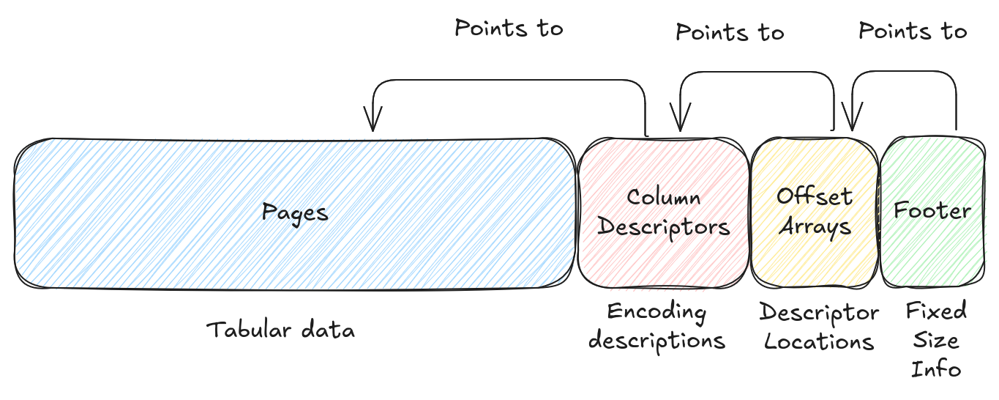
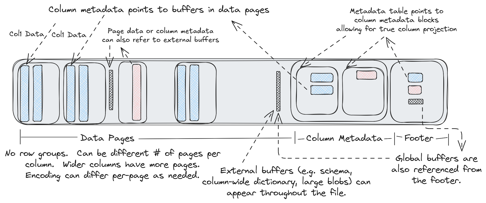

# Lance File Format

## File Structure

A Lance file is a container for tabular data. The data is stored in "disk pages". Each disk page contains some rows
for a single column. There may be one or more disk pages per column. Different columns may have different numbers of
disk pages. Metadata at the end of the file describes where the pages are located and how the data is encoded.



!!! Note

    This page describes the container specification. We also have a set of default encodings that are used to encode
    data into disk pages. See the [Encoding Strategy](encoding.md) page for more details.

### Disk Pages

Disk pages are designed to be large enough to justify a dedicated I/O operation, even on cloud storage, typically several megabytes. Using a larger page size may reduce the number of I/O operations required to read a file, but it also increases the amount of memory required to write the file. In practice, very large page sizes are not useful when high speed reads are required because large contiguous reads need to be broken into smaller reads for performance (particularly on cloud storage). As a result, a default of 8MB is recommended for the page size and should yield ideal performance on all storage systems.

Disk pages should not generally be opaque. It is possible to read a portion of a disk page when a subset of the rows are
required. However, the specifics of this process depend on the column encoding which is described in a later section.

### No Row Groups

Unlike similar formats, there is no "row group" concept, only pages. We believe the concept of row groups to be
fundamentally harmful to performance. If the row group size is too small then columns will be split into "runt pages" which yield poor read performance on cloud storage. If the row group size is too large then a file writer will need
a large amount of RAM since an entire row group must be buffered in memory before it can be written. Instead, to split
a file amongst multiple readers we rely on the fact that partial page reads are possible and have minimal read
amplification. As a result, you can split the file at whatever row boundary you want.

### Buffer Alignment

The file format does not require that buffers be contiguous as buffers are referenced by absolute offsets. In practice,
we always align buffers to 64 byte boundaries.

### External Buffers

Every page in the file is referenced by an absolute offset. This means that non-page data may be inserted amongst the
pages. This can be useful for storing extremely large data types which might only fit a few rows per page otherwise. We
can instead store the data out-of-line and store the locations in a page.

In addition, the file format supports "global buffers" which can be used for auxiliary data. This may be used to
store a file schema, file indexes, column statistics, or other metadata. References to the global buffers are stored
in a special spot in the footer.

### Column Descriptors

At the tail of the file is metadata that describes each page in the file, particularly the encoding strategy used.
This metadata consists of a series of "column descriptors", which are standalone protobuf messages for each column
in the file. Since each column has its own message there is no need to read all file metadata if you are only interested
in a subset of the columns. However, in many cases, the column descriptors are small enough that it is cheaper to read
the entire footer in a single read than split it into multiple reads.

### Offsets & Footer

After the column descriptors there are offset arrays for the column descriptors and global buffers. These simply
point to the locations of each item. Finally, there is a fixed-size footer which describes the position of the
offset arrays and start of the metadata section.

### Identifiers and Type Systems

This basic container format has no concept of types. These are added later by the encoding layer. All columns are
referenced by an integer "column index". All global buffers are referenced by an integer "global buffer index".
The schema is typically stored in the global buffers, but the file format is unaware of this.

## Reading Strategy

The file metadata will need to be known before reading the data. A simple approach for loading the footer is to
read one sector from the end (sector depends on the filesystem, 4KiB for local disk, larger for cloud storage). Then
parse the footer and read the rest of the metadata (at this point the size will be known). This requires 1-2 IOPS. By
storing the metadata size in some other location (e.g. table manifest) it is possible to always read the footer in
a single IOP. If there are _many_ columns in the file and only some are desired then it may be better to read
individual columns instead of reading all column metadata, increasing the number of IOPS but decreasing the amount
of data read.

Next, to read the data, scan through the pages for each column to determine which pages are needed. Each page stores
the row offset of the first row in the page. This makes it easy to quickly determine the required pages. The encoding
information for the page can then be used to determine exactly which byte ranges are needed from the page.

Disk pages should be large enough that there should no significant benefit to sequentially reading the file. However,
if such a use case is desired then the file can be read sequentially once the metadata is known, assuming you want to
read all columns in the file.

## Detailed Overview



A detailed description of the file layout follows:

```protobuf
// Note: the number of buffers (BN) is independent of the number of columns (CN)
//       and pages.
//
//       Buffers often need to be aligned.  64-byte alignment is common when
//       working with SIMD operations.  4096-byte alignment is common when
//       working with direct I/O.  In order to ensure these buffers are aligned
//       writers may need to insert padding before the buffers.
//
//       If direct I/O is required then most (but not all) fields described
//       below must be sector aligned.  We have marked these fields with an
//       asterisk for clarity.  Readers should assume there will be optional
//       padding inserted before these fields.
//
//       All footer fields are unsigned integers written with little endian
//       byte order.
//
// ├──────────────────────────────────┤
// | Data Pages                       |
// |   Data Buffer 0*                 |
// |   ...                            |
// |   Data Buffer BN*                |
// ├──────────────────────────────────┤
// | Column Metadatas                 |
// | |A| Column 0 Metadata*           |
// |     Column 1 Metadata*           |
// |     ...                          |
// |     Column CN Metadata*          |
// ├──────────────────────────────────┤
// | Column Metadata Offset Table     |
// | |B| Column 0 Metadata Position*  |
// |     Column 0 Metadata Size       |
// |     ...                          |
// |     Column CN Metadata Position  |
// |     Column CN Metadata Size      |
// ├──────────────────────────────────┤
// | Global Buffers Offset Table      |
// | |C| Global Buffer 0 Position*    |
// |     Global Buffer 0 Size         |
// |     ...                          |
// |     Global Buffer GN Position    |
// |     Global Buffer GN Size        |
// ├──────────────────────────────────┤
// | Footer                           |
// | A u64: Offset to column meta 0   |
// | B u64: Offset to CMO table       |
// | C u64: Offset to GBO table       |
// |   u32: Number of global bufs     |
// |   u32: Number of columns         |
// |   u16: Major version             |
// |   u16: Minor version             |
// |   "LANC"                         |
// ├──────────────────────────────────┤
//
// File Layout-End
```

### Column Metadata

The protobuf messages for the column metadata are as follows:

```protobuf
%%% proto.message.ColumnMetadata %%%
```
