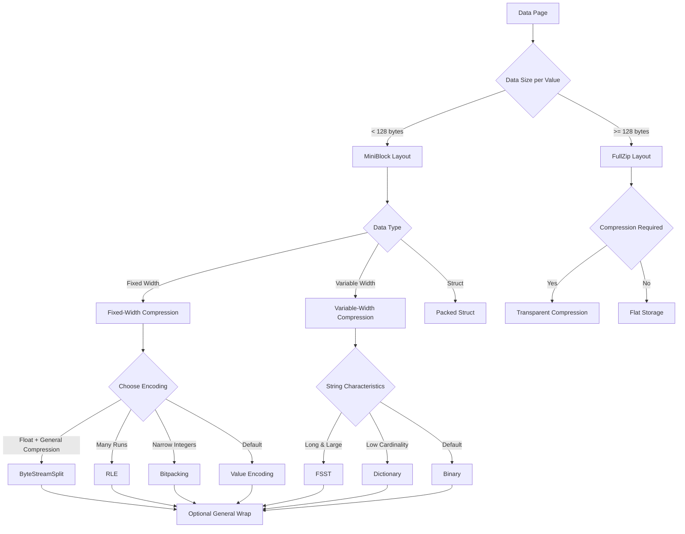
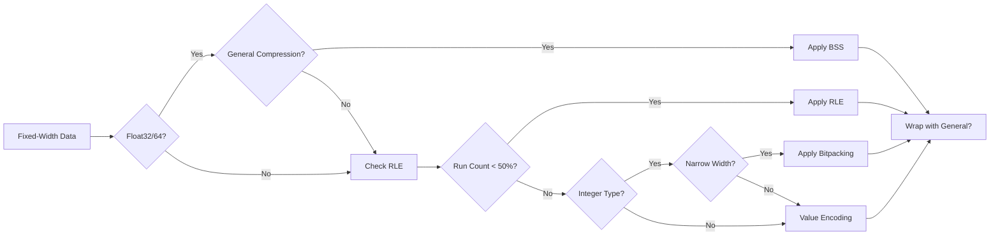
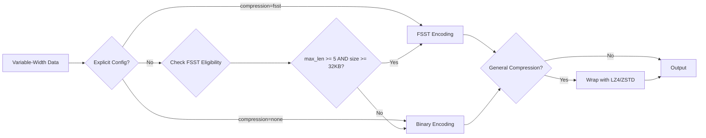

# Lance File Format

## File Structure

Each `.lance` file is the container for the actual data.


At the tail of the file, column metadata protobuf blocks are used to describe the encoding of the columns in the file. The specific protobuf message definitions for column metadata are defined in the encoding-specific protobuf files (see `protos/file2.proto` for Lance 2.x format).

A `Footer` describes the overall layout of the file. The entire file layout is described here:

```protobuf
// Note: the number of buffers (BN) is independent of the number of columns (CN)
//       and pages.
//
//       Buffers often need to be aligned.  64-byte alignment is common when
//       working with SIMD operations.  4096-byte alignment is common when
//       working with direct I/O.  In order to ensure these buffers are aligned
//       writers may need to insert padding before the buffers.
//       
//       If direct I/O is required then most (but not all) fields described
//       below must be sector aligned.  We have marked these fields with an
//       asterisk for clarity.  Readers should assume there will be optional
//       padding inserted before these fields.
//
//       All footer fields are unsigned integers written with  little endian
//       byte order.
//
// ├──────────────────────────────────┤
// | Data Pages                       |
// |   Data Buffer 0*                 |
// |   ...                            |
// |   Data Buffer BN*                |
// ├──────────────────────────────────┤
// | Column Metadatas                 |
// | |A| Column 0 Metadata*           |
// |     Column 1 Metadata*           |
// |     ...                          |
// |     Column CN Metadata*          |
// ├──────────────────────────────────┤
// | Column Metadata Offset Table     |
// | |B| Column 0 Metadata Position*  |
// |     Column 0 Metadata Size       |
// |     ...                          |
// |     Column CN Metadata Position  |
// |     Column CN Metadata Size      |
// ├──────────────────────────────────┤
// | Global Buffers Offset Table      |
// | |C| Global Buffer 0 Position*    |
// |     Global Buffer 0 Size         |
// |     ...                          |
// |     Global Buffer GN Position    |
// |     Global Buffer GN Size        |
// ├──────────────────────────────────┤
// | Footer                           |
// | A u64: Offset to column meta 0   |
// | B u64: Offset to CMO table       |
// | C u64: Offset to GBO table       |
// |   u32: Number of global bufs     |
// |   u32: Number of columns         |
// |   u16: Major version             |
// |   u16: Minor version             |
// |   "LANC"                         |
// ├──────────────────────────────────┤
//
// File Layout-End
```

## File Version

The Lance file format has gone through a number of changes including a breaking change from version 1 to version 2.
There are a number of APIs that allow the file version to be specified.
Using a newer version of the file format will lead to better compression and/or performance.
However, older software versions may not be able to read newer files.

In addition, the latest version of the file format (next) is unstable and should not be used for production use cases.
Breaking changes could be made to unstable encodings and that would mean that files written with these encodings are
no longer readable by any newer versions of Lance. The `next` version should only be used for experimentation and
benchmarking upcoming features.

The following values are supported:

| Version        | Minimal Lance Version | Maximum Lance Version | Description                                                                                                                                  |
| -------------- | --------------------- | --------------------- | -------------------------------------------------------------------------------------------------------------------------------------------- |
| 0.1            | Any                   | Any                   | This is the initial Lance format.                                                                                                            |
| 2.0            | 0.16.0                | Any                   | Rework of the Lance file format that removed row groups and introduced null support for lists, fixed size lists, and primitives              |
| 2.1 (unstable) | None                  | Any                   | Introduces structural encoding system (mini-block/full-zip), enhanced compression algorithms, RepDef hierarchy for nested data, and improved random access performance. |
| legacy         | N/A                   | N/A                   | Alias for 0.1                                                                                                                                |
| stable         | N/A                   | N/A                   | Alias for the latest stable version (currently 2.0)                                                                                          |
| next           | N/A                   | N/A                   | Alias for the latest unstable version (currently 2.1)                                                                                        |

### Version Evolution

#### Version 0.1 (Legacy)
- Initial Lance format implementation
- Row-group based organization
- Basic columnar storage

#### Version 2.0
- Removed row groups for simpler structure
- Added null support for lists, fixed-size lists, and primitives
- Introduced field and array encoding separation
- Basic compression support (dictionary, value, binary encodings)

#### Version 2.1 (Unstable)
- **Structural Encoding System**: Introduced mini-block and full-zip layouts for different data characteristics
- **RepDef Hierarchy**: Advanced repetition/definition level encoding for deeply nested data
- **Enhanced Compression**: Added FSST, bitpacking, RLE, byte-stream-split, and general compression
- **Adaptive Encoding Selection**: Data-driven heuristics for optimal encoding choice
- **Improved Random Access**: Better performance for nested fields through structural optimizations

## File Encodings

Lance supports a variety of encodings for different data types.
The encodings are chosen to give both random access and scan performance.
Encodings are added over time and may be extended in the future.
The manifest records a max format version which controls which encodings will be used.
This allows for a gradual migration to a new data format so that old readers can still read new data while a migration is in progress.

### Encoding Architecture

The Lance 2.1 encoding system follows a three-layer architecture:

1. **Field Encodings**: Consistent encoding across an entire field, handling schema-level structure
2. **Structural Encodings (Layouts)**: Page-level organization strategies (mini-block, full-zip, all-null)
3. **Compressive Encodings**: Data compression algorithms applied within structural layouts

This separation allows for flexible composition while maintaining performance guarantees:
- Field encodings handle the overall structure (lists, structs, primitives)
- Structural encodings determine how data is organized on disk for access patterns
- Compressive encodings reduce storage size while preserving accessibility

### Encoding Tree Structure

Compressive encodings form a tree structure where:
- **Root**: The original data block (fixed-width, variable-width, or struct)
- **Internal Nodes**: Transformations that output new data blocks (e.g., dictionary, RLE)
- **Leaf Nodes**: Final buffers written to disk (flat, compressed buffers)

Example encoding tree for FSST-compressed strings with bitpacked offsets:
```
VariableWidthBlock
└── FSST
    ├── Variable (offsets)
    │   └── InlineBitpacking
    │       └── Buffer (compressed offsets)
    └── Buffer (FSST-compressed values)
```

### Encodings Available

#### Field Encodings (Schema-level)

| Encoding Name   | What it does                                                       | Supported Versions | When it is applied                  |
| --------------- | ------------------------------------------------------------------- | ------------------ | ------------------------------------ |
| Basic struct    | Encodes non-nullable struct data                                   | >= 2.0             | Default encoding for structs         |
| List            | Encodes lists (nullable or non-nullable)                           | >= 2.0             | Default encoding for lists           |
| Basic Primitive | Encodes primitive data types using separate validity array         | >= 2.0             | Default encoding for primitive types |

#### Structural Encodings (Page-level Layouts) - Version 2.1+

| Layout Name     | What it does                                                       | When it is applied                                  |
| --------------- | ------------------------------------------------------------------- | ---------------------------------------------------- |
| MiniBlockLayout | Organizes data into ~8KB blocks with opaque compression           | Small data types where many values fit in one block |
| FullZipLayout   | Transparently compresses individual values                         | Large data types requiring per-value access         |
| AllNullLayout   | Optimized layout for pages containing only null values             | Pages with all null values                          |

#### Compressive Encodings (Data Compression)

| Encoding Name      | What it does                                                                                              | Supported Versions | When it is applied (Heuristics)                                        |
| ------------------ | ---------------------------------------------------------------------------------------------------------- | ------------------ | ----------------------------------------------------------------------- |
| Value/Flat         | Stores fixed-width values contiguously                                                                    | >= 2.0             | Fallback for fixed-width types                                         |
| Binary/Variable    | Stores variable-width data with separate offsets                                                          | >= 2.0             | Fallback for variable-width types                                      |
| Dictionary         | Maps values to indices for deduplication                                                                  | >= 2.0             | Pages where unique_values < total_values/divisor (default divisor=2)   |
| Packed struct      | Row-major format for structs with fixed-width fields                                                      | >= 2.0             | Structs with `"packed": "true"` metadata                               |
| FSST               | Fast static symbol table compression for strings                                                          | >= 2.1             | Strings with max_len >= 5 bytes and total_size >= 32KB                |
| Bitpacking (inline)| Variable bits per value within chunks                                                                     | >= 2.1             | Integers not using full bit width                                      |
| Bitpacking (OOL)   | Fixed bits per value across entire buffer                                                                 | >= 2.1             | Uniform integer compression                                            |
| RLE                | Run-length encoding for repeated values                                                                   | >= 2.1             | Run count < 50% of total values                                        |
| ByteStreamSplit    | Transposes bytes for better compression of floating-point                                                 | >= 2.1             | Float32/Float64 with general compression enabled                       |
| General            | Wrapper for LZ4/ZSTD compression                                                                          | >= 2.1             | Applied based on compression config                                    |
| Constant           | Single value repeated for entire block                                                                    | >= 2.1             | All values identical                                                   |

## Structural Encoding System (Version 2.1+)

The structural encoding system in Lance 2.1 represents a major advancement in how data is organized at the page level. This system introduces two primary layouts optimized for different data characteristics and access patterns.

### MiniBlock Layout

MiniBlock layout is designed for narrow data types where many values can fit into a single disk sector (typically 8KB). This layout provides:

- **Block-based compression**: Data is compressed in chunks of ~8KB
- **Opaque compression support**: Entire blocks can be compressed as units
- **Read amplification trade-off**: Must read entire block to access any value
- **Repetition index**: Supports nested random access through multi-level indexing

The MiniBlock layout includes:
- Optional repetition/definition compression
- Value compression using any compressive encoding
- Optional dictionary for deduplicated values
- Configurable repetition index depth for nested data access

### FullZip Layout

FullZip layout is designed for wide data types where individual values are large. This layout provides:

- **Transparent compression**: Each value is independently decompressible
- **Per-value access**: Direct random access to individual values
- **Transposed storage**: Separates repetition, definition, and value bits
- **Lower overhead**: Minimal metadata per value

The FullZip layout stores:
- Repetition bits (if nested data)
- Definition bits (if nullable)
- Fixed bits per value or bits per offset
- Compressed value data

### Layout Selection Heuristics

The choice between MiniBlock and FullZip is determined by:

1. **Data width**: Narrow types (< 128 bytes) prefer MiniBlock
2. **Value count**: High cardinality data may prefer FullZip
3. **Access pattern**: Sequential access favors MiniBlock, random access may favor FullZip
4. **Compression ratio**: MiniBlock allows more aggressive compression

## RepDef System (Repetition and Definition Levels)

The RepDef system enables efficient encoding of deeply nested and nullable data structures by tracking the structure through repetition and definition levels.

### RepDef Layers

Each structural layer in nested data adds a RepDef layer:

| Layer Type                | Description                                          | Repetition | Definition |
| ------------------------- | ---------------------------------------------------- | ---------- | ---------- |
| `ALL_VALID_ITEM`          | All primitive/struct values are non-null            | No         | No         |
| `ALL_VALID_LIST`          | All list values are non-null (but may be empty)    | Yes        | No         |
| `NULLABLE_ITEM`           | Primitive/struct values may be null                 | No         | Yes        |
| `NULLABLE_LIST`           | Lists may be null (but not empty)                   | Yes        | Yes        |
| `EMPTYABLE_LIST`          | Lists may be empty (but not null)                   | Yes        | No         |
| `NULL_AND_EMPTY_LIST`     | Lists may be both null and empty                    | Yes        | Yes        |

### Repetition and Definition Encoding

For nested data like `LIST<STRUCT<LIST<INT32>>>`:

- **Repetition levels**: Track where new lists begin in the flattened representation
- **Definition levels**: Track which values are present vs null at each nesting level
- **Compression**: Rep/def levels are typically compressed using bitpacking or RLE

### Example: Nested List Encoding

Consider the data: `[[1, 2], null, [], [3]]`

```
Repetition: [0, 1, 0, 0, 0]  # 0 = new outer list element
Definition: [2, 2, 0, 1, 2]  # 0 = null, 1 = empty, 2 = value present
Values:     [1, 2, 3]        # Only non-null values stored
```

## Compression Strategy and Selection

### Default Compression Strategy

Lance 2.1 implements an intelligent compression strategy that automatically selects optimal encodings based on data characteristics:

#### Fixed-Width Data Compression Selection

1. **Byte-Stream Split (BSS)**: Applied to Float32/Float64 when general compression is enabled
2. **Run-Length Encoding (RLE)**: Selected when run_count < 50% of total values
3. **Bitpacking**: Used for integers not utilizing full bit width
4. **Fallback**: Uncompressed value encoding

#### Variable-Width Data Compression Selection

1. **FSST**: Applied when max_length >= 5 bytes AND data_size >= 32KB
2. **Dictionary**: Used when unique_values < total_values/divisor (default divisor=2, min 100 values)
3. **General Compression**: LZ4/ZSTD wrapper based on configuration
4. **Fallback**: Binary encoding with offset compression

### Configuration via Field Metadata

Compression behavior can be controlled through field metadata:

```python
import pyarrow as pa

schema = pa.schema([
    pa.field(
        "optimized_strings",
        pa.string(),
        metadata={
            "lance-encoding:compression": "zstd",           # Compression algorithm
            "lance-encoding:compression-level": "5",        # Compression level (1-22 for zstd)
            "lance-encoding:structural-encoding": "miniblock", # Force specific layout
            "lance-encoding:bss": "auto",                   # Byte-stream-split mode
            "lance-encoding:rle-threshold": "0.3"           # RLE selection threshold
        }
    )
])
```

### Compression Metadata Keys

| Metadata Key                          | Description                                   | Values                    | Example                                                |
| ------------------------------------- | --------------------------------------------- | ------------------------- | ------------------------------------------------------ |
| `lance-encoding:compression`          | General compression algorithm                | none, lz4, zstd, fsst     | `"lance-encoding:compression": "zstd"`                |
| `lance-encoding:compression-level`    | Compression level                            | Algorithm-specific        | `"lance-encoding:compression-level": "5"`             |
| `lance-encoding:structural-encoding`  | Force specific structural layout             | miniblock, fullzip        | `"lance-encoding:structural-encoding": "miniblock"`   |
| `lance-encoding:bss`                  | Byte-stream-split mode                       | auto, always, never       | `"lance-encoding:bss": "auto"`                        |
| `lance-encoding:rle-threshold`        | RLE selection threshold                      | 0.0-1.0                   | `"lance-encoding:rle-threshold": "0.3"`               |
| `lance-encoding:packed`               | Pack struct fields                           | true, false               | `"lance-encoding:packed": "true"`                     |
| `lance-encoding:blob`                 | Store as blob (for large binary data)        | true, false               | `"lance-encoding:blob": "true"`                       |

## Performance Considerations

### Buffer Alignment

Lance 2.1 enforces strict buffer alignment for optimal performance:

- **SIMD Operations**: 64-byte alignment for vectorized operations
- **Direct I/O**: 4096-byte (page) alignment for bypassing OS cache
- **Padding**: Automatic padding insertion before aligned buffers

### Encoding Transparency

Encodings are classified by their transparency level:

- **Transparent**: Values can be directly accessed (e.g., Flat, Variable, FSST)
- **Opaque**: Requires decompression of entire block (e.g., General compression, inline bitpacking)
- **Semi-transparent**: Metadata enables partial access (e.g., Dictionary with known indices)

This classification affects:
- Random access performance
- Predicate pushdown capabilities
- Memory requirements for operations

## Detailed Compression Encodings

### FSST (Fast Static Symbol Table)

FSST is a string compression algorithm optimized for columnar data:

- **Symbol Table**: 256 symbols of up to 8 bytes each
- **Compression**: Replaces common substrings with single-byte symbols
- **Performance**: ~3GB/s decompression speed
- **Best for**: Natural language text, URLs, JSON strings

FSST is automatically selected when:
- Maximum string length >= 5 bytes
- Total data size >= 32KB
- Not suitable for dictionary encoding

### Bitpacking Variants

Lance 2.1 supports two bitpacking modes:

#### Inline Bitpacking
- Bits per value stored in chunk headers
- Adapts to local data distribution
- Better for data with outliers
- Opaque encoding (requires full chunk decompression)

#### Out-of-Line Bitpacking
- Fixed bits per value for entire buffer
- Stored in encoding metadata
- Better for uniform distributions
- Transparent encoding (supports random access)

### Run-Length Encoding (RLE)

RLE compresses sequences of repeated values:

- **Structure**: Separate runs and values arrays
- **Selection**: Applied when run_count < 50% of values
- **Best for**: Sorted data, categorical variables, time series
- **Trade-off**: Excellent compression vs. complex random access

### Byte-Stream Split (BSS)

BSS transposes multi-byte values for better compression:

- **Target**: Float32, Float64 data types
- **Process**: Splits into separate byte streams
- **Benefit**: Groups similar bytes (mantissa, exponent)
- **Requirement**: Requires general compression for effectiveness

Example transformation for Float32 array:
```
Original: [f1_byte0, f1_byte1, f1_byte2, f1_byte3, f2_byte0, ...]
BSS:      [f1_byte0, f2_byte0, ...] [f1_byte1, f2_byte1, ...] ...
```

### Dictionary Encoding

Dictionary encoding maps values to indices:

- **Structure**: Dictionary array + indices array
- **Selection**: unique_values < total_values/divisor (default divisor=2, minimum 100 values)
- **Compression**: Indices often bitpacked
- **Benefits**: Deduplication, fast equality filtering

### General Compression

Wrapper for block-level compression algorithms:

- **LZ4**: Fast compression/decompression, moderate ratio
- **ZSTD**: Better compression ratio, configurable levels (1-22)
- **Application**: Can wrap any encoding for additional compression
- **Trade-off**: Compression ratio vs. access granularity

## Encoding Composition Examples

### Example 1: High-Cardinality Strings with FSST

```
Input: Variable-width string column with long values
↓
FSST Encoding
├── Symbol Table (256 entries, stored in metadata)
└── Variable Encoding
    ├── Offsets → InlineBitpacking → Buffer
    └── Values → General(ZSTD) → Buffer
```

### Example 2: Nullable Integers with Outliers

```
Input: Nullable Int32 column with mostly small values
↓
MiniBlock Layout
├── Definition levels → Bitpacking(2 bits)
├── Values → InlineBitpacking
│   └── Chunks with variable bits per value
└── General(LZ4) wrapper for entire miniblock
```

### Example 3: Nested Lists with Mixed Nulls

```
Input: LIST<LIST<Float32>> with nulls at both levels
↓
MiniBlock Layout
├── Repetition levels → RLE
├── Definition levels → Bitpacking(3 bits)
└── Values → ByteStreamSplit
    └── Transposed bytes → General(ZSTD)
```

## Encoding Decision Flow

### Structural Layout Selection



### Compression Selection for Fixed-Width Data



### Compression Selection for Variable-Width Data



## Best Practices

### Choosing Compression Settings

1. **Profile your data**: Analyze cardinality, value distributions, and access patterns
2. **Start with defaults**: Lance's heuristics handle most cases well
3. **Override selectively**: Use metadata only for specific optimization needs
4. **Test incrementally**: Measure impact of each configuration change

### Common Optimization Patterns

| Data Pattern | Recommended Configuration | Rationale |
| ------------ | ------------------------- | --------- |
| Time series data | RLE + ZSTD | Leverage temporal locality |
| Natural text | FSST + ZSTD level 3 | Balance speed and compression |
| Sensor readings (float) | BSS + ZSTD | Exploit floating-point structure |
| Categorical strings | Dictionary + Bitpacking | Maximize deduplication (when unique_values < total_values/2) |
| Sparse data | RLE or Constant encoding | Compress repeated nulls/zeros |
| Random integers | Bitpacking only | Minimal overhead for random data |

### Memory and I/O Optimization

1. **Buffer pooling**: Reuse decompression buffers across operations
2. **Prefetching**: Leverage MiniBlock structure for predictive loading
3. **Batch processing**: Amortize decompression costs over multiple rows
4. **Direct I/O**: Use 4KB-aligned reads for large sequential scans