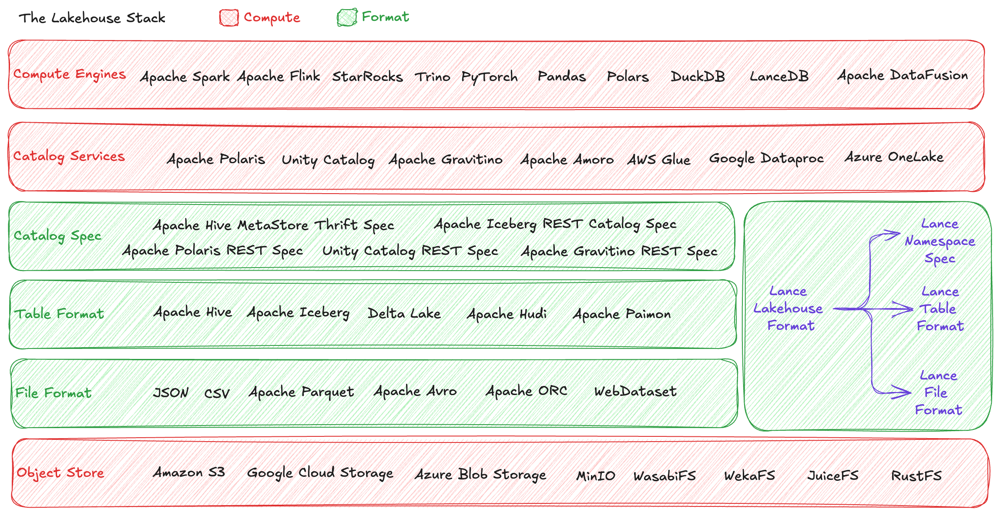

# Lance Format Specification

Lance is a **Lakehouse Format** that spans three specification layers: file format, table format, and catalog spec.

## Understanding the Lakehouse Stack

To understand where Lance fits in the data ecosystem, let's first map out the complete lakehouse technology stack.
The modern lakehouse architecture consists of six distinct layers:

### 1. Object Store

At the foundation lies the **object store**—storage systems characterized by their object-based simple hierarchy, 
typically providing highly durable guarantees with HTTP-based communication protocols for data transfer.
This includes systems like S3, GCS, and Azure Blob Storage.

### 2. File Format

Above the storage layer, the **file format** describes how a single file should be stored on disk.
This is where formats like Apache Parquet operate, defining the internal structure, encoding, and compression of individual data files.

### 3. Table Format

The **table format** layer describes how multiple files work together to form a logical table.
The key feature that modern table formats enable is transactional commits and read isolation to allow multiple writers and readers to safely operate against the same table.
All major open source table formats including Iceberg and Lance implement these features through MVCC (Multi-Version Concurrency Control), 
where each commit atomically produces a new table version, and all table versions form a serializable history for the specific table.
This also unlocks features like time travel and makes features like schema evolution easy to develop.

### 4. Catalog Spec

The **catalog spec** defines how any system can discover and manage a collection of tables within storage.
This is where the lower storage and format stack meets the upper service and compute stack.

Table formats require at least a way to list all available tables and to describe, add and drop tables in the list.
This is necessary for actually building the so-called **connectors** in compute engines so they can discover and start working on the table according to the format.
Historically, Hive has defined the Hive MetaStore spec that is sufficient for most table formats including Delta Lake, Hudi, Paimon, and also Lance.
Iceberg offers its unique Iceberg REST Catalog spec.

From the top down, projects like Apache Polaris, Unity Catalog, and Apache Gravitino usually offer additional specification for operating against table derivatives 
(e.g. views, materialized views, user-defined table functions) and objects used in table operations (e.g. user-defined functions, policies).

This intersection between top and bottom stack is also why typically a catalog service would provide both the catalog specifications offered by the format side for easy connectivity to compute engines, 
as well as providing their own APIs for extended management features.

Another key differentiation of a catalog spec versus a catalog service is that there can be multiple different vendors implementing the same spec.
For example, for Polaris REST spec we have open source Apache Polaris server, Snowflake Horizon Catalog, and Polaris-compatible services in AWS Glue, Azure OneLake, etc.

### 5. Catalog Service

A **catalog service** implements one or more catalog specifications to provide both table metadata and optionally continuous background maintenance (compaction, optimization, index updates) that table formats require to stay performant.
Catalog services typically implement multiple specifications to support different table formats.
For example, Polaris, Unity and Gravitino all support the Iceberg REST catalog specification for Iceberg tables, and have their own generic table API for other table formats.

Since table formats are static specifications, catalog services supply the active operational work needed for production deployments.
This is often where open source transitions to commercial offerings, as open source projects typically provide metadata functionality, while commercial solutions offer the full operational experience including automated maintenance.
There are also open source solutions like Apache Amoro emerging to fill this gap with complete open source catalog service implementations that offer both table metadata access and continuous optimization.

### 6. Compute Engine

Finally, **compute engines** are the workhorses that visit catalog services and leverage their knowledge of file formats, table formats, and catalog specifications to perform complex data workflows, including SQL queries, analytics processing, vector search, full-text search, and machine learning training.
All sorts of applications can be built on top of compute engines to serve more concrete analytics, ML and AI use cases.

### The Overall Lakehouse Architecture

In the lakehouse architecture, compute power resides in the object store, catalog services, and compute engines.
The middle three layers (file format, table format, catalog spec) are specifications without compute.
This separation enables portability and interoperability.

## Understanding Lance as a Lakehouse Format

Lance spans all three specification layers:

1. **File Format**: The Lance columnar file format, [read specification →](file/index.md)
2. **Table Format**: The Lance table format, [read specification →](table/index.md)
3. **Catalog Spec**: The Lance Namespace specification, [read specification →](namespace/index.md)

For comparison:

- **Apache Iceberg** operates at the table format and catalog spec layers, using Apache Parquet, Apache Avro and Apache ORC as the file format
- **Delta Lake** and **Apache Hudi** operate at only the table format layer, using Apache Parquet as the file format