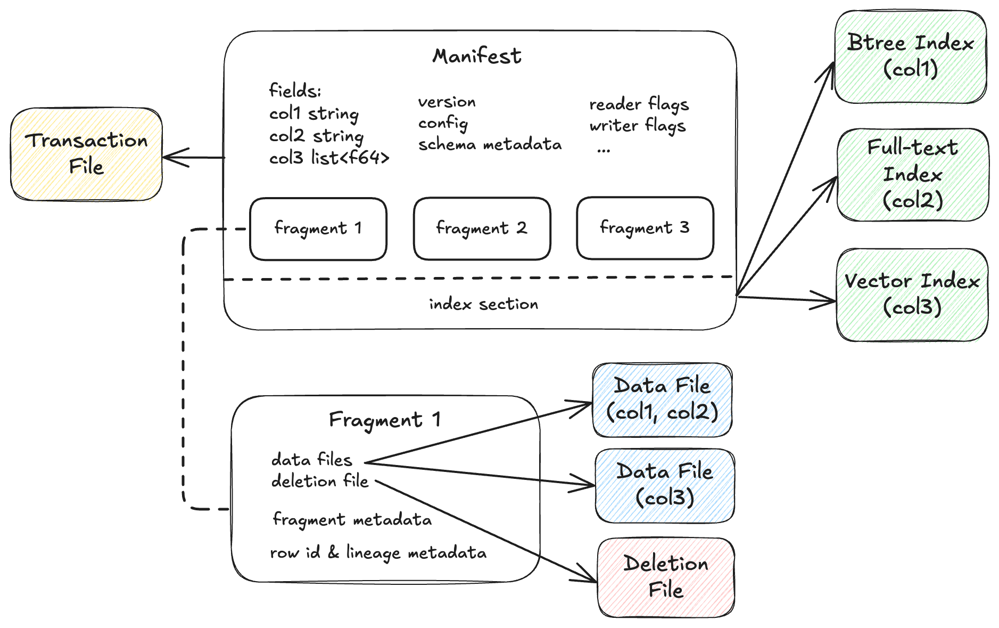
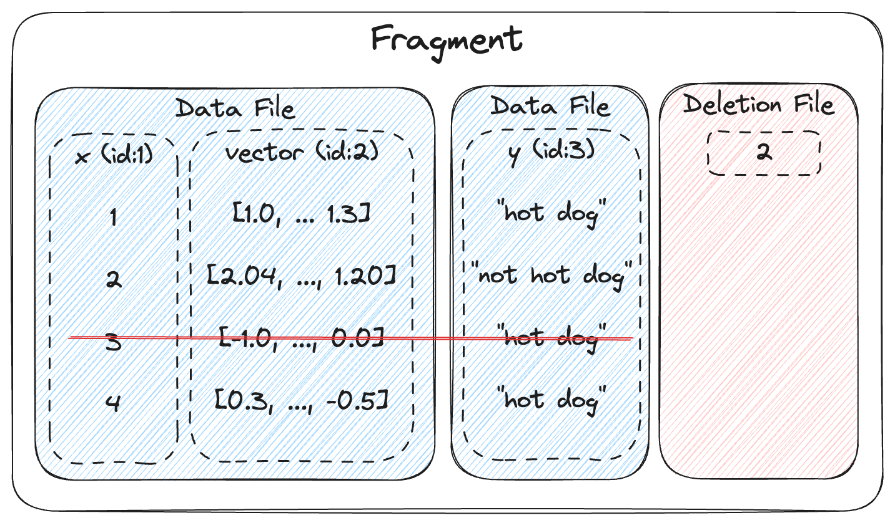

# Lance Table Format

## Overview

The Lance table format organizes datasets as versioned collections of fragments.
Each version is described by an immutable manifest file that references data files, deletion files, transaction file and indices.
The format supports ACID transactions, schema evolution, and efficient incremental updates through Multi-Version Concurrency Control (MVCC).

## Manifest



A manifest describes a single version of the dataset.
It contains the complete schema definition including nested fields, the list of data fragments comprising this version, 
a monotonically increasing version number, and an optional reference to the index section that describes a list of index metadata.

<details>
<summary>Manifest protobuf message</summary>

```protobuf
%%% proto.message.Manifest %%%
```

</details>

## Schema & Fields

Lance primarily uses Apache Arrow schema to define the structure of data in the dataset.
The manifest stores an Arrow schema as a list of fields.
At initial table creation time, fields are listed in depth-first order.
Afterwards, field IDs are assigned incrementally for newly added fields.

Column encodings are specified through field metadata using the `lance-encoding:` prefix.
See [File Format Encoding Specification](../file/encoding.md) for details on available encodings, compression schemes, and configuration options.

<details>
<summary>Field protobuf message</summary>

```protobuf
%%% proto.message.lance.file.Field %%%
```

</details>

## Fragments



A fragment represents a horizontal partition of the dataset containing a subset of rows.
Each fragment has a unique `uint32` identifier assigned incrementally based on the dataset's maximum fragment ID.
Each fragment consists of one or more data files storing columns, plus an optional deletion file.
If present, the deletion file stores the positions (0-based) of the rows that have been deleted from the fragment.
The fragment tracks the total row count including deleted rows in its physical rows field.
Column subsets can be read without accessing all data files, and each data file is independently compressed and encoded.

<details>
<summary>DataFragment protobuf message</summary>

```protobuf
%%% proto.message.DataFragment %%%
```

</details>

### Data Evolution

This fragment design enables a new concept called data evolution, which means efficient schema evolution (add column, update column, drop column) with backfill.
For example, when adding a new column, new column data are added by appending new data files to each fragment, with values computed for all existing rows in the fragment.
There is no need to rewrite the entire table to just add data for a single column.
This enables efficient feature engineering and embedding updates for ML/AI workloads.

## Data Files

Data files store column data for a fragment using the Lance file format.
Each data file stores a subset of the columns in the fragment.
Field IDs are assigned either sequentially based on schema position (for Lance file format v1) 
or independently of column indices due to variable encoding widths (for Lance file format v2).

<details>
<summary>DataFile protobuf message</summary>

```protobuf
%%% proto.message.DataFile %%%
```

</details>

## Deletion Files

Deletion files (a.k.a. deletion vectors) track deleted rows without rewriting data files.
Each fragment can have at most one deletion file per version.

Deletion files support two storage formats.
The Arrow IPC format (`.arrow` extension) stores a flat Int32Array of deleted row offsets and is efficient for sparse deletions.
The Roaring Bitmap format (`.bin` extension) stores a compressed roaring bitmap and is efficient for dense deletions.
Readers must filter rows whose offsets appear in the deletion file for the fragment.

Deletions can be materialized by rewriting data files with deleted rows removed.
However, this invalidates row addresses and requires rebuilding indices, which can be expensive.

<details>
<summary>DeletionFile protobuf message</summary>

```protobuf
%%% proto.message.DeletionFile %%%
```

</details>

## Related Specifications

### Storage Layout

File organization, base path system, and multi-location storage.

See [Storage Layout Specification](layout.md)

### Transactions

MVCC, commit protocol, transaction types, and conflict resolution.

See [Transaction Specification](transaction.md)

### Row Lineage

Row address, Stable row ID, row version tracking, and change data feed.

See [Row ID & Lineage Specification](row_id_lineage.md)

### Indices

Vector indices, scalar indices, full-text search, and index management.

See [Index Specification](index/index.md)

### Versioning

Feature flags and format version compatibility.

See [Format Versioning Specification](versioning.md)
