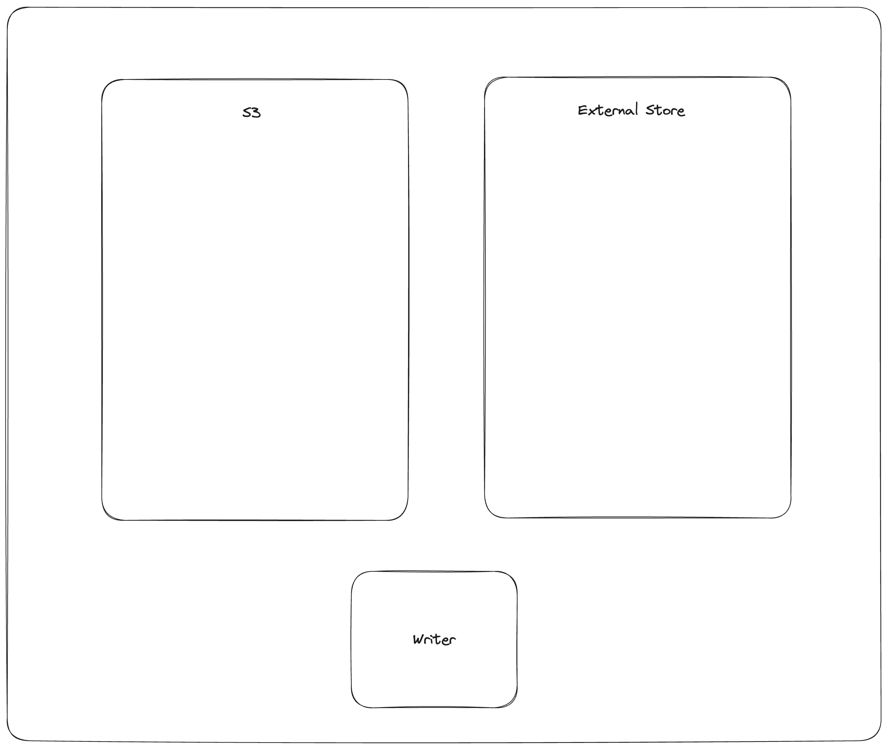

# Lance Table Format

## Dataset Directory

A `Lance Dataset` is organized in a directory.

```
/path/to/dataset:
    data/*.lance  -- Data directory
    _versions/*.manifest -- Manifest file for each dataset version.
    _indices/{UUID-*}/index.idx -- Secondary index, each index per directory.
    _deletions/*.{arrow,bin} -- Deletion files, which contain IDs of rows
      that have been deleted.
```

A `Manifest` file includes the metadata to describe a version of the dataset.

```protobuf
// Manifest is a global section shared between all the files.
message Manifest {
  // All fields of the dataset, including the nested fields.
  repeated lance.file.Field fields = 1;

  // Fragments of the dataset.
  repeated DataFragment fragments = 2;

  // Snapshot version number.
  uint64 version = 3;

  // The file position of the version auxiliary data.
  //  * It is not inheritable between versions.
  //  * It is not loaded by default during query.
  uint64 version_aux_data = 4;

  // Schema metadata.
  map<string, bytes> metadata = 5;

  message WriterVersion {
    // The name of the library that created this file.
    string library = 1;
    // The version of the library that created this file. Because we cannot assume
    // that the library is semantically versioned, this is a string. However, if it
    // is semantically versioned, it should be a valid semver string without any 'v'
    // prefix. For example: `2.0.0`, `2.0.0-rc.1`.
    string version = 2;
  }

  // The version of the writer that created this file.
  //
  // This information may be used to detect whether the file may have known bugs
  // associated with that writer.
  WriterVersion writer_version = 13;

  // If present, the file position of the index metadata.
  optional uint64 index_section = 6;

  // Version creation Timestamp, UTC timezone
  google.protobuf.Timestamp timestamp = 7;

  // Optional version tag
  string tag = 8;

  // Feature flags for readers.
  //
  // A bitmap of flags that indicate which features are required to be able to
  // read the table. If a reader does not recognize a flag that is set, it
  // should not attempt to read the dataset.
  //
  // Known flags:
  // * 1: deletion files are present
  // * 2: row ids are stable and stored as part of the fragment metadata.
  // * 4: use v2 format (deprecated)
  // * 8: table config is present
  uint64 reader_feature_flags = 9;

  // Feature flags for writers.
  //
  // A bitmap of flags that indicate which features must be used when writing to the
  // dataset. If a writer does not recognize a flag that is set, it should not attempt to
  // write to the dataset.
  //
  // The flag identities are the same as for reader_feature_flags, but the values of
  // reader_feature_flags and writer_feature_flags are not required to be identical.
  uint64 writer_feature_flags = 10;

  // The highest fragment ID that has been used so far.
  //
  // This ID is not guaranteed to be present in the current version, but it may
  // have been used in previous versions.
  //
  // For a single fragment, will be zero. For no fragments, will be absent.
  optional uint32 max_fragment_id = 11;

  // Path to the transaction file, relative to `{root}/_transactions`. The file at that
  // location contains a wire-format serialized Transaction message representing the
  // transaction that created this version.
  //
  // This string field "transaction_file" may be empty if no transaction file was written.
  //
  // The path format is "{read_version}-{uuid}.txn" where {read_version} is the version of
  // the table the transaction read from (serialized to decimal with no padding digits),
  // and {uuid} is a hyphen-separated UUID.
  string transaction_file = 12;

  // The next unused row id. If zero, then the table does not have any rows.
  //
  // This is only used if the "stable_row_ids" feature flag is set.
  uint64 next_row_id = 14;

  message DataStorageFormat {
    // The format of the data files (e.g. "lance")
    string file_format = 1;
    // The max format version of the data files. The format of the version can vary by
    // file_format and is not required to follow semver.
    //
    // Every file in this version of the dataset has the same file_format version.
    string version = 2;
  }

  // The data storage format
  //
  // This specifies what format is used to store the data files.
  DataStorageFormat data_format = 15;

  // Table config.
  //
  // Keys with the prefix "lance." are reserved for the Lance library. Other
  // libraries may wish to similarly prefix their configuration keys
  // appropriately.
  map<string, string> config = 16;

  // The version of the blob dataset associated with this table.  Changes to
  // blob fields will modify the blob dataset and update this version in the parent
  // table.
  //
  // If this value is 0 then there are no blob fields.
  uint64 blob_dataset_version = 17;

  // The base paths of data files.
  //
  // This is used to determine the base path of a data file. In common cases data file paths are under current dataset base path.
  // But for shallow cloning, importing file and other multi-tier storage cases, the actual data files could be outside of the current dataset.
  // This field is used with the `base_id` in `lance.file.File` and `lance.file.DeletionFile`.
  //
  // For example, if we have a dataset with base path `s3://bucket/dataset`, we have a DataFile with base_id 0, we get the actual data file path by:
  // base_paths[id = 0] + /data/ + file.path
  // the key(a.k.a index) starts from 0, increased by 1 for each new base path.
  repeated BasePath base_paths = 18;
} // Manifest
```

### Fragments

`DataFragment` represents a chunk of data in the dataset. Itself includes one or more `DataFile`,
where each `DataFile` can contain several columns in the chunk of data.
It also may include a `DeletionFile`, which is explained in a later section.

```protobuf
// A DataFragment is a set of files which represent the different columns of the same
// rows. If column exists in the schema of a dataset, but the file for that column does
// not exist within a DataFragment of that dataset, that column consists entirely of
// nulls.
message DataFragment {
  // The ID of a DataFragment is unique within a dataset.
  uint64 id = 1;

  repeated DataFile files = 2;

  // File that indicates which rows, if any, should be considered deleted.
  DeletionFile deletion_file = 3;

  // A serialized RowIdSequence message (see rowids.proto).
  //
  // These are the row ids for the fragment, in order of the rows as they appear.
  // That is, if a fragment has 3 rows, and the row ids are [1, 42, 3], then the
  // first row is row 1, the second row is row 42, and the third row is row 3.
  oneof row_id_sequence {
    // If small (< 200KB), the row ids are stored inline.
    bytes inline_row_ids = 5;
    // Otherwise, stored as part of a file.
    ExternalFile external_row_ids = 6;
  } // row_id_sequence

  // Number of original rows in the fragment, this includes rows that are now marked with
  // deletion tombstones. To compute the current number of rows, subtract
  // `deletion_file.num_deleted_rows` from this value.
  uint64 physical_rows = 4;
}
```

The overall structure of a fragment is shown below. One or more data files store the columns of a fragment.
New columns can be added to a fragment by adding new data files. The deletion file (if present),
stores the rows that have been deleted from the fragment.


Every row has a unique ID, which is an u64 that is composed of two u32s: the fragment ID and the local row ID.
The local row ID is just the index of the row in the data files.

## Dataset Update and Data Evolution

`Lance` supports fast dataset update and schema evolution via manipulating the `Manifest` metadata.

`Appending` is done by appending new `Fragment` to the dataset. While adding columns is done
by adding new `DataFile` of the new columns to each `Fragment`. Finally,
`Overwrite` a dataset can be done by resetting the `Fragment` list of the `Manifest`.


## Schema & Fields

Fields represent the metadata for a column. This includes the name, data type, id, nullability, and encoding.

Fields are listed in depth first order, and can be one of:

1. parent (struct)
2. repeated (list/array)
3. leaf (primitive)

For example, the schema:

```
a: i32
b: struct {
    c: list<i32>
    d: i32
}
```

Would be represented as the following field list:

| name  | id | type     | parent_id | logical_type |
|-------|----|----------|-----------|--------------|
| `a`   | 1  | LEAF     | 0         | `"int32"`    |
| `b`   | 2  | PARENT   | 0         | `"struct"`   |
| `b.c` | 3  | REPEATED | 2         | `"list"`     |
| `b.c` | 4  | LEAF     | 3         | `"int32"`    |
| `b.d` | 5  | LEAF     | 2         | `"int32"`    |

### Field Encoding Specification

Column-level encoding configurations are specified through PyArrow field metadata:

```python
import pyarrow as pa

schema = pa.schema([
    pa.field(
        "compressible_strings",
        pa.string(),
        metadata={
            "lance-encoding:compression": "zstd",
            "lance-encoding:compression-level": "3",
            "lance-encoding:structural-encoding": "miniblock",
            "lance-encoding:packed": "true"
        }
    )
])
```

| Metadata Key                         | Type         | Description                                  | Example Values    | Example Usage (Python)                                         |
|--------------------------------------|--------------|----------------------------------------------|-------------------|----------------------------------------------------------------|
| `lance-encoding:compression`         | Compression  | Specifies compression algorithm              | zstd              | `metadata={"lance-encoding:compression": "zstd"}`              |
| `lance-encoding:compression-level`   | Compression  | Zstd compression level (1-22)                | 3                 | `metadata={"lance-encoding:compression-level": "3"}`           |
| `lance-encoding:blob`                | Storage      | Marks binary data (>4MB) for chunked storage | true/false        | `metadata={"lance-encoding:blob": "true"}`                     |
| `lance-encoding:packed`              | Optimization | Struct memory layout optimization            | true/false        | `metadata={"lance-encoding:packed": "true"}`                   |
| `lance-encoding:structural-encoding` | Nested Data  | Encoding strategy for nested structures      | miniblock/fullzip | `metadata={"lance-encoding:structural-encoding": "miniblock"}` |

## Deletion

Rows can be marked deleted by adding a deletion file next to the data in the `_deletions` folder.
These files contain the indices of rows that have between deleted for some fragment.
For a given version of the dataset, each fragment can have up to one deletion file.
Fragments that have no deleted rows have no deletion file.

Readers should filter out row IDs contained in these deletion files during a scan or ANN search.

Deletion files come in two flavors:

1. Arrow files: which store a column with a flat vector of indices
2. Roaring bitmaps: which store the indices as compressed bitmaps.

[Roaring Bitmaps](https://roaringbitmap.org/) are used for larger deletion sets,
while Arrow files are used for small ones. This is because Roaring Bitmaps are known to be inefficient for small sets.

The filenames of deletion files are structured like:

```
_deletions/{fragment_id}-{read_version}-{random_id}.{arrow|bin}
```

Where `fragment_id` is the fragment the file corresponds to, `read_version` is the version of the dataset that it was created off of (usually one less than the version it was committed to), and `random_id` is a random i64 used to avoid collisions. The suffix is determined by the file type (`.arrow` for Arrow file, `.bin` for roaring bitmap).

```protobuf
// Deletion File
//
// The path of the deletion file is constructed as:
//   {root}/_deletions/{fragment_id}-{read_version}-{id}.{extension}
// where {extension} is `.arrow` or `.bin` depending on the type of deletion.
message DeletionFile {
  // Type of deletion file, which varies depending on what is the most efficient
  // way to store the deleted row offsets. If none, then will be unspecified. If there are
  // sparsely deleted rows, then ARROW_ARRAY is the most efficient. If there are
  // densely deleted rows, then BIT_MAP is the most efficient.
  enum DeletionFileType {
    // Deletion file is a single Int32Array of deleted row offsets. This is stored as
    // an Arrow IPC file with one batch and one column. Has a .arrow extension.
    ARROW_ARRAY = 0;
    // Deletion file is a Roaring Bitmap of deleted row offsets. Has a .bin extension.
    BITMAP = 1;
  }

  // Type of deletion file. If it is unspecified, then the remaining fields will be missing.
  DeletionFileType file_type = 1;
  // The version of the dataset this deletion file was built from.
  uint64 read_version = 2;
  // An opaque id used to differentiate this file from others written by concurrent
  // writers.
  uint64 id = 3;
  // The number of rows that are marked as deleted.
  uint64 num_deleted_rows = 4;
  // The base path index of the data file. Used when the file is imported or referred from another dataset.
  // Lance use it as key of the base_paths field in Manifest to determine the actual base path of the data file.
  optional uint32 base_id = 7;
} // DeletionFile
```

Deletes can be materialized by re-writing data files with the deleted rows removed.
However, this invalidates row indices and thus the ANN indices, which can be expensive to recompute.

## Committing Datasets

A new version of a dataset is committed by writing a new manifest file to the `_versions` directory.

To prevent concurrent writers from overwriting each other,
the commit process must be atomic and consistent for all writers.
If two writers try to commit using different mechanisms, they may overwrite each other's changes.
For any storage system that natively supports atomic rename-if-not-exists or put-if-not-exists,
these operations should be used. This is true of local file systems and most cloud object stores
including Amazon S3, Google Cloud Storage, Microsoft Azure Blob Storage.
For ones that lack this functionality, an external locking mechanism can be configured by the user.

### Manifest Naming Schemes

Manifest files must use a consistent naming scheme. The names correspond to the versions.
That way we can open the right version of the dataset without having to read all the manifests.
It also makes it clear which file path is the next one to be written.

There are two naming schemes that can be used:

1. V1: `_versions/{version}.manifest`. This is the legacy naming scheme.
2. V2: `_versions/{u64::MAX - version:020}.manifest`. This is the new naming scheme.
   The version is zero-padded (to 20 digits) and subtracted from `u64::MAX`.
   This allows the versions to be sorted in descending order,
   making it possible to find the latest manifest on object storage using a single list call.

It is an error for there to be a mixture of these two naming schemes.

### Conflict Resolution

If two writers try to commit at the same time, one will succeed and the other will fail.
The failed writer should attempt to retry the commit, but only if its changes are compatible
with the changes made by the successful writer.

The changes for a given commit are recorded as a transaction file,
under the `_transactions` prefix in the dataset directory.
The transaction file is a serialized `Transaction` protobuf message.
See the `transaction.proto` file for its definition.


The commit process is as follows:

1. The writer finishes writing all data files.
2. The writer creates a transaction file in the `_transactions` directory.
   This file describes the operations that were performed, which is used for two purposes:
   (1) to detect conflicts, and (2) to re-build the manifest during retries.
3. Look for any new commits since the writer started writing.
   If there are any, read their transaction files and check for conflicts.
   If there are any conflicts, abort the commit. Otherwise, continue.
4. Build a manifest and attempt to commit it to the next version.
   If the commit fails because another writer has already committed, go back to step 3.

When checking whether two transactions conflict, be conservative.
If the transaction file is missing, assume it conflicts.
If the transaction file has an unknown operation, assume it conflicts.

### External Manifest Store

If the backing object store does not support *-if-not-exists operations,
an external manifest store can be used to allow concurrent writers.
An external manifest store is a KV store that supports put-if-not-exists operation.
The external manifest store supplements but does not replace the manifests in object storage.
A reader unaware of the external manifest store could read a table that uses it,
but it might be up to one version behind the true latest version of the table.



The commit process is as follows:

1. `PUT_OBJECT_STORE mydataset.lance/_versions/{version}.manifest-{uuid}` stage a new manifest in object store under a unique path determined by new uuid
2. `PUT_EXTERNAL_STORE base_uri, version, mydataset.lance/_versions/{version}.manifest-{uuid}` commit the path of the staged manifest to the external store.
3. `COPY_OBJECT_STORE mydataset.lance/_versions/{version}.manifest-{uuid} mydataset.lance/_versions/{version}.manifest` copy the staged manifest to the final path
4. `PUT_EXTERNAL_STORE base_uri, version, mydataset.lance/_versions/{version}.manifest` update the external store to point to the final manifest

Note that the commit is effectively complete after step 2. If the writer fails after step 2, a reader will be able to detect the external store and object store are out-of-sync, and will try to synchronize the two stores. If the reattempt at synchronization fails, the reader will refuse to load. This is to ensure that the dataset is always portable by copying the dataset directory without special tool.


The reader load process is as follows:

1. `GET_EXTERNAL_STORE base_uri, version, path` then, if path does not end in a UUID return the path
2. `COPY_OBJECT_STORE mydataset.lance/_versions/{version}.manifest-{uuid} mydataset.lance/_versions/{version}.manifest` reattempt synchronization
3. `PUT_EXTERNAL_STORE base_uri, version, mydataset.lance/_versions/{version}.manifest` update the external store to point to the final manifest
4. `RETURN mydataset.lance/_versions/{version}.manifest` always return the finalized path, return error if synchronization fails


## Feature: Stable Row IDs

The row IDs features assigns a unique u64 ID to each row in the table.
This ID is stable throughout the lifetime of the row. To make access fast, a secondary index is created that maps row IDs to their locations in the table.
The respective parts of these indices are stored in the respective fragment's metadata.

**row ID**
: A unique auto-incrementing u64 ID assigned to each row in the table.

**row address**
: The current location of a row in the table. This is a u64 that can be thought of as a pair of two u32 values: the fragment ID and the local row offset. For example, if the row address is (42, 9), then the row is in the 42rd fragment and is the 10th row in that fragment.

**row ID sequence**
: The sequence of row IDs in a fragment.

**row ID index**
: A secondary index that maps row IDs to row addresses. This index is constructed by reading all the row ID sequences.

### Assigning Row IDs

Row IDs are assigned in a monotonically increasing sequence. The next row ID is stored in the manifest as the field `next_row_id`. This starts at zero. When making a commit, the writer uses that field to assign row IDs to new fragments. If the commit fails, the writer will re-read the new `next_row_id`, update the new row IDs, and then try again. This is similar to how the `max_fragment_id` is used to assign new fragment IDs.

When a row ID updated, it is typically assigned a new row ID rather than reusing the old one. This is because this feature doesn't have a mechanism to update secondary indices that may reference the old values for the row ID. By deleting the old row ID and creating a new one, the secondary indices will avoid referencing stale data.

### Row ID Sequences

The row ID values for a fragment are stored in a `RowIdSequence` protobuf message. This is described in the [protos/rowids.proto](https://github.com/lancedb/lance/blob/main/protos/rowids.proto) file. Row ID sequences are just arrays of u64 values, which have representations optimized for the common case where they are sorted and possibly contiguous. For example, a new fragment will have a row ID sequence that is just a simple range, so it is stored as a `start` and `end` value.

These sequence messages are either stored inline in the fragment metadata, or are written to a separate file and referenced from the fragment metadata. This choice is typically made based on the size of the sequence. If the sequence is small, it is stored inline. If it is large, it is written to a separate file. By keeping the small sequences inline, we can avoid the overhead of additional IO operations.

```protobuf
oneof row_id_sequence {
    // Inline sequence
    bytes inline_sequence = 1;
    // External file reference
    string external_file = 2;
} // row_id_sequence
```

### Row ID Index

To ensure fast access to rows by their row ID, a secondary index is created that maps row IDs to their locations in the table. This index is built when a table is loaded, based on the row ID sequences in the fragments. For example, if fragment 42 has a row ID sequence of `[0, 63, 10]`, then the index will have entries for `0 -> (42, 0)`, `63 -> (42, 1)`, `10 -> (42, 2)`. The exact form of this index is left up to the implementation, but it should be optimized for fast lookups.

### Row ID masks

Because index files are immutable, they main contain references to row IDs that have been deleted or that have new values.
To handle this, a mask is created for the index.


For example, consider the sequence shown in the above image.
It has a dataset with two columns, `str` and `vec`.
A string column and a vector column.
Each of them have indices, a scalar index for the string column and a vector index for the vector column.
There is just one fragment in the dataset, with contiguous row IDs 1 through 3.

When an update operation is made that modifies the `vec` column in row 2, a new fragment is created with the updated value.
A deletion file is added to the original fragment marking that row 2 as deleted in the first file.
In the `str` index, the fragment bitmap is updated to reflect the new location of the row IDs:`{1, 2}`.
Meanwhile, the `vec` index's fragment bitmap does not update, staying at `{1}`.
This is because the value in `vec` was updated, so the data in the index no longer reflects the data in the table.
