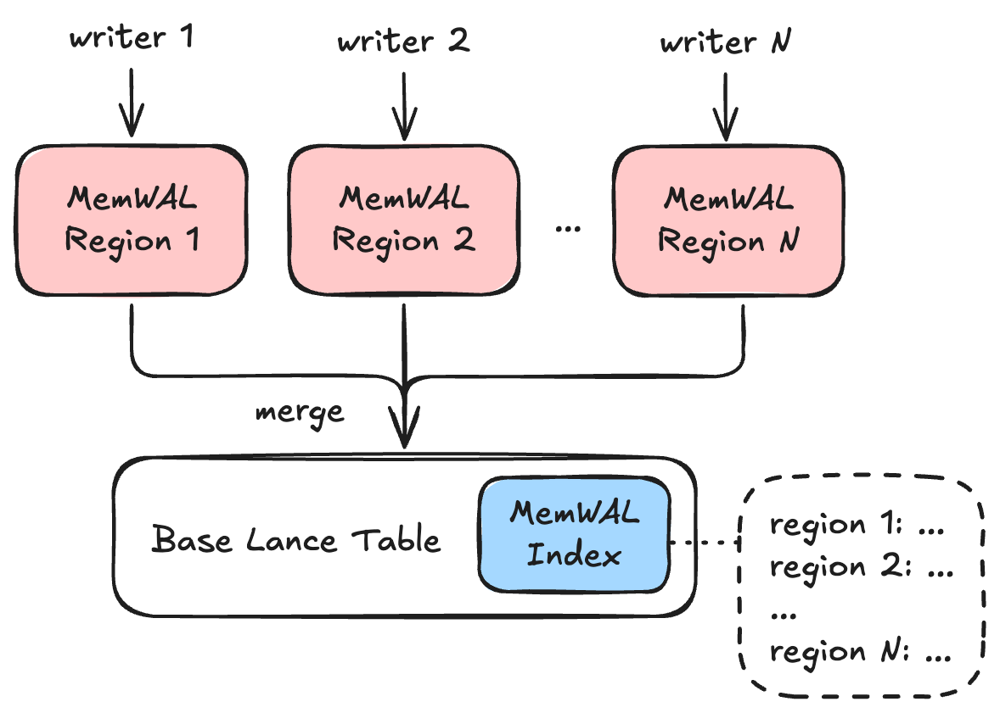
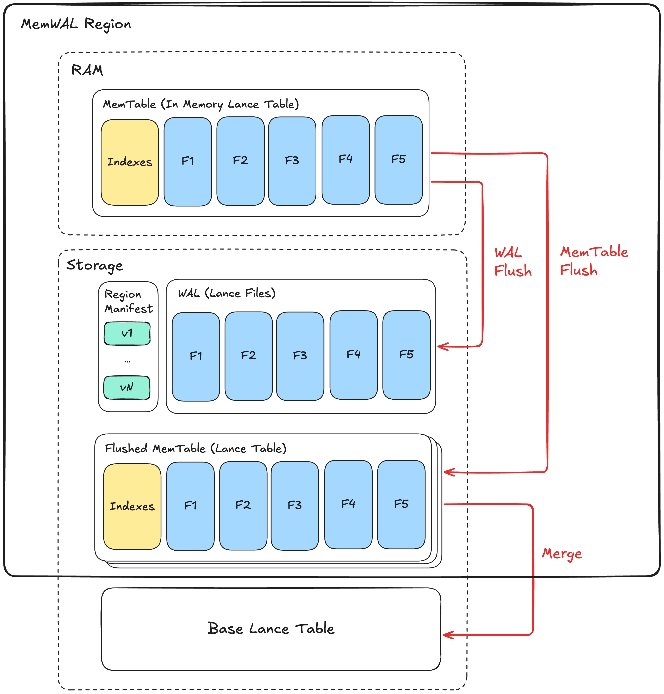

# MemTable & WAL Specification

Lance MemTable & WAL (MemWAL) specification describes an Log-Structured-Merge (LSM) tree architecture for Lance tables, enabling high-performance streaming write workloads.

## Prerequisites

### Unenforced Primary Key

MemWAL only works for Lance tables with unenforced primary key defined,
also the unenforced primary key:

- Must have a [btree index](./index/scalar/btree.md)
- Must be included in the region spec's `source_ids` if a region spec is specified (see [Region Spec](#region-sepc) for more details)

The last constraint is critical for correctness.
If two regions contain rows with the same primary key, the following scenario can cause data corruption:

1. Region A receives a write with primary key `pk=1` at time T1
2. Region B receives a write with primary key `pk=1` at time T2 (T2 > T1)
3. The row in region B is merged into the base table first
4. The row in region A is merged into the base table second
5. The row from Region A (older) now overwrites the row from Region B (newer)

This violates the expected "last write wins" semantics.
By ensuring each primary key is assigned to exactly one region via the region spec, merge order between regions becomes irrelevant for correctness.

### IVF Vector Index

Although later migration is possible, if the main use case is IVF family vector index,
it is recommended to have these indexes on the Lance table before enabling MemWAL.
This is because IVF index needs to remain the same quantization codebook (e.g. PQ codebook)
across all the layers of the LSM tree for vector distance to be comparable.
Migrating one codebook to another is a complicated proceses requiring gradual migration
and coordination between readers and writers.

## Overall Architecture



### Base Table

Under the MemWAL setup, the Lance table is called the **base table**.

### MemWAL Region

**MemWAL Region** is the main unit to horizontally scale out writes.
Each region has exactly one active writer at any time, using **epoch-based fencing** to guarantee single-writer semantics without distributed coordination.
Writers claim a region by incrementing the writer epoch, then write data to that region.
Data in each region is merged into the base table gradually in the background.

#### Region Identifier

Each region has a unique identifier across all regions following UUID v4 standard.
When a new region is created, it is assigned a new identifier.

#### Region Spec

A **Region Spec** defines how the all rows in a table is logically divided into different regions, 
enabling automatic region assignment and query-time region pruning.

Each region spec has:

- **Spec ID**: A positive integer that uniquely identifies this spec within the MemWAL index. IDs are never reused.
- **Region fields**: An array of field definitions that determine how to compute region identifiers.

Each region is bound to a specific region spec ID, recorded in its [manifest](#region-manifest).
Regions without a spec ID (`spec_id = 0`) are manually-created regions not governed by any spec.

A region spec's field array consists of **region field** definitions.
Each region field has the following properties:

| Property | Description |
|----------|-------------|
| `field_id` | Unique string identifier for this region field |
| `source_ids` | Array of field IDs referencing source columns in the schema |
| `transform` | A well-known region expression, specify this or `expression` |
| `expression` | A DataFusion SQL expression for custom logic, specify this or `transform` |
| `result_type` | The output type of the region value |

#### Unenforced Primary key Constraint

The `source_ids` across all region fields must include all primary key columns.
This ensures rows with the same primary key always map to the same region, which is required for correctness (see [Unenforced Primary Key](#unenforced-primary-key)).

#### Region Expression

A **Region Expression** is a [DataFusion SQL expression](https://datafusion.apache.org/user-guide/sql/index.html) that derives a region value from source column(s).
Source columns are referenced as `col0`, `col1`, etc., corresponding to the order of field IDs in `source_ids`.

Region expressions must satisfy the following requirements:

1. **Deterministic**: The same input value must always produce the same output value.
2. **Stateless**: The expression must not depend on external state (e.g., current time, random values, session variables).
3. **Type-promotion resistant**: The expression must produce the same result for equivalent values regardless of their numeric type (e.g., `int32(5)` and `int64(5)` must yield the same region value).
4. **Column removal resistant**: If a source field ID is not found in the schema, the column should be interpreted as NULL.
5. **NULL-safe**: The expression should properly handle NULL inputs and have defined behavior (e.g., return NULL if input is NULL for single-column expressions).
6. **Consistent with result type**: The expression's return type must be consistent with `result_type` in non-NULL cases.

#### Region Transform

A **Region Transform** is a well-known region expression with a predefined name.
When a transform is specified, the expression is derived automatically.

| Transform | Parameters | Region Expression | Result Type |
|-----------|------------|-------------------|-------------|
| `identity` | (none) | `col0` | same as source |
| `year` | (none) | `date_part('year', col0)` | `int32` |
| `month` | (none) | `date_part('month', col0)` | `int32` |
| `day` | (none) | `date_part('day', col0)` | `int32` |
| `hour` | (none) | `date_part('hour', col0)` | `int32` |
| `bucket` | `num_buckets` | `abs(murmur3(col0)) % N` | `int32` |
| `multi_bucket` | `num_buckets` | `abs(murmur3_multi(col0, col1, ...)) % N` | `int32` |
| `truncate` | `width` | `left(col0, W)` (string) or `col0 - (col0 % W)` (numeric) | same as source |

The `bucket` and `multi_bucket` transforms use Murmur3 hash functions:

- **`murmur3(col)`**: Computes the 32-bit Murmur3 hash (x86 variant, seed 0) of a single column. Returns a signed 32-bit integer. Returns NULL if input is NULL.
- **`murmur3_multi(col0, col1, ...)`**: Computes the Murmur3 hash across multiple columns. Returns a signed 32-bit integer. NULL fields are ignored during hashing; returns NULL only if all inputs are NULL.

The hash result is wrapped with `abs()` and modulo `N` to produce a non-negative bucket number in the range `[0, N)`.

### MemWAL Index

A **MemWAL Index** is the centralized structure for all MemWAL metadata for a base table.
A table has at most one MemWAL index.
It stores:

- **Configuration**: Region specs defining how rows map to regions, and which indexes to maintain
- **Merge progress**: Last generation merged to base table for each region
- **Region snapshots**: Point-in-time snapshot of all region states for read optimization

The index is the source of truth for **configuration** and **merge progress**, but region state snapshots are read-only (each region's manifest is authoritative for its own state).

Writers read the MemWAL index to get configuration (region specs, maintained indexes) before writing.
Readers use the index to get a snapshot of all region states, then query each region's data alongside the base table and merge results at runtime.

A background process periodically updates region snapshots by listing regions and loading their manifests.
See [MemWAL Index Details](#memwal-index-details) for the complete structure.

## Region Architecture



Within a region, writes enter its MemTable and are flushed to the regional WAL for durability.
The MemTable is flushed to storage as a Flushed MemTable based on memory pressure and other conditions.
Flushed MemTables are then asynchronously merged into the base table.

Here are the details of the related components and concepts:

### MemTable

An in-memory Lance table that buffers incoming writes. 
Each write inserts a fragment in the MemTable, making data immediately queryable without waiting for persistence.

### WAL

Write-Ahead Log (WAL) seves as the durable sotrage of MemTable.
A write to MemTable must be persisted also to the WAL to become fully durable.
Every time we write to the WAL, we call it a **WAL Flush**.

The whole LSM tree's durability is determined by the durability of the WAL.
For example, if WAL is stored in Amazon S3, it has the 99.999999999% durability.
If it is stored in local disk, the data will be lost if the local disk is damanaged.

#### WAL Entry

A WAL consists of an ordered sequence of WAL entries starting from 1. Each entry is a Lance format file.
The writer epoch is stored in the Lance file's schema metadata with key `writer_epoch` for fencing validation during replay.

#### File Location

Each WAL entry is stored within the WAL directory of the region located at `_memwal/{region_id}/wal`.

#### File Naming

WAL files use bit-reversed 64-bit binary naming to distribute files evenly across the directory keyspace.
This optimizes S3 throughput by spreading sequential writes across S3's internal partitions, minimizing throttling.

The filename is the bit-reversed binary representation of the entry ID with suffix `.lance`.
For example, entry ID 5 (binary `000...101`) becomes `1010000000000000000000000000000000000000000000000000000000000000.lance`.

This bit-reversal permutation ensures that sequential entry IDs are spread across the entire keyspace, similar to how [data files use UUID-based naming](layout.md#data-files) for S3 throughput optimization.

### Flushed MemTable

A flushed MemTable is a complete Lance table created by flushing the MemTable to storage.

!!!note
    This is called Sorted String Table (SSTable) or Sorted Run in many LSM-tree literatures and implementations.
    However, since our MemTable is not sorted, we just use the term flushed memtable avoid confusion.

#### Generation

Each flushed MemTable has a **generation** number starting from 1 that identifies its relative position among all flushed MemTables in the region.
When MemTable with generation `i` is flushed, the next MemTable gets generation number `i+1`.

#### Flush Location

The MemTable of generation `i` is flushed to `_memwal/{region_uuid}/{random_hash}_gen_{i}/` directory, where `{random_hash}` is an 8-character hex value generated at flush time.
The directory content follows [Lance table layout](layout.md).

The actual directory path for each generation is recorded in the region manifest's `flushed_generations` list (see [Region Manifest](#region-manifest)).

#### Merging Flushed MemTable

Generation numbers determine merge order: lower numbers represent older data and must be merged to the base table first to preserve correct upsert semantics.

### Region Manifest

Each region has a manifest file containing epoch-based fencing tokens, WAL pointers, and flushed MemTable generation trackers. This is the source of truth for region state.

The manifest is serialized as a protobuf binary file using the `RegionManifest` message.

#### Contents

The manifest contains:

- **Fencing state**: `writer_epoch` (writer fencing token)
- **WAL pointers**: `replay_after_wal_id` (last entry flushed to MemTable), `wal_id_last_seen` (last entry seen at manifest update)
- **Generation trackers**: `current_generation` (next generation to flush), `merged_generation` (last generation merged to base)
- **Flushed generations**: `flushed_generations` list of generation number and directory path pairs (e.g., generation 1 at `a1b2c3d4_gen_1`)

Note: `wal_id_last_seen` is a hint that may be stale since it's not updated on WAL write.
The manifest itself is atomically written, but recovery must try get newer WAL files to find the actual state beyond this hint.

<details>
<summary>RegionManifest protobuf message</summary>

```protobuf
%%% mem_wal.message.RegionManifest %%%
```

</details>

#### Versioning and Atomicity

Manifests are versioned starting from 1 and immutable. Each update creates a new manifest file at the next version number.
Updates use put-if-not-exists or file rename to ensure atomicity depending on the storage system. 
If two processes compete, one wins and the other retries.

To commit a manifest version:

1. Compute the next version number
2. Write the manifest to `{bit_reversed_version}.binpb` using put-if-not-exists
3. In parallel best-effort write to `version_hint.json` with `{"version": <new_version>}` (failure is acceptable)

To read the latest manifest version:

1. Read `version_hint.json` to get the latest version hint. If not found, start from version 1
2. Check existence for subsequent versions from the starting version
3. Continue until a version is not found
4. The latest version is the last found version

This approach uses HEAD requests instead of LIST operations in cloud storage, 
which is in general faster on cloud storage systems and
is friendly to systems like S3 Express that do not support lexicographically sorted listing.

#### File Location

All region manifest versions are stored in `_memwal/{region_id}/manifest` directory.

#### File Naming

Each region manifest version file uses bit-reversed 64-bit binary naming, the same scheme as [WAL files](#wal-file-naming).
For example, version 5 becomes `1010000000000000000000000000000000000000000000000000000000000000.binpb`.

#### Region Manifest Transactions

The region manifest is updated atomically in the following cases:

| Trigger | Fields Updated | Details |
|---------|----------------|---------|
| [Initialization & Recovery](#initialization--recovery) | `writer_epoch` | Incremented when writer claims the region |
| [MemTable Flush](#memtable-flush) | `replay_after_wal_id`, `wal_id_last_seen`, `current_generation`, `flushed_generations` | After flushing MemTable to storage |
| [Merge to Base Table](#merge-workflow) | `merged_generation`, `flushed_generations` | After merging a flushed MemTable; removes merged entry |
| [MemWAL Index Builder](#memwal-index-builder) | `wal_id_last_seen` | Periodically scans WAL entries and updates hint |

!!!note
    WAL flush does **not** update the manifest to keep the hot write path fast.

#### Fencing

Writers use epoch-based fencing (`writer_epoch`) to ensure single-writer semantics.
See [Writer Fencing](#writer-fencing) for details.

### Storage Layout

Here is a recap of the storage layout with all the files and concepts defined so far:

```
{table_path}/
├── _indices/
│   └── {index_uuid}/                    # MemWAL Index (uses standard index storage)
│       └── regions.binpb                # Serialized region snapshots (protobuf binary)
│
└── _memwal/
    └── {region_uuid}/                   # Region directory (UUID v4)
        ├── manifest/
        │   ├── {bit_reversed_version}.binpb     # Serialized region manifest (bit-reversed naming)
        │   └── version_hint.json                # Version hint file
        ├── wal/
        │   ├── {bit_reversed_entry_id}.lance    # WAL data files (bit-reversed naming)
        │   └── ...
        └── {random_hash}_gen_{i}/        # Flushed MemTable (generation i, random prefix)
            ├── _versions/
            │   └── {version}.manifest    # Table manifest (V2 naming scheme)
            └── _indices/                # indexes
                ├── {vector_index}/
                └── {scalar_index}/
```

### MemWAL Index Details

The MemWAL Index uses the [standard index storage](index/index.md#index-storage) at `_indices/{UUID}/`.

The index stores its data in two parts:

1. **Index details** (`index_details` in `IndexMetadata`): Contains configuration, merge progress, and snapshot metadata
2. **Region snapshots**: Stored as a Lance file or inline, depending on region count

#### Index Details Schema

The `index_details` field in `IndexMetadata` contains a `MemWalIndexDetails` protobuf message with:

| Field | Type | Description |
|-------|------|-------------|
| `snapshot_timestamp` | int64 | When the index was built (Unix timestamp in seconds) |
| `num_regions` | uint32 | Number of regions in the snapshot |
| `inline_snapshots` | bytes | Inline snapshot data for small region counts (optional) |
| `region_specs` | repeated RegionSpec | Region specs defining how rows map to regions |
| `maintained_indexes` | repeated string | Index names to maintain in MemTables |
| `merged_generations` | repeated MergedGeneration | Last generation merged to base table per region |

**Configuration fields** (`region_specs`, `maintained_indexes`) are the source of truth for MemWAL configuration.
Writers read these fields to determine how to partition data and which indexes to maintain.

- **Region specs** define how rows are partitioned into regions. Multiple specs can coexist during migration. Each spec has a unique `spec_id` that is never reused. See [Region Spec](#region-spec) for field definitions.
- **Maintained indexes** lists indexes (by name) to maintain in MemTables. The primary key btree index is always maintained implicitly and should not be listed here. For vector indexes, MemTables inherit quantization parameters (PQ codebook, SQ params) from the base table index to ensure distance comparability. See [Vector Indexes](#vector-indexes).

**Merge progress** (`merged_generations`) tracks the last generation merged to the base table for each region.
This field is updated atomically with merge-insert data commits, enabling conflict resolution when multiple mergers operate concurrently.
Each entry contains the region UUID and generation number.

**Region snapshot fields** (`snapshot_timestamp`, `num_regions`, `inline_snapshots`) provide a point-in-time snapshot of region states.
The actual region manifests remain authoritative for region state.

<details>
<summary>MemWalIndexDetails protobuf message</summary>

```protobuf
%%% mem_wal.message.MemWalIndexDetails %%%
```

</details>

#### Region Snapshot Storage

Region snapshots are stored using one of two strategies based on the number of regions:

| Region Count | Storage Strategy | Location |
|--------------|------------------|----------|
| <= 100 (threshold) | Inline | `inline_snapshots` field in index details |
| > 100 | External Lance file | `_indices/{UUID}/index.lance` |

The threshold (100 regions) is implementation-defined and may vary.

**Inline storage**: For small region counts, snapshots are serialized as a Lance file and stored in the `inline_snapshots` field.
This keeps the index metadata compact while avoiding an additional file read for common cases.

**External Lance file**: For large region counts, snapshots are stored as a Lance file at `_indices/{UUID}/index.lance`.
This file uses standard Lance format with the region snapshot schema, enabling efficient columnar access and compression.

#### Region Snapshot Schema

Region snapshots are stored as a Lance file with one row per region.
The schema has one column per `RegionManifest` field, with region fields as columns:

| Column | Type | Description |
|--------|------|-------------|
| `region_id` | `fixed_size_binary(16)` | Region UUID bytes |
| `version` | `uint64` | Region manifest version |
| `region_spec_id` | `uint32` | Region spec ID (0 if manual) |
| `writer_epoch` | `uint64` | Writer fencing token |
| `replay_after_wal_id` | `uint64` | Last WAL entry flushed to MemTable |
| `wal_id_last_seen` | `uint64` | Last WAL entry seen (hint) |
| `current_generation` | `uint64` | Next generation to flush |
| `merged_generation` | `uint64` | Last generation merged to base |
| `flushed_generations` | `list<struct<generation: uint64, path: string>>` | Flushed MemTable paths |

This schema directly corresponds to the fields in the `RegionManifest` protobuf message.

#### Staleness Handling

Since the index is eventually consistent, readers should handle stale data:

- A flushed MemTable listed in `flushed_generations` may have been merged and garbage collected
- New flushed MemTables may exist that are not yet in `flushed_generations`
- WAL entries may have advanced beyond what the index shows

The `snapshot_timestamp` field indicates when the index was built; readers can use this to estimate staleness and decide whether to refresh.

For authoritative state, readers may load individual region manifests directly from `_memwal/{region_uuid}/manifest/`.

## Writer Expectations

### Writer Configuration

Writers can be configured with the following options that affect write behavior:

| Option | Description |
|--------|-------------|
| **Durable write** | Each write is persisted to WAL before reporting success. Ensures no data loss on crash, but adds latency for object storage writes. |
| **Indexed write** | Each write refreshes MemTable indexes before reporting success. Ensures new data is immediately searchable via indexes, but adds indexing latency. |

Both options can be enabled independently. When disabled:

- **Non-durable writes** buffer data in memory until a flush threshold is reached, accepting potential data loss on crash
- **Non-indexed writes** defer index updates, meaning newly written data may not appear in index-accelerated queries until the next index refresh

### Initialization & Recovery

A writer must claim a region before performing any write operations:

1. Load the latest region manifest
2. Increment `writer_epoch` by one
3. Atomically write a new manifest
4. If the write fails (another writer claimed the epoch), reload the manifest and retry with a higher epoch
5. Read WAL entries sequentially from `replay_after_wal_id + 1` until not found
6. Replay valid WAL entries (those with `writer_epoch` ≤ current epoch) to reconstruct the MemTable with 1:1 fragment mapping (each WAL entry becomes one MemTable fragment)

After recovery, the writer tracks subsequent fragment mappings as new WAL flushes occur (see [WAL Flush](#wal-flush)).

### Writer Fencing

Before any manifest update (MemTable flush), a writer must verify its `writer_epoch` remains valid:

- If `local_writer_epoch == stored_writer_epoch`: The writer is still active and may proceed
- If `local_writer_epoch < stored_writer_epoch`: The writer has been fenced and must abort

Fenced writers must stop all operations immediately and notify pending writes of the failure.

For a concrete example of fencing between two writers, see [Appendix 1: Writer Fencing Example](#appendix-1-writer-fencing-example).

### Write Operations

Each write operation follows this sequence:

1. Validate incoming records
2. Insert records into the MemTable, creating an in-memory fragment (immediately queryable via full scan)
3. Track the Lance data file in the new fragment for pending WAL flush
4. Optionally trigger WAL flush based on size, count, or time thresholds
5. For [durable writes](#writer-configuration), wait for WAL flush to complete before returning
6. For [indexed writes](#writer-configuration), update MemTable indexes before returning:
    - Insert primary keys into the btree index
    - For each vector column with a base table index: encode and insert into HNSW graph
    - For each index in `maintained_indexes`: update the corresponding index structure

### WAL Flush

WAL flush batches pending MemTable fragments into a single Lance data file:

1. Identify pending (unflushed) fragments in the MemTable
2. Start writing the WAL entry to object storage
3. Stream binary pages from each pending fragment's Lance data file directly to the WAL entry
4. Write the footer containing batched data file metadata and `writer_epoch` in schema metadata
5. Complete the WAL entry write atomically
6. Mark fragments as flushed in the MemTable
7. Record fragment mappings (MemTable fragment IDs in this batch → WAL entry ID relative to last replay) for index remapping during [MemTable Flush](#memtable-flush)

!!!note
    The region manifest is **not** updated on every WAL flush. The `wal_id_last_seen` field is a hint that can be updated:
    
    1. **During MemTable flush** - when the region manifest is updated anyway
    2. **By a background index builder** - which scans WAL entries and updates each region's `wal_id_last_seen`

    This keeps the hot write path fast. On recovery, the writer reads WAL entries sequentially starting from `wal_id_last_seen + 1` to discover any WAL entries beyond what the manifest indicates.

The [durable write](#writer-configuration) option also impacts flush behavior:

| Mode | Behavior | Result |
|------|----------|--------|
| Durable write | Flush immediately, wait for completion | One or more Lance files per write |
| Non-durable write | Buffer until threshold, return immediately | Batched Lance files (fewer S3 operations) |

### MemTable Indexing

MemTable indexing differs from base table indexing to balance write performance with query capability.
Rather than maintaining all base table indexes, MemTables maintain a subset specified in the [MemWAL Index](#memwal-index).

#### Primary Key Index

The **primary key btree index** is always maintained for every MemTable, regardless of other index configuration.
This index is essential for:

- **Staleness detection**: During vector/FTS search, checking if a candidate from an older generation has a newer version
- **Point lookups**: Fast O(log n) access by primary key
- **Deduplication**: Efficiently finding duplicate primary keys during merge

The primary key index is implemented as an in-memory `BTreeMap<OrderableScalarValue, RowId>` where `OrderableScalarValue` wraps Arrow's `ScalarValue` with `Ord` implementation (see `lance-index::scalar::btree::OrderableScalarValue`).
For multi-column primary keys, the map key is a tuple of `OrderableScalarValue` for each column.

#### Vector Indexes

MemTables **automatically inherit** vector indexing from base table indexes.
This inheritance is critical for **distance comparability** across generations.

**Why inheritance is required:**

When ranking search results across generations, distances must be comparable:

| Component | Must Match Base Table? | Reason |
|-----------|------------------------|--------|
| Quantization (PQ codebook, SQ params) | **Yes** | Determines distance calculation |
| IVF centroids | No | Only affects partition assignment |
| Search structure (HNSW vs flat) | No | Only affects search efficiency |

If MemTable used independent quantization, distances from MemTable and base table would not be comparable, leading to incorrect ranking.

**Inheritance behavior:**

For each vector index on the base table, MemTable automatically:

1. **Inherits quantization parameters**: PQ codebook, SQ min/max, or no quantization (flat)
2. **Encodes vectors** using inherited quantization during writes
3. **Stores both** raw vectors (for potential refinement) and quantized codes
4. **Uses HNSW** as the search structure (optimal for small MemTable scale)

| Base Table Index | MemTable Inherits | MemTable Search |
|------------------|-------------------|-----------------|
| IVF-PQ | PQ codebook | HNSW on PQ codes |
| IVF-SQ | SQ parameters | HNSW on SQ codes |
| IVF-FLAT | Nothing (no quantization) | HNSW on raw vectors |
| IVF-HNSW-PQ | PQ codebook | HNSW on PQ codes |

**Write path with inheritance:**

```
Write batch with vectors:
  1. Load PQ/SQ codebook from base table index (cached)
  2. Encode vectors using inherited quantization
  3. Store raw vectors + quantized codes in MemTable
  4. Insert into HNSW graph for search
  5. On MemTable flush, serialize both raw vectors and codes
```

**Query path with comparable distances:**

```
Search across generations:
  1. Search MemTable HNSW → candidates with quantized distances
  2. Search base table IVF-PQ → candidates with quantized distances
  3. Distances are COMPARABLE (same quantization)
  4. Sort by distance directly
  5. Apply staleness filtering
```

!!!warning "PQ Codebook Migration"
    When the base table's PQ codebook is retrained, MemTable must switch to the new codebook.
    During migration, maintain compatibility by:
    1. Flushing current MemTable before codebook change
    2. New MemTable uses new codebook
    3. Query both old flushed MemTables (old codebook) and new MemTable (new codebook) separately
    4. Merge flushed MemTables to base table before they become incompatible

#### Scalar Indexes

The `maintained_indexes` field in `MemWalIndexDetails` lists additional base table indexes to maintain in MemTables.
These include both scalar indexes (typically full-text search indexes needed for real-time text search) and vector indexes.

Most scalar indexes other than FTS are not needed in MemTables since the primary key btree handles point lookups and staleness detection.

#### Full-Text Search Indexes

FTS indexes in MemTables **inherit tokenizer configuration** from base table indexes to ensure consistent tokenization across generations.

**Inheritance behavior:**

| Inherited | Not Inherited |
|-----------|---------------|
| Tokenizer type (simple, ngram, jieba, etc.) | Corpus statistics (IDF, avgdl) |
| Language settings | Document frequencies |
| Token filters (lowercase, stemming, etc.) | Posting lists |
| Position storage setting | |

**Why corpus statistics are NOT inherited:**

BM25 scoring depends on corpus-level statistics:
- `N`: Total document count
- `avgdl`: Average document length
- `df(t)`: Documents containing term t

These statistics are specific to each corpus (generation). If MemTable used base table's statistics, scores would be incorrect because:
- IDF would be wrong (term rarity differs between 10K MemTable vs 10M base table)
- avgdl would be wrong (document length distribution may differ)

**Global BM25 scoring (Lucene-style):**

At query time, statistics are **aggregated across all generations** for globally-comparable BM25 scores:

```
Query: "machine learning"

Step 1: Aggregate corpus statistics
  N_global = Σ gen.doc_count
  avgdl_global = Σ gen.sum_total_term_freq / N_global

Step 2: Aggregate term statistics (for query terms only)
  df_global("machine") = Σ gen.fts_index.df("machine")
  df_global("learning") = Σ gen.fts_index.df("learning")

Step 3: Compute global IDF
  IDF("machine") = log(1 + (N_global - df_global) / (df_global + 0.5))

Step 4: Search each generation with global stats
  Each FTS index returns candidates scored with global IDF and avgdl
  Scores are now COMPARABLE across generations

Step 5: Merge and rank globally
```

This follows the same pattern as [Apache Lucene's multi-segment BM25 scoring](https://github.com/apache/lucene), where:
- Each segment (generation) stores its own corpus statistics
- At query time, statistics are summed across segments
- A single scorer with global parameters is used for all segments

**Required FTS index statistics:**

Each MemTable FTS index must expose:

| Statistic | Description | Used For |
|-----------|-------------|----------|
| `doc_count` | Documents in this index | Global N |
| `sum_total_term_freq` | Sum of all document lengths | Global avgdl |
| `df(term)` | Documents containing term | Global IDF |

These are summed at query time to compute global BM25 parameters.

#### In-Memory Index Structure

Each MemTable maintains indexes as in-memory data structures:

| Index Type | In-Memory Structure | Description |
|------------|---------------------|-------------|
| Primary key btree | `BTreeMap<PK, RowId>` | Maps primary key value(s) to row ID |
| Vector (HNSW + quantization) | `HnswBuilder` + `Quantizer` | HNSW graph + inherited PQ/SQ codebook |
| Additional btree | `BTreeMap<Value, RowId>` | Maps indexed column value(s) to row ID |

**Memory overhead** for ~20K vectors (64MB MemTable):

| Component | Size | Notes |
|-----------|------|-------|
| HNSW graph structure | ~5-10MB | Neighbors + distances |
| Thread-safe overhead | ~1MB | `RwLock` per node |
| PQ codebook (cached) | ~1MB | Shared across MemTables |
| PQ codes storage | ~1-2MB | 64 bytes/vector typical |
| **Total** | ~10-15% of MemTable size |

#### Index Update Timing

Index update timing depends on the [indexed write](#writer-configuration) setting:

| Mode | Index Update Timing | Query Behavior |
|------|---------------------|----------------|
| Indexed write | Synchronous: indexes updated before write returns | New data immediately searchable via indexes |
| Non-indexed write | Deferred: indexes updated in background or at next flush | New data may require full scan until index refresh |

When indexes are updated (either synchronously or deferred):

1. **Primary key btree**: Insert `(pk_value, row_id)` into `BTreeMap`
2. **Vector indexes**: For each vector column with a base table index:
    - Encode vector using inherited quantization (PQ/SQ codebook)
    - Insert into HNSW graph with `O(log n)` complexity
3. **Other indexes**: Update according to index-specific logic

Entries reference MemTable fragment IDs and row offsets.

#### Flushed MemTable Index Caching

When a MemTable is flushed to storage:

1. In-memory indexes are serialized to disk in the flushed MemTable's `_indices/` directory:
    - **Primary key btree**: Written as Lance btree index format
    - **Vector indexes**: HNSW graph + quantized codes written in Lance format
    - **Raw vectors**: Stored in data files for potential exact distance refinement
    - **Other indexes**: Written in their respective formats
2. The in-memory index structures are retained as a **cache** for readers in the same process
3. Remote readers load indexes from disk; local readers use the cached in-memory structures

This caching strategy provides:

- **Zero-latency index access** for readers in the writer's process
- **No index rebuild overhead** for local readers after flush
- **Standard disk-based access** for remote readers

Fragment mappings enable index remapping during [MemTable Flush](#memtable-flush). These mappings are recorded:

- During [Initialization & Recovery](#initialization--recovery): 1:1 mapping from replayed WAL entries
- During [WAL Flush](#wal-flush): mapping from batched MemTable fragments to WAL entry

### MemTable Flush

Flushing the MemTable creates a new flushed MemTable (generation) with data and indexes:

1. Generate a random 8-character hex prefix (e.g., `a1b2c3d4`)
2. Create directory `_memwal/{region_uuid}/{random_hash}_gen_{current_generation}/`
3. Identify WAL entries to include (from `replay_after_wal_id + 1` to the last flushed entry)
4. Create table manifest with `base_paths` pointing to the WAL directory
5. Add fragment entries referencing WAL files via `base_id`
6. Remap indexes using in-memory fragment mappings:
    - Read index entries referencing MemTable fragment IDs
    - Translate to flushed MemTable fragment IDs using mappings (MemTable fragment ID → WAL entry ID relative to last replay)
    - Write remapped indexes to `_memwal/{region_uuid}/{random_hash}_gen_{current_generation}/_indices/`
7. Write the manifest to `_memwal/{region_uuid}/{random_hash}_gen_{current_generation}/_versions/{version}.manifest` (using [V2 naming scheme](transaction.md#manifest-naming-schemes))
8. Update the region manifest:
    - Advance `replay_after_wal_id` to the last flushed WAL entry
    - Update `wal_id_last_seen`
    - Increment `current_generation`
    - Append `(current_generation, {random_hash}_gen_{current_generation})` to `flushed_generations`

The random prefix ensures that flush retries write to a new directory, avoiding conflicts with partially written files from failed attempts. Only the directory recorded in `flushed_generations` is considered valid.

If the writer crashes before completing MemTable flush, the new writer replays WAL entries into memory with 1:1 fragment mapping, rebuilds the in-memory indexes, and can then perform a fresh MemTable flush with a new random prefix.

## Background Job Expectations

Background jobs run independently from writers and handle asynchronous maintenance tasks.

### Merge to Base Table

Flushed MemTables are merged to the base table in generation order using Lance's merge-insert operation.

#### Merge Workflow

1. Load the MemWAL Index and read `merged_generations[region_id]`
2. Load the region manifest and identify unmerged flushed MemTables from `flushed_generations`: those with generation numbers in range `(merged_generation, current_generation)`
3. For each flushed MemTable in ascending generation order:
    - Look up the directory path from `flushed_generations`
    - Open it as a Lance table
    - Execute merge-insert into the base table, atomically updating the MemWAL Index:
        - Set `merged_generations[region_id]` to this generation
    - On commit conflict, apply [conflict resolution rules](#merge-commit-conflict-resolution)
    - On successful commit, update the region manifest: set `merged_generation` to this generation and remove the entry from `flushed_generations`
    - If the region manifest update fails, continue to the next generation (MemWAL Index is authoritative)
4. After merge, the flushed MemTable and its referenced WAL files may be garbage collected (see [Garbage Collection](#garbage-collection))

Ordered merge ensures correct upsert semantics: flushed MemTables with higher generation numbers overwrite those with lower numbers.

#### Merge Commit Conflict Resolution

When a merge-insert commit to the base table encounters a version conflict, the merger reads the conflicting commit's MemWAL Index:

- **Incompatible conflict**: If the conflicting commit's `merged_generations[region_id] >= my_generation`, abort without retry. The data is either already merged (same generation) or superseded (higher generation).
- **Compatible conflict**: Otherwise, retry the commit as normal.

After aborting due to an incompatible conflict, reload the MemWAL Index and region manifest, then continue to the next unmerged generation.

This conflict resolution prevents redundant work and ensures mergers don't regress the merge progress.

#### Concurrent Mergers and Idempotency

Multiple mergers may operate on the same region concurrently. This is safe due to:

1. **Atomic MemWAL Index update**: The `merged_generations` in MemWAL Index is updated atomically with the data commit
2. **Conflict resolution**: Incompatible commits (same region, higher/equal generation) cause abort, not retry
3. **Merge-insert idempotency**: If two mergers merge the same generation before either commits, both write identical data (primary key upsert semantics)

If a merger crashes after committing to the base table but before updating the region manifest:

- The MemWAL Index has `merged_generations[region_id] = N`
- The region manifest still has `merged_generation = N-1`
- Next merger reads MemWAL Index, sees generation N already merged, skips it
- Region manifest is eventually updated to catch up

The MemWAL Index `merged_generations` and region manifest `merged_generation` may temporarily differ.
The MemWAL Index is authoritative for conflict resolution; the region manifest is eventually consistent and used for `flushed_generations` cleanup.

For a concrete example, see [Appendix 2: Concurrent Merger Example](#appendix-2-concurrent-merger-example).

#### Implementation Consideration: Atomic Index Maintenance

The merge commit should atomically update both data and indexes in the base table.
If data is merged but indexes are updated separately (e.g., via a background rebuild), there is a window where:

1. Merged data exists in the base table but is not covered by base table indexes
2. The flushed MemTable (with its indexes) has been garbage collected
3. Queries must fall back to brute-force scans for the unindexed data, degrading performance

To avoid this performance degradation:

| Index Type | Recommended Approach |
|------------|---------------------|
| **Btree** | Incremental insert during merge transaction |
| **FTS** | Incremental update to posting lists and statistics |
| **Vector (IVF)** | Add vectors to existing partitions without retraining centroids |

For vector indexes, adding to existing IVF partitions may cause partition imbalance over time.
Periodic rebalancing (e.g., SPFresh-style centroid updates) can address this, but the rebalancing operation itself should also be atomic with any data changes it affects.

If atomic index maintenance is not feasible for a particular index type, implementations should either:

- **Delay garbage collection**: Keep flushed MemTable indexes until base table indexes are updated
- **Track index coverage**: Maintain separate `index_merged_generation` to know which generations are covered by base table indexes

### MemWAL Index Builder

A background process periodically builds a new region snapshot:

1. Load the existing MemWAL Index to preserve configuration (`region_specs`, `maintained_indexes`) and merge progress (`merged_generations`)
2. List all region directories under `_memwal/`
3. For each region:
    - Load the region manifest
    - Scan WAL entries sequentially to find the actual last entry ID
    - If the observed WAL ID is greater than `wal_id_last_seen`, update the region manifest
    - Copy manifest fields (including `flushed_generations`) into a region snapshot row
4. Determine storage strategy based on region count:
    - If `num_regions <= threshold`: Serialize as Lance file bytes to `inline_snapshots`
    - If `num_regions > threshold`: Write as Lance file to `_indices/{UUID}/index.lance`
5. Create new `MemWalIndexDetails` with preserved configuration, merge progress, and new region snapshots
6. Update the table manifest with the new index metadata

This process serves two purposes:

- Keeps `wal_id_last_seen` up-to-date in region manifests (since writers don't update it on every WAL flush)
- Provides readers with an efficient snapshot of all region states

The build frequency is implementation-defined. More frequent builds reduce staleness but increase I/O overhead.

#### Configuration Updates

To update MemWAL configuration (add/remove region specs or maintained indexes):

1. Load the existing MemWAL Index
2. Modify the configuration fields (`region_specs`, `maintained_indexes`)
3. Keep the existing `merged_generations` and region snapshots (or rebuild snapshots)
4. Write the new index with updated configuration
5. Update the table manifest with the new index metadata

Configuration changes are versioned with the table manifest, ensuring writers and readers see consistent configuration for each table version.

### Garbage Collection

Garbage collection removes obsolete data from the region directory. This is a file-only operation that does not update the region manifest.

Eligible for deletion:

1. **Flushed MemTable directories**: Generation directories where `generation <= merged_generation`
2. **WAL data files**: Files referenced only by deleted generations
3. **Old region manifest versions**: Versions older than the current version minus a retention threshold
4. **Orphaned directories**: Directories matching `*_gen_*` pattern but not in `flushed_generations` (from failed flush attempts)

**Time travel consideration**: Garbage collection must not remove generations that are reachable by any retained base table version. When a reader opens an older table version, the MemWAL Index snapshot from that version references specific `merged_generation` values. Generations that satisfy `generation > merged_generation` for any retained table version must be preserved.

Garbage collection must verify that no flushed MemTable still references a WAL file before deletion.

## Reader Expectations

### Consistency Guarantees

Reader consistency depends on two dimensions:

| Dimension | Options |
|-----------|---------|
| **MemTable access** | Has access to in-memory MemTable, or only persisted data |
| **Manifest source** | Reads region manifests directly, or uses MemWAL Index |

**Strong consistency** requires both:

1. Access to in-memory MemTables for **all** regions involved in the query
2. Reading region manifests directly (not via MemWAL Index)

Otherwise, the query is **eventually consistent**.

#### Consistency Matrix

| MemTable Access | Manifest Source | Consistency |
|-----------------|-----------------|-------------|
| All regions | Region manifest | **Strong** |
| All regions | MemWAL Index | Eventually consistent (index may be stale) |
| Partial/None | Region manifest | Eventually consistent (missing unflushed data) |
| Partial/None | MemWAL Index | Eventually consistent (both sources of staleness) |

#### Sources of Staleness

- **Missing MemTable access**: Unflushed data in a writer's in-memory MemTable is not visible
- **Stale MemWAL Index**: Newly flushed MemTables are not visible until the index is rebuilt
- **Stale region manifest cache**: If readers cache region manifests, newly flushed MemTables may not be visible

### Query Planning

From the query planner's perspective, MemWAL data is abstracted as a mapping:

```
region -> generation -> Dataset
```

Where:

- **Region**: UUID identifying the region
- **Generation**: Integer generation number (`-1` for base table, `1+` for MemTables)
- **Dataset**: Either in-memory MemTable or persisted flushed MemTable (Lance table)

The planner collects datasets from:

1. **Base table**: generation = -1
2. **Flushed MemTables**: generations in range `(merged_generation, current_generation)` from region manifest or MemWAL Index
3. **In-memory MemTable**: generation = `current_generation` (if accessible)

### Query Execution

Query execution unions all datasets and deduplicates by primary key.

**Deduplication ranking** uses two virtual columns:

- `_gen`: Generation number (-1 for base, 1+ for MemTables)
- `_rowaddr`: Row address within the dataset

The ordering for "newest" is: highest `_gen` first, then highest `_rowaddr` (within the same generation, later rows win).

A single write batch may contain duplicate primary keys. Query execution must deduplicate, keeping only the newest row for each key.

For detailed query plans by query type, see [Appendix 3: Query Execution Examples](#appendix-3-query-execution-examples).

## Durability Guarantees

| Mode | Guarantee | Latency |
|------|-----------|---------|
| Durable write | Data persisted to object storage before return | Higher (S3 PUT latency) |
| Non-durable write | Data in memory only until next flush | Lower (memory write only) |

Writers using non-durable writes accept potential data loss between the last flush and a crash.
The flush interval and buffer size thresholds control the maximum data at risk.

For configuration details, see [Writer Configuration](#writer-configuration).

## MemWAL Optimizations

One key reason we call the whole system MemWAL is that we could perform the following 2 optimziations
to minimize flush latency:

### WAL Flush 

the list of fragments in MemTable can be viewed as an in-memory buffer of the WAL. This means instead of writing the same data twice to MemTable and WAL, we write data once to MemTable, and then WAL can be flushed from the data file in the fragments.

### MemTable Flush

because the list of WAL entries are Lance data files,
we can directly treat them as the data files of the flushed MemTable.

## Appendices

### Appendix 1: Writer Fencing Example

This example demonstrates how epoch-based fencing prevents data corruption when two writers compete for the same region.

#### Initial State

```
Region manifest (version 1):
  writer_epoch: 5
  replay_after_wal_id: 10
  wal_id_last_seen: 12
```

#### Scenario

| Step | Writer A | Writer B | Manifest State |
|------|----------|----------|----------------|
| 1 | Loads manifest, sees epoch=5 | | epoch=5, version=1 |
| 2 | Increments to epoch=6, writes manifest v2 | | epoch=6, version=2 |
| 3 | Starts writing WAL entries 13, 14, 15 | | |
| 4 | | Loads manifest v2, sees epoch=6 | epoch=6, version=2 |
| 5 | | Increments to epoch=7, writes manifest v3 | epoch=7, version=3 |
| 6 | | Starts writing WAL entries 16, 17 | |
| 7 | Tries to flush MemTable, loads manifest | | |
| 8 | Sees epoch=7, but local epoch=6 | | |
| 9 | **Writer A is fenced!** Aborts all operations | | |
| 10 | | Continues writing normally | epoch=7, version=3 |

#### What Happens to Writer A's WAL Entries?

Writer A wrote WAL entries 13, 14, 15 with `writer_epoch=6` in their schema metadata.

When Writer B performs crash recovery or MemTable flush:

1. Reads WAL entries sequentially starting from `replay_after_wal_id + 1` (entry 13)
2. For each entry, checks existence using HEAD request on the bit-reversed filename
3. Continues until an entry is not found (e.g., entry 18 doesn't exist)
4. Finds entries 13, 14, 15, 16, 17
5. Reads each file's `writer_epoch` from schema metadata
6. Entries 13, 14, 15 have `writer_epoch=6` which is ≤ current epoch (7) → **valid, will be replayed**
7. Entries 16, 17 have `writer_epoch=7` → **valid, will be replayed**

#### Key Points

1. **No data loss**: Writer A's entries are not discarded. They were written with a valid epoch at the time and will be included in recovery.

2. **Consistency preserved**: Writer A is prevented from making further writes that could conflict with Writer B.

3. **Orphaned files are safe**: WAL files from fenced writers remain on storage and are replayed by the new writer. They are only garbage collected after being included in a flushed MemTable that has been merged.

4. **Epoch validation timing**: Writers check their epoch before manifest updates (MemTable flush), not on every WAL write. This keeps the hot path fast while ensuring consistency at commit boundaries.

### Appendix 2: Concurrent Merger Example

This example demonstrates how MemWAL Index and conflict resolution handle concurrent mergers safely.

#### Initial State

```
MemWAL Index:
  merged_generations: {region: 5}

Region manifest (version 1):
  merged_generation: 5
  current_generation: 8
  flushed_generations: [(6, "abc123_gen_6"), (7, "def456_gen_7")]
```

#### Scenario 1: Racing on the Same Generation

Two mergers both try to merge generation 6 concurrently.

| Step | Merger A | Merger B | MemWAL Index | Region Manifest |
|------|----------|----------|--------------|-----------------|
| 1 | Reads index: merged_gen=5 | | merged_gen=5 | merged_gen=5 |
| 2 | Reads region manifest | | | |
| 3 | Starts merging gen 6 | | | |
| 4 | | Reads index: merged_gen=5 | merged_gen=5 | merged_gen=5 |
| 5 | | Reads region manifest | | |
| 6 | | Starts merging gen 6 | | |
| 7 | Commits (merged_gen=6) | | **merged_gen=6** | merged_gen=5 |
| 8 | | Tries to commit | | |
| 9 | | **Conflict**: reads new index | | |
| 10 | | Sees merged_gen=6 >= 6, aborts | | |
| 11 | Updates region manifest | | merged_gen=6 | **merged_gen=6** |
| 12 | | Reloads, continues to gen 7 | | |

Merger B's conflict resolution detected that generation 6 was already merged by checking the MemWAL Index in the conflicting commit.

#### Scenario 2: Stale Merger with Out-of-Order Attempt

Merger B has a stale view and tries to merge an older generation.

| Step | Merger A | Merger B | MemWAL Index | Region Manifest |
|------|----------|----------|--------------|-----------------|
| 1 | Reads index, region manifest | | merged_gen=5 | merged_gen=5 |
| 2 | Merges gen 6, commits | | **merged_gen=6** | merged_gen=5 |
| 3 | Updates region manifest | | merged_gen=6 | **merged_gen=6** |
| 4 | Merges gen 7, commits | | **merged_gen=7** | merged_gen=6 |
| 5 | Updates region manifest | | merged_gen=7 | **merged_gen=7** |
| 6 | | Reads stale index | merged_gen=7 | merged_gen=7 |
| 7 | | Thinks gen 6 needs merging | | |
| 8 | | Tries to commit gen 6 | | |
| 9 | | **Conflict**: reads new index | | |
| 10 | | Sees merged_gen=7 >= 6, aborts | | |
| 11 | | Reloads index, skips gen 6, 7 | | |

Even with a stale MemWAL Index, Merger B correctly detected that generation 6 was already merged by checking the authoritative MemWAL Index in the conflicting commit.

#### Scenario 3: Crash After Table Commit

Merger A crashes after committing to the table but before updating the region manifest.

| Step | Merger A | Merger B | MemWAL Index | Region Manifest |
|------|----------|----------|--------------|-----------------|
| 1 | Reads index: merged_gen=5 | | merged_gen=5 | merged_gen=5 |
| 2 | Merges gen 6, commits | | **merged_gen=6** | merged_gen=5 |
| 3 | **CRASH** before region update | | merged_gen=6 | merged_gen=5 |
| 4 | | Reads index: merged_gen=6 | merged_gen=6 | merged_gen=5 |
| 5 | | Reads region manifest | | |
| 6 | | Region says gen 6 unmerged... | | |
| 7 | | But index says merged_gen=6 | | |
| 8 | | **Skips gen 6** (index authoritative) | | |
| 9 | | Merges gen 7, commits | | **merged_gen=7** |
| 10 | | Updates region manifest | | **merged_gen=7** |

The MemWAL Index is authoritative. Even though the region manifest was stale, Merger B correctly used the MemWAL Index to determine that generation 6 was already merged.

#### Key Points

1. **MemWAL Index is authoritative**: The `merged_generations` in MemWAL Index is the source of truth for merge progress, updated atomically with data.

2. **Region manifest is eventually consistent**: It may lag behind MemWAL Index after crashes, but is eventually updated by subsequent mergers.

3. **Conflict resolution uses MemWAL Index**: When a commit conflicts, the merger checks the conflicting commit's MemWAL Index, not the region manifest.

4. **No progress regression**: Because MemWAL Index is updated atomically with data, concurrent mergers cannot regress the merge progress.

5. **Crash recovery is safe**: If a merger crashes after table commit but before region manifest update, subsequent mergers use MemWAL Index to skip already-merged generations.

### Appendix 3: Query Execution Examples

This appendix provides query plan examples. All examples assume the planner has collected datasets as:

```
datasets = {
  -1: base_table,           # generation -1 = base table
   1: flushed_gen_1,        # flushed MemTable generation 1
   2: flushed_gen_2,        # flushed MemTable generation 2
   3: in_memory_memtable,   # current generation (if accessible)
}
```

The core pattern for all queries:

1. **Union** all datasets with their generation number
2. **Deduplicate** by primary key, ranking by `(_gen DESC, _rowaddr DESC)`
3. **Apply** query-specific operators (filter, sort, limit)

#### Scan Queries

```
GlobalLimitExec: limit=n
  DeduplicateExec: partition_by=[primary_key], order_by=[_gen DESC, _rowaddr DESC]
    UnionExec
      ScanExec: dataset[gen=-1], projection=[columns], filter=[pushed_down]
      ScanExec: dataset[gen=1], projection=[columns], filter=[pushed_down]
      ScanExec: dataset[gen=2], projection=[columns], filter=[pushed_down]
      ScanExec: dataset[gen=3], projection=[columns]
```

Early termination is possible with a streaming deduplicate operator.

#### Vector Search Queries

Vector search requires special handling for staleness detection. Consider this scenario:

1. Base table has `pk=123` with vector `v1` that matches the query (distance = 0.1)
2. MemTable has `pk=123` with updated vector `v2` that doesn't match (distance = 0.9)
3. KNN search on base table returns `pk=123` (good score)
4. KNN search on MemTable does NOT return `pk=123` (v2 is far from query)
5. Without staleness detection, the old version from base table would be incorrectly returned

The solution uses the **primary key btree index** to filter out stale results:

```
GlobalLimitExec: limit=k
  SortExec: order_by=[_dist ASC]
    FilterStaleExec: pk_indexes=[btree[gen=3], btree[gen=2], btree[gen=1]]
      UnionExec
        KNNExec: dataset[gen=3], k=k*overfetch  -- highest gen first
        KNNExec: dataset[gen=2], k=k*overfetch
        KNNExec: dataset[gen=1], k=k*overfetch
        KNNExec: dataset[gen=-1], k=k*overfetch
```

For each candidate from generation G, `FilterStaleExec` checks if the primary key exists in btree indexes of generations > G. If found, the candidate is filtered out. The newer version doesn't participate in ranking since it didn't match the query.

#### Full-Text Search Queries

Full-text search has two challenges across generations:

1. **Staleness**: A document may match a query in an older generation but not in a newer generation after the text was updated
2. **Score comparability**: BM25 scores depend on corpus statistics which differ per generation

**Solution:** Use global BM25 scoring (Lucene-style) with staleness filtering.

```
-- Physical plan
GlobalLimitExec: limit=k
  SortExec: order_by=[_bm25 DESC]
    FilterStaleExec: pk_indexes=[btree[gen=3], btree[gen=2], btree[gen=1]]
      GlobalBM25Exec:  -- aggregates stats, creates single scorer
        UnionExec
          FTSExec: dataset[gen=3], query="search terms"
          FTSExec: dataset[gen=2], query="search terms"
          FTSExec: dataset[gen=1], query="search terms"
          FTSExec: dataset[gen=-1], query="search terms"
```

**GlobalBM25Exec** performs:

1. Collects `doc_count` and `sum_total_term_freq` from all FTS indexes
2. Computes global `N` and `avgdl`
3. For query terms, sums `df(term)` from all indexes to compute global IDF
4. Passes global BM25 parameters to each `FTSExec`
5. All candidates receive globally-comparable BM25 scores

This ensures fair ranking between base table (large corpus) and MemTable (small corpus) results.
See [Full-Text Search Indexes](#full-text-search-indexes) for details on the global scoring approach.

#### Point Lookups

Point lookups can short-circuit by checking newest generations first:

```
-- Physical plan (short-circuit evaluation)
CoalesceExec: return_first_non_null
  -- Check newest generation first, take last row (scan is ordered by _rowaddr)
  TakeLastExec:
    ScanExec: dataset[gen=3], filter=[primary_key = target]
  TakeLastExec:
    ScanExec: dataset[gen=2], filter=[primary_key = target]
  TakeLastExec:
    ScanExec: dataset[gen=1], filter=[primary_key = target]
  TakeLastExec:
    ScanExec: dataset[gen=-1], filter=[primary_key = target]
```

Point lookups terminate early once the key is found. Since scans are naturally ordered by `_rowaddr`, we take the last matching row without explicit sorting.

### Appendix 4: Execution Nodes

This appendix describes custom execution nodes for MemWAL query execution. These nodes are optimized for MemWAL's data model where each dataset has a fixed `_gen` and rows are naturally ordered by `_rowaddr`.

#### DeduplicateExec

Deduplicates rows by primary key, keeping the row with highest `(_gen, _rowaddr)`.

**Semantics:**
```
For each primary key across all input datasets:
  Keep the row with max(_gen), breaking ties by max(_rowaddr)
```

**Optimized implementation:**

Since each dataset has a fixed `_gen` and rows are naturally ordered by `_rowaddr`:

1. Process datasets from highest `_gen` to lowest
2. Maintain a set of seen primary keys
3. For each dataset:
    - Scan rows (naturally ordered by `_rowaddr`)
    - For each primary key, buffer rows until key changes, emit last row
    - Skip primary keys already in seen set
    - Add emitted primary keys to seen set
4. Stream results without full materialization

**Complexity:** O(n) where n = total rows, with O(k) memory where k = unique primary keys.

#### TakeLastExec

Takes the last row from an ordered input stream.

**Semantics:**
```
Buffer rows until input exhausted, emit final row
```

**Optimized implementation:**

Since we only need the last row:

1. Iterate through input, keeping only the most recent row in memory
2. On input exhaustion, emit the buffered row (or nothing if empty)

**Complexity:** O(n) time, O(1) memory (single row buffer).

#### CoalesceFirstExec

Returns the first non-null/non-empty result from multiple inputs, with short-circuit evaluation.

**Semantics:**
```
For each input in order:
  Execute input
  If result is non-empty, return it immediately
  Otherwise, continue to next input
Return empty if all inputs are empty
```

**Implementation:**

1. Inputs are evaluated lazily in order
2. On first non-empty result, return immediately without evaluating remaining inputs
3. Useful for point lookups: check newest generation first, return on match

**Complexity:** Best case O(1) inputs evaluated, worst case O(k) where k = number of inputs.

#### FilterStaleExec

Filters out rows that have a newer version in a higher generation. Used for search workloads where the newer version may not appear in search results (e.g., updated vector no longer matches query).

**Parameters:**

- `pk_indexes`: List of primary key btree indexes for each generation, ordered by generation descending

**Why btree index lookup is necessary:**

A naive approach would only check if the same primary key appears in search results from newer generations. However, this fails when:

1. Vector `v1` (generation 1) matches query → returned by KNN
2. Vector `v2` (generation 2, same pk) doesn't match query → NOT returned by KNN
3. Naive approach: pk only appears once in results → not filtered (WRONG)
4. Btree approach: check btree[gen=2] for pk → found → filtered out (CORRECT)

**Behavior:**

Stale results are **filtered out** (not included in output). They do not participate in final ranking. This is the correct semantic for search: if a row was updated and the new version doesn't match the query, the old matching version should not be returned.

**Algorithm (iterative roll-up):**

Process generations from highest to lowest, accumulating known primary keys:

```
known_pks = {}  # pks confirmed to exist in processed generations

For gen in [highest_gen, ..., lowest_gen]:
  gen_candidates = candidates.filter(_gen == gen)

  For each candidate (pk, gen) in gen_candidates:
    # Fast path: pk already seen in a higher generation's results
    If pk in known_pks:
      Filter out candidate (stale)
      Continue

    # Slow path: check btree indexes of higher generations
    For check_gen in [highest_gen, ..., gen+1]:
      If pk_indexes[check_gen].contains(pk):
        Filter out candidate (stale)
        Break

    If not filtered:
      Emit candidate

  # Roll up: add all pks from this generation's btree to known set
  # This enables fast-path checks for lower generations
  known_pks.add_all(pk_indexes[gen].keys())
```

**Why roll-up matters:**

Without roll-up, each candidate requires btree lookups in all higher generations. With roll-up:

1. Process gen 3: emit candidates, add gen 3 pks to `known_pks`
2. Process gen 2: check `known_pks` first (O(1)), then btree if needed
3. Process gen 1: many pks already in `known_pks`, fewer btree lookups

**Complexity:**

- Best case: O(n) when most pks are found via `known_pks` fast path
- Worst case: O(n × g × log m) where n = candidates, g = generations, m = rows per generation

**Optimization:** For in-memory btree indexes (cached from flushed MemTables), lookups are O(log m) with no I/O. The base table may use a different staleness check mechanism (e.g., deletion vectors) since it doesn't maintain an in-memory btree.

#### Usage in Query Plans

| Query Type | Execution Pattern |
|------------|-------------------|
| Scan | `DeduplicateExec` → streams deduplicated rows |
| Point Lookup | `CoalesceFirstExec` → `TakeLastExec` per dataset |
| Vector Search | `FilterStaleExec(pk_indexes)` → `SortExec(_dist)` → `LimitExec` |
| Full-Text Search | `GlobalBM25Exec` → `FilterStaleExec(pk_indexes)` → `SortExec(_bm25)` → `LimitExec` |

**Note on Vector/FTS Search:**

- **Staleness filtering:** `FilterStaleExec` uses primary key btree indexes to filter out stale versions even when the newer version doesn't appear in search results (e.g., updated vector/text no longer matches query). Stale results are removed before ranking, ensuring top-k contains only current versions.
- **Vector scoring:** Distances are directly comparable across generations because MemTable inherits quantization (PQ codebook) from base table.
- **FTS scoring:** BM25 scores are made comparable via `GlobalBM25Exec`, which aggregates corpus statistics across generations (Lucene-style multi-segment scoring).
