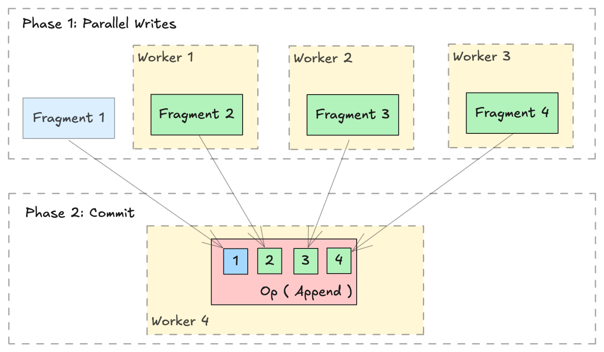

# Distributed Write

!!! warning
    Lance provides out-of-the-box [Ray](../integrations/ray.md) and [Spark](https://github.com/lancedb/lance-spark) integrations.

    This page is intended for users who wish to perform distributed operations in a custom manner, i.e. using `slurm` or `Kubernetes` without the Lance integration.

## Overview

The [Lance format](../format/index.md) is designed to support parallel writing across multiple distributed workers. A distributed write operation can be performed by two phases:

1. **Parallel Writes**: Generate new `lance.LanceFragment` in parallel across multiple workers.
2. **Commit**: Collect all the `lance.FragmentMetadata` and commit into a single dataset in a single `lance.LanceOperation`.



## Write new data

Writing or appending new data is straightforward with `lance.fragment.write_fragments`.

```python
import json
from lance.fragment import write_fragments

# Run on each worker
data_uri = "./dist_write"
schema = pa.schema([
    ("a", pa.int32()),
    ("b", pa.string()),
])

# Run on worker 1
data1 = {
    "a": [1, 2, 3],
    "b": ["x", "y", "z"],
}
fragments_1 = write_fragments(data1, data_uri, schema=schema)
print("Worker 1: ", fragments_1)

# Run on worker 2
data2 = {
    "a": [4, 5, 6],
    "b": ["u", "v", "w"],
}
fragments_2 = write_fragments(data2, data_uri, schema=schema)
print("Worker 2: ", fragments_2)
```

Output:
```
Worker 1:  [FragmentMetadata(id=0, files=...)]
Worker 2:  [FragmentMetadata(id=0, files=...)]
```

Now, use `lance.fragment.FragmentMetadata.to_json` to serialize the fragment metadata, and collect all serialized metadata on a single worker to execute the final commit operation.

```python
import json
from lance import FragmentMetadata, LanceOperation

# Serialize Fragments into JSON data
fragments_json1 = [json.dumps(fragment.to_json()) for fragment in fragments_1]
fragments_json2 = [json.dumps(fragment.to_json()) for fragment in fragments_2]

# On one worker, collect all fragments
all_fragments = [FragmentMetadata.from_json(f) for f in \
    fragments_json1 + fragments_json2]

# Commit the fragments into a single dataset
# Use LanceOperation.Overwrite to overwrite the dataset or create new dataset.
op = lance.LanceOperation.Overwrite(schema, all_fragments)
read_version = 0 # Because it is empty at the time.
lance.LanceDataset.commit(
    data_uri,
    op,
    read_version=read_version,
)

# We can read the dataset using the Lance API:
dataset = lance.dataset(data_uri)
assert len(dataset.get_fragments()) == 2
assert dataset.version == 1
print(dataset.to_table().to_pandas())
```

Output:
```
     a  b
0  1  x
1  2  y
2  3  z
3  4  u
4  5  v
5  6  w
```

## Append data

Appending additional data follows a similar process. Use `lance.LanceOperation.Append` to commit the new fragments, ensuring that the `read_version` is set to the current dataset's version.

```python
import lance

ds = lance.dataset(data_uri)
read_version = ds.version # record the read version

op = lance.LanceOperation.Append(schema, all_fragments)
lance.LanceDataset.commit(
    data_uri,
    op,
    read_version=read_version,
)
```

## Add New Columns

[Lance Format excels at operations such as adding columns](../format/index.md). Thanks to its two-dimensional layout ([see this blog post](https://blog.lancedb.com/designing-a-table-format-for-ml-workloads/)), adding new columns is highly efficient since it avoids copying the existing data files. Instead, the process simply creates new data files and links them to the existing dataset using metadata-only operations.

```python
import lance
from pyarrow import RecordBatch
import pyarrow.compute as pc

dataset = lance.dataset("./add_columns_example")
assert len(dataset.get_fragments()) == 2
assert dataset.to_table().combine_chunks() == pa.Table.from_pydict({
    "name": ["alice", "bob", "charlie", "craig", "dave", "eve"],
    "age": [25, 33, 44, 55, 66, 77],
}, schema=schema)


def name_len(names: RecordBatch) -> RecordBatch:
    return RecordBatch.from_arrays(
        [pc.utf8_length(names["name"])],
        ["name_len"],
    )

# On Worker 1
frag1 = dataset.get_fragments()[0]
new_fragment1, new_schema = frag1.merge_columns(name_len, ["name"])

# On Worker 2
frag2 = dataset.get_fragments()[1]
new_fragment2, _ = frag2.merge_columns(name_len, ["name"])

# On Worker 3 - Commit
all_fragments = [new_fragment1, new_fragment2]
op = lance.LanceOperation.Merge(all_fragments, schema=new_schema)
lance.LanceDataset.commit(
    "./add_columns_example",
    op,
    read_version=dataset.version,
)

# Verify dataset
dataset = lance.dataset("./add_columns_example")
print(dataset.to_table().to_pandas())
```

Output:
```
      name  age  name_len
0    alice   25         5
1      bob   33         3
2  charlie   44         7
3    craig   55         5
4     dave   66         4
5      eve   77         3
``` 

## Update Columns

Currently, Lance supports the fragment level update columns ability to update existing columns in a distributed manner.

This operation performs a left-outer-hash-join with the right table (new data)
on the column specified by `left_on` and `right_on`. For every row in the current
fragment, the updated column value is:
1. If no matched row on the right side, the column value of the left side row.
2. If there is exactly one corresponding row on the right side, the column value
   of the matching row.
3. If there are multiple corresponding rows, the column value of a random row.

```python
import lance
import pyarrow as pa

# Create initial dataset with two fragments
# First fragment
data1 = pa.table(
    {
        "id": [1, 2, 3, 4],
        "name": ["Alice", "Bob", "Charlie", "David"],
        "score": [85, 90, 75, 80],
    }
)
dataset_uri = "./my_dataset.lance"
dataset = lance.write_dataset(data1, dataset_uri)

# Second fragment
data2 = pa.table(
    {
        "id": [5, 6, 7, 8],
        "name": ["Eve", "Frank", "Grace", "Henry"],
        "score": [88, 92, 78, 82],
    }
)
dataset = lance.write_dataset(data2, dataset_uri, mode="append")

# Prepare update data for fragment 0 using 'id' as join key
update_data1 = pa.table(
    {
        "id": [1, 3],
        "name": ["Alan", "Chase"],
        "score": [95, 85],
    }
)

# Prepare update data for fragment 1
update_data2 = pa.table(
    {
        "id": [5, 7],
        "name": ["Eva", "Gracie"],
        "score": [98, 88],
    }
)

# Update fragment 0
fragment0 = dataset.get_fragment(0)
updated_fragment0, fields_modified0 = fragment0.update_columns(
    update_data1, left_on="id", right_on="id"
)

# Update fragment 1
fragment1 = dataset.get_fragment(1)
updated_fragment1, fields_modified1 = fragment1.update_columns(
    update_data2, left_on="id", right_on="id"
)

union_fields_modified = list(set(fields_modified0 + fields_modified1))
# Commit the changes for both fragments
op = lance.LanceOperation.Update(
    updated_fragments=[updated_fragment0, updated_fragment1],
    fields_modified=union_fields_modified,
)
updated_dataset = lance.LanceDataset.commit(
    str(dataset_uri), op, read_version=dataset.version
)

# Verify the update
dataset = lance.dataset(dataset_uri)
print(dataset.to_table().to_pandas())
```

Output:
```
   id    name  score
0   1    Alan     95
1   2     Bob     90
2   3   Chase     85
3   4   David     80
4   5     Eva     98
5   6   Frank     92
6   7  Gracie     88
7   8   Henry     82
```