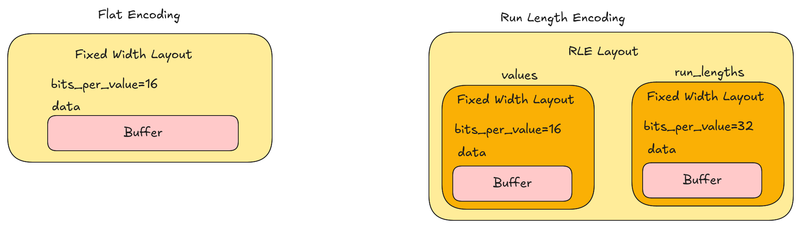
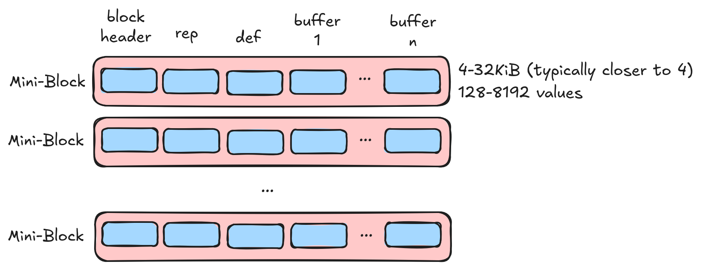
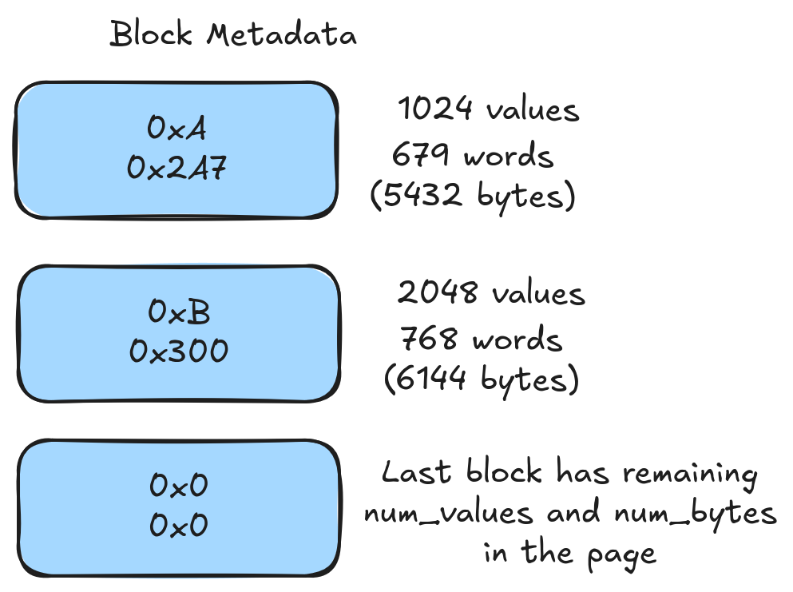
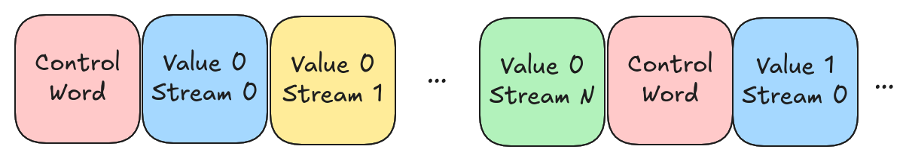
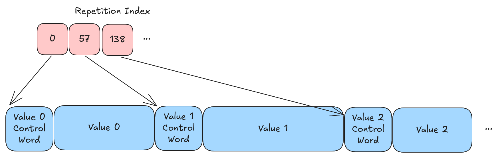

# Lance 编码策略（Encoding Strategy）

编码策略决定了数组数据如何编码为磁盘页（Disk Page）。编码策略的演进速度通常快于文件格式本身。

## 早期编码策略

0.1 和 2.0 编码策略不再提供文档。它们与后续编码策略差异显著，详细描述会造成干扰。

## 术语

数组（Array）是一个值的序列。数组有一个数据类型（Data Type），用于描述值的语义解释。布局（Layout）是将数组编码为一组缓冲区和子数组的方式。缓冲区（Buffer）是一段连续的字节序列。编码（Encoding）描述了数据的语义解释如何映射到布局。编码器（Encoder）将数据从一种布局转换为另一种布局。

数据类型和布局是正交的概念。一个整数数组可能被编码为两种完全不同的布局，但表示相同的数据。



### 数据类型

Lance 使用 Arrow 类型系统的子集作为数据类型。Arrow 数据类型既是数据类型也是编码。在写入数据时，Lance 通常会对 Arrow 数据类型进行标准化。例如，字符串数组和大字符串数组（Large String Array）可能最终走同一条路径（变长数据）。实际上，大多数类型归入两条通用路径：一条用于定长数据，一条用于变长数据（同时支持 32 位和 64 位偏移量）。

在读取时，Arrow 数据类型用于确定目标编码。例如，字符串数组和大字符串数组可能以相同的布局存储，但在读取时，我们会使用 Arrow 数据类型来确定返回给用户的偏移量大小。输出的 Arrow 类型不要求与输入的 Arrow 类型匹配。例如，以"大字符串"写入数组然后以"字符串"读回是可以接受的。

## 搜索缓存（Search Cache）

搜索缓存是 Lance 文件读取器的关键组件。随机访问需要我们定位文件中数据的物理位置。为此，我们需要知道诸如列使用的编码、页的位置以及其他可能的信息。这些信息统称为"搜索缓存"，实现为基本的 LRU 缓存。我们定义了一个"初始化阶段"，即将各种索引信息加载到搜索缓存中。初始化的成本假定在读取器的生命周期内被分摊。

在执行全量扫描（即非随机访问）时，我们应该能够忽略搜索缓存，有时甚至可以完全避免加载它。我们**确实**希望优化冷扫描（Cold Scan），因为初始化阶段的成本通常无法在读取器的生命周期内被分摊。

## 结构化编码（Structural Encoding）

编码数组的第一步是确定数组的结构化编码。结构化编码将数据拆分为更小的单元，这些单元可以独立解码。结构化编码还负责编码"结构"（结构体有效性、列表有效性、列表偏移量等），通常利用重复级别（Repetition Levels）和定义级别（Definition Levels）。

结构化编码相当复杂！但其目标是提取所有与 I/O 调度相关的细节，使压缩库可以专注于压缩。这使我们的压缩特征保持简单，同时不牺牲随机访问的能力。

结构化编码只有少数几种。结构化编码由 `PageLayout` 消息描述，它是编码的顶层消息。

```protobuf
%%% proto.message.PageLayout %%%
```

### 重复级别和定义级别

重复级别和定义级别是表达结构体和列表信息的替代方案，取代了有效性位图（Validity Bitmaps）和偏移量数组。它们有一个显著优势：将所有这些缓冲区合并为单个缓冲区，从而避免多次 IOPS。

代码中可以找到关于重复级别和定义级别更详尽的解释。需要特别注意的是，我们使用 0 表示"最内层"项，而 Parquet 使用 0 表示"最外层"项。以下是示例：

#### 定义级别

考虑以下数组：

```text
[{"middle": {"inner": 1]}}, NULL, {"middle": NULL}, {"middle": {"inner": NULL}}]
```

在 Arrow 中我们会有以下有效性数组：

```text
Outer validity : 1, 0, 1, 1
Middle validity: 1, ?, 0, 1
Inner validity : 1, ?, ?, 0
Values         : 1, ?, ?, ?
```

? 值在 Arrow 格式中是未定义的。我们可以将其转换为定义级别：

| 值     | 定义级别 | 说明                |
| ------ | ---------- | -------------------- |
| 1      | 0          | 在所有层级都有效  |
| ?      | 3          | 在外层为空  |
| ?      | 2          | 在中间层为空 |
| ?      | 1          | 在内层为空  |

#### 重复级别

考虑以下包含 3 行的列表数组：

```text
[{<0,1>, <>, <2>}, {<3>}, {}], [], [{<4>}]
```

在 Arrow 中我们会有三个偏移量数组：

```text
Outer-most ([]): [0, 3, 3, 4]
Middle     ({}): [0, 3, 4, 4, 5]
Inner      (<>): [0, 2, 2, 3, 4, 5]
Values         : [0, 1, 2, 3, 4]
```

我们可以将其转换为重复级别：

| 值     | 重复级别 | 说明                                     |
| ------ | ---------- | ----------------------------------------- |
| 0      | 3          | 最外层列表的开始                  |
| 1      | 0          | 继续最内层列表（无新列表）  |
| ?      | 1          | 最内层新列表的开始（空列表） |
| 2      | 1          | 最内层新列表的开始              |
| 3      | 2          | 中间层新列表的开始                  |
| ?      | 2          | 最内层新列表的开始（空列表） |
| ?      | 3          | 最外层新列表的开始（空列表） |
| 4      | 0          | 最外层新列表的开始              |

### 迷你块页布局（Mini Block Page Layout）

迷你块页布局是较小类型的默认布局。它适用于大多数经典数据类型（整数、浮点数、布尔值、短字符串等），这些类型是 Parquet 和相关格式已经处理得很好的。不出意料，所采用的方法与这些格式非常相似。



数据被划分为小型迷你块。每个迷你块应包含 2 的幂次方个值（最后一个迷你块除外），且压缩数据应小于 32KiB。由于需要读取整个迷你块才能获取单个值，因此我们希望保持迷你块的大小较小。迷你块按 8 字节边界填充，这有助于避免对齐问题。每个迷你块以一个小型头部开始，帮助我们确定应用了多少填充。

重复级别和定义级别被切片并与压缩缓冲区一起存储在迷你块中。由于需要读取整个迷你块，无需交错存储各种缓冲区，它们按顺序存储（重复级别、定义级别、值、...）。

#### 缓冲区 1（迷你块）

| 字节  | 含义                             |
| ----- | ----------------------------------- |
| 1     | 迷你块中的缓冲区数量 |
| 2     | 缓冲区 0 的大小                    |
| 2     | 缓冲区 1 的大小                    |
| ...   | ...                                 |
| 2     | 缓冲区 N 的大小                    |
| 0-7   | 填充以确保 8 字节对齐  |
| \*    | 缓冲区 0                            |
| 0-7   | 填充以确保 8 字节对齐  |
| \*    | 缓冲区 1                            |
| ...   | ...                                 |
| 0-7   | 填充以确保 8 字节对齐  |
| \*    | 缓冲区 N                            |
| 0-7   | 填充以确保 8 字节对齐  |

注意：虽然自然会先解释此缓冲区，但它实际上是页中的第二个缓冲区。

#### 缓冲区 0（迷你块元数据）



为了支持随机访问，我们有一个小型元数据查找表，每个迷你块占用两个字节。该查找表告诉我们每个迷你块中有多少字节以及迷你块中有多少项。此元数据查找表必须在初始化时加载并放入搜索缓存中。

| 位（非字节） | 含义                             |
| ---------------- | ----------------------------------- |
| 12               | 块 0 中 8 字节字的数量   |
| 4                | 块 0 中值数量的 Log2 值 |
| 12               | 块 1 中 8 字节字的数量   |
| 4                | 块 1 中值数量的 Log2 值 |
| ...              | ...                                 |
| 12               | 块 N 中 8 字节字的数量   |
| 4                | 块 N 中值数量的 Log2 值 |

对于除最后一块外的所有块，低 4 位存储 `log2(num_values)`，且 `num_values` 必须是 2 的幂。对于最后一块，这些位设为 `0`。protobuf 存储了页中值的总数，因此读取器可以通过减去前面各块的值来推导最后一块的大小。

#### 缓冲区 2（字典，可选）

字典编码（Dictionary Encoding）是一种可以在文件的多个不同层级应用的编码。例如，它可以用作压缩编码，甚至可以完全在文件外部使用。我们发现应用字典编码最方便的简单位置是在结构化层级。由于字典索引很小，字典编码始终使用迷你块布局。使用字典编码时，我们将字典存储在索引 2 的缓冲区中。我们要求字典在初始化时完全加载和解码。这意味着在随机访问期间不必加载字典，但字典需要放入搜索缓存中。

字典值以单个缓冲区存储，并通过块压缩路径进行压缩。字典值的压缩方案可以单独配置（见下方 `lance-encoding:dict-values-compression`）。

#### 缓冲区 2（或 3）（重复索引，可选）

如果存在重复信息（列表层级），则需要某种方式将行偏移量转换为项偏移量。迷你块始终存储项。在全量扫描期间，列表偏移量在解码重复级别时恢复。然而，为了支持随机访问，我们没有可用的重复级别。因此，我们将重复索引存储在下一个可用的缓冲区中（索引 2 或 3，取决于是否存在字典）。

重复索引是一个 u64 值的扁平缓冲区。我们有 N \* D 个值，其中 N 是迷你块的数量，D 是期望的随机访问深度加一。例如，要支持一维查找（按行随机访问），D 为 2。要支持二维查找（如 rows\[50\]\[17\]），可以将 D 设为 3。

目前我们只支持一维随机访问。
目前我们不压缩重复索引。

这在未来版本中可能会改变。

| 字节  | 含义                            |
| ----- | ---------------------------------- |
| 8     | 块 0 中的行数          |
| 8     | 块 0 中的部分项数 |
| 8     | 块 1 中的行数          |
| 8     | 块 1 中的部分项数 |
| ...   | ...                                |
| 8     | 块 N 中的行数          |
| 8     | 块 N 中的部分项数 |

每个块的最后 8 字节存储"部分"项的数量。这些是最后一个完整行之后剩余的项。我们不要求行受迷你块边界限制，因此需要跟踪这些。例如，如果每行有 10,000 个项，那么可能有多个迷你块只包含部分项和 0 行。

在读取时，我们可以使用此重复索引将行偏移量转换为项偏移量。

#### 迷你块压缩

迷你块布局依赖压缩算法来处理数据到迷你块的拆分。这是因为每块的值数量取决于数据的可压缩性。因此，迷你块压缩有一个专用特征（Trait）。

数据压缩算法决定块边界。重复级别和定义级别随后被适当切片并发送给块压缩器。这意味着重复级别和定义级别的压缩方式没有限制。

除了将数据拆分为迷你块外，没有其他约束。我们期望将迷你块作为不透明的块进行完全解码。这意味着可以使用任何我们认为合适的压缩算法。

#### Protobuf

```protobuf
%%% proto.message.MiniBlockLayout %%%
```

迷你块布局的 protobuf 描述了各种缓冲区的压缩方式。它还告诉我们一些关于字典（如果存在）和重复索引（如果存在）的信息。

### 全量交错页布局（Full Zip Page Layout）

全量交错页布局是为较大值（如向量嵌入）设计的布局，这些值很大但还不足以为单个值单独执行一次 IOP。在这种情况下，我们试图避免存储大量的"块开销"（包括缓冲区空间和搜索缓存中存储重复索引所需的 RAM 空间）。作为权衡，随机访问读取需要为每个范围执行第二次 IOP（除非数据是定长的，如向量嵌入）。

我们目前使用 256 字节作为全量交错布局的阈值。在此时，我们在 4KiB 磁盘扇区中只能容纳 16 个值，因此为每 16 个值创建一个迷你块描述符开销过大。

进一步的结果是，我们必须确保压缩算法是"透明的"，以便在应用压缩后仍然可以索引单个值。这阻止了使用诸如增量编码（Delta Encoding）之类的压缩算法。如果要应用通用压缩，必须逐值应用。我们通过要求压缩返回定长或变长布局来强制执行此约束，这样我们就知道每个元素的位置。

重复级别和定义级别，连同所有压缩缓冲区，全部交错存储在单个缓冲区中。

#### 数据缓冲区（缓冲区 0）



数据缓冲区是一个单一缓冲区，包含重复信息、定义信息和值数据，全部交错存储。重复和定义信息被合并并按字节打包，称为控制字（Control Word）。如果值为空或是空列表，则控制字就是所有序列化的内容。如果没有有效性或重复信息，则不序列化控制字。如果值是变长的，则编码值的大小。这是一个 4 字节或 8 字节整数，取决于压缩返回的偏移量中使用的宽度（在未来版本中，这可能会用某种变长整数编码来编码）。最后附加值缓冲区本身。

| 字节  | 含义        |
| ----- | -------------- |
| 0-4   | 控制字 0 |
| 0/4/8 | 值 0 大小   |
| \*    | 值 0 数据   |
| ...   | ...            |
| 0-4   | 控制字 N |
| 0/4/8 | 值 N 大小   |
| \*    | 值 N 数据   |

注意：没有有效性信息的定长数据类型（如不可空的向量嵌入）就是一个简单的数据扁平缓冲区。

#### 重复索引（缓冲区 1）



如果存在重复信息或值是变长的，则需要额外的帮助来定位磁盘页中的值。重复索引是一个 u64 值的数组。每行一个值，该值是该行在数据缓冲区中的起始偏移量。执行随机访问需要两次 IOP：首先向重复索引发起一次 IOP 以确定位置，然后向数据缓冲区发起第二次 IOP 以加载数据。或者，可以在初始化阶段将整个重复索引加载到内存中，但这可能导致搜索缓存的 RAM 使用量较高。

重复索引必须是定长的（否则我们需要一个重复索引来读取重复索引！）且是透明的。因此压缩选项有限。话虽如此，压缩重复索引在性能方面价值不大。它从不被完整读取，因为全量扫描不需要它。目前重复索引始终使用简单的（非分块）字节打包压缩为 1、2、4 或 8 字节值。

#### Protobuf

```protobuf
%%% proto.message.FullZipLayout %%%
```

全量交错布局的 protobuf 描述了数据缓冲区的压缩方式。它还告诉我们控制字的大小以及每个值的位数（对于定长数据）或每个偏移量的位数（对于变长数据）。

### 常量页布局（Constant Page Layout）

此布局用于页中所有（可见的）值都是相同标量值的情况。

全空（All-Null）情况由不带内联标量值的常量页表示。令人意外的是，这并不意味着没有数据。如果存在任何层级的结构体或列表，我们需要存储重复/定义级别，以便区分空结构体、空列表、空列表和空值。

#### 重复级别和定义级别（缓冲区 0 和 1）

注意：我们目前将重复级别存储在第一个缓冲区中，使用 16 位值的扁平布局；定义级别存储在第二个缓冲区中，同样使用 16 位值的扁平布局。这在未来版本中可能会改变。

#### Protobuf

```protobuf
%%% proto.message.ConstantLayout %%%
```

我们只需要知道每个重复/定义级别的含义以及（如果存在的话）内联标量值的字节。

### Blob 页布局（Blob Page Layout）

Blob 页布局是为大型二进制值设计的布局，在这种情况下每个磁盘页只有少量值。实际数据存储在外部缓冲区中（行外存储）。磁盘页存储一个"描述"，它是一个包含两个字段的结构体数组：`position` 和 `size`。`position` 是 blob 的绝对文件偏移量，`size` 是 blob 的大小（以字节为单位）。内部页布局描述了描述信息的编码方式。

有效性信息（定义级别）被嵌入在描述中。如果大小和位置都为零，则值为空。否则，如果大小为零且位置非零，则值为空值（Null），位置就是定义级别。

此布局仅在可以为每个值单独执行一次 IOP 时推荐使用。例如，当值为 1MiB 或更大时。

此布局没有自己的缓冲区，仅包装一个内部布局。

#### Protobuf

```protobuf
%%% proto.message.BlobLayout %%%
```

由于我们将有效性嵌入到描述中，不需要在内部布局中存储它，因此 blob 布局中存储重复/定义含义，而内部布局中的重复/定义含义将是 1 个全有效项层。

## 半结构化转换（Semi-Structural Transformations）

在结构化编码过程之前（或期间）会对数据应用一些数据转换。这些转换在此描述。

### 字典编码

字典编码是一种可以应用于任何类型数组的技术。当数组中唯一值不多时，它非常有用。首先，创建一个唯一值的"字典"。然后创建一个指向字典的索引数组。

字典编码在其他上下文中也称为"分类编码（Categorical Encoding）"。

字典编码可以作为简单的压缩技术处理，但应用时它将是不透明的压缩技术，这会限制其可用性（例如在全量交错上下文中）。因此，我们在任何结构化编码之前应用它。这允许我们将字典放入搜索缓存以支持随机访问。

### 结构体打包（Struct Packing）

结构体打包是应用于结构体值的替代表示。它不是以列式方式存储结构体，而是以行主序（Row-Major）方式存储。这将减少随机访问所需的 IOPS 数量，但会阻止单独读取单个字段的能力。当结构体中的所有字段总是一起访问时，这很有用。

打包结构体始终需要手动启用（见下方配置部分）。

在 Lance 2.1 中，打包结构体仅限于定长子字段（`PackedStruct`）。从 Lance 2.2 开始，变长子字段也通过 `VariablePackedStruct` 得到支持。

### 固定大小列表（Fixed Size List）

固定大小列表是一种需要在结构化层级进行专门处理的 Arrow 数据类型。如果底层数据类型是原始类型，则固定大小列表将是原始的（如张量）。如果底层数据类型是结构化的（结构体/列表），则固定大小列表也是结构化的，应与可变大小列表相同处理。

我们不希望压缩库需要担心固定大小列表的复杂细节。因此，我们在结构化编码过程中将列表展平。这使随机访问变得复杂，因为我们必须在行（整个固定大小列表）和项（列表中的单个项）之间进行转换。

如果固定大小列表中的项可为空，则不将该有效性数组视为重复或定义级别。相反，我们将有效性作为单独的缓冲区存储。例如，使用迷你块编码对可空固定大小列表进行编码时，有效性缓冲区是迷你块中的另一个缓冲区。使用全量交错编码对可空固定大小列表进行编码时，有效性缓冲区与值交错存储。

好消息是，固定大小列表完全是结构化编码的关注点。压缩技术可以假装固定大小列表数据类型不存在。

## 压缩

一旦选择了结构化编码，就必须确定如何压缩数据。可能需要压缩各种缓冲区（如数据、重复级别、定义级别、字典等）。可用的压缩算法也受所选结构化编码的限制。例如，使用全量交错布局时需要透明压缩。因此，每种编码技术在给定场景中可能可用也可能不可用。此外，同一技术在不同的编码选择下可能以不同的方式应用。

在实现层面，我们为每种压缩约束定义了一个特征（Trait）。技术实现其可以应用的特征。首先，以下是至少在一种场景中已实现的压缩技术汇总，以及该技术实现了哪些特征的列表。使用 ? 表示该技术在该上下文中应该可用但我们尚未实现，使用 X 表示该技术因不透明而不可用。注意，即使技术不透明，它仍可以逐值应用。我们使用 check 标记逐值应用的技术：

| 压缩方式         | 在块上下文中使用 | 在全量交错上下文中使用 | 在迷你块上下文中使用 |
| --------------- | --------------------- | ------------------------ | -------------------------- |
| Flat            | ✅ (2.1)              | ✅ (2.1)                 | ✅ (2.1)                   |
| Variable        | ✅ (2.1)              | ✅ (2.1)                 | ✅ (2.1)                   |
| Constant        | ✅ (2.1)              | ?                        | ?                          |
| Bitpacking      | ✅ (2.1)              | ?                        | ✅ (2.1)                   |
| Fsst            | ?                     | ✅ (2.1)                 | ✅ (2.1)                   |
| Rle             | ✅ (2.2)              | X                        | ✅ (2.1)                   |
| ByteStreamSplit | ?                     | X                        | ✅ (2.1)                   |
| General         | ✅ (2.2)              | check (2.1)              | ✅ (2.1)                   |

以下各节将更详细地描述每种技术，并解释它在各种上下文中如何使用。

### Flat

Flat 压缩是定长数据的未压缩表示。只有一个数据缓冲区，每个值的位数固定。

在迷你块上下文中应用时，我们找到小于 8,186 字节的最大 2 的幂次方个值，并将其作为块大小。

### Variable

Variable 压缩是变长数据的未压缩表示。有一个值缓冲区和一个偏移量缓冲区。

在迷你块上下文中应用时，每个块可能有不同数量的值。我们遍历值，直到找到超过 4,096 字节的点，然后使用我们已经经过的最近 2 的幂次方个值。

### Constant

Constant 压缩目前仅在少数特殊场景中使用，如全空数组。

这在未来版本中可能会改变。

### 位打包（Bitpacking）

位打包是一种压缩技术，用于去除值集合中未使用的位。例如，如果我们有一个 u32 数组且最大值为 5000，那么只需要 13 位来存储每个值。

在迷你块上下文中使用时，我们始终使用每块 1024 个值。此外，我们将压缩后的位宽内联存储在块本身中。

位打包理论上可以在全量交错上下文中使用。但该上下文中的值很大，节省几位不太可能产生有意义的影响。此外，全量交错上下文保持字节对齐，因此每个值至少需要去除 8 位。

### Fsst

Fsst 是一种快速且透明的变长数据压缩算法。它是我们应用于变长数据的主要压缩算法。

目前我们每个磁盘页使用一个 FSST 符号表，并将该符号表存储在 protobuf 描述中。这是出于历史原因，并不理想，未来版本中可能会改变。

当 FSST 在迷你块上下文中应用时，我们只是压缩数据并让底层压缩器（目前始终是 `Variable`）处理分块。

### 行程编码（RLE，Run Length Encoding）

行程编码是一种将大量相同值的连续段压缩为值数组和行程长度数组的压缩技术。目前在迷你块上下文中使用。为了确定是否应用行程编码，我们查看行程数除以值数的比率。如果比率低于阈值（默认为 0.5），则应用行程编码。

### 字节流分割（BSS，Byte Stream Split）

字节流分割是一种压缩技术，按字节位置分割多字节值，为所有值的每个字节位置创建单独的流。这是将浮点值转换为更可压缩格式的一种基本而简单的形式，因为它倾向于将尾数位聚集在一起，而浮点值列中的尾数位通常是一致的。它本身并不会使数据变小。因此，BSS 仅在列上也应用了通用压缩时才会被应用。

我们目前通过查看熵统计来确定是否应用 BSS。有一个可配置的敏感度参数。敏感度为 0.0 表示永不应用 BSS，敏感度为 1.0 表示始终应用 BSS。

### 通用压缩（General）

通用压缩是经典不透明压缩技术的统称，如 LZ4、ZStandard、Snappy 等。这些技术通常是反向引用压缩器（Back-Referencing Compressors），用"反向引用"替换值，指向我们已经见过该值的位置。

在迷你块上下文中应用时，我们在所有其他压缩之后运行通用压缩，压缩整个迷你块。

在全量交错上下文中应用时，我们对每个值运行通用压缩。

唯一自动应用通用压缩的情况是在全量交错上下文中，且值至少有 32KiB 大。这是因为通用压缩可能消耗大量 CPU。

然而，通用压缩非常有效，我们允许通过配置在其他上下文中手动启用它。

## 压缩配置

以下部分列出了可用的配置选项。这些选项可以通过写入器选项以编程方式设置。但它们也可以在 schema 的字段元数据中设置。

| 键                                    | 值                                   | 默认值           | 描述                                                                             |
| ------------------------------------ | ------------------------------------ | ---------------- | --------------------------------------------------------------------------------------- |
| `lance-encoding:compression`         | `lz4`, `zstd`, `none`, ...           | `none`           | 手动启用通用压缩。值指定压缩方案。                          |
| `lance-encoding:compression-level`   | 整数（范围取决于方案） | 因方案而异 | 值越高表示应做更多工作来压缩数据。                         |
| `lance-encoding:rle-threshold`       | `0.0-1.0`                            | `0.5`            | 见下文                                                                               |
| `lance-encoding:bss`                 | `off`, `on`, `auto`                  | `auto`           | 见下文                                                                               |
| `lance-encoding:dict-divisor`        | 大于 1 的整数              | `2`              | 见下文                                                                               |
| `lance-encoding:dict-size-ratio`     | `0.0-1.0`                            | `0.8`            | 见下文                                                                               |
| `lance-encoding:dict-values-compression` | `lz4`, `zstd`, `none`             | `lz4`            | 选择字典值的通用压缩方案                                 |
| `lance-encoding:dict-values-compression-level` | 整数（取决于方案） | 因方案而异 | 字典值通用压缩的压缩级别                             |
| `lance-encoding:general`             | `off`, `on`                          | `off`            | 是否应用通用压缩。                                                   |
| `lance-encoding:packed`              | 任意字符串                           | 未设置          | 是否应用打包结构体编码（见上文）。                                    |
| `lance-encoding:structural-encoding` | `miniblock`, `fullzip`               | 未设置          | 强制应用特定的结构化编码（仅用于测试目的） |

### 配置详情

#### 压缩方案

`lance-encoding:compression` 设置启用通用压缩算法。可用方案：

- **`lz4`**：快速压缩，压缩比良好。默认压缩级别为快速模式。
- **`zstd`**：高压缩比，级别可配置（0-22）。比 LZ4 压缩效果更好但速度更慢。
- **`none`**：不应用通用压缩（默认）。
- **`fsst`**：用于字符串数据的快速静态符号表压缩。

通用压缩在其他编码技术（RLE、BSS、位打包等）之上应用，以进一步减小数据大小。对于迷你块布局，压缩应用于整个迷你块。对于全量交错布局中的大值（>= 32KiB），自动逐值应用压缩。

#### 压缩级别

压缩级别取决于方案。目前以下方案支持以下级别：

| 方案   | 使用的 Crate                            | 级别   | 默认值                                                                                                                                                                                                                           |
| ------ | --------------------------------------- | ------ | --------------------------------------------------------------------------------------------------------------------------------------------------------------------------------------------------------------------------------- |
| `zstd` | [`zstd`](https://crates.io/crates/zstd) | `0-22` | `crate dependent`（撰写本文时为 3）                                                                                                                                                                                          |
| `lz4`  | [`lz4`](https://crates.io/crates/lz4)   | N/A    | LZ4 crate 有两种模式（快速和高压缩），目前尚未暴露到配置中。LZ4 crate 包装了一个 C 库，默认值取决于 C 库。撰写本文时默认为快速模式 |

更高的压缩级别通常提供更好的压缩效果，但编码速度更慢。解码速度通常受压缩级别的影响较小。

#### 行程编码（RLE）阈值

RLE 阈值用于确定是否应用行程编码。阈值是通过行程数除以值数计算的比率。如果比率小于阈值，则应用行程编码。默认值为 0.5，这意味着当行程数少于值数的一半时应用行程编码。

**要点：**
- 当数据有足够的重复时自动选择 RLE（run_count / num_values < 阈值）
- 支持的类型：所有定长原始类型（u8、i8、u16、i16、u32、i32、f32、u64、i64、f64）
- 最大块大小：每个迷你块 2048 个值
- 将阈值设为 `0.0` 有效地禁用 RLE
- 将阈值设为 `1.0` 使 RLE 非常激进（只要存在任何行程就使用）

RLE 对以下场景特别有效：
- 已排序或部分排序的数据
- 有大量重复值的列（状态码、类别等）
- 低基数列

#### 字节流分割（BSS）

BSS 的配置变量是一个简单的枚举。值为 `off` 表示永不应用 BSS，值为 `on` 表示始终应用 BSS，值为 `auto` 表示根据熵计算来应用 BSS（详见代码）。

**重要：**BSS 仅在 `lance-encoding:compression` 变量也设置为非 `none` 值时才应用。BSS 是一种使浮点数据更可压缩的数据转换，它本身并不减小大小。

**要点：**
- 支持的类型：仅 32 位和 64 位数据（f32、f64、时间戳）
- 最大块大小：1024 个值（f32）、512 个值（f64）
- `auto` 模式：使用熵分析，敏感度阈值为 0.5
- `on` 模式：对支持的类型始终应用 BSS
- `off` 模式：永不应用 BSS

BSS 通过按字节位置分割多字节值来工作，创建单独的字节流。这将相似的位聚集在一起（特别是浮点数中的尾数位），使通用压缩算法能够更有效地压缩。

BSS 对以下场景特别有效：
- 具有相似范围的浮点测量值
- 精度一致的时间序列数据
- 具有相关尾数模式的科学数据

#### 字典编码控制

字典编码受几个启发式规则控制。决策在叶值页上做出，因此嵌套类型仍然可以受益。例如，`List<u32>` 可以对其 `u32` 值使用字典编码。

两个字段级元数据键控制何时尝试字典编码：

- `lance-encoding:dict-divisor`（默认 `2`）：编码器计算唯一值预算为 `num_values / divisor`
- `lance-encoding:dict-size-ratio`（默认 `0.8`）：估计的字典编码表示必须保持在原始页大小的此比率以下

还有额外的全局保护机制，可通过环境变量设置：

- `LANCE_ENCODING_DICT_TOO_SMALL`（尝试字典编码前的最小页大小，默认 `100` 个值）
- `LANCE_ENCODING_DICT_DIVISOR`（未设置字段元数据时的回退除数，默认 `2`）
- `LANCE_ENCODING_DICT_MAX_CARDINALITY`（字典条目的上限，默认 `100000`）
- `LANCE_ENCODING_DICT_SIZE_RATIO`（未设置字段元数据时的回退比率，默认 `0.8`）

当值频繁重复且不同值的数量保持较低时，字典编码是有效的。

#### 字典值压缩

字典值通过块压缩路径进行压缩，有自己的配置：

- `lance-encoding:dict-values-compression`：`lz4`、`zstd`、`none`
- `lance-encoding:dict-values-compression-level`：可选的方案特定级别

环境变量回退：

- `LANCE_ENCODING_DICT_VALUES_COMPRESSION`
- `LANCE_ENCODING_DICT_VALUES_COMPRESSION_LEVEL`

优先级顺序为：

1. 字段元数据（`dict-values-*`）
2. 环境变量（`LANCE_ENCODING_DICT_VALUES_*`）
3. 默认值（`lz4`）

`none` 禁用字典值的通用（不透明）压缩。对于定长字典值，当有益时仍可能选择结构化编码（如 RLE 或位打包）。

#### 打包结构体编码

打包结构体编码是上述半结构化转换。启用后，结构体值以行主序格式而非默认的列式格式存储。这减少了随机访问所需的 I/O 操作次数，但阻止了独立读取单个字段。

这始终需要手动启用，且仅应在结构体的所有字段通常一起访问时使用。

#### 迷你块大小调优

每个迷你块默认最多包含 4096 个值。由于必须获取整个迷你块才能读取其中的任何值，仅读取每个迷你块中一小段连续切片的工作负载可能会遇到读放大（Read Amplification）。

默认值适用于绝大多数部署场景。本地磁盘和典型的云对象存储（客户端和存储桶在同一区域）有足够的带宽，默认迷你块大小的开销可以忽略不计。只有在通过性能分析确认迷你块读放大正在耗尽可用带宽时（例如，通过受限网络链路访问远程对象存储），才应考虑更改此设置。

每个迷你块的最大值数量可以通过环境变量降低：

- `LANCE_MINIBLOCK_MAX_VALUES`（默认 `4096`）：单个迷你块中值数量的上限。

降低此值会产生更小的迷你块，减少每次读取获取的数据量，但代价是更多的迷你块和略多的元数据开销。
