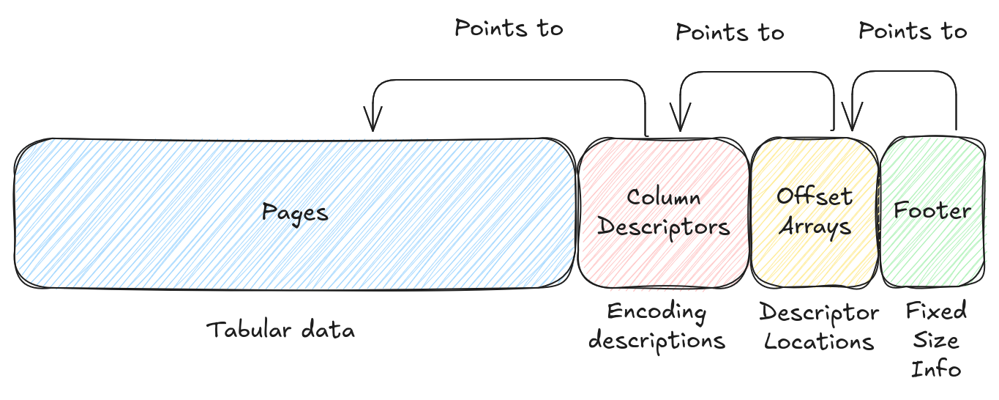
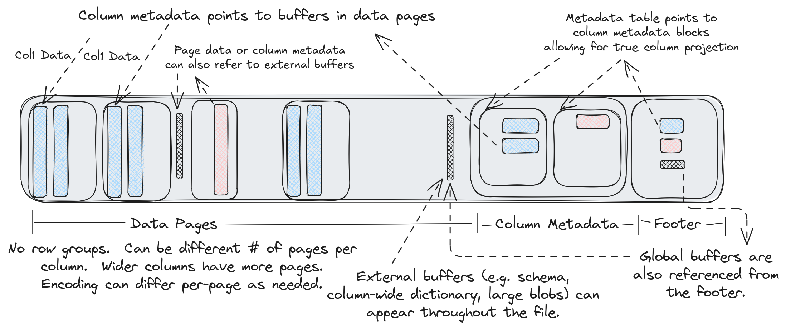

# Lance 文件格式（Lance File Format）

## 文件结构

Lance 文件是表格数据的容器。数据存储在"磁盘页（Disk Page）"中。每个磁盘页包含单个列的若干行数据。每列可能有一个或多个磁盘页，不同列的磁盘页数量可以不同。文件末尾的元数据（Metadata）描述了页的位置以及数据的编码方式。



!!! Note

    本页描述的是容器规范。我们还有一组用于将数据编码到磁盘页中的默认编码方案。详见[编码策略](encoding.md)页面。

### 磁盘页（Disk Pages）

磁盘页的设计足够大，以便能够支撑一次独立的 I/O 操作，即使在云存储上也是如此，通常为数兆字节。使用更大的页大小可以减少读取文件所需的 I/O 操作次数，但也会增加写入文件时所需的内存量。在实际应用中，当需要高速读取时，过大的页大小并无太大用处，因为大块的连续读取需要被拆分为更小的读取操作以获得更好的性能（尤其是在云存储上）。因此，推荐使用 8MB 作为默认页大小，这在所有存储系统上都能获得理想的性能。

磁盘页通常不应被视为不透明的。当只需要部分行时，可以只读取磁盘页的一部分。但具体的读取过程取决于列编码方式，这将在后续章节中描述。

### 无行组（No Row Groups）

与类似的格式不同，Lance 没有"行组（Row Group）"的概念，只有页。我们认为行组的概念从根本上对性能有害。如果行组大小太小，列将被拆分成"残页"，在云存储上的读取性能很差。如果行组大小太大，文件写入器则需要大量 RAM，因为整个行组必须在内存中缓冲后才能写入。相反，为了在多个读取器之间拆分文件，我们依赖于部分页读取是可行的，并且具有最小的读取放大（Read Amplification）。因此，你可以在任意行边界处拆分文件。

### 缓冲区对齐（Buffer Alignment）

文件格式不要求缓冲区是连续的，因为缓冲区通过绝对偏移量来引用。在实践中，我们始终将缓冲区对齐到 64 字节边界。

### 外部缓冲区（External Buffers）

文件中的每个页都通过绝对偏移量引用。这意味着非页数据可以插入到页之间。对于那些每页可能只能容纳少量行的超大数据类型来说，这非常有用。我们可以将数据存储在页外（out-of-line），并将位置信息存储在页中。

此外，文件格式支持"全局缓冲区（Global Buffers）"，可用于存储辅助数据。这可以用来存储文件模式（Schema）、文件索引、列统计信息或其他元数据。全局缓冲区的引用存储在页脚（Footer）中的特定位置。

### 列描述符（Column Descriptors）

文件尾部是描述文件中每个页的元数据，特别是所使用的编码策略。这些元数据由一系列"列描述符"组成，每个列对应一个独立的 protobuf 消息。由于每个列都有自己的消息，因此如果你只关心部分列，则无需读取所有文件元数据。然而在很多情况下，列描述符足够小，一次读取整个页脚比将其拆分为多次读取更为经济。

### 偏移量与页脚（Offsets & Footer）

列描述符之后是列描述符和全局缓冲区的偏移量数组。这些数组简单地指向各项的位置。最后是一个固定大小的页脚，描述偏移量数组和元数据段起始位置的位置。

### 标识符与类型系统（Identifiers and Type Systems）

这个基础容器格式没有类型的概念。类型由编码层后续添加。所有列通过整数"列索引（Column Index）"引用。所有全局缓冲区通过整数"全局缓冲区索引（Global Buffer Index）"引用。模式通常存储在全局缓冲区中，但文件格式本身并不感知这一点。

## 读取策略（Reading Strategy）

在读取数据之前需要先了解文件元数据。加载页脚的一个简单方法是从文件末尾读取一个扇区（扇区大小取决于文件系统，本地磁盘为 4KiB，云存储更大）。然后解析页脚并读取剩余的元数据（此时大小已知）。这需要 1-2 次 IOPS。通过将元数据大小存储在其他位置（例如表清单 / Table Manifest），可以始终在单次 IOP 中读取页脚。如果文件中有很多列但只需要其中部分列，那么单独读取各列的元数据可能更好——这会增加 IOPS 次数，但减少读取的数据量。

接下来，要读取数据，需要扫描每列的页以确定需要哪些页。每个页存储了该页第一行的行偏移量。这使得快速确定所需页变得简单。然后可以使用页的编码信息来精确确定需要从页中读取哪些字节范围。

磁盘页应该足够大，因此顺序读取文件不应带来显著收益。然而，如果确实需要这样的使用场景，在元数据已知的前提下，假设你想读取文件中的所有列，可以顺序读取文件。

## 详细概览



文件布局的详细描述如下：

```protobuf
// Note: the number of buffers (BN) is independent of the number of columns (CN)
//       and pages.
//
//       Buffers often need to be aligned.  64-byte alignment is common when
//       working with SIMD operations.  4096-byte alignment is common when
//       working with direct I/O.  In order to ensure these buffers are aligned
//       writers may need to insert padding before the buffers.
//
//       If direct I/O is required then most (but not all) fields described
//       below must be sector aligned.  We have marked these fields with an
//       asterisk for clarity.  Readers should assume there will be optional
//       padding inserted before these fields.
//
//       All footer fields are unsigned integers written with little endian
//       byte order.
//
// ├──────────────────────────────────┤
// | Data Pages                       |
// |   Data Buffer 0*                 |
// |   ...                            |
// |   Data Buffer BN*                |
// ├──────────────────────────────────┤
// | Column Metadatas                 |
// | |A| Column 0 Metadata*           |
// |     Column 1 Metadata*           |
// |     ...                          |
// |     Column CN Metadata*          |
// ├──────────────────────────────────┤
// | Column Metadata Offset Table     |
// | |B| Column 0 Metadata Position*  |
// |     Column 0 Metadata Size       |
// |     ...                          |
// |     Column CN Metadata Position  |
// |     Column CN Metadata Size      |
// ├──────────────────────────────────┤
// | Global Buffers Offset Table      |
// | |C| Global Buffer 0 Position*    |
// |     Global Buffer 0 Size         |
// |     ...                          |
// |     Global Buffer GN Position    |
// |     Global Buffer GN Size        |
// ├──────────────────────────────────┤
// | Footer                           |
// | A u64: Offset to column meta 0   |
// | B u64: Offset to CMO table       |
// | C u64: Offset to GBO table       |
// |   u32: Number of global bufs     |
// |   u32: Number of columns         |
// |   u16: Major version             |
// |   u16: Minor version             |
// |   "LANC"                         |
// ├──────────────────────────────────┤
//
// File Layout-End
```

### 列元数据（Column Metadata）

列元数据的 protobuf 消息定义如下：

```protobuf
%%% proto.message.ColumnMetadata %%%
```
