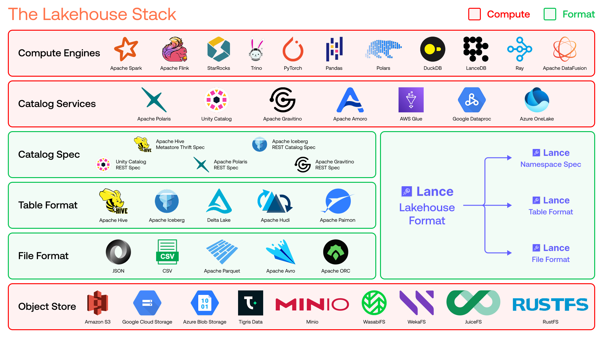

# Lance 格式规范

Lance 是一种**湖仓格式（Lakehouse Format）**，涵盖三个规范层级：文件格式、表格式和目录规范。

## 理解湖仓技术栈

为了理解 Lance 在数据生态系统中的定位，让我们首先梳理完整的湖仓技术栈。
现代湖仓架构由六个不同的层级组成：

### 1. 对象存储（Object Store）

最底层是**对象存储**——以基于对象的简单层级结构为特征的存储系统，
通常提供高持久性保证，并使用基于 HTTP 的通信协议进行数据传输。
包括 S3、GCS 和 Azure Blob Storage 等系统。

### 2. 文件格式（File Format）

存储层之上是**文件格式**，描述单个文件在磁盘上的存储方式。
这是 Apache Parquet 等格式所在的层级，定义了单个数据文件的内部结构、编码和压缩方式。

### 3. 表格式（Table Format）

**表格式**层描述多个文件如何协同工作以形成一个逻辑表。
现代表格式启用的关键特性是事务性提交和读隔离，允许多个写入者和读取者安全地操作同一个表。
所有主要的开源表格式，包括 Iceberg 和 Lance，都通过 MVCC（多版本并发控制）实现这些特性，
其中每次提交原子性地产生一个新的表版本，所有表版本形成特定表的可序列化历史。
这也解锁了时间旅行等功能，并使模式演进（Schema Evolution）等特性易于开发。

### 4. 目录规范（Catalog Spec）

**目录规范**定义了任何系统如何发现和管理存储中的一组表。
这是底层存储和格式栈与上层服务和计算栈的交汇点。

表格式至少需要一种方式来列出所有可用的表，以及描述、添加和删除列表中的表。
这对于在计算引擎中构建所谓的**连接器（Connector）**至关重要，使它们能够根据格式发现并开始处理表。
从历史上看，Hive 定义了 Hive MetaStore 规范，对于大多数表格式（包括 Delta Lake、Hudi、Paimon 以及 Lance）来说已经足够。
Iceberg 提供了其独有的 Iceberg REST Catalog 规范。

从上到下，Apache Polaris、Unity Catalog 和 Apache Gravitino 等项目通常提供额外的规范，
用于操作表的衍生物（如视图、物化视图、用户定义表函数）以及表操作中使用的对象（如用户定义函数、策略）。

底层和顶层栈之间的这个交叉点也是为什么通常目录服务会同时提供格式侧的目录规范（便于连接计算引擎）
以及提供自己的 API 来实现扩展管理功能。

目录规范与目录服务的另一个关键区别是，可以有多个不同的供应商实现同一个规范。
例如，对于 Polaris REST 规范，我们有开源的 Apache Polaris 服务器、Snowflake Horizon Catalog，
以及 AWS Glue、Azure OneLake 等中的 Polaris 兼容服务。

### 5. 目录服务（Catalog Service）

**目录服务**实现一个或多个目录规范，提供表元数据以及可选的持续后台维护（压缩、优化、索引更新），
这些是表格式保持高性能所必需的。
目录服务通常实现多个规范以支持不同的表格式。
例如，Polaris、Unity 和 Gravitino 都支持 Iceberg 表的 Iceberg REST Catalog 规范，
并为其他表格式提供自己的通用表 API。

由于表格式是静态规范，目录服务提供了生产部署所需的活跃运维工作。
这通常是开源向商业产品过渡的地方，开源项目通常提供元数据功能，
而商业解决方案提供完整的运维体验，包括自动化维护。
还有一些新兴的开源解决方案，如 Apache Amoro，提供完整的开源目录服务实现，
同时提供表元数据访问和持续优化。

### 6. 计算引擎（Compute Engine）

最后，**计算引擎**是访问目录服务并利用其对文件格式、表格式和目录规范的了解来执行复杂数据工作流的主力，
包括 SQL 查询、分析处理、向量搜索、全文搜索和机器学习训练。
各种应用可以构建在计算引擎之上，服务于更具体的分析、ML 和 AI 用例。

### 整体湖仓架构

在湖仓架构中，计算能力位于对象存储、目录服务和计算引擎中。
中间三层（文件格式、表格式、目录规范）是没有计算的规范。
这种分离实现了可移植性和互操作性。

## 理解 Lance 作为湖仓格式

Lance 跨越所有三个规范层级：

1. **文件格式**：Lance 列式文件格式，[阅读规范 →](file/index.md)
2. **表格式**：Lance 表格式，[阅读规范 →](table/index.md)
3. **目录规范**：Lance Namespace 规范，[阅读规范 →](namespace/index.md)

作为对比：

- **Apache Iceberg** 在表格式和目录规范层级运作，使用 Apache Parquet、Apache Avro 和 Apache ORC 作为文件格式
- **Delta Lake** 和 **Apache Hudi** 仅在表格式层级运作，使用 Apache Parquet 作为文件格式
