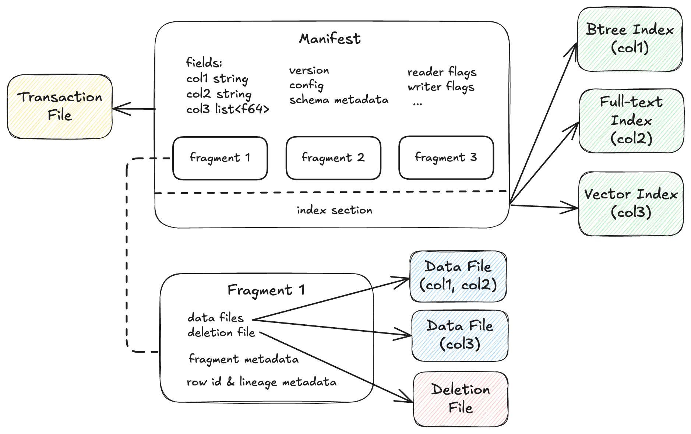
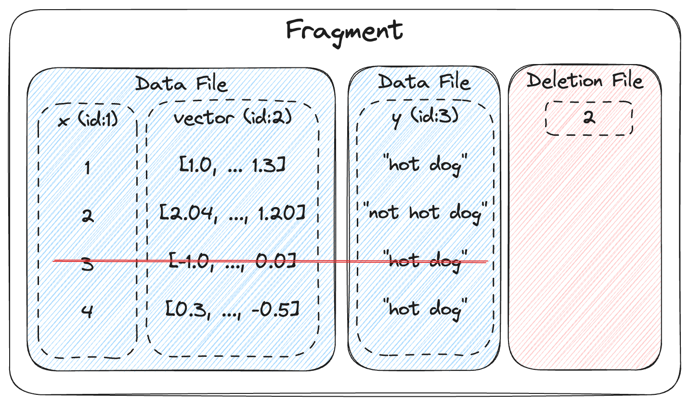

# Lance 表格式（Table Format）

## 概述

Lance 表格式将数据集组织为版本化的片段（Fragment）和索引（Index）集合。
每个版本由一个不可变的清单文件（Manifest）描述，该文件引用数据文件、删除文件、事务文件和索引。
该格式支持 ACID 事务、模式演进（Schema Evolution）以及通过多版本并发控制（Multi-Version Concurrency Control, MVCC）实现的高效增量更新。

## 清单（Manifest）



清单描述数据集的单个版本。
它包含完整的模式定义（包括嵌套字段）、组成该版本的数据片段列表、
单调递增的版本号，以及一个可选的索引部分引用，该引用描述了索引元数据列表。

<details>
<summary>Manifest protobuf 消息</summary>

```protobuf
%%% proto.message.Manifest %%%
```

</details>

## 模式与字段（Schema & Fields）

表的模式以一系列字段加上模式元数据映射的形式写入。
数据类型通常与 Apache Arrow 数据类型一一对应。
每个字段（包括嵌套字段）都有一个唯一的整数 ID。在初始建表时，字段按深度优先顺序分配 ID。
之后，新增字段按递增方式分配字段 ID。

列编码配置通过字段元数据使用 `lance-encoding:` 前缀指定。
有关可用编码、压缩方案和配置选项的详细信息，请参阅[文件格式编码规范](../file/encoding.md)。

有关完整的模式规范详细信息，包括支持的数据类型、字段 ID 分配和元数据处理，
请参阅[模式格式规范](schema.md)。

<details>
<summary>Field protobuf 消息</summary>

```protobuf
%%% proto.message.lance.file.Field %%%
```

</details>

### 非强制主键（Unenforced Primary Key） { #unenforced-primary-key }

Lance 支持通过字段元数据定义非强制主键。
这对于合并插入（Merge-Insert）操作中的去重以及其他受益于逻辑行标识的场景非常有用。
主键是"非强制的"，意味着 Lance 不会始终验证唯一性约束。
用户可以使用特定的工作负载（如合并插入）在必要时进行强制执行。
主键在初始设置后是固定的，不得更新或删除。

主键字段必须满足以下条件：

- 该字段及其所有祖先字段不能为空（nullable）。
- 该字段必须是叶子字段（具有原始数据类型且没有子字段）。
- 该字段不能位于列表（List）或映射（Map）类型内。

使用 Arrow 模式创建 Lance 表时，在 Arrow 字段上添加以下元数据以将其标记为主键的一部分：

- `lance-schema:unenforced-primary-key`：设置为 `true`、`1` 或 `yes`（不区分大小写）以表示该字段是主键的一部分。
- `lance-schema:unenforced-primary-key:position`（可选）：一个从 1 开始的整数，指定在复合主键中的位置。

对于具有多列的复合主键，位置决定主键字段的排序：

- 当指定了位置时，字段按其位置值排序（1、2、3、...）。
- 当未指定位置时，字段按其模式字段 ID 排序。
- 具有显式位置的字段排在没有位置的字段之前。

## 片段（Fragments）



片段表示数据集的水平分区，包含行的一个子集。
每个片段有一个唯一的 `uint32` 标识符，基于数据集的最大片段 ID 递增分配。
每个片段由一个或多个存储列的数据文件加上一个可选的删除文件组成。
如果存在删除文件，它存储已从片段中删除的行的位置（从 0 开始）。
片段在其物理行数（physical rows）字段中跟踪包括已删除行在内的总行数。
可以在不访问所有数据文件的情况下读取列的子集，每个数据文件独立压缩和编码。

<details>
<summary>DataFragment protobuf 消息</summary>

```protobuf
%%% proto.message.DataFragment %%%
```

</details>

### 数据演进（Data Evolution）

这种片段设计使得一个称为数据演进的新概念成为可能，即支持带有回填（Backfill）的高效模式演进（添加列、更新列、删除列）。
例如，在添加新列时，通过向每个片段追加新的数据文件来添加新列数据，为片段中所有现有行计算值。
无需重写整个表即可仅为单个列添加数据。
这使得 ML/AI 工作负载中的特征工程和嵌入向量更新变得高效。

每个数据文件应包含一组不同的字段 ID。
不要求数据集模式中的所有字段 ID 都能在某个数据文件中找到。
如果没有对应的数据文件，该列应读取为全部 `NULL`。

字段 ID 可能被替换为 `-2`，即墓碑值（Tombstone Value）。
在这种情况下，该列应被忽略。例如，在重写列时使用：
旧数据文件将字段 ID 替换为 `-2` 以忽略旧数据，并向片段追加一个新的数据文件。

## 数据文件（Data Files）

数据文件使用 Lance 文件格式存储片段的列数据。
每个数据文件存储片段中列的一个子集。
字段 ID 的分配方式取决于文件格式版本：基于模式位置顺序分配（Lance 文件格式 v1）
或独立于列索引分配（由于可变编码宽度，Lance 文件格式 v2）。

<details>
<summary>DataFile protobuf 消息</summary>

```protobuf
%%% proto.message.DataFile %%%
```

</details>

!!! note "字段到列的映射在不同数据存储版本之间有所不同"

    在 **2.0** 中，所有字段（包括非叶子字段，如 struct 和 list 容器）在
    `column_indices` 中被分配顺序列索引。

    在 **2.1+** 中，非叶子字段（未打包的 struct、list 容器）在
    `column_indices` 中被分配 `-1`，因为它们的有效性信息被折叠到
    重复/定义级别（repetition/definition levels）中。只有叶子字段和打包的 struct 有列索引。

    请参阅 [5.0.0 迁移指南](../../guide/migration.md#500)获取详细示例。

## 删除文件（Deletion Files）

删除文件（也称为删除向量，Deletion Vectors）在不重写数据文件的情况下跟踪已删除的行。
每个片段在每个版本中最多有一个删除文件。

删除文件支持两种存储格式。
Arrow IPC 格式（`.arrow` 扩展名）存储已删除行偏移量的扁平 Int32Array，适用于稀疏删除。
Roaring Bitmap 格式（`.bin` 扩展名）存储压缩的 Roaring 位图，适用于密集删除。
读取器必须过滤掉偏移量出现在片段删除文件中的行。

可以通过重写数据文件并移除已删除行来物化删除操作。
但是，这会使行地址失效并需要重建索引，代价可能很高。

<details>
<summary>DeletionFile protobuf 消息</summary>

```protobuf
%%% proto.message.DeletionFile %%%
```

</details>

## 相关规范

### 存储布局（Storage Layout）

文件组织、基础路径系统和多位置存储。

参见[存储布局规范](layout.md)

### 事务（Transactions）

MVCC、提交协议、事务类型和冲突解决。

参见[事务规范](transaction.md)

### 行血统（Row Lineage）

行地址（Row Address）、稳定行 ID（Stable Row ID）、行版本跟踪和变更数据馈送（Change Data Feed）。

参见[行 ID 与血统规范](row_id_lineage.md)

### 索引（Indices）

向量索引、标量索引、全文搜索和索引管理。

参见[索引规范](index/index.md)

### 版本控制（Versioning）

特性标志和格式版本兼容性。

参见[格式版本规范](versioning.md)
