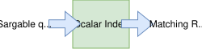
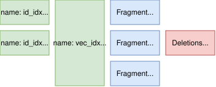
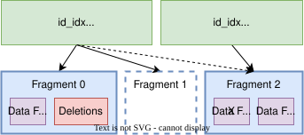
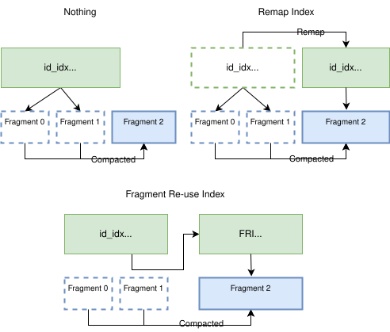

# Lance 中的索引（Indices）

Lance 支持三大类索引来加速数据访问：标量索引（Scalar Indices）、向量索引（Vector Indices）和系统索引（System Indices）。

**标量索引**是传统索引，用于加速标量数据类型（如整数和字符串）上的查询。示例包括 [B 树](scalar/btree.md)和[全文搜索索引](scalar/fts.md)。通常，标量索引接收查询谓词（如等值条件或范围条件），并输出满足谓词的行地址集合。

<figure markdown="span">
  
</figure>

**[向量索引](./vector/index.md)**专门用于高维向量数据（如机器学习模型生成的嵌入向量）上的近似最近邻（ANN）搜索。示例包括 IVF（倒排文件，Inverted File）索引和 HNSW（分层可导航小世界，Hierarchical Navigable Small World）索引。它们与标量索引不同，因为使用了本质上不同的查询模式。向量索引不使用可索引谓词（Sargable Predicates），而是接收一个查询向量，并基于某种距离度量（如欧氏距离或余弦相似度）返回最近邻的行地址及对应距离。

**系统索引**是辅助索引，用于加速内部系统操作。它们与面向用户的标量索引和向量索引不同，不直接用于用户查询。示例包括[片段复用索引（Fragment Reuse Index）](system/frag_reuse.md)，用于支持压缩（Compaction）后的高效行地址重映射。

## 设计

Lance 索引的设计遵循以下原则：

1. **按需加载索引**：数据集可以在不加载任何索引的情况下被打开和读取。只有当查询能从索引中受益时才会加载索引。这种设计最小化了内存使用并加快了数据集的打开速度。
2. **索引可以渐进式加载**：索引的设计使得在查询执行期间只需将必要的部分加载到内存中。例如，查询 B 树索引时，先加载一个小型页表来确定需要为给定查询加载哪些索引页，然后只加载这些页来执行索引搜索。这分摊了冷索引查询的成本，因为每次查询只需加载索引的一小部分。
3. **索引可以合并为比片段更大的单元。**索引比数据文件小得多，因此将索引段合并以覆盖多个片段（Fragment）是高效的。这减少了查询执行期间需要打开的索引文件数量和需要查询的独立索引数据结构的数量。
4. **索引文件一旦写入即不可变，与数据文件类似。**它们只能通过创建新文件来修改。这意味着可以安全地将它们缓存在内存或磁盘中，而无需担心一致性问题。

## 基本概念

Lance 中的索引定义在数据集的一个或多个特定列上，通过名称来标识。

索引由多个**索引段（Index Segments）**组成，每个段通过唯一的 UUID 标识。每个段是一个独立的、自包含的索引，覆盖数据的一个子集。

每个索引段覆盖数据集中不相交的片段子集。各段必须覆盖其所覆盖片段中的所有行，但有一个例外：如果片段在索引创建时已有删除标记，则索引段可以不包含已删除的行。索引覆盖的片段记录在 `fragment_bitmap` 字段中。

索引段组合起来**不需要**覆盖所有片段。这意味着索引不要求完全是最新的。当出现这种情况时，引擎可以将查询拆分为已索引和未索引的子计划，并合并结果。

<figure markdown="span">
  
  <figcaption>典型数据集的抽象布局，包含三个片段和两个索引。
  </figcaption>
</figure>

考虑上图中的示例数据集：

- 数据集包含三个片段，ID 分别为 0、1、2。片段 1 有 10 个已删除的行，由删除文件指示。
- 有一个名为 "id_idx" 的索引，包含两个段：一个覆盖片段 0，另一个覆盖片段 1。片段 2 未被该索引覆盖。使用该索引的查询需要查询两个段，然后直接扫描片段 2。此外，在查询覆盖片段 1 的段时，引擎需要过滤掉 10 个已删除的行。
- 还有一个名为 "vec_idx" 的索引，包含单个段，覆盖所有三个片段。因为它覆盖了所有片段，使用该索引的查询不需要直接扫描任何片段。但它们仍需要过滤掉片段 1 中的 10 个已删除的行。

## 索引存储 { #index-storage }

每个索引的内容存储在[基础路径](../layout.md#base-path-system)下的 `_indices/{UUID}` 目录中。我们称此位置为**索引目录**。索引目录中实际存储的内容取决于索引类型，可以是由索引实现定义的任意文件。不过，它们通常由包含索引数据结构的 Lance 文件组成。这样可以复用现有的 Lance 文件格式代码来读写索引数据。

## 创建和更新索引段

索引段通过事务性流程创建和更新：

1. **构建索引数据**：从待索引的片段中读取相关列数据并构建索引数据结构。将这些数据写入新的 `_indices/{UUID}` 目录中的文件，其中 `{UUID}` 是新生成的唯一标识符。

2. **准备元数据**：创建一个 `IndexMetadata` 消息，包含：
   - `uuid`：新生成的 UUID
   - `name`：索引名称（如果添加到现有索引，必须与现有段匹配）
   - `fields`：被索引的列
   - `fragment_bitmap`：此段覆盖的片段 ID 集合
   - `index_details`：索引特定的配置和参数
   - `version`：此索引类型的格式版本
   - 完整的 protobuf 定义参见 [table.proto](https://github.com/lance-format/lance/blob/main/protos/table.proto)。

3. **提交事务**：写入一个新的清单（Manifest），在其 `IndexSection` 中包含新的索引段。这通过与数据写入相同的事务机制以原子方式完成。

当原地更新已索引的列（不删除行）时，引擎必须从覆盖这些片段的索引段的 `fragment_bitmap` 字段中移除受影响的片段 ID。这会将这些片段标记为需要重新索引，而不会使整个段失效，同时防止从索引中读取无效数据。

## 索引兼容性

在使用索引段之前，引擎必须验证其是否支持该段：

1. **检查索引类型**：`index_details` 字段包含一个 protobuf `Any` 消息，其类型 URL 标识索引类型（如 B 树、IVF、HNSW）。如果引擎无法识别该类型，应跳过此索引段。

2. **检查版本**：`IndexMetadata` 中的 `version` 字段指示索引段的格式版本。如果引擎不支持此版本，应跳过此索引段。这允许索引格式随时间演进，同时保持向后兼容性。

当引擎无法使用某个索引段时，应回退到扫描该段本应覆盖的片段。

## 加载索引 { #loading-an-index }

加载索引时：

1. 从[清单（Manifest）](../index.md#manifest)的 `index_section` 字段获取索引部分的偏移量。
2. 从清单文件中读取索引部分。这是一个类型为 `IndexSection` 的 protobuf 消息，包含一个 `IndexMetadata` 消息列表，每个消息描述一个索引段。
3. 从数据集目录下的 `_indices/{UUID}` 目录读取索引文件，其中 `{UUID}` 是索引段的 UUID。

!!! tip "优化清单加载"

    当清单文件较小时，可以提前读取并缓存索引部分。这避免了加载索引时的额外文件读取。

`IndexMetadata` 消息包含关于索引段的重要信息：

- `uuid`：索引段的唯一标识符。
- `fields`：索引构建在哪些列上。
- `fragment_bitmap`：此索引段覆盖的片段 ID 集合。
- `index_details`：一个 protobuf `Any` 消息，包含索引特定的详细信息，如索引类型、参数和存储格式。这允许不同索引类型存储各自的元数据。

<details>
  <summary>完整的 protobuf 定义</summary>

这些都是 Lance 源代码中 `table.proto` 文件的一部分。

```protobuf
%%% proto.message.IndexSection %%%

%%% proto.message.IndexMetadata %%%
```

</details>

## 处理已删除和失效的行

由于索引段是不可变的，它们可能包含对已删除或已更新行的引用。这些行应在查询执行期间被过滤掉。

<figure markdown="span">
  
  <figcaption>索引段覆盖包含已删除行、完全删除的片段和已更新片段的示意图。
  </figcaption>
</figure>

需要考虑三种情况：

1. **片段有部分已删除的行。**片段中有少量行被标记为已删除，但仍有部分行存在。应使用删除文件中的行地址来过滤索引结果。
2. **片段被完全删除。**可以通过检查片段位图中存在的片段 ID 是否在数据集中缺失来检测。来自此片段的任何行地址都应被过滤掉。
3. **片段的索引列被原地更新。**仅通过检查元数据无法检测到这种情况。为防止读取无效数据，引擎应过滤掉不在索引当前 `fragment_bitmap` 中的任何行地址。

## 压缩与重映射

当片段被压缩时，片段中行的行地址会发生变化。这意味着引用这些片段的任何索引段将不再指向现有的行地址。有三种处理方式：

<figure markdown="span">

</figure>

1. 不做任何处理，让索引段不再覆盖这些片段。这种方法简单且有效，但意味着压缩会立即使索引过时。这对查询性能来说是最差的选项。

2. 立即重写索引段，将行地址重新映射。这种方法确保索引保持最新，但在压缩期间会产生显著的写放大。

3. 创建[片段复用索引（Fragment Reuse Index）](system/frag_reuse.md)，将旧行地址映射到新行地址。这允许读取器在读取索引段时在内存中重新映射行地址。这种方法在查询执行期间增加了一些 I/O 和计算开销，但避免了压缩期间的写放大。

## 索引的稳定行 ID（Stable Row ID）

索引可以选择使用稳定行 ID 而非行地址。稳定行 ID 是一种逻辑标识符，即使行在压缩期间被移动，也保持不变。

**优势：**

- 压缩后无需重映射
- 只有当索引列数据发生变化时，更新才会使索引失效

**权衡：**

- 在查询时需要额外的查找操作来将稳定行 ID 转换为物理行地址

此功能目前处于实验阶段。性能评估仍在进行中，以确定何时这种权衡是值得的。
