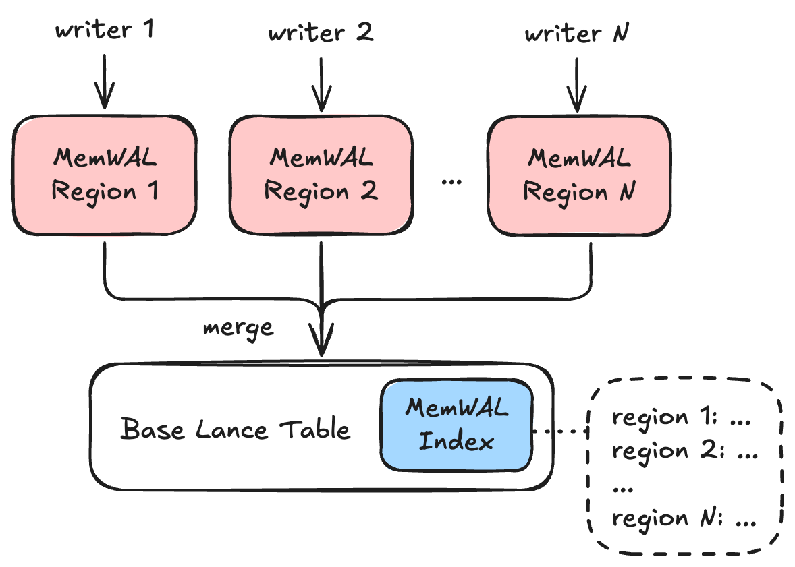
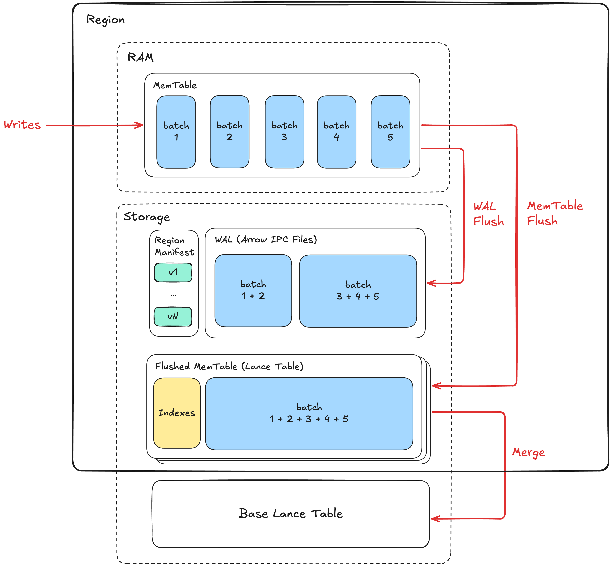

# MemTable 和 WAL 规范（实验性）

Lance MemTable 和 WAL（MemWAL）规范描述了一种面向 Lance 表的日志结构合并树（Log-Structured-Merge, LSM Tree）架构，支持高性能流式写入工作负载，同时保持关键工作负载的索引读取性能，包括扫描、点查询、向量搜索（Vector Search）和全文搜索（Full-Text Search）。

## 整体架构



在 MemWAL 规范的上下文中，Lance 表被称为**基表（Base Table）**。
基表必须在表 schema 中定义一个[非强制主键](index.md#unenforced-primary-key)。

在基表之上，MemWAL 规范定义了一组分片（Shard）。
写入者向分片写入数据，每个分片中的数据会异步合并到基表中。
基表中维护了一个索引，供读取者快速获取某一时间点所有分片的状态。

### MemWAL 分片

**MemWAL 分片（Shard）** 是水平扩展写入的主要单位。

每个分片在任意时刻只有一个活跃的写入者。
写入者声明一个分片，然后向该分片写入数据。
每个分片中的数据预期会异步合并到基表中。

相同主键的行必须写入且只能写入同一个分片。
如果两个分片包含相同主键的行，以下场景可能导致数据损坏：

1. 分片 A 在时间 T1 收到主键 `pk=1` 的写入
2. 分片 B 在时间 T2 收到主键 `pk=1` 的写入（T2 > T1）
3. 分片 B 中的行先被合并到基表
4. 分片 A 中的行后被合并到基表
5. 分片 A 中的行（较旧）覆盖了分片 B 中的行（较新）

这违反了预期的"最后写入获胜（Last Write Wins）"语义。
通过分片规范确保每个主键被分配到唯一一个分片，
分片之间的合并顺序就不会影响正确性。

详见 [MemWAL 分片架构](#shard-architecture)。

### MemWAL 索引 { #memwal-index }

**MemWAL 索引（MemWAL Index）** 是基表之上所有 MemWAL 元数据的集中式结构。
一个表最多有一个 MemWAL 索引。它存储：

- **配置**：分片规范（Shard Spec），定义行如何映射到分片，以及需要维护哪些索引
- **合并进度**：每个分片最后合并到基表的代数（Generation）
- **索引追赶进度**：每个基表索引已重建覆盖到的合并代数
- **分片快照**：所有分片状态的快照，用于读取优化

该索引是**配置**、**合并进度**和**索引追赶进度**的权威数据源。
写入者和合并者在写入前读取 MemWAL 索引以获取这些配置。

每个[分片的清单](#shard-manifest)对其自身状态具有权威性。
读取者使用**分片快照**作为只读优化，以获取所有分片的时间点视图，而无需打开每个分片清单。

详见 [MemWAL 索引详情](#memwal-index-details)。

## 分片架构 { #shard-architecture }



在分片内部，写入数据存储在**内存表（MemTable）** 中。
同时数据也会写入分片的**预写日志（Write-Ahead Log, WAL）** 以保证持久性。
MemTable 会根据内存压力和其他条件定期**刷写（Flush）** 到存储。
存储中**已刷写的 MemTable** 随后会异步**合并（Merge）** 到基表中。

### MemTable

MemTable 保存在刷写到存储之前插入到分片中的行。
它有两个用途：

1. 构建数据和相关索引，以便作为已刷写的 MemTable 刷写到存储
2. 允许读取者访问尚未刷写到存储的数据

#### MemTable 格式

MemTable 的完整内存格式是实现特定的，不在本规范的范围内。
Lance 核心 Rust SDK 维护了一个默认实现，并通过所有语言绑定 SDK 提供，
但集成方可以根据特定用例自由构建自己的 MemTable 格式，
只要在刷写 MemTable 时遵循 MemWAL 存储布局、读取者和写入者的要求即可。

从概念上讲，由于 Lance 使用 [Arrow 作为其内存数据交换格式](https://arrow.apache.org/docs/format/index.html)，
为便于本规范的说明，我们将 MemTable 视为 Arrow 记录批次（Record Batch）的列表，
每次向 MemTable 的写入就是一个新的 Arrow 记录批次。

#### MemTable 代数

基于内存限制和持久性要求等条件，
MemTable 需要被**刷写**到存储并丢弃。
发生这种情况时，新的写入会进入新的 MemTable，循环往复。
每个 MemTable 被分配一个从 1 开始单调递增的代数编号（Generation Number）。
当代数为 `N` 的 MemTable 被丢弃时，下一个 MemTable 会被分配代数 `N+1`。

### WAL

WAL 作为分片中所有 MemTable 的持久存储。
它由按代数排序的 MemTable 数据组成。
每次写入 WAL 的操作称为 **WAL 刷写（WAL Flush）**。

#### WAL 持久性

当一次写入被刷写到 WAL 后，该写入就变得持久了。
否则，如果 MemTable 丢失，数据也会丢失。

多次写入可以批量合并到单次 WAL 刷写中，以降低 WAL 刷写频率并提高吞吐量。
单次 WAL 刷写批量处理的写入越多，一次写入变得持久所需的时间就越长。

整个 LSM 树的持久性取决于 WAL 的持久性。
例如，如果 WAL 存储在 Amazon S3 上，它具有 99.999999999% 的持久性。
如果存储在本地磁盘上，当本地磁盘损坏时数据将会丢失。

#### WAL 条目

每次 WAL 刷写都会向 WAL 添加一个新的 **WAL 条目（WAL Entry）**。
换句话说，WAL 由从位置 0 开始的有序 WAL 条目列表组成。
写入者必须按从低到高的位置顺序刷写 WAL 条目。
如果 WAL 条目 `N` 未完全刷写，WAL 条目 `N+1` 就不能存在于存储中。

#### WAL 重放

**重放（Replaying）** WAL 意味着从低位置到高位置读取 WAL 中的数据。
这通常用于在 MemTable 丢失后恢复最新的 MemTable，
方法是从最新 MemTable 代数的起始位置读取到 WAL 中的最高位置，
前提是有适当的隔离机制（Fencing）来防止多个写入者写入同一分片。

详见[写入者隔离](#writer-fencing)。

#### WAL 条目格式

每个 WAL 条目是存储中的一个文件，遵循 [Apache Arrow IPC 流格式](https://arrow.apache.org/docs/format/Columnar.html#ipc-streaming-format)，用于存储 MemTable 中的写入批次。
写入者纪元（Writer Epoch）存储在流的 Arrow schema 元数据中，键为 `writer_epoch`，用于重放时的隔离验证。

#### WAL 存储布局

每个 WAL 条目存储在分片的 WAL 目录中，位于 `_mem_wal/{shard_id}/wal`。

WAL 文件使用位反转（Bit-Reversed）64 位二进制命名，以在目录键空间中均匀分布文件。
这通过将顺序写入分散到 S3 的内部分区来优化 S3 吞吐量，最大限度地减少限流。
文件名是条目 ID 的位反转二进制表示，后缀为 `.lance`。
例如，条目 ID 5（二进制 `000...101`）变为 `1010000000000000000000000000000000000000000000000000000000000000.arrow`。

### 已刷写的 MemTable { #flushed-memtable }

已刷写的 MemTable 是通过将 MemTable 刷写到存储而创建的。
在 Lance MemWAL 规范中，已刷写的 MemTable 必须是遵循 Lance 表格式规范的 Lance 表。

!!!note
    在许多 LSM 树文献和实现中，这被称为排序字符串表（SSTable, Sorted String Table）或排序运行（Sorted Run）。
    然而，由于我们的 MemTable 是无序的，我们使用"已刷写的 MemTable"这一术语以避免混淆。

#### 已刷写的 MemTable 存储布局

代数为 `i` 的 MemTable 被刷写到 `_mem_wal/{region_uuid}/{random_hex}_gen_{i}/` 目录，
其中 `{random_hex}` 是刷写时生成的随机 8 字符十六进制值。
随机十六进制值是必要的，以确保如果一次 MemTable 刷写尝试失败，
重试可以使用另一个目录。
代数目录中的内容遵循 [Lance 表存储布局](layout.md)。

#### 合并 MemTable 到基表

代数编号决定了已刷写 MemTable 合并到基表的顺序：
较低的编号代表较旧的数据，必须先合并到基表，以保持正确的更新插入（Upsert）语义。

在单个已刷写的 MemTable 中，如果有多行具有相同的主键，
最后插入的行获胜。

### 分片清单 { #shard-manifest }

每个分片都有一个清单文件（Manifest）。这是分片状态的权威数据源。

#### 分片清单内容

清单包含：

- **隔离状态**：`writer_epoch` 作为最新的写入者隔离令牌，详见[写入者隔离](#writer-fencing)
- **WAL 指针**：`replay_after_wal_entry_position`（已刷写到 MemTable 的最后条目位置，从 0 开始），`wal_entry_position_last_seen`（清单更新时看到的最后条目位置，从 0 开始）
- **代数跟踪器**：`current_generation`（下一个要刷写的代数），`flushed_generations` 代数编号和目录路径对的列表（例如，代数 1 位于 `a1b2c3d4_gen_1`）

注意：`wal_entry_position_last_seen` 是一个可能过时的提示，因为它不会在每次 WAL 写入时更新。
它由任何能够更新分片清单的读取者机会性地更新。
清单本身是原子写入的，但恢复时必须尝试获取更新的 WAL 文件以找到超出此提示的实际状态。

清单使用 `ShardManifest` 消息序列化为 protobuf 二进制文件。

<details>
<summary>ShardManifest protobuf 消息</summary>

```protobuf
%%% mem_wal.message.ShardManifest %%%
```

</details>

#### 分片清单版本管理

清单从版本 1 开始编号且不可变。
每次更新都会在下一个版本号创建新的清单文件。
更新使用 put-if-not-exists 或文件重命名来确保原子性，具体取决于存储系统。
如果两个进程竞争，一个获胜，另一个重试。

提交清单版本：

1. 计算下一个版本号
2. 使用 put-if-not-exists 将清单写入 `{bit_reversed_version}.binpb`
3. 并行尽力写入 `version_hint.json`，内容为 `{"version": <new_version>}`（失败可接受）

读取最新的清单版本：

1. 读取 `version_hint.json` 获取最新版本提示。如果未找到，从版本 1 开始
2. 从起始版本开始检查后续版本是否存在
3. 持续直到某个版本不存在
4. 最新版本是最后找到的版本

!!!note
    这种方式可行是因为分片清单的写入速率远低于读取速率。分片清单仅在分片元数据变更时更新（MemTable 刷写），而不是在每次写入时更新。这确保了 HEAD 请求最终会终止并找到最新版本。

#### 分片清单存储布局

所有分片清单版本存储在 `_mem_wal/{shard_id}/manifest` 目录中。

每个分片清单版本文件使用位反转 64 位二进制命名，与 WAL 文件使用相同的方案。
例如，版本 5 变为 `1010000000000000000000000000000000000000000000000000000000000000.binpb`。

## MemWAL 索引详情 { #memwal-index-details }

MemWAL 索引使用[标准索引存储](index/index.md#index-storage)，位于 `_indices/{UUID}/`。

索引将数据分为两部分存储：

1. **索引详情**（`IndexMetadata` 中的 `index_details`）：包含配置、合并进度和快照元数据
2. **分片快照**：根据分片数量以 Lance 文件或内联方式存储

### 索引详情

`IndexMetadata` 中的 `index_details` 字段包含一个 `MemWalIndexDetails` protobuf 消息，具有以下关键字段：

- **配置字段**（`shard_specs`、`maintained_indexes`）是 MemWAL 配置的权威数据源。
  写入者读取这些字段以确定如何分区数据以及需要维护哪些索引。
- **合并进度**（`merged_generations`）跟踪每个分片最后合并到基表的代数。
  此字段与合并插入数据提交原子更新，当多个合并者并发操作时支持冲突解决。
  每个条目包含分片 UUID 和代数编号。
- **索引追赶进度**（`index_catchup`）跟踪每个基表索引已重建覆盖到的合并代数。
  当数据从已刷写的 MemTable 合并到基表时，基表的索引可能会异步重建。
  在此期间，查询应使用已刷写 MemTable 的预构建索引，而不是扫描基表中未索引的数据。
  详见[索引读取计划](#indexed-read-plan)。
- **分片快照字段**（`snapshot_ts_millis`、`num_shards`、`inline_snapshots`）提供分片状态的快照。
  实际的分片清单仍然是分片状态的权威数据源。
  当 `num_shards` 为 0 时，`inline_snapshots` 字段可以是 `None` 或具有正确 schema 但 0 行的空 Lance 文件。

<details>
<summary>MemWalIndexDetails protobuf 消息</summary>

```protobuf
%%% mem_wal.message.MemWalIndexDetails %%%
```

</details>

### 分片标识符

每个分片在所有分片中具有唯一标识符，遵循 UUID v4 标准。
创建新分片时，会为其分配一个新标识符。

### 分片规范

**分片规范（Shard Spec）** 定义了表中所有行如何逻辑地划分到不同分片，
支持自动分片分配和查询时的分片裁剪（Shard Pruning）。

每个分片规范包含：

- **规范 ID**：一个正整数，在 MemWAL 索引中唯一标识此规范。ID 不会被复用。
- **分片字段**：一组字段定义，决定如何计算分片值。

每个分片绑定到特定的分片规范 ID，记录在其[清单](#shard-manifest)中。
没有规范 ID（`spec_id = 0`）的分片是手动创建的分片，不受任何规范管理。

分片规范的字段数组由**分片字段（Shard Field）** 定义组成。
每个分片字段具有以下属性：

| Property      | Description                                                               |
| ------------- | ------------------------------------------------------------------------- |
| `field_id`    | 此分片字段的唯一字符串标识符                                                |
| `source_ids`  | 引用 schema 中源列的字段 ID 数组                                            |
| `transform`   | 一个已知的分片表达式，与 `expression` 二选一                                  |
| `expression`  | 自定义逻辑的 DataFusion SQL 表达式，与 `transform` 二选一                     |
| `result_type` | 分片值的输出类型                                                            |

#### 分片表达式

**分片表达式（Shard Expression）** 是一个 [DataFusion SQL 表达式](https://datafusion.apache.org/user-guide/sql/index.html)，从源列派生分片值。
源列以 `col0`、`col1` 等引用，对应 `source_ids` 中字段 ID 的顺序。

分片表达式必须满足以下要求：

1. **确定性**：相同的输入值必须始终产生相同的输出值。
2. **无状态**：表达式不能依赖外部状态（例如，当前时间、随机值、会话变量）。
3. **类型提升无关**：表达式必须对等效值产生相同的结果，无论其数值类型如何（例如，`int32(5)` 和 `int64(5)` 必须产生相同的分片值）。
4. **列移除无关**：如果源字段 ID 在 schema 中未找到，该列应被解释为 NULL。
5. **NULL 安全**：表达式应正确处理 NULL 输入并具有定义的行为（例如，对于单列表达式，如果输入为 NULL 则返回 NULL）。
6. **与结果类型一致**：表达式的返回类型在非 NULL 情况下必须与 `result_type` 一致。

#### 分片转换

**分片转换（Shard Transform）** 是一个具有预定义名称的已知分片表达式。
指定转换时，表达式会自动派生。

| Transform      | Parameters    | Shard Expression                                         | Result Type    |
| -------------- | ------------- | --------------------------------------------------------- | -------------- |
| `identity`     | (none)        | `col0`                                                    | same as source |
| `year`         | (none)        | `date_part('year', col0)`                                 | `int32`        |
| `month`        | (none)        | `date_part('month', col0)`                                | `int32`        |
| `day`          | (none)        | `date_part('day', col0)`                                  | `int32`        |
| `hour`         | (none)        | `date_part('hour', col0)`                                 | `int32`        |
| `bucket`       | `num_buckets` | `abs(murmur3(col0)) % N`                                  | `int32`        |
| `multi_bucket` | `num_buckets` | `abs(murmur3_multi(col0, col1, ...)) % N`                 | `int32`        |
| `truncate`     | `width`       | `left(col0, W)` (string) or `col0 - (col0 % W)` (numeric) | same as source |

`bucket` 和 `multi_bucket` 转换使用 Murmur3 哈希函数：

- **`murmur3(col)`**：计算单列的 32 位 Murmur3 哈希（x86 变体，种子 0）。返回有符号 32 位整数。如果输入为 NULL 则返回 NULL。
- **`murmur3_multi(col0, col1, ...)`**：计算多列的 Murmur3 哈希。返回有符号 32 位整数。哈希期间忽略 NULL 字段；仅当所有输入均为 NULL 时返回 NULL。

哈希结果用 `abs()` 包装并对 `N` 取模，以产生范围在 `[0, N)` 内的非负桶编号。

### 分片快照存储

分片快照根据分片数量使用以下两种策略之一存储：

| Shard Count       | Storage Strategy    | Location                                  |
| ------------------ | ------------------- | ----------------------------------------- |
| <= 100（阈值）      | 内联                | 索引详情中的 `inline_snapshots` 字段         |
| > 100              | 外部 Lance 文件      | `_indices/{UUID}/index.lance`             |

阈值（100 个分片）是实现定义的，可能有所不同。

**内联存储**：对于少量分片，快照被序列化为 Lance 文件并存储在 `inline_snapshots` 字段中。
这使索引元数据保持紧凑，同时避免了常见情况下的额外文件读取。

**外部 Lance 文件**：对于大量分片，快照作为 Lance 文件存储在 `_indices/{UUID}/index.lance`。
此文件使用标准 Lance 格式和分片快照 schema，支持高效的列式访问和压缩。

### 分片快照 Arrow Schema

分片快照作为 Lance 文件存储，每个分片一行。
Schema 中每个 `ShardManifest` 字段有一列，加上分片规范列：

| Column                            | Type                                             | Description                                              |
| --------------------------------- | ------------------------------------------------ | -------------------------------------------------------- |
| `shard_id`                       | `fixed_size_binary(16)`                          | 分片 UUID 字节                                            |
| `version`                         | `uint64`                                         | 分片清单版本                                               |
| `shard_spec_id`                  | `uint32`                                         | 分片规范 ID（手动创建则为 0）                                |
| `writer_epoch`                    | `uint64`                                         | 写入者隔离令牌                                              |
| `replay_after_wal_entry_position` | `uint64`                                         | 已刷写到 MemTable 的最后 WAL 条目位置（从 0 开始）            |
| `wal_entry_position_last_seen`    | `uint64`                                         | 最后看到的 WAL 条目位置（从 0 开始，提示性质）                 |
| `current_generation`              | `uint64`                                         | 下一个要刷写的代数                                          |
| `flushed_generations`             | `list<struct<generation: uint64, path: string>>` | 已刷写的 MemTable 路径                                     |
| `region_field_{field_id}`         | varies                                           | 分片字段值（分片规范中每个字段一列）                           |

例如，当分片规范包含一个类型为 `int32` 的 `user_bucket` 字段时：

| Column                     | Type    | Description                  |
| -------------------------- | ------- | ---------------------------- |
| ...                        | ...     | （上述基本列）                  |
| `region_field_user_bucket` | `int32` | 此分片的桶值                   |

此 schema 直接对应 `ShardManifest` protobuf 消息中的字段加上计算的分片字段值。

## 存储布局 { #storage-layout }

以下是到目前为止定义的所有文件和概念的存储布局汇总：

```
{table_path}/
├── _indices/
│   └── {index_uuid}/                    # MemWAL 索引（使用标准索引存储）
│       └── index.lance                  # 序列化的分片快照（Lance 文件）
│
└── _mem_wal/
    └── {region_uuid}/                   # 分片目录（UUID v4）
        ├── manifest/
        │   ├── {bit_reversed_version}.binpb     # 序列化的分片清单（位反转命名）
        │   └── version_hint.json                # 版本提示文件
        ├── wal/
        │   ├── {bit_reversed_entry_id}.lance    # WAL 数据文件（位反转命名）
        │   └── ...
        └── {random_hash}_gen_{i}/        # 已刷写的 MemTable（代数 i，随机前缀）
            ├── _versions/
            │   └── {version}.manifest    # 表清单（V2 命名方案）
            ├── _indices/                 # 索引
            │   ├── {vector_index}/
            │   └── {scalar_index}/
            └── bloom_filter.bin          # 主键布隆过滤器
```

## 实现预期 { #implementation-expectation }

本规范描述了 LSM 树架构的存储布局。实现可以自由使用任何方法来满足存储布局要求。一旦数据按预期的存储布局写入，读取者和写入者的预期就会生效。

规范定义了：

- **存储布局**：WAL 条目、已刷写 MemTable、分片清单和 MemWAL 索引的目录结构、文件格式和命名约定
- **持久性保证**：数据如何通过 WAL 条目和已刷写 MemTable 持久化
- **一致性模型**：读取者和写入者如何通过清单和基于纪元的隔离进行协调

实现可以为以下方面选择不同的方法：

- 内存数据结构和索引
- WAL 刷写前的缓冲策略
- 后台任务调度和并发
- 查询执行策略

只要存储布局正确且文档中的不变量得到维护，实现就可以针对其特定用例进行优化。

## 写入者预期

写入者在单个分片上操作，负责：

1. 使用基于纪元的隔离声明分片
2. 按照[存储布局](#storage-layout)将数据写入 WAL 条目和已刷写 MemTable
3. 维护分片清单以跟踪 WAL 和代数进度

### 写入者隔离 { #writer-fencing }

写入者使用基于纪元的隔离（Epoch-Based Fencing）来确保每个分片的单写入者语义。

声明分片：

1. 加载最新的分片清单
2. 将 `writer_epoch` 加一
3. 原子写入新的清单版本
4. 如果写入失败（另一个写入者已声明该纪元），重新加载并使用更高的纪元重试

在任何清单更新之前，写入者必须验证其 `writer_epoch` 仍然有效：

- 如果 `local_writer_epoch == stored_writer_epoch`：写入者仍然活跃，可以继续
- 如果 `local_writer_epoch < stored_writer_epoch`：写入者已被隔离，必须中止

具体示例请见[附录 1：写入者隔离示例](#appendix-1-writer-fencing-example)。

## 后台任务预期

后台任务负责将已刷写的 MemTable 合并到基表以及垃圾回收。

### MemTable 合并器

已刷写的 MemTable 必须在每个分片内按**代数升序**合并到基表。此排序对于正确的更新插入语义至关重要：较新的代数必须覆盖较旧的代数。

合并使用 Lance 的合并插入（Merge-Insert）操作，具有原子事务语义：

- `merged_generations[shard_id]` 与数据提交原子更新
- 在提交冲突时，检查冲突提交的 `merged_generations` 以确定该代数是否已被合并

具体示例请见[附录 2：并发合并器示例](#appendix-2-concurrent-merger-example)。

### 垃圾回收器

垃圾回收器（Garbage Collector）从分片目录中删除过时的数据。已刷写的 MemTable 及其引用的 WAL 文件可以在以下条件全部满足后删除：

1. 该代数已合并到基表（`generation <= merged_generations[shard_id]`）
2. 所有维护的索引已追赶（`generation <= min(index_catchup[I].caught_up_generation)`）
3. 没有保留的基表版本为时间旅行引用该代数

## 读取者预期

### LSM 树合并读取 { #lsm-tree-merging-read }

读取者**必须**按主键合并来自多个数据源（基表、已刷写的 MemTable、内存中的 MemTable）的结果，以确保正确性。

当相同的主键存在于多个数据源中时，读取者必须仅保留最新版本，基于：

1. **代数编号**（`_gen`）：较高的代数获胜。基表的代数为 0，MemTable 的代数为从 1 开始的正整数。
2. **行地址**（`_rowaddr`）：在同一代数内，较高的行地址获胜（批次中较后的写入覆盖较早的写入）。

"最新"的排序为：最高 `_gen` 优先，然后最高 `_rowaddr`。

此去重是必要的，因为：

- 在 MemTable 中更新的行也存在于基表中（包含旧数据）
- 已合并到基表的已刷写 MemTable 可能尚未被垃圾回收，导致同一行出现在两个位置
- 单个写入批次可能包含对同一主键的多次更新

没有适当的合并，查询将返回重复或过时的行。

### 读取者一致性

读取者一致性取决于两个因素：

1. 对内存中 MemTable 的访问权限
2. 分片元数据的来源（通过 MemWAL 索引或分片清单）

强一致性要求访问查询涉及的所有分片的内存中 MemTable，并直接读取分片清单。
否则，由于缺少未刷写的数据或过时的 MemWAL 索引快照，查询是最终一致的。

!!!note
    读取过时的 MemWAL 索引不影响正确性，只影响新鲜度：

    - **已合并的 MemTable 仍在索引中**：如果已刷写的 MemTable 已合并到基表但仍显示在 MemWAL 索引中，读取者会查询两者。这会导致查询同一数据两次的低效率，但 [LSM 树合并](#lsm-tree-merging-read)确保了正确的结果，因为两者包含相同的数据。这种低效率也因数据被索引覆盖而得到补偿，我们很少会同时扫描两份数据。
    - **已垃圾回收的 MemTable 仍在索引中**：如果已刷写的 MemTable 已被垃圾回收，但仍在 MemWAL 索引中，读取者将无法打开它并跳过。这也是安全的，因为如果它已被垃圾回收，数据必定已存在于基表中。
    - **新刷写的 MemTable 不在索引中**：如果新刷写的 MemTable 在快照构建后添加，则不会被查询。结果是最终一致的，但对于快照的时间点来说是正确的。

### 查询规划

#### MemTable 收集

查询规划器从多个数据源收集数据集，并将它们组装起来进行统一的查询执行。
数据集来自：

1. 基表（代表已合并的数据）
2. 已刷写的 MemTable（已持久化但尚未合并）
3. 可选的内存中 MemTable（如果可访问）

每个数据集标记一个代数编号：基表为 0，MemTable 代数为正整数。
在分片内，代数编号决定数据新鲜度，较高的编号代表较新的数据。
不同分片的行不需要去重，因为每个主键映射到唯一一个分片。

规划器还从每个代数收集布隆过滤器（Bloom Filter），用于搜索查询中的过时检测。

#### 分片裁剪

在执行查询之前，如果分片规范可用，
规划器会根据分片规范评估过滤谓词，以确定哪些分片可能包含匹配的数据。
此裁剪步骤减少了需要扫描的分片数量。

对于每个过滤谓词：

1. 提取在分片规范中使用的列上的谓词
2. 评估哪些分片值可以满足谓词
3. 裁剪值不匹配的分片

例如，使用 `bucket(user_id, 10)` 的分片规范和过滤条件 `user_id = 123`：

1. 计算 `bucket(123, 10) = 3`
2. 仅扫描桶值为 3 的分片
3. 跳过所有其他分片

分片裁剪适用于扫描查询和搜索查询中的预过滤。

#### 索引读取计划 { #indexed-read-plan }

当数据从已刷写的 MemTable 合并到基表时，基表的索引由基表索引构建器异步重建。
在此期间，已合并的数据存在于基表中，但尚未被基表索引覆盖。

如果不做特殊处理，索引查询将退化为对基表未索引部分的昂贵全扫描。
为了保持索引读取性能，查询规划器应使用 `index_catchup` 进度来确定每个查询的最优数据源。

关键洞察是，已刷写的 MemTable 充当了基表索引追赶和当前合并状态之间的桥梁。
对于需要特定索引加速的查询，当 `index_gen < merged_gen` 时，
间隔 `(index_gen, merged_gen]` 中的代数的数据已合并到基表中，但未被基表索引覆盖。
由于已刷写的 MemTable 包含预构建索引（在 [MemTable 刷写](#flushed-memtable)期间创建），查询可以使用这些索引而不是扫描基表中的未索引数据。
这确保了所有读取保持索引化，无论异步索引构建器落后多少。

## 附录

### 附录 1：写入者隔离示例 { #appendix-1-writer-fencing-example }

此示例演示了当两个写入者竞争同一分片时，基于纪元的隔离如何防止数据损坏。

#### 初始状态

```
Shard manifest (version 1):
  writer_epoch: 5
  replay_after_wal_entry_position: 10
  wal_entry_position_last_seen: 12
```

#### 场景

| Step | Writer A                                      | Writer B                                  | Manifest State     |
| ---- | --------------------------------------------- | ----------------------------------------- | ------------------ |
| 1    | 加载清单，看到 epoch=5                          |                                           | epoch=5, version=1 |
| 2    | 递增到 epoch=6，写入清单 v2                      |                                           | epoch=6, version=2 |
| 3    | 开始写入 WAL 条目 13, 14, 15                    |                                           |                    |
| 4    |                                               | 加载清单 v2，看到 epoch=6                    | epoch=6, version=2 |
| 5    |                                               | 递增到 epoch=7，写入清单 v3                  | epoch=7, version=3 |
| 6    |                                               | 开始写入 WAL 条目 16, 17                    |                    |
| 7    | 尝试刷写 MemTable，加载清单                      |                                           |                    |
| 8    | 看到 epoch=7，但本地 epoch=6                     |                                           |                    |
| 9    | **Writer A 被隔离！** 中止所有操作                |                                           |                    |
| 10   |                                               | 继续正常写入                                | epoch=7, version=3 |

#### Writer A 的 WAL 条目会怎样？

Writer A 在其 schema 元数据中写入了 `writer_epoch=6` 的 WAL 条目 13, 14, 15。

当 Writer B 执行崩溃恢复或 MemTable 刷写时：

1. 从 `replay_after_wal_entry_position + 1`（条目 11，因为位置从 0 开始）开始顺序读取 WAL 条目
2. 对每个条目，使用 HEAD 请求检查位反转文件名的存在性
3. 持续直到某个条目不存在（例如，条目 18 不存在）
4. 找到条目 13, 14, 15, 16, 17
5. 读取每个文件 schema 元数据中的 `writer_epoch`
6. 条目 13, 14, 15 的 `writer_epoch=6`，<= 当前纪元 (7) -> **有效，将被重放**
7. 条目 16, 17 的 `writer_epoch=7` -> **有效，将被重放**

#### 要点

1. **无数据丢失**：Writer A 的条目不会被丢弃。它们是在当时有效的纪元下写入的，将被包含在恢复中。

2. **一致性保持**：Writer A 被阻止进行可能与 Writer B 冲突的后续写入。

3. **孤立文件是安全的**：来自被隔离写入者的 WAL 文件保留在存储中，由新写入者重放。它们仅在被包含在已合并的已刷写 MemTable 中后才会被垃圾回收。

4. **纪元验证时机**：写入者在清单更新前（MemTable 刷写时）检查纪元，而不是在每次 WAL 写入时。这使热路径保持快速，同时在提交边界确保一致性。

### 附录 2：并发合并器示例 { #appendix-2-concurrent-merger-example }

此示例演示了 MemWAL 索引和冲突解决如何安全地处理并发合并器。

#### 初始状态

```
MemWAL Index:
  merged_generations: {shard: 5}

Shard manifest (version 1):
  current_generation: 8
  flushed_generations: [(6, "abc123_gen_6"), (7, "def456_gen_7")]
```

#### 场景 1：竞争同一代数

两个合并器同时尝试合并代数 6。

| Step | Merger A                  | Merger B                       | MemWAL Index     |
| ---- | ------------------------- | ------------------------------ | ---------------- |
| 1    | 读取索引: merged_gen=5     |                                | merged_gen=5     |
| 2    | 读取分片清单               |                                |                  |
| 3    | 开始合并 gen 6             |                                |                  |
| 4    |                           | 读取索引: merged_gen=5          | merged_gen=5     |
| 5    |                           | 读取分片清单                    |                  |
| 6    |                           | 开始合并 gen 6                  |                  |
| 7    | 提交（merged_gen=6）       |                                | **merged_gen=6** |
| 8    |                           | 尝试提交                        |                  |
| 9    |                           | **冲突**：读取新索引             |                  |
| 10   |                           | 看到 merged_gen=6 >= 6，中止    |                  |
| 11   |                           | 重新加载，继续处理 gen 7         |                  |

Merger B 的冲突解决通过检查冲突提交中的 MemWAL 索引，检测到代数 6 已被合并。

#### 场景 2：表提交后崩溃

Merger A 在提交到表后崩溃。

| Step | Merger A                  | Merger B                         | MemWAL Index     |
| ---- | ------------------------- | -------------------------------- | ---------------- |
| 1    | 读取索引: merged_gen=5     |                                  | merged_gen=5     |
| 2    | 合并 gen 6，提交           |                                  | **merged_gen=6** |
| 3    | **崩溃**                  |                                  | merged_gen=6     |
| 4    |                           | 读取索引: merged_gen=6            | merged_gen=6     |
| 5    |                           | 读取分片清单                      |                  |
| 6    |                           | **跳过 gen 6**（已合并）           |                  |
| 7    |                           | 合并 gen 7，提交                  | **merged_gen=7** |

MemWAL 索引是唯一的权威数据源。Merger B 正确地使用它来确定代数 6 已被合并。

#### 要点

1. **唯一权威数据源**：`merged_generations` 是合并进度的权威来源，与数据原子更新。

2. **冲突解决使用 MemWAL 索引**：当提交冲突时，合并器检查冲突提交的 MemWAL 索引。

3. **无进度回退**：由于 MemWAL 索引与数据原子更新，并发合并器无法回退合并进度。
