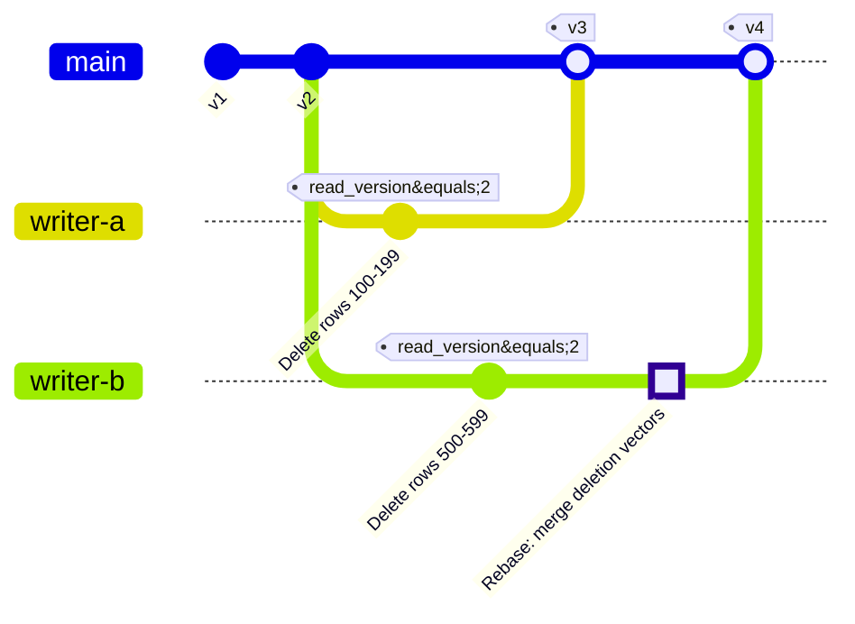
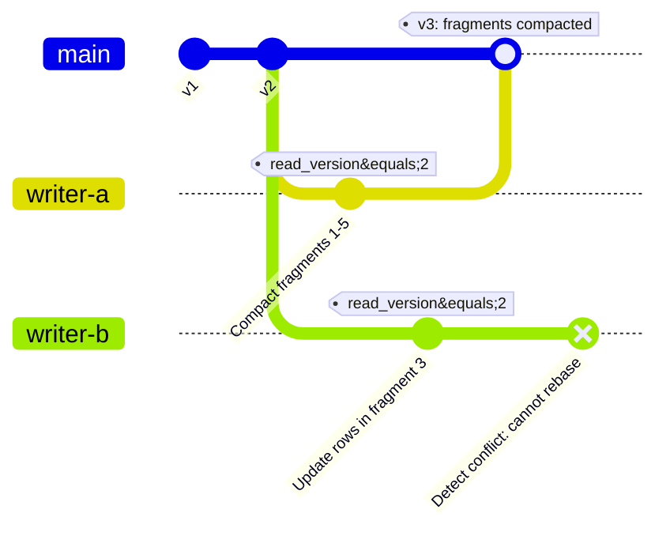
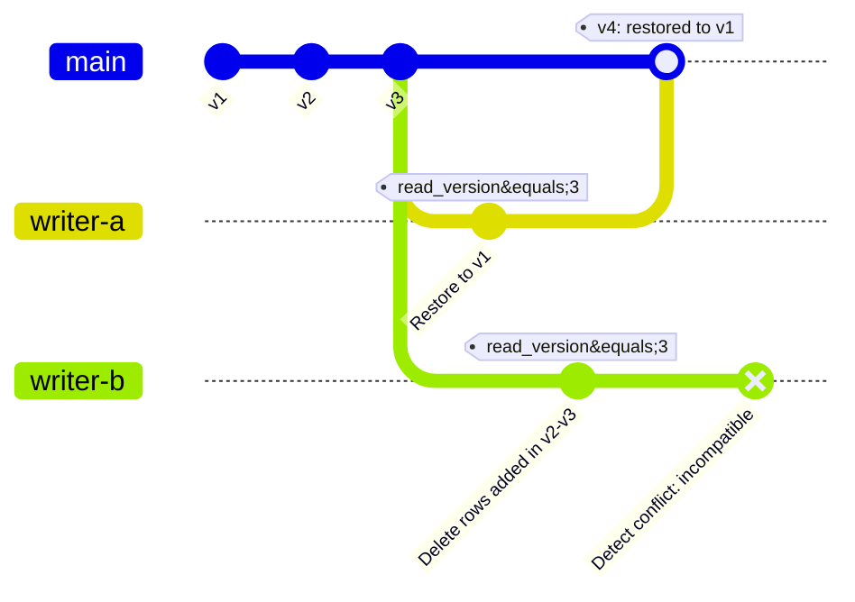
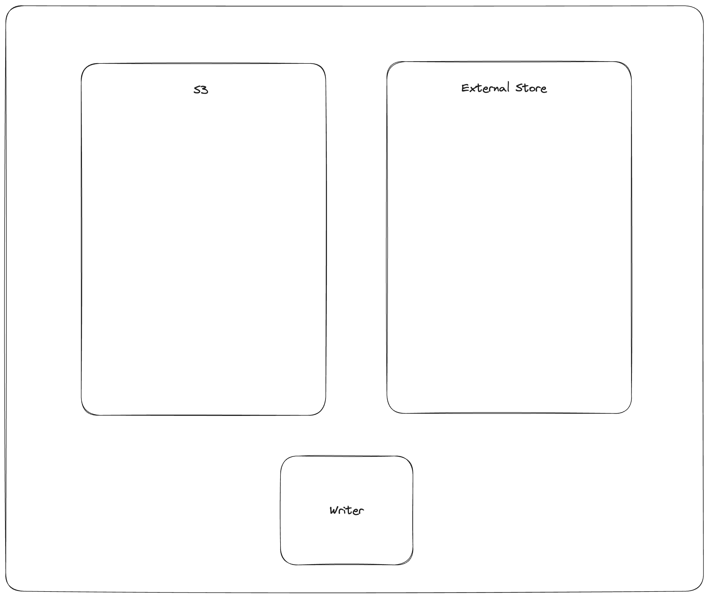
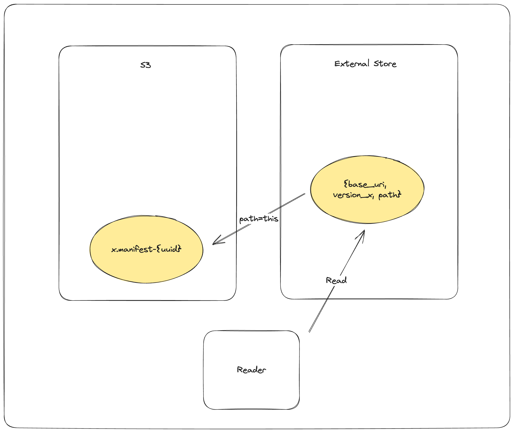

# 事务规范（Transaction Specification）

## 事务概述

Lance 实现了多版本并发控制（Multi-Version Concurrency Control, MVCC）以为并发读写者提供 ACID 事务保证。
每次提交通过原子存储操作创建一个新的不可变表版本。
所有表版本形成一个可序列化的历史记录，支持时间旅行（Time Travel）和模式演进等功能。

事务是 Lance 中变更的基本单位。
事务描述了一组要原子性地应用于创建新表版本的修改。
事务模型通过乐观并发控制（Optimistic Concurrency Control）和自动冲突解决支持并发写入。

## 提交协议（Commit Protocol）

### 存储原语

Lance 提交依赖于底层对象存储提供的原子写操作：

- **rename-if-not-exists**：仅在目标不存在时原子性地重命名文件
- **put-if-not-exists**：仅在文件不存在时原子性地写入文件（也称为 PUT-IF-NONE-MATCH 或条件 PUT）

这些原语保证当多个写入者同时尝试创建相同的清单文件时，恰好只有一个写入者成功。

### 清单命名方案（Manifest Naming Schemes） { #manifest-naming-schemes }

Lance 支持两种清单命名方案：

- **V1**：`{version}.manifest` - 单调递增的版本号（例如 `1.manifest`、`2.manifest`）
- **V2**：`{u64::MAX - version:020}.manifest` - 反向排序的字典序（例如版本 1 对应 `18446744073709551614.manifest`）

V2 方案通过字典序对象列表实现高效的最新版本发现。

### 事务文件

事务文件存储每次提交尝试的序列化事务 protobuf 消息。
这些文件有两个用途：

1. 在并发事务已提交时，支持提交重试期间的清单重建
2. 通过描述执行的操作来支持冲突检测

### 提交算法

提交过程尝试使用上述存储原语原子性地写入新的清单文件。
当并发写入者冲突时，系统加载事务文件来检测冲突，并在可能的情况下尝试变基（Rebase）事务。
如果原子提交失败，过程将使用更新的事务状态重试。
有关冲突检测和解决机制的详细信息，请参阅[冲突解决](#conflict-resolution)部分。

## 事务类型

事务类型的权威规范定义在 [`protos/transaction.proto`](https://github.com/lancedb/lance/blob/main/protos/transaction.proto) 中。

每个事务包含一个 `read_version` 字段，表示构建事务时所基于的表版本，
一个 `uuid` 字段用于唯一标识事务，以及一个 `operation` 字段，指定以下事务类型之一：

在以下部分中，我们将描述每种事务类型及其与其他事务类型的兼容性。这种兼容性并不总是双向的。我们从正在提交的操作的角度来描述。例如，我们说 Append 与 Overwrite 不兼容，意味着如果我们尝试提交一个 Append，而在我们开始 Append 之后已经有一个 Overwrite 被提交了，那么 Append 将失败。另一方面，在描述 Overwrite 操作时，我们说它不与 Append 冲突。这是因为，如果我们尝试提交一个 Overwrite，而在此期间发生了一个 Append 操作，我们仍然允许 Overwrite 继续执行。

### 追加（Append）

在不修改现有数据的情况下向表中添加新片段。
片段 ID 不在事务创建时分配；它们在清单构建期间分配。

<details>
<summary>Append protobuf 消息</summary>

```protobuf
%%% proto.message.Append %%%
```

</details>

#### Append 兼容性

追加操作是最常见的操作之一，设计为与大多数其他操作兼容，甚至包括自身。这是为了确保多个写入者可以追加而不用担心冲突。以下是与追加冲突的操作：

- Overwrite
- Restore
- UpdateMemWalState

### 删除（Delete）

使用删除向量标记行为已删除。
可能更新片段（添加删除向量）或删除整个片段。
`predicate` 字段存储删除条件，支持与并发事务的冲突检测。

<details>
<summary>Delete protobuf 消息</summary>

```protobuf
%%% proto.message.Delete %%%
```

</details>

#### Delete 兼容性

Delete 修改现有片段，因此可能与对重叠片段的其他操作产生冲突。
通常这些冲突是可变基的或可重试的。

以下是与 Delete 冲突的操作：

- Overwrite
- Restore
- UpdateMemWalState

以下操作与 Delete 冲突但可以重试：

- Merge（仅当存在重叠片段时）
- Rewrite（仅当存在重叠片段时）
- DataReplacement（仅当存在重叠片段时）

以下操作与 Delete 冲突但可能可以变基。两个操作的删除掩码将被合并。但是，如果两个操作修改了相同的行，则冲突变为可重试冲突。

- Delete
- Update

### 覆盖（Overwrite）

使用新数据、模式和配置创建或完全覆盖表。

<details>
<summary>Overwrite protobuf 消息</summary>

```protobuf
%%% proto.message.Overwrite %%%
```

</details>

#### Overwrite 兼容性

覆盖操作完全覆盖表。通常，我们不关心自读取版本以来发生了什么。

但是，覆盖不一定重写表配置。因此，我们认为以下是可重试的冲突：

- UpdateConfig（仅当两个操作修改相同的配置键时）
- Overwrite（始终）
- UpdateMemWalState（始终）

### 创建索引（CreateIndex）

添加、替换或移除二级索引（向量索引、标量索引、全文搜索索引）。

<details>
<summary>CreateIndex protobuf 消息</summary>

```protobuf
%%% proto.message.CreateIndex %%%
```

</details>

#### CreateIndex 兼容性

索引记录了哪些片段被索引覆盖，我们不要求所有片段都被覆盖。因此，索引与新片段的并发添加通常是兼容的。这些新片段将只是未被索引的。

更新和删除也与索引创建兼容。这是因为索引引用已删除的行是可以的。这些结果将在索引搜索后被过滤掉。如果发生了更新，旧值将被过滤掉，新值将被视为未索引集的一部分。

如果两个 CreateIndex 操作并发提交，这是允许的。如果索引具有不同的名称，则没有问题。如果索引具有相同的名称，则第二个操作将获胜并替换第一个。

以下操作与索引创建冲突：

- Overwrite
- Restore
- UpdateMemWalState

数据替换操作如果被替换的列正在被索引，将与索引创建冲突。如果被重写的片段被索引覆盖，重写操作将与索引创建冲突。这是因为索引引用行地址，而重写操作会更改行地址。但是，如果使用了片段重用索引（Fragment Reuse Index），或者启用了稳定行 ID 功能，则重写操作与索引创建兼容。因此，以下是与索引创建的可重试冲突：

- Rewrite（仅当存在重叠片段、没有稳定行 ID 且没有片段重用索引时）
- DataReplacement（仅当存在重叠片段且被替换的列正在被索引时）

某些索引是特殊的单例索引（Singleton Index）。例如，片段重用索引和 MemWAL 索引。如果两个修改同一单例索引的操作之间发生冲突，则必须变基操作并合并索引。因此，以下是与索引创建的可变基冲突：

- CreateIndex（仅当两个操作修改同一单例索引时）

### 重写（Rewrite）

在不进行语义修改的情况下重新组织数据。
这包括压缩（Compaction）、碎片整理（Defragmentation）和重新排序等操作。
重写操作会更改行地址，需要更新索引。
在执行 `Rewrite` 事务之前，必须通过 `ReserveFragments` 预留新的片段 ID。

<details>
<summary>Rewrite protobuf 消息</summary>

```protobuf
%%% proto.message.Rewrite %%%
```

</details>

#### Rewrite 兼容性

重写操作不更改数据，但它们可以物化删除操作并替换片段。因此，它们可能与修改正在被重写的片段的其他操作产生冲突。

以下操作与重写冲突：

- Overwrite
- Restore

默认情况下，Rewrite 与 CreateIndex 不兼容，因为该操作将更改 CreateIndex 引用的行地址。但是，片段重用索引或稳定行 ID 功能可以使这些操作兼容。

多个操作会修改现有片段。因此，如果它们修改相同的片段，则可能与 Rewrite 冲突。但是，Merge 是[过于通用的](#overly-general-operations)，因此无法进行冲突检测。因此，以下是与 Rewrite 的可重试冲突：

- Merge（始终）
- DataReplacement（仅当存在重叠片段时）
- Delete（仅当存在重叠片段时）
- Update（仅当存在重叠片段时）
- Rewrite（当存在重叠片段或两者都携带片段重用索引时）
- CreateIndex（存在重叠片段且没有片段重用索引或稳定行 ID 时）

有一种情况 Rewrite 会变基。即当 Rewrite 操作携带片段重用索引且存在正在写入片段重用索引的 CreateIndex 操作时。在这种情况下，Rewrite 将变基并更新其片段重用索引以包含冲突的片段重用索引。

因此，以下是与 Rewrite 的可变基冲突：

- CreateIndex（当 CreateIndex 正在写入片段重用索引且 Rewrite 携带片段重用索引时）

### 合并（Merge）

向表中添加新列，修改模式。
所有片段必须更新以包含新列。

<details>
<summary>Merge protobuf 消息</summary>

```protobuf
%%% proto.message.Merge %%%
```

</details>

#### 过于通用的操作 { #overly-general-operations }

Merge 操作是一个非常通用的操作。操作中提供的片段集将是结果数据集中的最终片段集。因此，它与其他操作的冲突潜力很高。如果可能，应优先使用更具限制性的操作，如 Rewrite、DataReplacement 或 Append，而不是 Merge。

#### Merge 兼容性

如上所述，Merge 是一个非常通用的操作，因此它与其他操作的冲突潜力很高。
以下操作与 Merge 冲突：

- Overwrite
- Restore
- UpdateMemWalState
- Project

以下操作是与 Merge 的可重试冲突：

- Update（始终）
- Append（始终）
- Delete（始终）
- Merge（始终）
- Rewrite（始终）
- DataReplacement（始终）

### 投影（Project）

从表中移除列，修改模式。
这是一个仅元数据的操作；数据文件不会被修改。

<details>
<summary>Project protobuf 消息</summary>

```protobuf
%%% proto.message.Project %%%
```

</details>

#### Project 兼容性

由于 Project 只修改模式，它与大多数其他操作兼容。但是，它与 Merge 不兼容，因为 Merge 操作修改模式（可能添加列），并且当前不存在变基这些更改的逻辑（Project 足够轻量且容易重试）。

以下操作与 Project 冲突：

- Overwrite
- Restore
- UpdateMemWalState

以下操作是与 Project 的可重试冲突：

- Project（始终）
- Merge（始终）

### 恢复（Restore）

将表恢复到之前的版本。

<details>
<summary>Restore protobuf 消息</summary>

```protobuf
%%% proto.message.Restore %%%
```

</details>

#### Restore 兼容性

Restore 操作将表恢复到之前的版本。通常假定它优先于任何其他操作。以下操作与 Restore 冲突：

- UpdateMemWalState

### 预留片段（ReserveFragments）

为将来的 `Rewrite` 操作预分配片段 ID。
这允许重写操作在重写事务提交之前引用片段 ID。

<details>
<summary>ReserveFragments protobuf 消息</summary>

```protobuf
%%% proto.message.ReserveFragments %%%
```

</details>

#### ReserveFragments 兼容性

ReserveFragments 操作相当简单。它唯一更改的是最大片段 ID。因此，这仅与修改最大片段 ID 的操作冲突。以下操作与 ReserveFragments 冲突：

- Overwrite
- Restore

### 克隆（Clone） { #clone }

创建表的浅拷贝或深拷贝。
浅克隆是仅元数据的拷贝，通过 `base_paths` 引用原始数据文件。
深克隆是使用对象存储原生复制操作（例如 S3 CopyObject）的完整拷贝。

<details>
<summary>Clone protobuf 消息</summary>

```protobuf
%%% proto.message.Clone %%%
```

</details>

#### Clone 兼容性

Clone 操作只能是数据集中的第一个操作。如果存在现有数据集，Clone 操作将失败。
因此，不存在与 Clone 的冲突。

### 更新（Update）

修改行值而不添加或删除行。
支持两种执行模式：REWRITE_ROWS 删除当前片段中的行并在新片段中重写它们，这在修改大多数列或只影响少量行时最优；REWRITE_COLUMNS 通过墓碑标记旧列版本来完全重写片段中受影响的列，这在影响大多数行但只修改列的子集时最优。

<details>
<summary>Update protobuf 消息</summary>

```protobuf
%%% proto.message.Update %%%
```

</details>

#### Update 兼容性

以下操作与 Update 冲突：

- Overwrite
- Restore

更新操作既是删除操作也是追加操作。与 Delete 操作类似，它将修改片段以更改删除掩码。因此，与修改相同片段的其他操作之间会存在可重试冲突。以下操作是与 Update 的可重试冲突：

- Rewrite（仅当存在重叠片段时）
- DataReplacement（仅当存在重叠片段时）
- Merge（始终）

与 Delete 类似，Update 操作可以变基对删除掩码的其他修改。以下操作是与 Update 的可变基冲突：

- Delete
- Update

### 更新配置（UpdateConfig）

修改表配置、表元数据、模式元数据或字段元数据而不更改数据。

<details>
<summary>UpdateConfig protobuf 消息</summary>

```protobuf
%%% proto.message.UpdateConfig %%%
```

</details>

#### UpdateConfig 兼容性

UpdateConfig 操作只修改表配置，往往与其他操作兼容。以下操作与 UpdateConfig 冲突：

- Overwrite
- UpdateConfig（仅当两个操作修改相同的配置时）

### 数据替换（DataReplacement）

用新的数据文件替换特定列区域中的数据。

<details>
<summary>DataReplacement protobuf 消息</summary>

```protobuf
%%% proto.message.DataReplacement %%%
```

</details>

#### DataReplacement 兼容性

DataReplacement 操作只替换单个列的数据。因此，它比 Merge 或 Update 操作更安全、更简单。以下操作与 DataReplacement 冲突：

- Overwrite
- Restore
- UpdateMemWalState

以下操作是与 DataReplacement 的可重试冲突：

- DataReplacement（仅当相同字段且片段重叠时）
- CreateIndex（仅当被替换的字段正在被索引时）
- Rewrite（仅当存在重叠片段时）
- Update（仅当存在重叠片段时）
- Merge（始终）

### 更新 MemWal 状态（UpdateMemWalState）

更新 MemWAL 索引的状态（基于预写日志的索引）。

<details>
<summary>UpdateMemWalState protobuf 消息</summary>

```protobuf
%%% proto.message.UpdateMemWalState %%%
```

</details>

### 更新基础路径（UpdateBases）

向表中添加新的基础路径，使其能够引用额外位置中的数据文件。

<details>
<summary>UpdateBases protobuf 消息</summary>

```protobuf
%%% proto.message.UpdateBases %%%
```

</details>

#### UpdateBases 兼容性

UpdateBases 操作只修改基础路径。因此，它只与其他 UpdateBases 操作冲突，而且仅在两个操作具有相同 ID、名称或路径的基础路径时才冲突。

## 冲突解决 { #conflict-resolution }

### 术语

当并发事务尝试针对相同的读取版本提交时，Lance 采用冲突解决来确定事务是否可以共存。
三种可能的结果：

- **可变基（Rebasable）**：事务可以被修改以合并并发更改，同时保留其语义意图。
  事务被转换以适应并发修改，然后在提交层内自动重试提交。

- **可重试（Retryable）**：事务无法变基，但操作可以在应用层使用更新的数据重新执行。
  实现返回可重试冲突错误，通知应用程序应重新读取数据并重试操作。
  重试的操作预期产生语义等效的结果。

- **不兼容（Incompatible）**：事务以根本性的方式冲突，重试将违反操作的假设或产生与预期语义不同的结果。
  提交以不可重试的错误失败。
  如果调用者决定重试，应极其谨慎，因为事务可能产生与最初预期不同的输出。

### 变基机制

`TransactionRebase` 结构跟踪针对并发提交变基事务所需的状态：

1. **片段跟踪**：维护事务读取版本时片段的映射，标记哪些需要重写
2. **修改检测**：跟踪已修改或删除的片段 ID 集合
3. **受影响的行**：对于 Delete 和 Update 操作，存储操作影响的具体行，用于细粒度冲突检测
4. **片段重用索引**：从并发 Rewrite 操作中累积片段重用索引元数据

当检测到并发事务时，变基过程：

1. 比较片段修改以确定是否存在重叠
2. 对于 Delete/Update 操作，比较 `affected_rows` 以检测是否修改了相同的行
3. 当两个事务都从同一片段删除行时合并删除向量
4. 当并发 Rewrite 更改片段 ID 时累积片段重用索引更新
5. 如果可变基则修改事务，否则返回可重试/不兼容冲突错误

### 冲突场景

#### 可变基冲突示例

以下图表说明了两个 Delete 操作修改同一片段中不同行的可变基冲突：



在此场景中：

- 写入者 A 删除第 100-199 行并成功提交版本 3
- 写入者 B 尝试提交但检测到版本 3 已存在
- 写入者 B 的事务是可变基的，因为它只修改了删除向量（而非数据文件）且 `affected_rows` 没有重叠
- 写入者 B 通过合并写入者 A 的删除向量和自己的删除向量进行变基，并写入存储
- 写入者 B 成功提交版本 4

#### 可重试冲突示例

以下图表说明了 Update 操作遇到并发 Rewrite（压缩）导致无法自动变基的可重试冲突：



在此场景中：

- 写入者 A 将片段 1-5 压缩为单个片段并成功提交版本 3
- 写入者 B 尝试更新片段 3 中的行但检测到版本 3 已存在
- 写入者 B 的 Update 事务是可重试但不可变基的：压缩后片段 3 不再存在
- 提交层返回可重试冲突错误
- 应用程序必须针对版本 3 重新执行 Update 操作，在新的压缩片段中定位行

#### 不兼容冲突示例

以下图表说明了 Delete 操作遇到并发 Restore 从根本上使操作无效的不兼容冲突：



在此场景中：

- 写入者 A 将表恢复到版本 1 并成功提交版本 4
- 写入者 B 尝试删除在版本 2 和 3 之间添加的行
- 写入者 B 的 Delete 事务不兼容：表已恢复到版本 1，它打算删除的行不再存在
- 提交以不可重试的错误失败
- 如果调用者针对版本 4 重试删除操作，它要么不删除任何行（如果这些行在 v1 中不存在），要么删除不同的行（如果 v1 中存在类似的行 ID），产生与最初预期语义不同的结果

## 外部清单存储（External Manifest Store）

如果底层对象存储不支持原子操作（rename-if-not-exists 或 put-if-not-exists），可以使用外部清单存储来支持并发写入者。

外部清单存储是一个支持 put-if-not-exists 操作的键值存储。
外部清单存储补充但不替代对象存储中的清单。
不知道外部清单存储的读取器仍然可以读取表，但可能观察到比真正最新版本落后最多一个提交的版本。

### 使用外部存储的提交过程

提交过程遵循四步协议：



1. **暂存清单**：`PUT_OBJECT_STORE {dataset}/_versions/{version}.manifest-{uuid}`
   - 将新清单写入对象存储中由新 UUID 确定的唯一路径
   - 此暂存清单尚不可被读取器看到

2. **提交到外部存储**：`PUT_EXTERNAL_STORE base_uri, version, {dataset}/_versions/{version}.manifest-{uuid}`
   - 使用 put-if-not-exists 将暂存清单的路径原子性地提交到外部存储
   - 此步骤后提交实际上已完成
   - 如果此操作由于冲突而失败，则另一个写入者已提交此版本

3. **在对象存储中完成**：`COPY_OBJECT_STORE {dataset}/_versions/{version}.manifest-{uuid} → {dataset}/_versions/{version}.manifest`
   - 将暂存清单复制到最终路径
   - 这使不知道外部存储的读取器也能发现清单

4. **更新外部存储指针**：`PUT_EXTERNAL_STORE base_uri, version, {dataset}/_versions/{version}.manifest`
   - 更新外部存储使其指向已完成的清单路径
   - 完成外部存储和对象存储之间的同步

**容错：**

如果写入者在步骤 2 之后但在步骤 4 之前失败，外部存储和对象存储暂时不同步。
读取器检测到此状态并尝试完成同步。
如果同步失败，读取器拒绝加载以确保数据集的可移植性。

### 使用外部存储的读取过程

读取器遵循验证和同步协议：



1. **查询外部存储**：`GET_EXTERNAL_STORE base_uri, version` → `path`
   - 检索请求版本的清单路径
   - 如果路径不以 UUID 结尾，直接返回（同步已完成）
   - 如果路径以 UUID 结尾，需要同步

2. **同步到对象存储**：`COPY_OBJECT_STORE {dataset}/_versions/{version}.manifest-{uuid} → {dataset}/_versions/{version}.manifest`
   - 尝试完成暂存清单
   - 此操作是幂等的

3. **更新外部存储**：`PUT_EXTERNAL_STORE base_uri, version, {dataset}/_versions/{version}.manifest`
   - 更新外部存储以反映已完成的路径
   - 未来的读取器将看到已同步的状态

4. **返回已完成的路径**：返回 `{dataset}/_versions/{version}.manifest`
   - 始终返回已完成的路径
   - 如果同步失败，返回错误以防止读取不一致状态

此协议确保使用外部清单存储的数据集保持可移植性：复制数据集目录可保存所有数据，无需外部存储。
