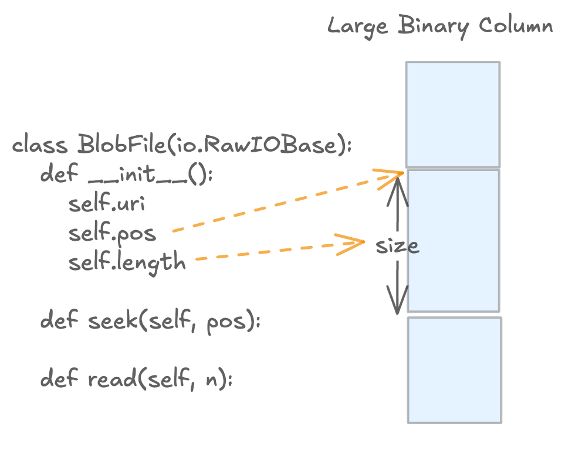

# Blob 列

Lance 通过 blob 列支持大型二进制对象（图像、视频、音频、模型制品）。Blob 访问是延迟的：读取操作返回 `BlobFile` 句柄，调用者可以按需流式读取字节。



## 本页内容

本页聚焦于 Python blob 工作流，使用 Lance 文件格式术语。

- `data_storage_version` 指数据集的 Lance **文件格式版本**。
- 数据集的 `data_storage_version` 一旦创建就固定不变。
- 如果你需要不同的文件格式版本，请写入一个**新数据集**。

## 快速开始（Blob v2）

```python
import lance
import pyarrow as pa
from lance import blob_array, blob_field

schema = pa.schema([
    pa.field("id", pa.int64()),
    blob_field("blob"),
])

table = pa.table(
    {
        "id": [1],
        "blob": blob_array([b"hello blob v2"]),
    },
    schema=schema,
)

ds = lance.write_dataset(table, "./blobs_v22.lance", data_storage_version="2.2")

blob = ds.take_blobs("blob", indices=[0])[0]
with blob as f:
    assert f.read() == b"hello blob v2"
```

## 版本兼容性（唯一真实来源）

| 数据集 `data_storage_version` | 旧版 blob 元数据（`lance-encoding:blob`） | Blob v2（`lance.blob.v2`） |
|---|---|---|
| `0.1`, `2.0`, `2.1` | 支持读写 | 不支持 |
| `2.2+` | 不支持写入 | 支持读写（推荐） |

重要提示：

- 对于文件格式 `>= 2.2`，写入时会拒绝旧版 blob 元数据（`lance-encoding:blob`）。

## Blob v2 写入模式

使用 `blob_field` 和 `blob_array` 构建 blob v2 列。

```python
import lance
import pyarrow as pa
from lance import Blob, blob_array, blob_field

schema = pa.schema([
    pa.field("id", pa.int64()),
    blob_field("blob", nullable=True),
])

# A single column can mix:
# - inline bytes
# - external URI
# - external URI slice (position + size)
# - null
rows = pa.table(
    {
        "id": [1, 2, 3, 4],
        "blob": blob_array([
            b"inline-bytes",
            "s3://bucket/path/video.mp4",
            Blob.from_uri("s3://bucket/archive.tar", position=4096, size=8192),
            None,
        ]),
    },
    schema=schema,
)

ds = lance.write_dataset(
    rows,
    "./blobs_v22.lance",
    data_storage_version="2.2",
)
```

注意：

- 默认情况下，外部 blob URI 必须映射到已注册的非数据集根基础路径。
- 如果你需要引用这些基础路径之外的外部对象，请在写入时设置 `allow_external_blob_outside_bases=True`。

### 示例：打包外部 blob（单个容器文件）

```python
import io
import tarfile
from pathlib import Path
import lance
import pyarrow as pa
from lance import Blob, blob_array, blob_field

# Build a tar file with three payloads
payloads = {
    "a.bin": b"alpha",
    "b.bin": b"bravo",
    "c.bin": b"charlie",
}

with tarfile.open("container.tar", "w") as tf:
    for name, data in payloads.items():
        info = tarfile.TarInfo(name)
        info.size = len(data)
        tf.addfile(info, io.BytesIO(data))

# Capture offset/size for each member
blob_values = []
with tarfile.open("container.tar", "r") as tf:
    container_uri = Path("container.tar").resolve().as_uri()
    for name in payloads:
        m = tf.getmember(name)
        blob_values.append(Blob.from_uri(container_uri, position=m.offset_data, size=m.size))

schema = pa.schema([
    pa.field("name", pa.utf8()),
    blob_field("blob"),
])

rows = pa.table(
    {
        "name": list(payloads.keys()),
        "blob": blob_array(blob_values),
    },
    schema=schema,
)

ds = lance.write_dataset(
    rows,
    "./packed_blobs_v22.lance",
    data_storage_version="2.2",
    allow_external_blob_outside_bases=True,
)
```

## Blob v2 读取模式

使用 `take_blobs` 获取文件类句柄。必须精确提供一个选择器：`ids`、`indices` 或 `addresses`。

| 选择器 | 典型用途 | 稳定性 |
|---|---|---|
| `indices` | 在单个数据集快照内的位置读取 | 在该快照内稳定 |
| `ids` | 基于逻辑行 ID 的读取 | 稳定的逻辑标识（当行 ID 可用时） |
| `addresses` | 底层物理读取和调试 | 不稳定的物理位置 |

### 按行索引读取

```python
import lance

ds = lance.dataset("./blobs_v22.lance")
blobs = ds.take_blobs("blob", indices=[0, 1])

with blobs[0] as f:
    data = f.read()
```

### 按行 ID 读取

```python
import lance

ds = lance.dataset("./blobs_v22.lance")
row_ids = ds.to_table(columns=[], with_row_id=True).column("_rowid").to_pylist()

blobs = ds.take_blobs("blob", ids=row_ids[:2])
```

### 按行地址读取

```python
import lance

ds = lance.dataset("./blobs_v22.lance")
row_addrs = ds.to_table(columns=[], with_row_address=True).column("_rowaddr").to_pylist()

blobs = ds.take_blobs("blob", addresses=row_addrs[:2])
```

### 示例：延迟解码视频帧

```python
import av
import lance

ds = lance.dataset("./videos_v22.lance")
blob = ds.take_blobs("video", indices=[0])[0]

start_ms, end_ms = 500, 1000

with av.open(blob) as container:
    stream = container.streams.video[0]
    stream.codec_context.skip_frame = "NONKEY"

    start = (start_ms / 1000) / stream.time_base
    end = (end_ms / 1000) / stream.time_base
    container.seek(int(start), stream=stream)

    for frame in container.decode(stream):
        if frame.time is not None and frame.time > end_ms / 1000:
            break
        # process frame
        pass
```

## 旧版兼容性附录（`data_storage_version` <= `2.1`）

如果你需要继续写入旧版 blob 列，请使用文件格式 `0.1`、`2.0` 或 `2.1`，并使用 `lance-encoding:blob = true` 标记 `LargeBinary` 字段。

```python
import lance
import pyarrow as pa

schema = pa.schema([
    pa.field("id", pa.int64()),
    pa.field(
        "video",
        pa.large_binary(),
        metadata={"lance-encoding:blob": "true"},
    ),
])

table = pa.table(
    {
        "id": [1, 2],
        "video": [b"foo", b"bar"],
    },
    schema=schema,
)

ds = lance.write_dataset(
    table,
    "./legacy_blob_dataset",
    data_storage_version="2.1",
)
```

此写入模式对 `data_storage_version >= 2.2` 无效。对于新数据集，请优先使用 blob v2。

## 重写为新的 Blob v2 数据集

如果你当前的数据集使用旧版 blob 且你想要 blob v2，请以 `data_storage_version="2.2"` 重写到新数据集中。

```python
import lance
import pyarrow as pa
from lance import blob_array, blob_field

legacy = lance.dataset("./legacy_blob_dataset")
raw = legacy.scanner(columns=["id", "video"], blob_handling="all_binary").to_table()

new_schema = pa.schema([
    pa.field("id", pa.int64()),
    blob_field("video"),
])

rewritten = pa.table(
    {
        "id": raw.column("id"),
        "video": blob_array(raw.column("video").to_pylist()),
    },
    schema=new_schema,
)

lance.write_dataset(
    rewritten,
    "./blob_v22_dataset",
    data_storage_version="2.2",
)
```

警告：

- 上面的示例将二进制数据加载到内存中（`blob_handling="all_binary"` 和 `to_pylist()`）。
- 对于大型数据集，建议使用分块/批量重写管道。

## 故障排除

### "Blob v2 requires file version >= 2.2"

原因：

- 你正在向低于 `2.2` 的数据集/文件格式写入 blob v2 值。

修复：

- 写入以 `data_storage_version="2.2"`（或更新版本）创建的数据集。

### "Legacy blob columns ... are not supported for file version >= 2.2"

原因：

- 你在写入 `2.2+` 数据时使用了旧版 blob 元数据（`lance-encoding:blob`）。

修复：

- 将旧版基于元数据的列替换为 blob v2 列（`blob_field` / `blob_array`）。

### "Exactly one of ids, indices, or addresses must be specified"

原因：

- `take_blobs` 未收到选择器或收到了多个选择器。

修复：

- 精确提供 `ids`、`indices` 或 `addresses` 中的一个。
