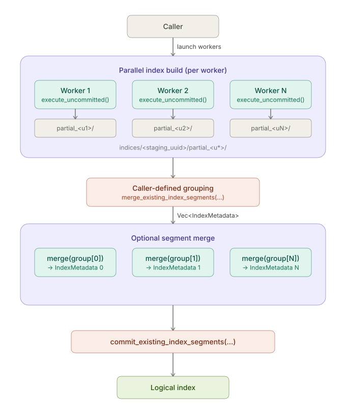

# 分布式索引构建

!!! warning
    Lance 公开了可集成到外部分布式索引构建工作流中的公共 API，但 Lance 本身不提供完整的分布式调度器或端到端编排层。

    本页描述了当前模型、术语和执行流程，以便调用者可以正确集成这些 API。

## 概述

Lance 中的分布式索引构建遵循与分布式写入相同的高层模式：

1. 多个工作节点并行构建索引数据
2. 调用者为一次分布式构建调用 Lance 段构建（Segment Build）API
3. Lance 从调用者提供的工作节点输出中规划和构建索引制品
4. 构建的制品被提交到数据集清单（Manifest）中

对于向量索引，工作节点输出是直接存储在 `indices/<segment_uuid>/` 下的段。Lance 可以将这些输出转换为一个或多个物理段，然后将它们作为一个逻辑索引提交。



## 术语

本指南始终使用以下术语：

- **段（Segment）**：由 `execute_uncommitted()` 写入 `indices/<segment_uuid>/` 下的一个工作节点输出
- **物理段（Physical Segment）**：一个准备提交到清单中的索引段
- **逻辑索引（Logical Index）**：用户可见的按名称标识的索引；一个逻辑索引可能包含一个或多个物理段

例如，一次分布式向量构建可能创建如下布局：

```text
indices/<segment_uuid_0>/
├── index.idx
└── auxiliary.idx

indices/<segment_uuid_1>/
├── index.idx
└── auxiliary.idx

indices/<segment_uuid_2>/
├── index.idx
└── auxiliary.idx
```

段构建后，Lance 生成一个或多个段目录：

```text
indices/<physical_segment_uuid_0>/
├── index.idx
└── auxiliary.idx

indices/<physical_segment_uuid_1>/
├── index.idx
└── auxiliary.idx
```

这些物理段随后作为一个逻辑索引一起提交。在常见的无合并情况下，输入段已经是物理段，`build_all()` 会原样返回它们。

## 角色

分布式索引构建涉及两方：

- **工作节点**构建段
- **调用者**启动工作节点，选择如何将这些段转换为物理段，提供段构建 API 请求的任何额外输入，并提交最终结果

Lance 不提供分布式调度器。调用者负责启动工作节点和驱动整体工作流。

## 当前模型

当前分布式向量索引构建模型有两层并行性。

### 工作节点构建

首先，多个工作节点并行构建段：

1. 在每个工作节点上，调用片段构建 API，例如 `create_index_builder(...).fragments(...).execute_uncommitted()` 或 Python `create_index_uncommitted(..., fragment_ids=...)`
2. 每个工作节点在 `indices/<segment_uuid>/` 下写入一个段

### 段合并

然后调用者决定这些现有段是按原样提交还是合并为更大的段：

1. 保持工作节点输出不变，使用 `commit_existing_index_segments(...)` 直接提交，或
2. 对每个调用者定义的分组调用 `merge_existing_index_segments(...)` 分组一个或多个现有段
3. 使用 `commit_existing_index_segments(...)` 提交最终的段列表

在单次提交中，构建的段必须具有不重叠的片段覆盖范围。

## 内部 Finalize 模型

在内部，Lance 将分布式向量段构建建模为：

1. 每个工作节点**构建**一个未提交的段
2. **可选合并**调用者定义的现有段分组
3. 将结果段作为一个逻辑索引**提交**

合并步骤直接由 `execute_uncommitted()` 返回的 `IndexMetadata` 驱动。

这是有意的存储级模型：

- 段是尚未发布的工作节点输出
- 物理段是清单引用的持久化制品
- 逻辑索引标识仅在提交时附加

## 段分组

调用者选择最终的段分组：

- 保持段边界，每个工作节点输出直接提交
- 在提交前将多个现有段合并为更大的段

分组决策与工作节点构建分离。工作节点只构建段；Lance 在规划物理段时应用段构建策略。

## 职责边界

调用者应了解：

- 哪个分布式构建已准备好进行段构建
- 工作节点构建返回的段元数据
- 结果物理段应如何发布

Lance 负责：

- 写入段制品
- 从提供的段集规划物理段
- 将段存储合并为物理段制品
- 将物理段提交到清单

如果暂存根目录或已构建的段目录从未被提交，它将作为 `_indices/` 下未引用的索引目录保留。这些制品由 `cleanup_old_versions(...)` 使用与其他未引用索引文件相同的基于时间的规则进行清理。

这种拆分将分布式调度保持在存储引擎之外，同时仍让 Lance 拥有磁盘上的索引格式。
