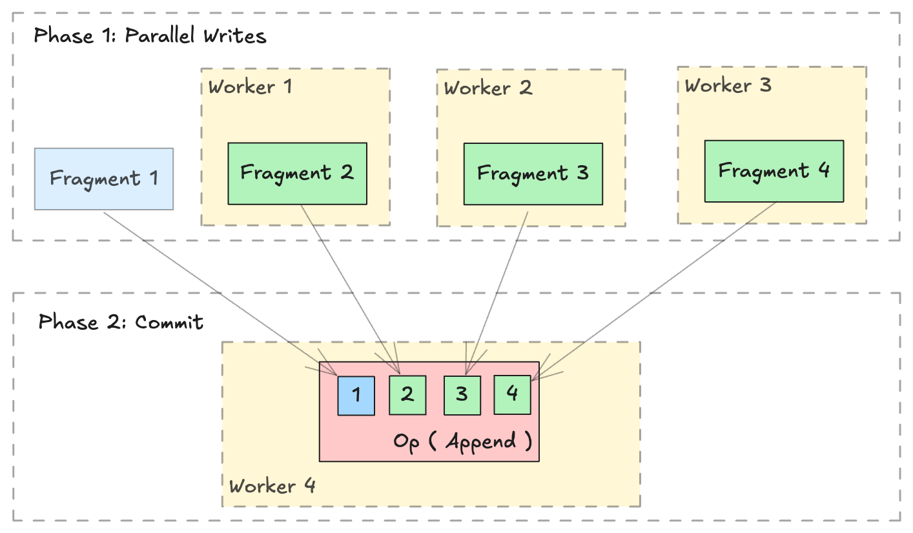

# 分布式写入

!!! warning
    Lance 提供了开箱即用的 [Ray](https://github.com/lance-format/lance-ray) 和 [Spark](https://github.com/lance-format/lance-spark) 集成。

    本页面面向希望以自定义方式执行分布式操作的用户，例如使用 `slurm` 或 `Kubernetes` 而不使用 Lance 集成。

## 概述

[Lance 格式](../format/index.md)旨在支持跨多个分布式工作节点的并行写入。分布式写入操作可以通过两个阶段完成：

1. **并行写入**：在多个工作节点上并行生成新的 `lance.LanceFragment`。
2. **提交**：收集所有 `lance.FragmentMetadata` 并通过单个 `lance.LanceOperation` 提交到单个数据集中。



## 写入新数据

使用 `lance.fragment.write_fragments` 写入或追加新数据非常简单。

```python
import json
from lance.fragment import write_fragments

# Run on each worker
data_uri = "./dist_write"
schema = pa.schema([
    ("a", pa.int32()),
    ("b", pa.string()),
])

# Run on worker 1
data1 = {
    "a": [1, 2, 3],
    "b": ["x", "y", "z"],
}
fragments_1 = write_fragments(data1, data_uri, schema=schema)
print("Worker 1: ", fragments_1)

# Run on worker 2
data2 = {
    "a": [4, 5, 6],
    "b": ["u", "v", "w"],
}
fragments_2 = write_fragments(data2, data_uri, schema=schema)
print("Worker 2: ", fragments_2)
```

输出：
```
Worker 1:  [FragmentMetadata(id=0, files=...)]
Worker 2:  [FragmentMetadata(id=0, files=...)]
```

现在，使用 `lance.fragment.FragmentMetadata.to_json` 序列化片段元数据，并在单个工作节点上收集所有序列化的元数据以执行最终的提交操作。

```python
import json
from lance import FragmentMetadata, LanceOperation

# Serialize Fragments into JSON data
fragments_json1 = [json.dumps(fragment.to_json()) for fragment in fragments_1]
fragments_json2 = [json.dumps(fragment.to_json()) for fragment in fragments_2]

# On one worker, collect all fragments
all_fragments = [FragmentMetadata.from_json(f) for f in \
    fragments_json1 + fragments_json2]

# Commit the fragments into a single dataset
# Use LanceOperation.Overwrite to overwrite the dataset or create new dataset.
op = lance.LanceOperation.Overwrite(schema, all_fragments)
read_version = 0 # Because it is empty at the time.
lance.LanceDataset.commit(
    data_uri,
    op,
    read_version=read_version,
)

# We can read the dataset using the Lance API:
dataset = lance.dataset(data_uri)
assert len(dataset.get_fragments()) == 2
assert dataset.version == 1
print(dataset.to_table().to_pandas())
```

输出：
```
     a  b
0  1  x
1  2  y
2  3  z
3  4  u
4  5  v
5  6  w
```

## 追加数据

追加额外数据遵循类似的流程。使用 `lance.LanceOperation.Append` 提交新片段，确保 `read_version` 设置为当前数据集的版本。

```python
import lance

ds = lance.dataset(data_uri)
read_version = ds.version # record the read version

op = lance.LanceOperation.Append(all_fragments)
lance.LanceDataset.commit(
    data_uri,
    op,
    read_version=read_version,
)
```

## 添加新列

[Lance 格式擅长添加列等操作](../format/index.md)。得益于其二维布局（[参见此博客文章](https://blog.lancedb.com/designing-a-table-format-for-ml-workloads/)），添加新列非常高效，因为它避免了复制现有数据文件。相反，该过程只需创建新的数据文件，并使用仅元数据操作将它们链接到现有数据集。

```python
import lance
from pyarrow import RecordBatch
import pyarrow.compute as pc

dataset = lance.dataset("./add_columns_example")
assert len(dataset.get_fragments()) == 2
assert dataset.to_table().combine_chunks() == pa.Table.from_pydict({
    "name": ["alice", "bob", "charlie", "craig", "dave", "eve"],
    "age": [25, 33, 44, 55, 66, 77],
}, schema=schema)


def name_len(names: RecordBatch) -> RecordBatch:
    return RecordBatch.from_arrays(
        [pc.utf8_length(names["name"])],
        ["name_len"],
    )

# On Worker 1
frag1 = dataset.get_fragments()[0]
new_fragment1, new_schema = frag1.merge_columns(name_len, ["name"])

# On Worker 2
frag2 = dataset.get_fragments()[1]
new_fragment2, _ = frag2.merge_columns(name_len, ["name"])

# On Worker 3 - Commit
all_fragments = [new_fragment1, new_fragment2]
op = lance.LanceOperation.Merge(all_fragments, schema=new_schema)
lance.LanceDataset.commit(
    "./add_columns_example",
    op,
    read_version=dataset.version,
)

# Verify dataset
dataset = lance.dataset("./add_columns_example")
print(dataset.to_table().to_pandas())
```

输出：
```
      name  age  name_len
0    alice   25         5
1      bob   33         3
2  charlie   44         7
3    craig   55         5
4     dave   66         4
5      eve   77         3
```

## 更新列

目前，Lance 支持片段级别的更新列功能，以分布式方式更新现有列。

此操作通过 `left_on` 和 `right_on` 指定的列对右表（新数据）执行左外哈希连接（Left-Outer-Hash-Join）。对于当前片段中的每一行，更新后的列值为：
1. 如果右侧没有匹配行，则使用左侧行的列值。
2. 如果右侧恰好有一个对应行，则使用匹配行的列值。
3. 如果有多个对应行，则使用随机行的列值。

```python
import lance
import pyarrow as pa

# Create initial dataset with two fragments
# First fragment
data1 = pa.table(
    {
        "id": [1, 2, 3, 4],
        "name": ["Alice", "Bob", "Charlie", "David"],
        "score": [85, 90, 75, 80],
    }
)
dataset_uri = "./my_dataset.lance"
dataset = lance.write_dataset(data1, dataset_uri)

# Second fragment
data2 = pa.table(
    {
        "id": [5, 6, 7, 8],
        "name": ["Eve", "Frank", "Grace", "Henry"],
        "score": [88, 92, 78, 82],
    }
)
dataset = lance.write_dataset(data2, dataset_uri, mode="append")

# Prepare update data for fragment 0 using 'id' as join key
update_data1 = pa.table(
    {
        "id": [1, 3],
        "name": ["Alan", "Chase"],
        "score": [95, 85],
    }
)

# Prepare update data for fragment 1
update_data2 = pa.table(
    {
        "id": [5, 7],
        "name": ["Eva", "Gracie"],
        "score": [98, 88],
    }
)

# Update fragment 0
fragment0 = dataset.get_fragment(0)
updated_fragment0, fields_modified0 = fragment0.update_columns(
    update_data1, left_on="id", right_on="id"
)

# Update fragment 1
fragment1 = dataset.get_fragment(1)
updated_fragment1, fields_modified1 = fragment1.update_columns(
    update_data2, left_on="id", right_on="id"
)

union_fields_modified = list(set(fields_modified0 + fields_modified1))
# Commit the changes for both fragments
op = lance.LanceOperation.Update(
    updated_fragments=[updated_fragment0, updated_fragment1],
    fields_modified=union_fields_modified,
)
updated_dataset = lance.LanceDataset.commit(
    str(dataset_uri), op, read_version=dataset.version
)

# Verify the update
dataset = lance.dataset(dataset_uri)
print(dataset.to_table().to_pandas())
```

输出：
```
   id    name  score
0   1    Alan     95
1   2     Bob     90
2   3   Chase     85
3   4   David     80
4   5     Eva     98
5   6   Frank     92
6   7  Gracie     88
7   8   Henry     82
```
