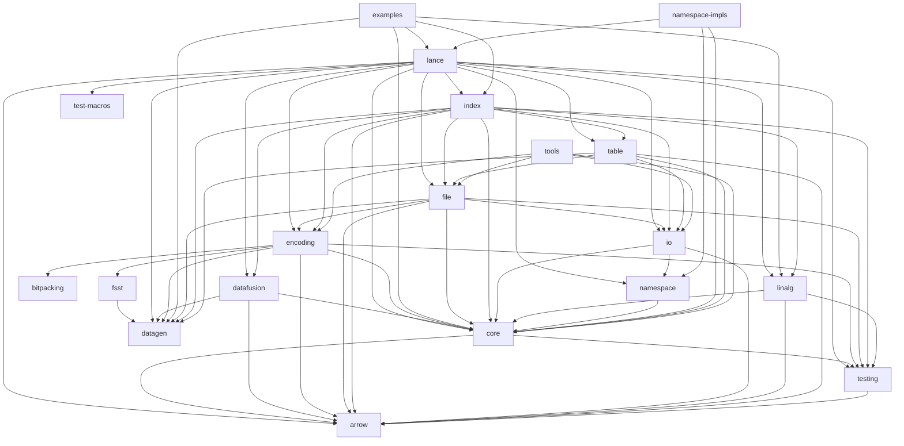

# Lance Rust Workspace

Where core rust code lance lives.

## Architecture

The Lance project is organized as a Rust workspace with multiple crates that work together to provide the columnar data format implementation.

### Dependency Graph

<!-- BEGIN_CARGO_DIAGRAM -->
<!-- This section is auto-generated. Run `python ci/update_rust_readme.py` to update. -->

<!-- END_CARGO_DIAGRAM -->

<!-- BEGIN_CARGO_CRATE_LIST -->
<!-- This section is auto-generated. Run `python ci/update_rust_readme.py` to update. -->
## Workspace Crates

- **fsst** (`rust/compression/fsst/`) - FSST string compression for Lance
- **lance** (`rust/lance/`) - A columnar data format that is 100x faster than Parquet for random access.
- **lance-arrow** (`rust/lance-arrow/`) - Arrow Extension for Lance
- **lance-bitpacking** (`rust/compression/bitpacking/`) - Vendored copy of https://github.com/spiraldb/fastlanes for use in Lance
- **lance-core** (`rust/lance-core/`) - Lance Columnar Format -- Core Library
- **lance-datafusion** (`rust/lance-datafusion/`) - Internal utilities used by other lance modules to simplify working with datafusion
- **lance-datagen** (`rust/lance-datagen/`) - A columnar data format that is 100x faster than Parquet for random access.
- **lance-encoding** (`rust/lance-encoding/`) - Encoders and decoders for the Lance file format
- **lance-examples** (`rust/examples/`) - Lance examples in Rust
- **lance-file** (`rust/lance-file/`) - Utilities for the Lance file format
- **lance-index** (`rust/lance-index/`) - Lance indices implementation
- **lance-io** (`rust/lance-io/`) - I/O utilities for Lance
- **lance-linalg** (`rust/lance-linalg/`) - A columnar data format that is 100x faster than Parquet for random access.
- **lance-namespace** (`rust/lance-namespace/`) - Lance Namespace Core APIs
- **lance-namespace-impls** (`rust/lance-namespace-impls/`) - Lance Namespace Implementations
- **lance-table** (`rust/lance-table/`) - Utilities for the Lance table format
- **lance-test-macros** (`rust/lance-test-macros/`) - A columnar data format that is 100x faster than Parquet for random access.
- **lance-testing** (`rust/lance-testing/`) - A columnar data format that is 100x faster than Parquet for random access.
- **lance-tools** (`rust/lance-tools/`) - Tools for interacting with Lance files and tables
<!-- END_CARGO_CRATE_LIST -->

## Updating This README

To update the dependency graph and crate list, run:

```bash
python scripts/update_rust_readme.py
```
