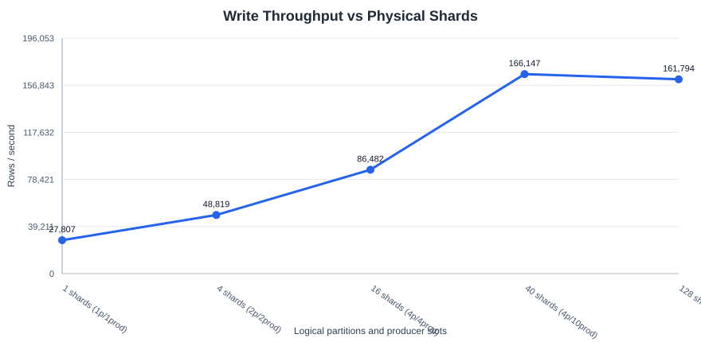
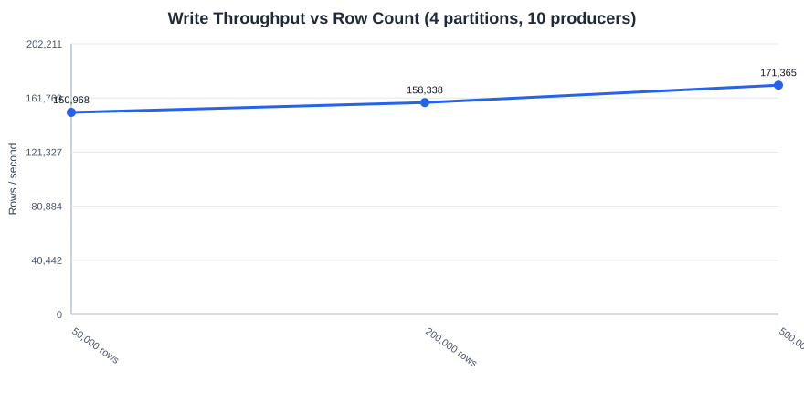
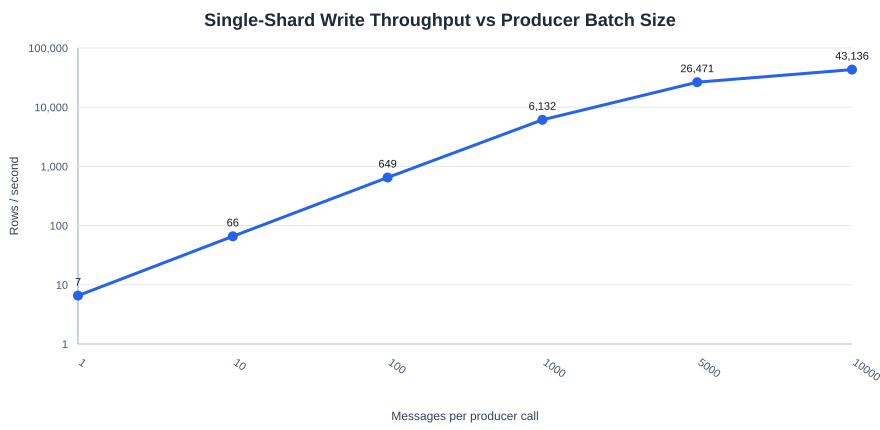
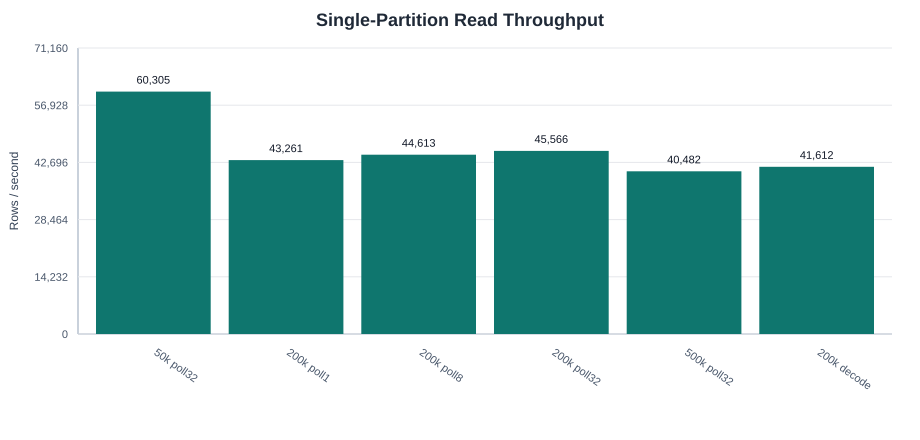

# Lance Topic Storage-Only S3 Benchmark Report

Run date: 2026-05-01

## Setup

- Host: EC2 `c7i.8xlarge` in `us-east-1`, Ubuntu 24.04, repository Rust toolchain 1.94.0.
- Storage: `s3://lance-bench-054483968661-shared/codex/lance_topic_storage_20260501_105034`.
- Payload: fixed JSON payload with a 256-byte body string.
- Repeats: 2 per case. Tables and graphs below use the arithmetic mean.
- Topic model: storage-only Lance table plus MemWAL shards. Physical shard count is `logical_partition_count * producer_count`.

`batch_size` is the number of messages passed to one producer call. `send(id, payload)` is equivalent to `batch_size = 1` and acknowledges after that single message is committed to WAL. `send_batch(ids, payloads)` acknowledges after the corresponding WAL entry or entries are committed; if a batch routes to multiple logical partitions, the producer writes one WAL entry per nonempty physical shard.

## Write Results

### Horizontal Scaling

| Case | Logical partitions | Producer slots | Physical shards | Rows/s avg | Speedup |
| --- | --- | --- | --- | --- | --- |
| horizontal_p1_prod1 | 1 | 1 | 1 | 27,807 | 1.00x |
| horizontal_p2_prod2 | 2 | 2 | 4 | 48,819 | 1.76x |
| horizontal_p4_prod4 | 4 | 4 | 16 | 86,482 | 3.11x |
| horizontal_p4_prod10 | 4 | 10 | 40 | 166,147 | 5.97x |
| horizontal_p8_prod16 | 8 | 16 | 128 | 161,794 | 5.82x |

The 4-partition/10-producer case reached 166,147 rows/s, a 5.97x speedup over one physical shard. The 8-partition/16-producer case did not improve further in this run, which suggests object-store request overhead and local scheduling became the limiting factors before 128 physical shards.

### Row Count Trend

| Rows | WAL entries avg | Rows/s avg | Input MiB/s avg |
| --- | --- | --- | --- |
| 50,000 | 40 | 150,968 | 46.73 |
| 200,000 | 160 | 158,338 | 49.21 |
| 500,000 | 400 | 171,365 | 53.37 |

Throughput stayed consistent or improved as rows increased from 50k to 500k, so the horizontal result is not just an initial burst.

### Single-Shard Batch Sweep

| Batch size | Rows | WAL entries avg | Rows/s avg | WAL MiB/s avg |
| --- | --- | --- | --- | --- |
| 1 | 2,000 | 2000 | 7 | 0.011 |
| 10 | 20,000 | 2000 | 66 | 0.030 |
| 100 | 100,000 | 1000 | 649 | 0.228 |
| 1000 | 200,000 | 200 | 6,132 | 2.090 |
| 5000 | 500,000 | 100 | 26,471 | 9.015 |
| 10000 | 500,000 | 50 | 43,136 | 14.686 |

The single-shard result is object-write dominated. One message per WAL entry was about 6.6 rows/s. With 10k messages per producer call, the same single physical shard reached 43,136 rows/s.

## Read Results

| Case | Rows | Poll entries | Decode payload | Rows/s avg | Polls avg |
| --- | --- | --- | --- | --- | --- |
| read_prod1_50k_poll32 | 50,000 | 32 | false | 60,305 | 1.0 |
| read_prod1_200k_poll1 | 200,000 | 1 | false | 43,261 | 40.0 |
| read_prod1_200k_poll8 | 200,000 | 8 | false | 44,613 | 5.0 |
| read_prod1_200k_poll32 | 200,000 | 32 | false | 45,566 | 2.0 |
| read_prod1_500k_poll32 | 500,000 | 32 | false | 40,482 | 4.0 |
| read_decode_prod1_200k_poll32 | 200,000 | 32 | true | 41,612 | 2.0 |

Single-partition reads were roughly 40k-60k rows/s from S3 in this matrix. Increasing `poll_entries` reduced the number of polls but did not materially change throughput because each case still read the same WAL entries from S3.

## Raw Data

- [write.csv](write.csv)
- [read.csv](read.csv)
- [run.log](run.log)

## Caveats

- The benchmark measures topic WAL append and tail performance only. It does not include future maintenance work that compacts WAL into flushed MemTables or merges flushed MemTables into the base table.
- Read benchmarking used one logical partition and one producer shard, matching the current requirement for single-partition read performance.
- Low batch-size write cases intentionally use fewer total rows because every producer call creates a separate S3 WAL entry.
